# 交互控制系统

<cite>
**本文档引用的文件**
- [app.py](file://app.py)
- [analyze_data.py](file://analyze_data.py)
- [verify_data.py](file://verify_data.py)
</cite>

## 目录
1. [简介](#简介)
2. [项目结构](#项目结构)
3. [核心组件](#核心组件)
4. [架构概览](#架构概览)
5. [详细组件分析](#详细组件分析)
6. [依赖关系分析](#依赖关系分析)
7. [性能考虑](#性能考虑)
8. [故障排除指南](#故障排除指南)
9. [结论](#结论)

## 简介

交互控制系统是一个基于Streamlit构建的餐饮差评运营分析看板，专注于为用户提供直观、实时的数据可视化和交互体验。该系统通过星级范围滑块、动态数据更新和实时响应功能，帮助运营人员快速定位差评问题并制定整改策略。

系统采用现代化的响应式设计，包含深色主题界面、流畅的动画过渡和直观的视觉层次，为用户提供优质的交互体验。通过文件上传、下拉选择和文本输入等用户输入控件，实现了灵活的数据筛选和分析功能。

## 项目结构

该项目采用简洁的三层架构设计，主要包含以下组件：

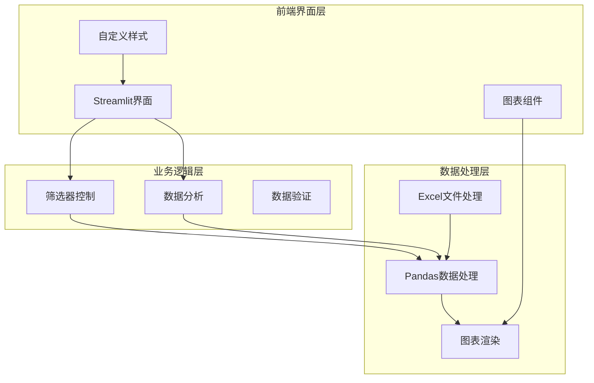

**图表来源**
- [app.py:1-1089](file://app.py#L1-L1089)

**章节来源**
- [app.py:1-1089](file://app.py#L1-L1089)

## 核心组件

### 1. 筛选器控制系统

筛选器控制系统是整个交互系统的核心，主要负责星级范围筛选和动态数据更新。

#### 星级范围滑块实现

系统实现了直观的星级范围滑块，支持单星和多星范围选择：

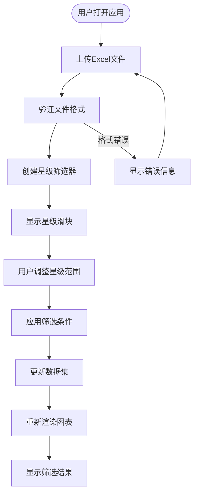

**图表来源**
- [app.py:346-363](file://app.py#L346-L363)

#### 动态数据更新机制

系统采用事件驱动的数据更新机制，当用户调整筛选器时，会触发以下流程：

1. **实时响应**：用户调整滑块时立即触发数据更新
2. **条件过滤**：根据星级范围对原始数据进行过滤
3. **状态同步**：更新所有相关图表和指标的状态
4. **界面刷新**：重新渲染受影响的UI组件

**章节来源**
- [app.py:346-363](file://app.py#L346-L363)

### 2. 用户输入控件设计

系统提供了多种用户输入控件，每种控件都有特定的交互逻辑和配置选项。

#### 文件上传控件

文件上传控件采用拖拽式设计，提供直观的文件导入体验：

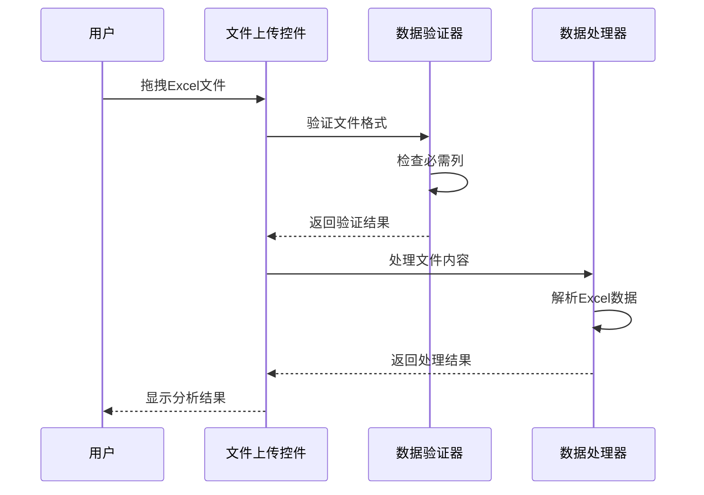

**图表来源**
- [app.py:326-338](file://app.py#L326-L338)

#### 下拉选择控件

系统在筛选器区域使用了下拉选择控件，用于选择不同的筛选维度：

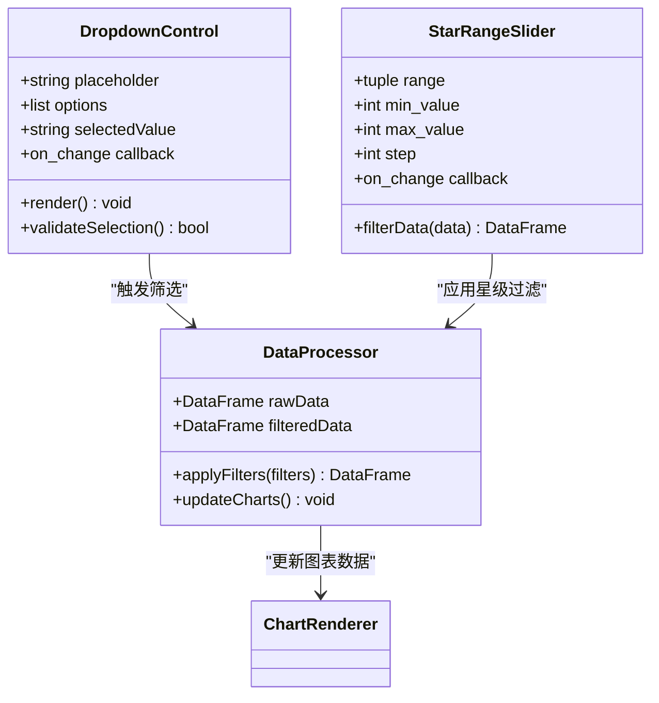

**图表来源**
- [app.py:349-354](file://app.py#L349-L354)

**章节来源**
- [app.py:326-338](file://app.py#L326-L338)
- [app.py:349-354](file://app.py#L349-L354)

### 3. 数据过滤和排序实现

系统实现了多层次的数据过滤和排序机制，支持复杂的多条件筛选。

#### 多条件筛选架构

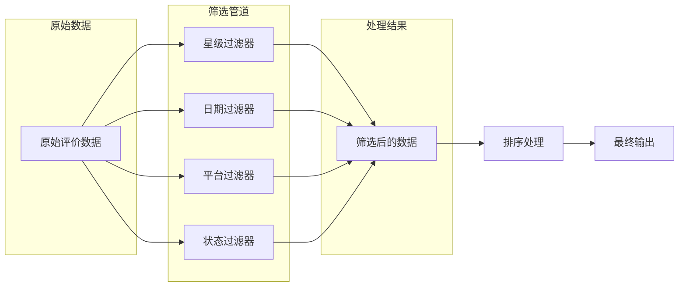

**图表来源**
- [app.py:356-357](file://app.py#L356-L357)

#### 数据刷新和状态管理

系统采用响应式状态管理模式，确保所有UI组件能够实时反映数据变化：

**章节来源**
- [app.py:356-357](file://app.py#L356-L357)

### 4. 用户界面响应式交互设计

系统实现了丰富的响应式交互设计，包括悬停效果、点击反馈和动画过渡。

#### 视觉层次设计

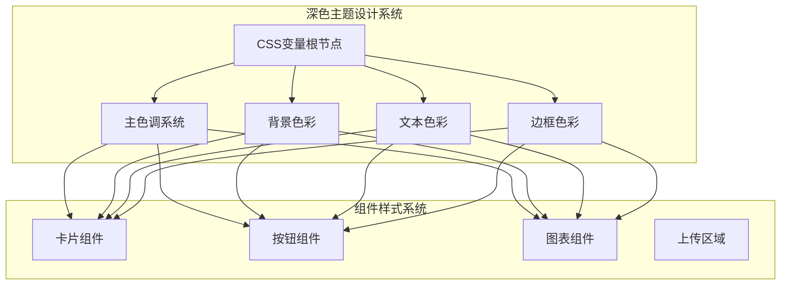

**图表来源**
- [app.py:10-31](file://app.py#L10-L31)

#### 交互反馈机制

系统实现了多层次的交互反馈机制：

**章节来源**
- [app.py:10-31](file://app.py#L10-L31)

## 架构概览

系统采用模块化的架构设计，各个组件之间具有清晰的职责分离和依赖关系。

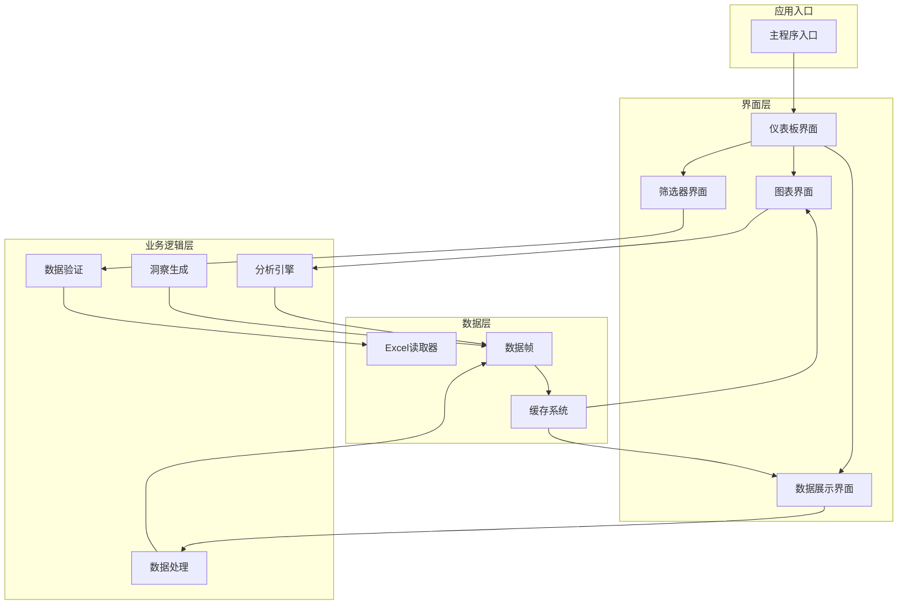

**图表来源**
- [app.py:1-1089](file://app.py#L1-L1089)

**章节来源**
- [app.py:1-1089](file://app.py#L1-L1089)

## 详细组件分析

### 组件A分析：星级范围筛选器

星级范围筛选器是系统中最核心的交互组件，实现了直观的星级评分筛选功能。

#### 实现机制

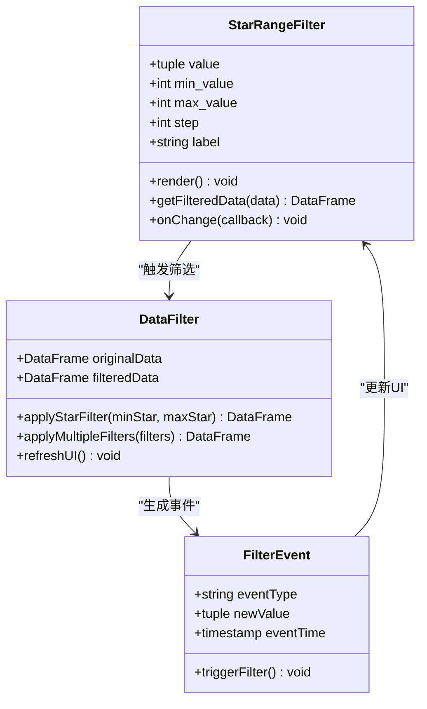

**图表来源**
- [app.py:346-354](file://app.py#L346-L354)

#### 交互流程

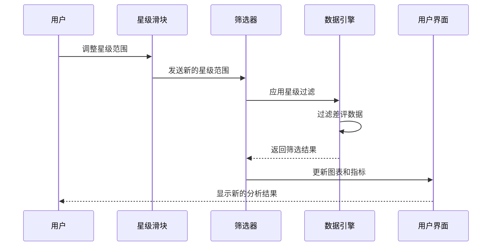

**图表来源**
- [app.py:356-363](file://app.py#L356-L363)

**章节来源**
- [app.py:346-363](file://app.py#L346-L363)

### 组件B分析：数据验证系统

数据验证系统确保上传的Excel文件包含所有必需的列，防止数据处理错误。

#### 验证流程

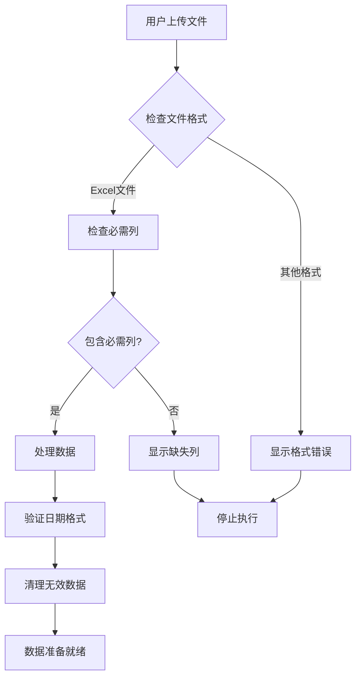

**图表来源**
- [app.py:329-340](file://app.py#L329-L340)

#### 错误处理机制

系统实现了完善的错误处理机制，包括：

**章节来源**
- [app.py:329-340](file://app.py#L329-L340)

### 组件C分析：图表渲染系统

图表渲染系统基于Plotly构建，提供了丰富的数据可视化能力。

#### 图表类型架构

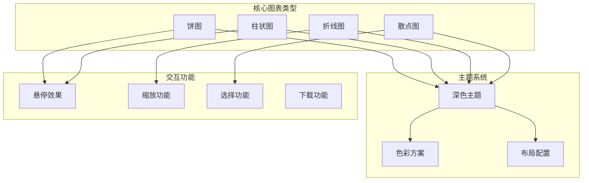

**图表来源**
- [app.py:442-450](file://app.py#L442-L450)

**章节来源**
- [app.py:442-450](file://app.py#L442-L450)

### 组件D分析：洞察生成系统

洞察生成系统能够从分析数据中提取有价值的业务洞察，为运营决策提供支持。

#### 洞察生成流程

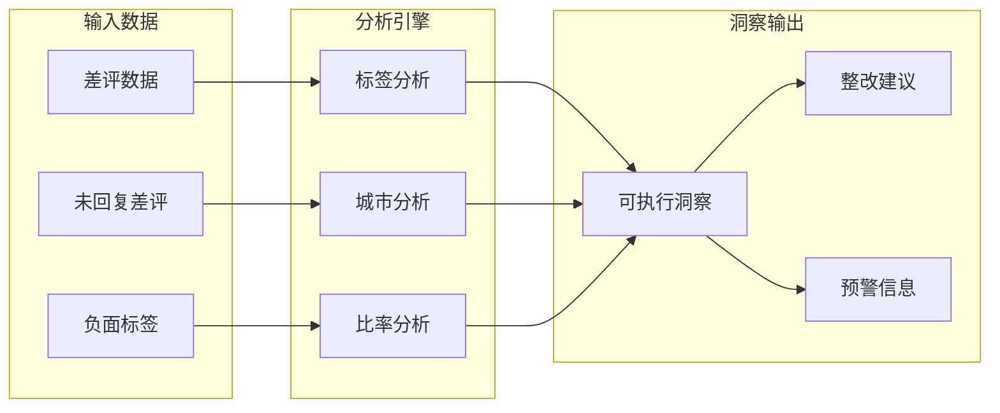

**图表来源**
- [app.py:966-998](file://app.py#L966-L998)

**章节来源**
- [app.py:966-998](file://app.py#L966-L998)

## 依赖关系分析

系统采用了清晰的依赖关系设计，确保模块间的松耦合和高内聚。

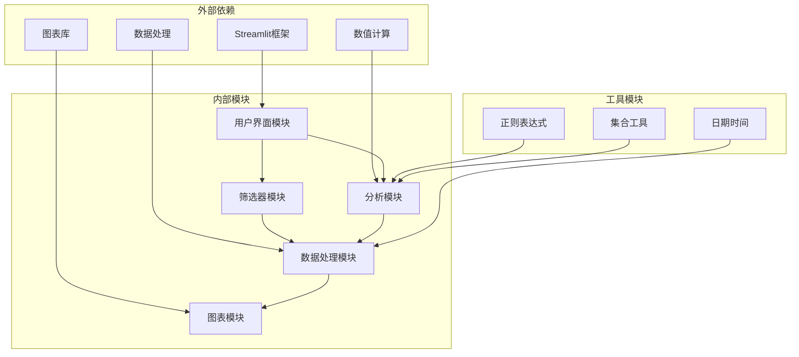

**图表来源**
- [app.py:1-7](file://app.py#L1-L7)

**章节来源**
- [app.py:1-7](file://app.py#L1-L7)

### 依赖注入和模块化

系统通过模块化设计实现了良好的依赖管理：

**章节来源**
- [app.py:1-1089](file://app.py#L1-L1089)

## 性能考虑

系统在设计时充分考虑了性能优化，特别是在大数据量处理和实时响应方面。

### 性能优化策略

1. **懒加载机制**：仅在需要时加载和处理数据
2. **缓存策略**：对计算结果进行缓存，避免重复计算
3. **增量更新**：只更新受影响的UI组件
4. **内存管理**：及时释放不需要的数据引用

### 数据处理优化

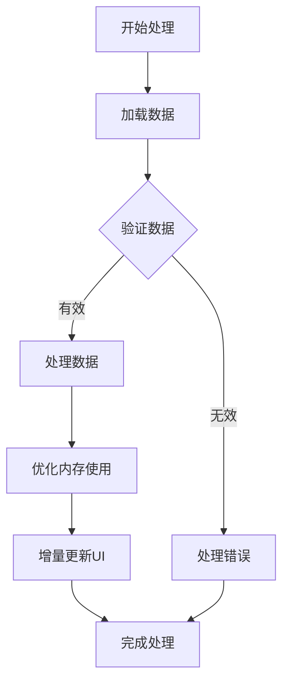

**图表来源**
- [app.py:329-340](file://app.py#L329-L340)

## 故障排除指南

### 常见问题及解决方案

#### 文件上传问题

**问题描述**：用户无法上传Excel文件或上传后无响应

**可能原因**：
1. 文件格式不支持
2. 文件损坏或格式错误
3. 缺少必需列
4. 内存不足

**解决方案**：
1. 确认文件格式为.xlsx或.xls
2. 检查文件完整性
3. 验证必需列存在
4. 清理浏览器缓存

#### 数据筛选问题

**问题描述**：筛选后无数据显示或显示异常

**可能原因**：
1. 筛选条件过于严格
2. 数据格式不匹配
3. 空值处理问题

**解决方案**：
1. 调整筛选范围
2. 检查数据格式
3. 清理空值数据

#### 图表渲染问题

**问题描述**：图表无法正常显示或显示异常

**可能原因**：
1. 数据为空或格式错误
2. Plotly库版本问题
3. 浏览器兼容性问题

**解决方案**：
1. 检查数据有效性
2. 更新Plotly库
3. 更换浏览器尝试

**章节来源**
- [app.py:1033-1036](file://app.py#L1033-L1036)

## 结论

交互控制系统通过精心设计的用户界面和强大的数据处理能力，为餐饮差评分析提供了全面的解决方案。系统的主要优势包括：

1. **直观的交互设计**：通过星级滑块等控件提供自然的筛选体验
2. **实时响应机制**：用户操作后立即得到反馈
3. **丰富的可视化**：多种图表类型满足不同分析需求
4. **智能洞察生成**：自动提取有价值的业务洞察
5. **响应式设计**：适配不同设备和屏幕尺寸

该系统不仅提升了运营人员的工作效率，还为决策制定提供了数据支撑。通过持续优化和扩展，可以进一步提升用户体验和分析能力。