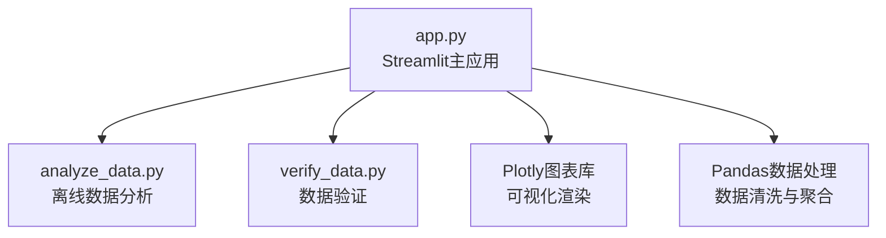
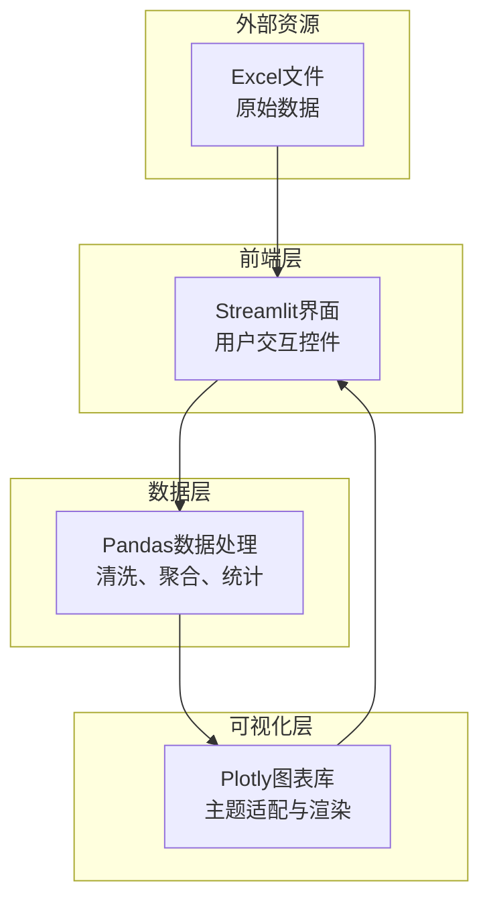
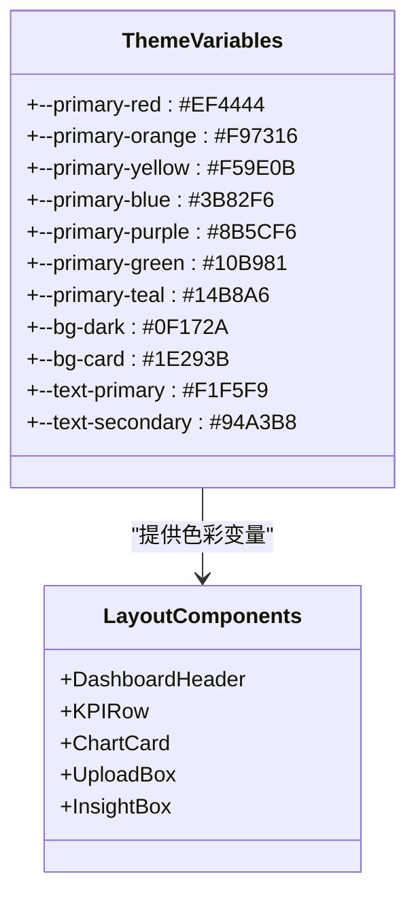
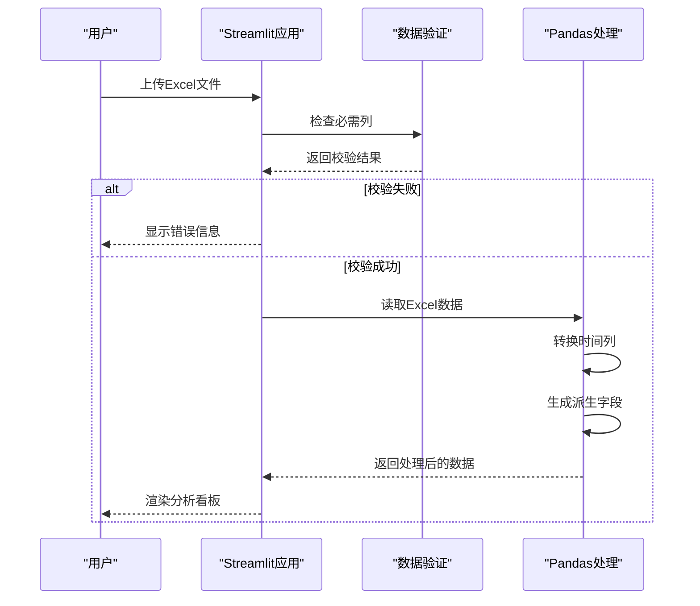
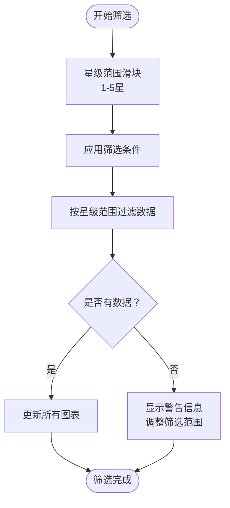
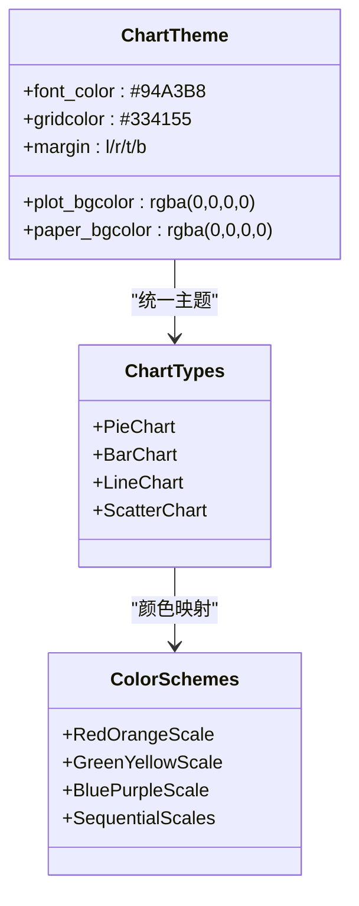
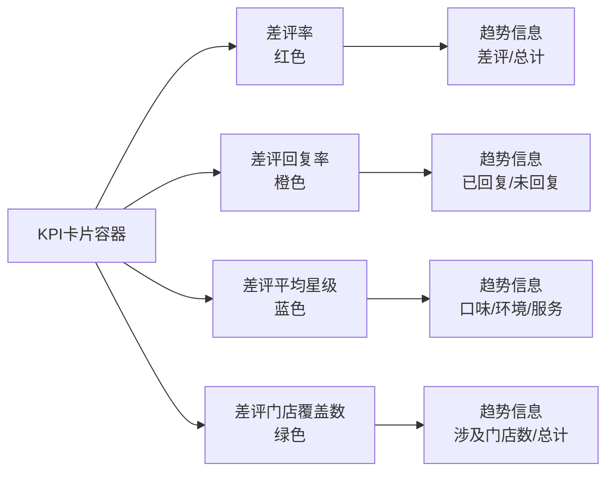
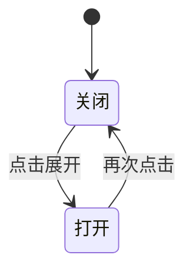
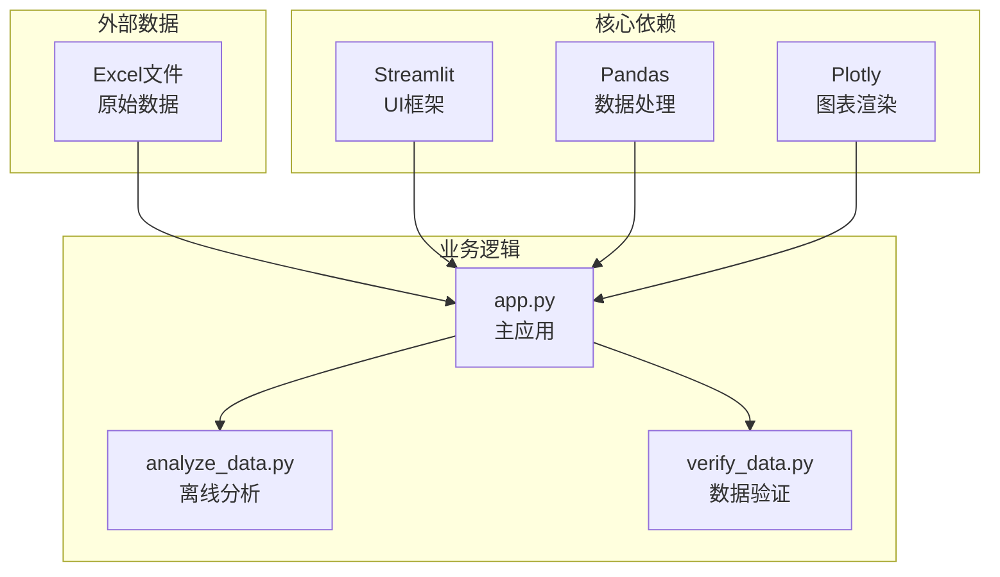

# 可视化与交互设计

<cite>
**本文档引用的文件**
- [app.py](file://app.py)
- [analyze_data.py](file://analyze_data.py)
- [verify_data.py](file://verify_data.py)
</cite>

## 目录
1. [简介](#简介)
2. [项目结构](#项目结构)
3. [核心组件](#核心组件)
4. [架构总览](#架构总览)
5. [详细组件分析](#详细组件分析)
6. [依赖关系分析](#依赖关系分析)
7. [性能考虑](#性能考虑)
8. [故障排除指南](#故障排除指南)
9. [结论](#结论)
10. [附录](#附录)

## 简介
本项目是一个基于 Streamlit 的餐饮差评运营分析看板，专注于通过数据驱动的方式帮助运营人员快速定位差评问题、识别整改方向并提升门店服务质量。系统采用暗色主题设计，结合多种图表组件与交互控件，提供从数据上传、筛选、可视化到智能建议的完整流程。

## 项目结构
项目由三个主要文件组成：
- app.py：Streamlit 主应用，负责页面布局、样式注入、数据处理与图表渲染
- analyze_data.py：离线数据分析脚本，用于批量生成报表与统计摘要
- verify_data.py：数据验证脚本，用于检查关键字段与计算指标

**图表来源**
- [app.py:1-1089](file://app.py#L1-L1089)
- [analyze_data.py:1-133](file://analyze_data.py#L1-L133)
- [verify_data.py:1-32](file://verify_data.py#L1-L32)

**章节来源**
- [app.py:1-1089](file://app.py#L1-L1089)
- [analyze_data.py:1-133](file://analyze_data.py#L1-L133)
- [verify_data.py:1-32](file://verify_data.py#L1-L32)

## 核心组件
- 页面配置与主题系统
  - 使用页面配置设置宽屏布局与图标
  - 自定义CSS变量定义品牌色彩与暗色主题
  - 注入全局样式以统一组件外观
- 数据上传与校验
  - 支持 Excel 文件上传，自动校验必需列
  - 对时间列进行转换与缺失值处理
- 筛选器控制系统
  - 星级范围滑块筛选，实时更新图表
  - 筛选前后数据量提示
- 图表组件体系
  - KPI卡片展示核心指标
  - 饼图、柱状图、折线图等多种图表组合
  - 带标注的数值标签增强可读性
- 交互面板
  - 展开/收起的数据表格
  - 智能运营建议模块
  - 数据验证面板

**章节来源**
- [app.py:8-306](file://app.py#L8-L306)
- [app.py:326-363](file://app.py#L326-L363)
- [app.py:404-427](file://app.py#L404-L427)
- [app.py:442-450](file://app.py#L442-L450)
- [app.py:1000-1031](file://app.py#L1000-L1031)

## 架构总览
系统采用“前端交互 + 后端数据处理”的双层架构：
- 前端层：Streamlit 控制器，负责用户交互与页面渲染
- 数据层：Pandas 负责数据清洗、聚合与统计
- 可视化层：Plotly 负责图表绘制与主题适配

**图表来源**
- [app.py:326-363](file://app.py#L326-L363)
- [app.py:442-450](file://app.py#L442-L450)
- [app.py:1000-1031](file://app.py#L1000-L1031)

## 详细组件分析

### 页面主题与样式系统
系统采用CSS自定义属性构建主题变量，支持多色系渐变与暗色背景：
- 品牌色彩：红色、橙色、黄色、蓝色、紫色、绿色、青色
- 背景色系：深蓝背景、卡片背景、悬停效果
- 文字色彩：主色、次色、弱化色
- 渐变色彩：红-橙、蓝-紫、绿-青、橙-黄

**图表来源**
- [app.py:10-31](file://app.py#L10-L31)
- [app.py:44-281](file://app.py#L44-L281)

**章节来源**
- [app.py:10-31](file://app.py#L10-L31)
- [app.py:44-281](file://app.py#L44-L281)

### 数据上传与验证流程
系统提供直观的拖拽上传界面，并在后台执行严格的数据校验：
- 必需列检查：评价时间、评价ID、省份、城市、评价门店、星级分、口味分、环境分、服务分、回复状态
- 时间列处理：转换为日期时间格式并移除无效值
- 派生字段：评价日期、评价小时、评价月份

**图表来源**
- [app.py:326-363](file://app.py#L326-L363)
- [app.py:329-344](file://app.py#L329-L344)

**章节来源**
- [app.py:326-363](file://app.py#L326-L363)
- [app.py:329-344](file://app.py#L329-L344)

### 筛选器控制系统
系统实现了星级范围筛选器，支持实时数据更新：
- 滑块控件：1-5星范围选择，默认全范围
- 实时反馈：显示筛选前后的数据量变化
- 动态更新：筛选条件改变时自动刷新所有图表

**图表来源**
- [app.py:346-363](file://app.py#L346-L363)
- [app.py:357](file://app.py#L357)

**章节来源**
- [app.py:346-363](file://app.py#L346-L363)
- [app.py:357](file://app.py#L357)

### 图表组件配置与定制
系统使用 Plotly Express 和 Graph Objects 构建多种图表，统一采用自定义主题：
- 主题函数：统一设置背景色、字体、网格线、边距等
- 颜色映射：针对不同图表类型配置专用色谱
- 标注系统：在图表上添加数值标签增强可读性

**图表来源**
- [app.py:296-304](file://app.py#L296-L304)
- [app.py:442-450](file://app.py#L442-L450)
- [app.py:456-470](file://app.py#L456-L470)

**章节来源**
- [app.py:296-304](file://app.py#L296-L304)
- [app.py:442-450](file://app.py#L442-L450)
- [app.py:456-470](file://app.py#L456-L470)

### KPI指标展示系统
系统采用卡片式布局展示核心指标，支持状态分类：
- 差评率：红色警示级别
- 差评回复率：橙色警告级别  
- 差评平均星级：蓝色信息级别
- 差评门店覆盖数：绿色成功级别

**图表来源**
- [app.py:404-427](file://app.py#L404-L427)
- [app.py:406-425](file://app.py#L406-L425)

**章节来源**
- [app.py:404-427](file://app.py#L404-L427)
- [app.py:406-425](file://app.py#L406-L425)

### 交互面板与展开器
系统提供多个可展开的数据面板：
- 差评详情数据：按时间倒序展示
- 未回复差评明细：按时间倒序展示
- 数据验证面板：展示关键指标汇总

**图表来源**
- [app.py:1000-1031](file://app.py#L1000-L1031)
- [app.py:1000-1003](file://app.py#L1000-L1003)
- [app.py:1005-1009](file://app.py#L1005-L1009)
- [app.py:1011-1031](file://app.py#L1011-L1031)

**章节来源**
- [app.py:1000-1031](file://app.py#L1000-L1031)
- [app.py:1000-1003](file://app.py#L1000-L1003)
- [app.py:1005-1009](file://app.py#L1005-L1009)
- [app.py:1011-1031](file://app.py#L1011-L1031)

## 依赖关系分析
系统依赖关系清晰，职责分离明确：

**图表来源**
- [app.py:1-6](file://app.py#L1-L6)
- [analyze_data.py:1](file://analyze_data.py#L1)
- [verify_data.py:1](file://verify_data.py#L1)

**章节来源**
- [app.py:1-6](file://app.py#L1-L6)
- [analyze_data.py:1](file://analyze_data.py#L1)
- [verify_data.py:1](file://verify_data.py#L1)

## 性能考虑
- 数据处理优化
  - 使用向量化操作替代循环
  - 合理使用索引与查询条件
  - 避免重复计算相同统计数据
- 图表渲染优化
  - 统一主题配置减少重复设置
  - 合理设置图表尺寸避免过度渲染
  - 使用颜色映射缓存提高性能
- 内存管理
  - 及时释放不需要的数据对象
  - 分批处理大数据集
  - 使用适当的数据类型减少内存占用

## 故障排除指南
- 文件上传问题
  - 确认文件格式为 .xlsx 或 .xls
  - 检查必需列是否存在且命名正确
  - 验证Excel文件完整性
- 数据解析错误
  - 检查评价时间列格式
  - 确认星级分在1-5范围内
  - 验证回复状态字段值
- 图表显示异常
  - 检查数据是否为空或全部被筛选掉
  - 确认颜色映射配置正确
  - 验证主题变量定义完整

**章节来源**
- [app.py:335-337](file://app.py#L335-L337)
- [app.py:1033-1035](file://app.py#L1033-L1035)

## 结论
该可视化系统通过精心设计的主题系统、直观的交互控件和丰富的图表组件，为餐饮差评分析提供了完整的解决方案。系统采用暗色主题设计，不仅提升了视觉体验，也减少了长时间使用的视觉疲劳。通过星级范围筛选、多维度指标展示和智能建议功能，帮助运营人员快速定位问题并制定整改措施。

## 附录

### 图表自定义指南
- 颜色主题定制
  - 修改CSS变量值调整整体色调
  - 在颜色映射中添加新的配色方案
  - 使用渐变色增强视觉层次
- 布局设计优化
  - 调整网格模板列数适应不同屏幕尺寸
  - 优化卡片间距与内边距
  - 使用响应式断点适配移动端
- 交互功能扩展
  - 添加更多筛选器控件
  - 实现图表间联动选择
  - 增加导出功能支持

### 开发最佳实践
- 保持代码模块化，职责单一
- 使用类型注解提高代码可读性
- 编写单元测试验证核心逻辑
- 使用日志记录关键操作步骤
- 实现异常处理与用户友好提示