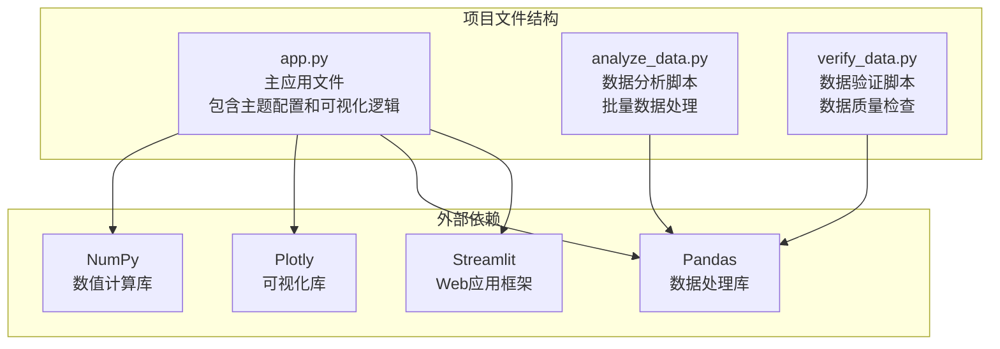
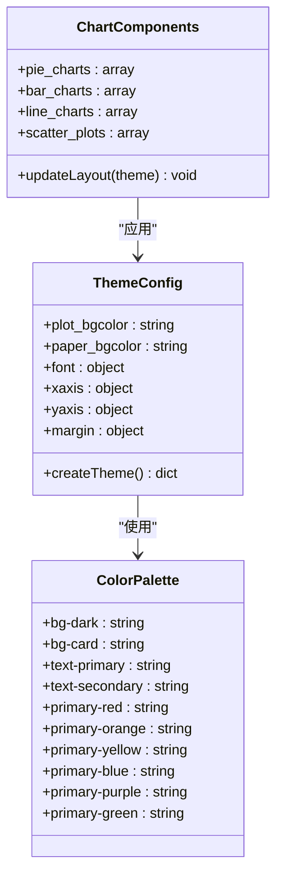
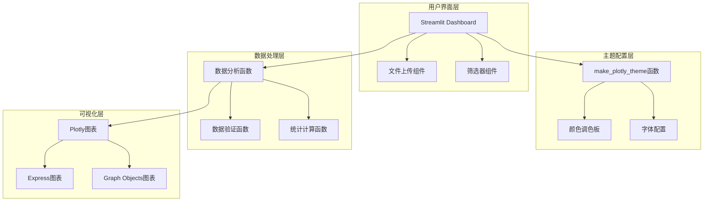
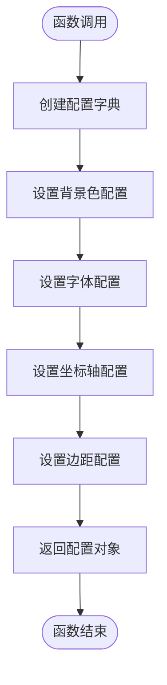
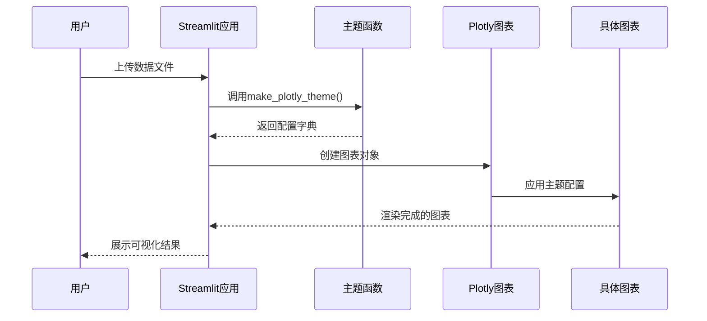
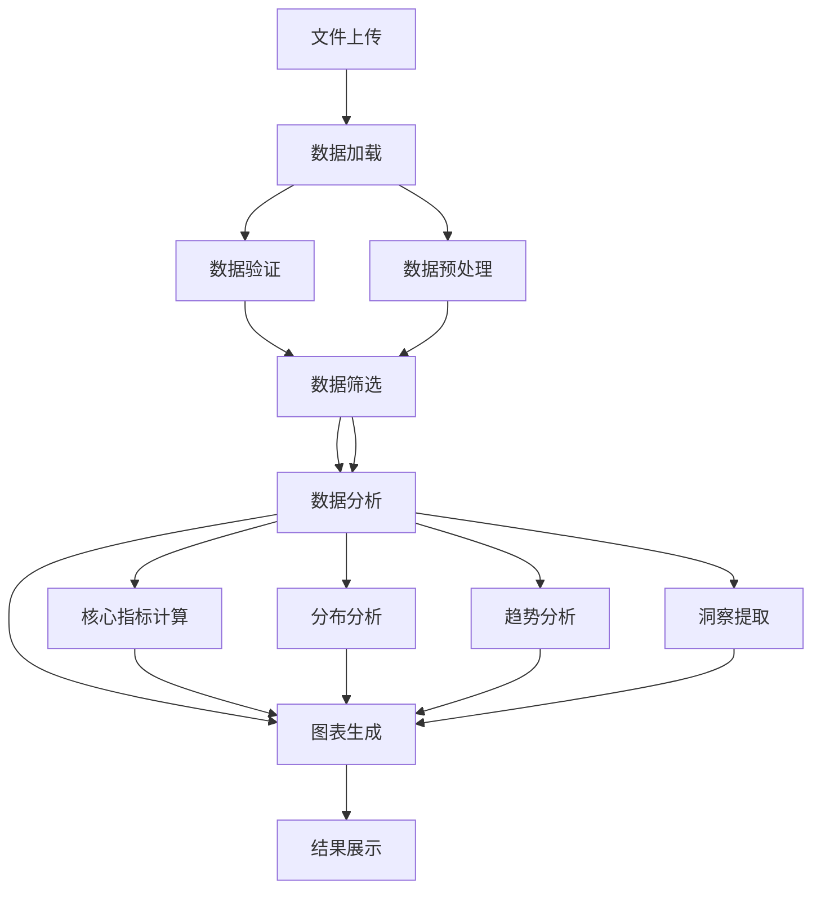
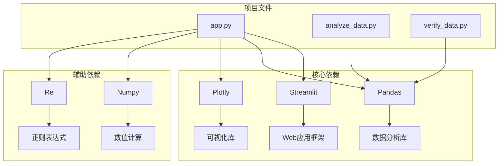

# Plotly主题配置

<cite>
**本文档引用的文件**
- [app.py](file://app.py)
- [analyze_data.py](file://analyze_data.py)
- [verify_data.py](file://verify_data.py)
</cite>

## 目录
1. [简介](#简介)
2. [项目结构](#项目结构)
3. [核心组件](#核心组件)
4. [架构概览](#架构概览)
5. [详细组件分析](#详细组件分析)
6. [依赖关系分析](#依赖关系分析)
7. [性能考虑](#性能考虑)
8. [故障排除指南](#故障排除指南)
9. [结论](#结论)

## 简介

本项目是一个基于Streamlit和Plotly的餐饮差评运营分析看板，专注于通过数据可视化帮助餐厅管理者识别和解决差评问题。项目的核心创新在于实现了统一的Plotly主题配置系统，通过`make_plotly_theme`函数为所有图表提供一致的视觉风格，特别是深色主题的完美适配。

该系统不仅实现了基础的主题配置功能，还集成了完整的数据分析流程，从数据预处理、统计分析到交互式可视化展示，形成了一个端到端的差评管理解决方案。

## 项目结构

项目采用简洁而高效的文件组织结构，主要包含三个核心文件：

**图表来源**
- [app.py:1-1089](file://app.py#L1-L1089)
- [analyze_data.py:1-133](file://analyze_data.py#L1-L133)
- [verify_data.py:1-32](file://verify_data.py#L1-L32)

**章节来源**
- [app.py:1-1089](file://app.py#L1-L1089)
- [analyze_data.py:1-133](file://analyze_data.py#L1-L133)
- [verify_data.py:1-32](file://verify_data.py#L1-L32)

## 核心组件

### 主题配置系统

项目的核心创新是`make_plotly_theme`函数，它提供了一个完整的深色主题配置方案：

**图表来源**
- [app.py:296-304](file://app.py#L296-L304)

### 主题参数详解

#### 背景色配置
- `plot_bgcolor`: 图表绘图区域背景色，设置为透明(`rgba(0,0,0,0)`)
- `paper_bgcolor`: 整体图表背景色，同样设置为透明

#### 字体配置
- `font.color`: 文字颜色，使用浅灰色`#94A3B8`
- `font.family`: 字体族，采用系统默认字体链

#### 网格线配置
- `xaxis.gridcolor`: X轴网格线颜色，使用深灰色`#334155`
- `xaxis.zerolinecolor`: X轴零线颜色，同样使用深灰色
- `yaxis.gridcolor`: Y轴网格线颜色，使用深灰色`#334155`
- `yaxis.zerolinecolor`: Y轴零线颜色，同样使用深灰色

#### 边距配置
- `margin.l`: 左边距，10像素
- `margin.r`: 右边距，10像素
- `margin.t`: 上边距，40像素
- `margin.b`: 下边距，10像素

**章节来源**
- [app.py:296-304](file://app.py#L296-L304)

## 架构概览

项目采用模块化的架构设计，将主题配置、数据处理和可视化展示分离：

**图表来源**
- [app.py:296-304](file://app.py#L296-L304)
- [app.py:308-317](file://app.py#L308-L317)
- [app.py:328-363](file://app.py#L328-L363)

## 详细组件分析

### make_plotly_theme函数实现

该函数是整个主题系统的核心，提供了统一的视觉配置：

#### 设计理念
1. **一致性原则**: 所有图表共享相同的背景色、字体和网格线配置
2. **深色主题优化**: 特别针对深色背景进行了色彩搭配优化
3. **可扩展性**: 通过返回字典格式，便于在不同场景下灵活使用

#### 实现原理

**图表来源**
- [app.py:296-304](file://app.py#L296-L304)

#### 关键配置项作用机制

##### 背景配置机制
- `plot_bgcolor`和`paper_bgcolor`都设置为透明，确保图表能够正确显示深色背景
- 这种设计避免了图表背景与页面背景产生冲突

##### 字体配置机制
- 统一的字体颜色`#94A3B8`提供良好的对比度
- 字体族设置确保跨平台兼容性

##### 坐标轴网格线机制
- 网格线颜色`#334155`与深色主题完美融合
- 零线颜色与网格线保持一致，增强视觉统一性

**章节来源**
- [app.py:296-304](file://app.py#L296-L304)

### 图表集成与使用

项目中的每个图表都通过`update_layout(**make_plotly_theme())`方式应用主题配置：

**图表来源**
- [app.py:442-450](file://app.py#L442-L450)
- [app.py:456-470](file://app.py#L456-L470)

### 数据分析与可视化流程

项目实现了完整的数据分析流程，从原始数据到最终可视化：

**图表来源**
- [app.py:328-363](file://app.py#L328-L363)
- [app.py:381-384](file://app.py#L381-L384)

**章节来源**
- [app.py:328-363](file://app.py#L328-L363)
- [app.py:381-384](file://app.py#L381-L384)

## 依赖关系分析

项目的主要依赖关系如下：

**图表来源**
- [app.py:1-7](file://app.py#L1-L7)

**章节来源**
- [app.py:1-7](file://app.py#L1-L7)

## 性能考虑

### 主题配置性能优化

1. **单点配置**: 通过集中式的`make_plotly_theme`函数，避免重复配置
2. **内存效率**: 返回字典对象，减少内存占用
3. **渲染优化**: 统一的配置减少了图表渲染时的计算开销

### 数据处理性能

1. **向量化操作**: 使用Pandas的向量化操作提高数据处理速度
2. **条件筛选**: 通过布尔索引实现高效的数据筛选
3. **分组聚合**: 使用groupby操作进行高效的统计计算

## 故障排除指南

### 常见问题及解决方案

#### 主题配置不生效
- **问题**: 图表仍然显示默认样式
- **解决方案**: 确保在创建图表后调用`update_layout(**make_plotly_theme())`

#### 颜色显示异常
- **问题**: 图表颜色与预期不符
- **解决方案**: 检查CSS变量定义和颜色值设置

#### 字体显示问题
- **问题**: 字体无法正确显示
- **解决方案**: 验证字体族设置和系统字体可用性

**章节来源**
- [app.py:1033-1035](file://app.py#L1033-L1035)

## 结论

本项目成功实现了基于Plotly的统一主题配置系统，通过`make_plotly_theme`函数为所有图表提供了深色主题的完美适配。该系统不仅解决了视觉一致性的问题，还为后续的功能扩展奠定了坚实的基础。

### 主要成就

1. **统一的视觉风格**: 通过集中式主题配置实现了所有图表的视觉统一
2. **深色主题优化**: 特别针对深色背景进行了色彩搭配优化
3. **完整的数据分析流程**: 从数据预处理到可视化展示的完整解决方案
4. **可扩展的架构设计**: 为后续功能扩展提供了良好的基础

### 未来发展方向

1. **主题定制化**: 支持更多主题样式的配置选项
2. **响应式设计**: 优化移动端的显示效果
3. **交互增强**: 添加更多的交互功能和动画效果
4. **性能优化**: 进一步优化大数据量下的渲染性能

该系统为餐饮差评管理提供了一个强大而直观的工具，有助于餐厅管理者更好地理解和解决差评问题，最终提升整体的服务质量和客户满意度。