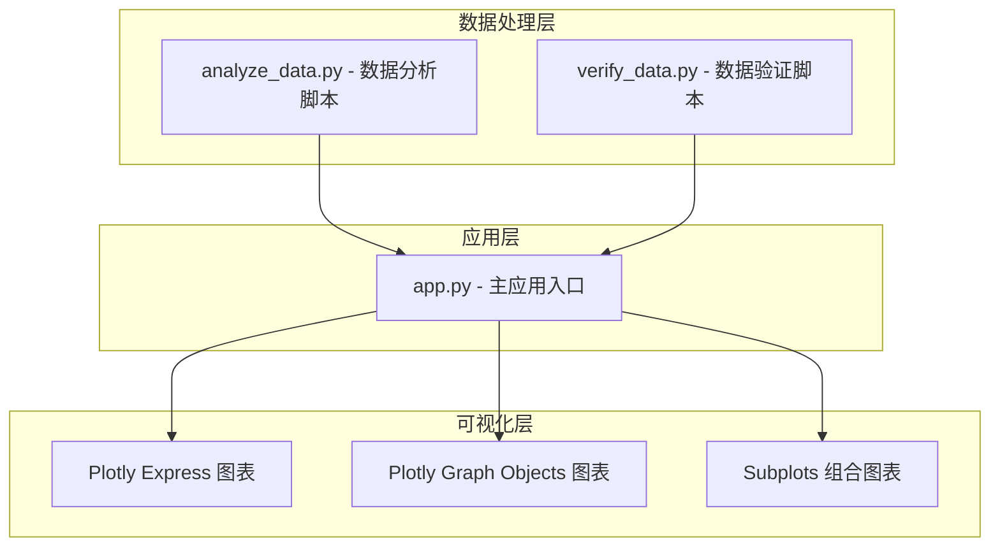
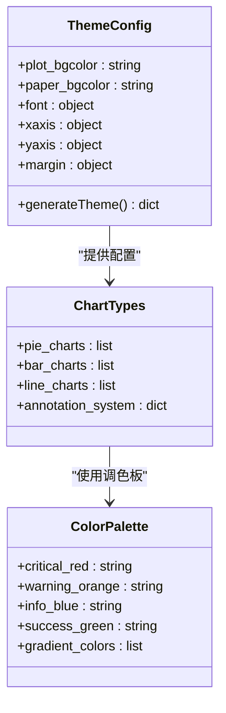
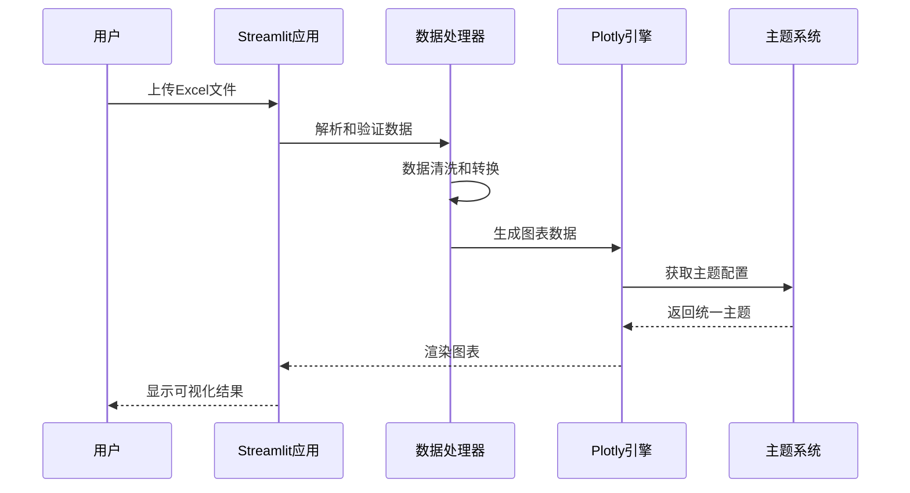
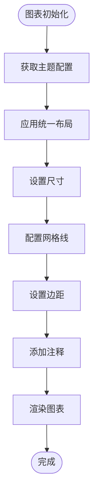
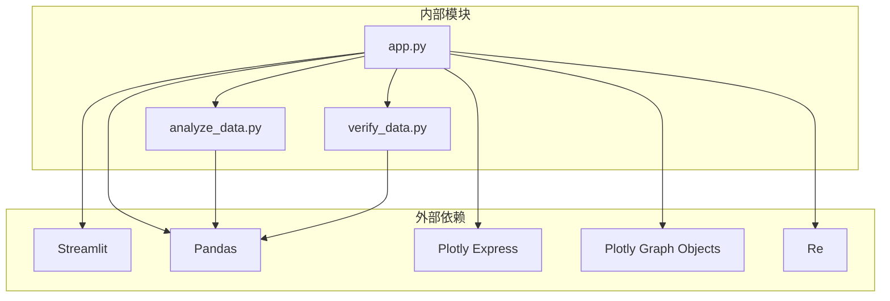

# 图表组件配置

<cite>
**本文档引用的文件**
- [app.py](file://app.py)
- [analyze_data.py](file://analyze_data.py)
- [verify_data.py](file://verify_data.py)
</cite>

## 目录
1. [简介](#简介)
2. [项目结构](#项目结构)
3. [核心组件](#核心组件)
4. [架构概览](#架构概览)
5. [详细组件分析](#详细组件分析)
6. [依赖关系分析](#依赖关系分析)
7. [性能考虑](#性能考虑)
8. [故障排除指南](#故障排除指南)
9. [结论](#结论)

## 简介

本项目是一个基于Streamlit和Plotly的餐饮差评运营分析看板，专注于数据可视化和业务洞察。该系统通过多种图表类型展示差评数据分析结果，包括饼图、柱状图、折线图等，并提供了统一的主题定制和布局配置方案。

## 项目结构

该项目采用简洁的三层架构设计：

**图表来源**
- [app.py:1-1089](file://app.py#L1-L1089)
- [analyze_data.py:1-133](file://analyze_data.py#L1-L133)
- [verify_data.py:1-32](file://verify_data.py#L1-L32)

**章节来源**
- [app.py:1-1089](file://app.py#L1-L1089)

## 核心组件

### 主题配置系统

项目实现了统一的Plotly主题配置系统，通过`make_plotly_theme()`函数提供一致的视觉风格：

**图表来源**
- [app.py:296-304](file://app.py#L296-L304)

### 图表类型配置

系统支持多种图表类型的配置，每种类型都有特定的颜色映射和交互设置：

**饼图配置**
- 使用离散颜色映射确保每个扇区有独特的颜色
- 支持环形饼图（hole参数）
- 自动显示图例和百分比标签

**柱状图配置**
- 支持水平和垂直柱状图
- 使用连续颜色渐变表示数值大小
- 自动添加数值标注
- 支持反向Y轴排序

**折线图配置**
- 支持带填充的面积图
- 可选的数据点标记
- 多系列数据的时间序列展示

**章节来源**
- [app.py:442-450](file://app.py#L442-L450)
- [app.py:456-479](file://app.py#L456-L479)
- [app.py:495-511](file://app.py#L495-L511)
- [app.py:773-784](file://app.py#L773-L784)

## 架构概览

**图表来源**
- [app.py:328-363](file://app.py#L328-L363)
- [app.py:296-304](file://app.py#L296-L304)

## 详细组件分析

### make_plotly_theme 函数详解

`make_plotly_theme()`函数是整个图表系统的视觉统一核心，提供以下配置参数：

#### 基础背景配置
- `plot_bgcolor`: 图表绘图区域背景色，设置为透明
- `paper_bgcolor`: 整体纸张背景色，设置为透明

#### 字体和颜色配置
- `font.color`: 文字颜色，使用浅灰色 `#94A3B8`
- `font.family`: 字体族，使用系统默认字体
- `font.size`: 字体大小，适合小屏设备显示

#### 坐标轴配置
- `xaxis.gridcolor`: X轴网格线颜色，使用深色背景适配
- `xaxis.zerolinecolor`: X轴零线颜色
- `yaxis.gridcolor`: Y轴网格线颜色
- `yaxis.zerolinecolor`: Y轴零线颜色

#### 边距配置
- `margin.l`: 左边距，10像素
- `margin.r`: 右边距，10像素
- `margin.t`: 上边距，40像素
- `margin.b`: 下边距，10像素

**章节来源**
- [app.py:296-304](file://app.py#L296-L304)

### 图表布局统一配置

系统通过统一的布局配置确保所有图表具有一致的视觉体验：

**图表来源**
- [app.py:463-470](file://app.py#L463-L470)
- [app.py:522-529](file://app.py#L522-L529)

### 颜色映射策略

系统实现了多层次的颜色映射策略：

#### 业务语义颜色
- `#EF4444`: 危险色（差评、红色警告）
- `#F97316`: 警告色（中性评价、橙色警告）
- `#F59E0B`: 信息色（好评、黄色提示）
- `#10B981`: 成功色（积极反馈、绿色成功）

#### 渐变色彩系统
- 红色渐变：从红色到橙色
- 蓝色渐变：从蓝色到紫色
- 绿色渐变：从绿色到青色
- 橙色渐变：从橙色到黄色

#### 连续颜色映射
- 使用`color_continuous_scale`参数实现数值到颜色的连续映射
- 支持单色到多色的渐变效果
- 自动根据数据范围调整颜色分布

**章节来源**
- [app.py:446](file://app.py#L446)
- [app.py:459](file://app.py#L459)
- [app.py:499](file://app.py#L499)

### 注释和标记系统

系统提供了灵活的注释和标记添加机制：

#### 数值标注
- 使用`add_annotation()`方法添加文本标注
- 支持动态计算标注位置和内容
- 可配置字体样式、颜色和位置偏移

#### 颜色标注
- 在柱状图中使用颜色映射显示数值大小
- 通过颜色深浅直观反映数据差异
- 支持反向颜色映射突出重要数据

#### 自定义标记
- 折线图中的数据点标记
- 饼图中的百分比标签
- 布局标题和轴标签的自定义样式

**章节来源**
- [app.py:472-478](file://app.py#L472-L478)
- [app.py:531-537](file://app.py#L531-L537)
- [app.py:794-796](file://app.py#L794-L796)

## 依赖关系分析

**图表来源**
- [app.py:1-7](file://app.py#L1-L7)

**章节来源**
- [app.py:1-7](file://app.py#L1-L7)

## 性能考虑

### 图表渲染优化

1. **懒加载策略**: 只在需要时生成和渲染图表
2. **数据预处理**: 在图表生成前完成数据清洗和转换
3. **内存管理**: 及时释放不需要的中间数据结构
4. **容器宽度**: 使用`use_container_width=True`确保图表自适应

### 主题配置优化

1. **单一配置源**: 通过`make_plotly_theme()`集中管理所有主题设置
2. **CSS变量集成**: 将主题颜色与CSS变量系统结合
3. **响应式设计**: 支持不同屏幕尺寸的自适应显示

### 数据处理优化

1. **向量化操作**: 使用Pandas的向量化操作提高性能
2. **数据类型优化**: 合理的数据类型选择减少内存占用
3. **索引优化**: 使用适当的索引提高查询效率

## 故障排除指南

### 常见问题及解决方案

#### 图表不显示或显示异常
- 检查数据完整性，确保必需列存在
- 验证数据类型正确性
- 确认主题配置参数有效

#### 颜色显示问题
- 检查颜色值格式是否正确
- 验证颜色映射范围设置
- 确认CSS变量定义完整

#### 布局错乱问题
- 检查边距配置是否合理
- 验证容器尺寸设置
- 确认响应式布局配置

**章节来源**
- [app.py:1033-1035](file://app.py#L1033-L1035)

### 调试技巧

1. **数据验证**: 使用`verify_data.py`脚本检查数据质量
2. **增量调试**: 逐步注释图表代码定位问题
3. **日志输出**: 添加必要的调试信息输出
4. **边界测试**: 测试空数据和异常数据场景

**章节来源**
- [verify_data.py:1-32](file://verify_data.py#L1-L32)

## 结论

本项目展示了如何构建一个功能完整、视觉统一的图表组件系统。通过精心设计的主题配置、灵活的图表类型支持和完善的注释系统，为用户提供了一个强大的数据分析和可视化工具。

关键优势包括：
- 统一的视觉风格和主题配置
- 多样化的图表类型支持
- 灵活的颜色映射和交互功能
- 良好的性能优化和用户体验
- 完善的错误处理和调试机制

该系统为类似的数据可视化项目提供了优秀的参考模板，特别是在主题定制、图表配置和性能优化方面具有重要的借鉴价值。