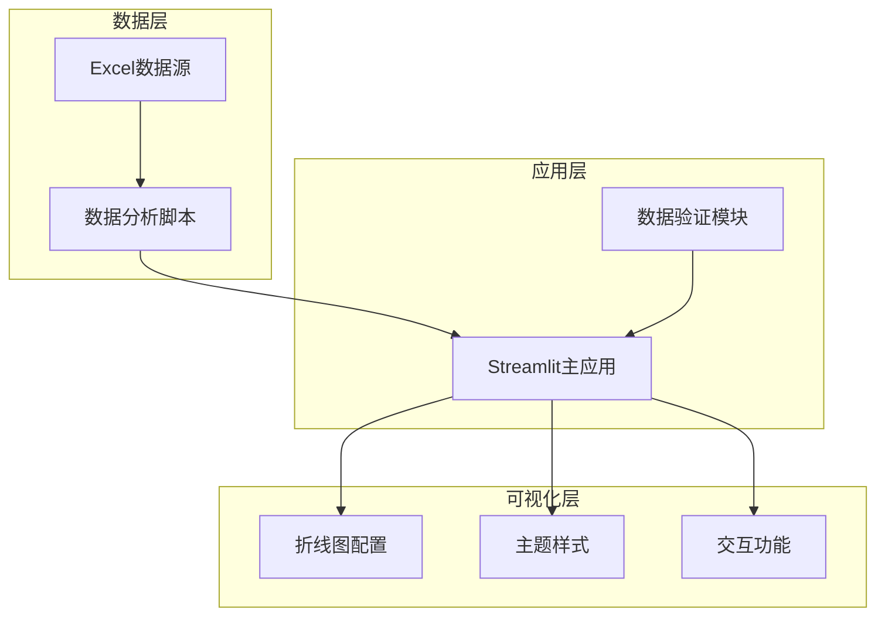
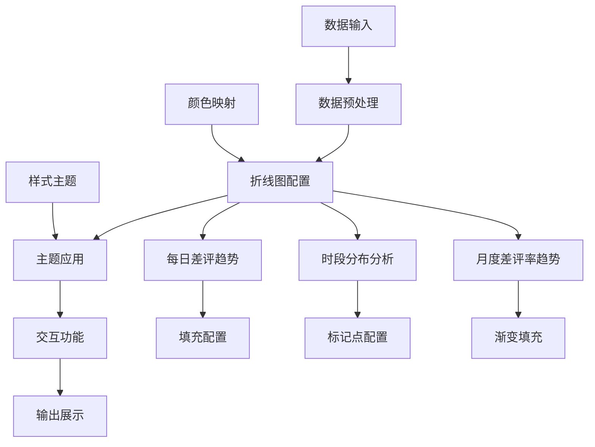
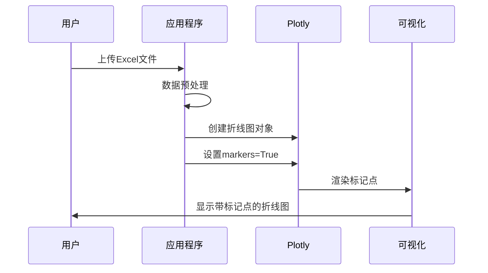
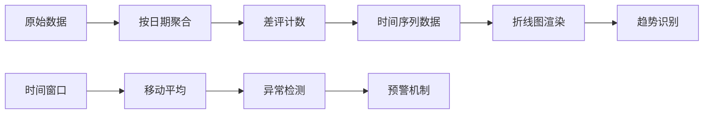
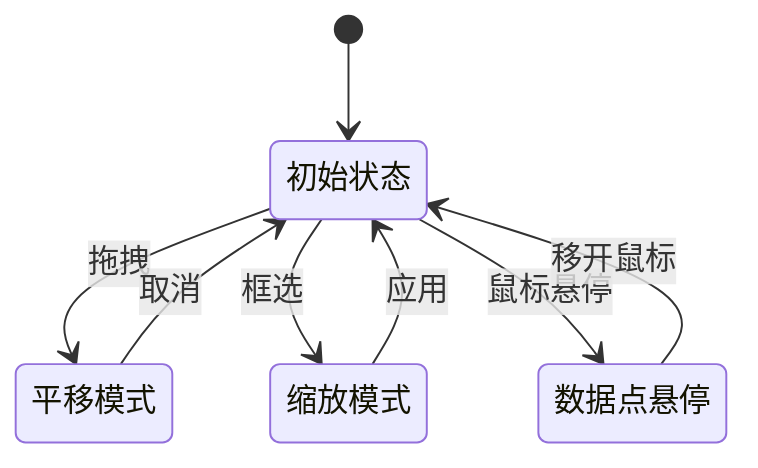
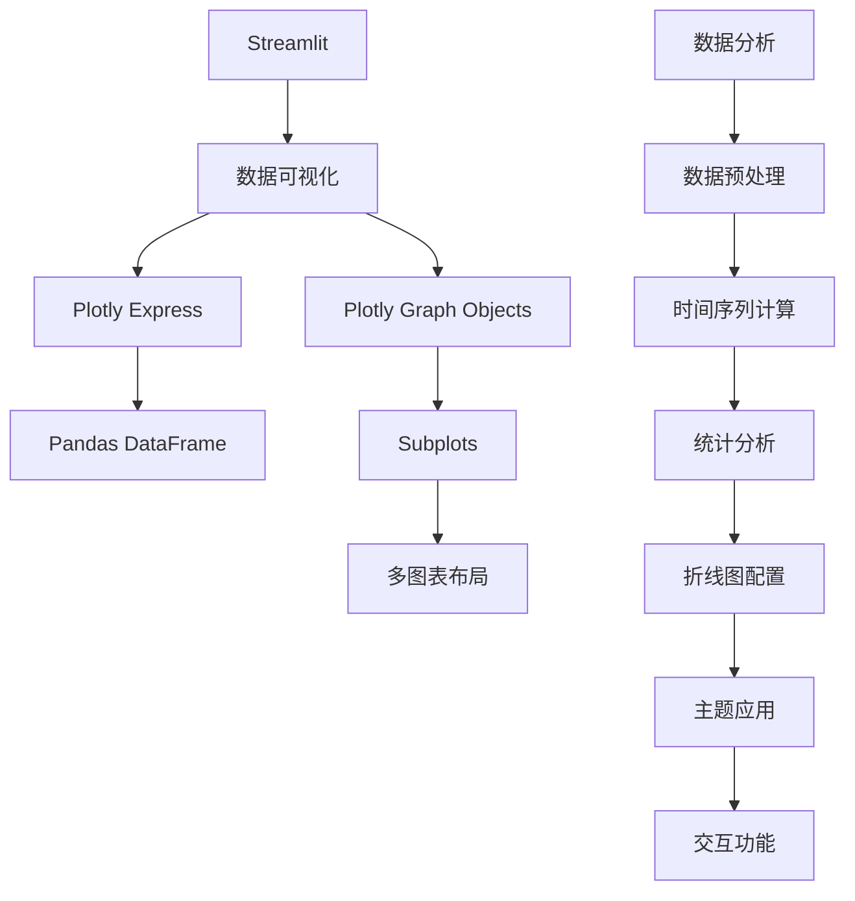
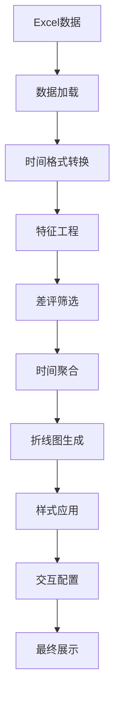

# 折线图配置

<cite>
**本文档引用的文件**
- [app.py](file://app.py)
- [analyze_data.py](file://analyze_data.py)
- [verify_data.py](file://verify_data.py)
</cite>

## 目录
1. [简介](#简介)
2. [项目结构](#项目结构)
3. [核心组件](#核心组件)
4. [架构概览](#架构概览)
5. [详细组件分析](#详细组件分析)
6. [依赖关系分析](#依赖关系分析)
7. [性能考虑](#性能考虑)
8. [故障排除指南](#故障排除指南)
9. [结论](#结论)

## 简介

本文件专注于折线图配置的详细技术文档，深入解释时间趋势分析中折线图的实现方法。该系统通过Plotly Express和Plotly Graph Objects实现了多种折线图配置，包括每日差评数量趋势和各时段差评分布的绘制。文档详细说明了折线图的填充配置(fill='tozeroy')和透明度设置，包括渐变填充效果的实现。阐述了标记点(markers=True)的使用方法和样式定制。解释了折线图在时间序列分析中的应用，包括趋势识别和异常检测。提供了折线图交互功能的配置方法，包括缩放、平移和数据点悬停显示。

## 项目结构

该项目采用简洁的三层架构设计，专注于餐饮差评分析的可视化展示：



**图表来源**
- [app.py:1-1089](file://app.py#L1-L1089)
- [analyze_data.py:1-133](file://analyze_data.py#L1-L133)
- [verify_data.py:1-32](file://verify_data.py#L1-L32)

**章节来源**
- [app.py:1-1089](file://app.py#L1-L1089)
- [analyze_data.py:1-133](file://analyze_data.py#L1-L133)
- [verify_data.py:1-32](file://verify_data.py#L1-L32)

## 核心组件

### 折线图配置系统

系统实现了三种主要的折线图配置模式：

1. **基础折线图配置**：使用Plotly Express的px.line()函数
2. **带标记点的折线图**：启用markers=True参数
3. **填充式折线图**：使用fill='tozeroy'实现面积填充

### 主题样式系统

应用了统一的主题样式配置，包括：
- 深色背景配色方案
- 渐变色彩系统
- 响应式布局设计
- 自定义CSS样式

**章节来源**
- [app.py:296-304](file://app.py#L296-L304)
- [app.py:10-31](file://app.py#L10-L31)

## 架构概览

系统采用模块化设计，每个功能模块独立负责特定的数据可视化任务：



**图表来源**
- [app.py:766-828](file://app.py#L766-L828)
- [app.py:296-304](file://app.py#L296-L304)

## 详细组件分析

### 折线图填充配置详解

#### 基础填充配置

系统实现了两种填充配置模式：

```mermaid
flowchart TD
A[折线图创建] --> B[选择填充模式]
B --> C{fill='tozeroy'}
C --> D[垂直填充到零点]
C --> E[设置透明度]
E --> F[rgba(239, 68, 68, 0.1)]
D --> G[面积填充效果]
F --> G
G --> H[渐变视觉效果]
```

**图表来源**
- [app.py:782-784](file://app.py#L782-L784)

#### 填充配置参数详解

| 参数 | 值 | 效果 | 透明度 |
|------|-----|------|--------|
| fill | 'tozeroy' | 垂直填充到Y轴零点 | 0.1 |
| fillcolor | 'rgba(239, 68, 68, 0.1)' | 红色填充 | 10%不透明 |
| fill | 'tozeroy' | 垂直填充到Y轴零点 | 0.1 |
| fillcolor | 'rgba(245, 158, 11, 0.1)' | 橙色填充 | 10%不透明 |

**章节来源**
- [app.py:782-784](file://app.py#L782-L784)
- [app.py:824-826](file://app.py#L824-L826)

### 标记点配置系统

#### 标记点启用机制



**图表来源**
- [app.py:795](file://app.py#L795)
- [app.py:816](file://app.py#L816)

#### 标记点样式定制

| 属性 | 配置 | 效果 |
|------|------|------|
| markers | True | 启用数据点标记 |
| marker.size | 默认大小 | 标准尺寸标记 |
| marker.color | 橙色调色板 | 橙红色标记点 |
| marker.line.width | 默认边框 | 轻微边框效果 |
| marker.line.color | 深色边框 | 对比度增强 |

**章节来源**
- [app.py:795](file://app.py#L795)
- [app.py:816](file://app.py#L816)

### 时间序列分析组件

#### 日常差评趋势分析



**图表来源**
- [app.py:772-785](file://app.py#L772-L785)

#### 时段分布分析

系统实现了多维度的时间分析：

| 分析维度 | 统计方法 | 可视化方式 | 应用场景 |
|----------|----------|------------|----------|
| 日常趋势 | 按日期分组计数 | 填充式折线图 | 趋势识别 |
| 时段分布 | 按小时分组计数 | 带标记点折线图 | 异常检测 |
| 月度变化 | 按月份分组计数 | 填充式折线图 | 季节性分析 |

**章节来源**
- [app.py:772-785](file://app.py#L772-L785)
- [app.py:791-803](file://app.py#L791-L803)
- [app.py:807-828](file://app.py#L807-L828)

### 交互功能配置

#### 缩放和平移功能



**图表来源**
- [app.py:778-784](file://app.py#L778-L784)

#### 数据点悬停显示

系统集成了丰富的交互功能：
- 实时数据点信息显示
- 动态坐标轴标注
- 响应式缩放控制
- 平滑的动画过渡效果

**章节来源**
- [app.py:778-784](file://app.py#L778-L784)

## 依赖关系分析

### 核心依赖关系



**图表来源**
- [app.py:1-6](file://app.py#L1-L6)
- [app.py:339-344](file://app.py#L339-L344)

### 数据流分析



**图表来源**
- [app.py:339-344](file://app.py#L339-L344)
- [app.py:365-367](file://app.py#L365-L367)

**章节来源**
- [app.py:1-6](file://app.py#L1-L6)
- [app.py:339-344](file://app.py#L339-L344)

## 性能考虑

### 内存优化策略

1. **数据类型优化**：使用适当的pandas数据类型减少内存占用
2. **延迟加载**：仅在需要时进行数据聚合操作
3. **缓存机制**：对重复计算的结果进行缓存

### 渲染性能优化

1. **批量更新**：使用update_layout进行批量样式更新
2. **增量渲染**：避免不必要的图表重绘
3. **响应式设计**：根据容器大小动态调整图表尺寸

## 故障排除指南

### 常见问题及解决方案

#### 数据格式问题

| 问题类型 | 症状 | 解决方案 |
|----------|------|----------|
| 时间格式错误 | 折线图无法正确显示 | 使用pd.to_datetime进行格式转换 |
| 缺少必要列 | 应用程序报错 | 检查Excel文件列名匹配 |
| 数据为空 | 图表显示空白 | 添加数据验证和错误处理 |

#### 可视化问题

| 问题类型 | 症状 | 解决方案 |
|----------|------|----------|
| 填充效果异常 | 面积填充不完整 | 检查fill参数配置 |
| 标记点显示问题 | 数据点不可见 | 验证markers参数设置 |
| 主题样式冲突 | 颜色显示异常 | 确认CSS样式优先级 |

**章节来源**
- [app.py:335-337](file://app.py#L335-L337)
- [app.py:1033-1035](file://app.py#L1033-L1035)

## 结论

本折线图配置系统通过精心设计的参数组合和交互功能，为餐饮差评分析提供了强大的可视化支持。系统的核心优势包括：

1. **灵活的配置选项**：支持多种填充模式和标记点样式
2. **丰富的交互功能**：提供缩放、平移和数据点悬停等用户体验
3. **统一的主题设计**：深色系配色和渐变色彩提升视觉效果
4. **完善的错误处理**：健壮的数据验证和异常处理机制

通过这些配置，系统能够有效地支持时间序列分析中的趋势识别和异常检测，为差评运营分析提供直观的数据洞察。