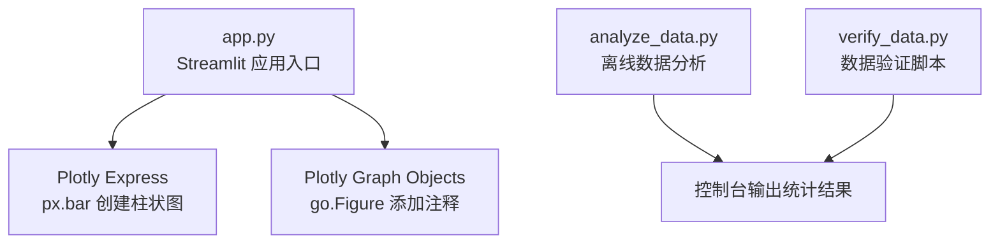
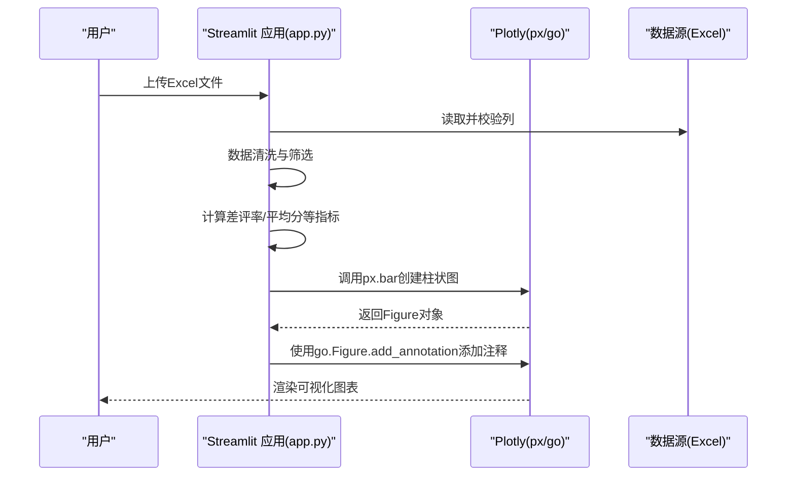
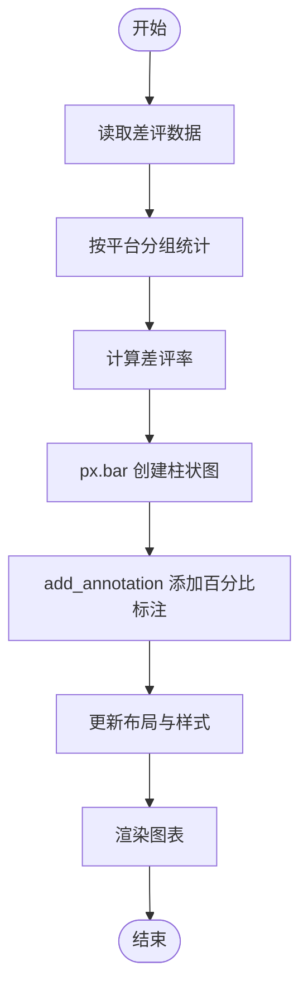
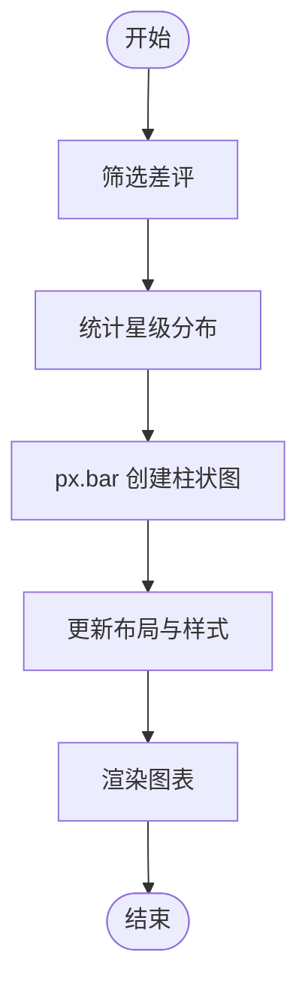
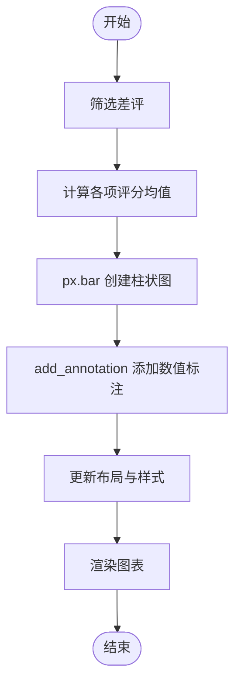
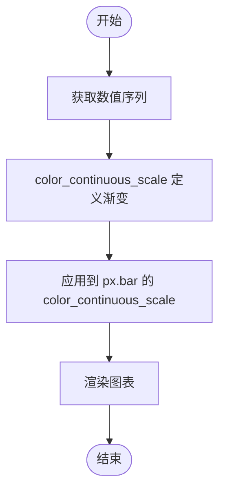
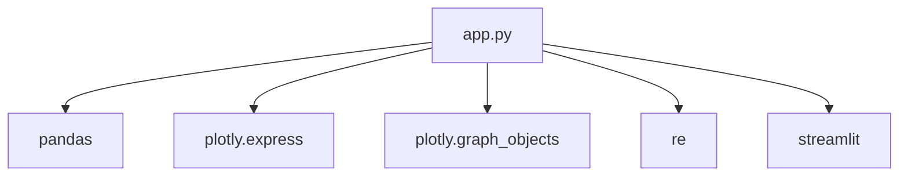

# 柱状图配置

<cite>
**本文档引用的文件**
- [app.py](file://app.py)
- [analyze_data.py](file://analyze_data.py)
- [verify_data.py](file://verify_data.py)
</cite>

## 目录
1. [简介](#简介)
2. [项目结构](#项目结构)
3. [核心组件](#核心组件)
4. [架构总览](#架构总览)
5. [详细组件分析](#详细组件分析)
6. [依赖分析](#依赖分析)
7. [性能考虑](#性能考虑)
8. [故障排除指南](#故障排除指南)
9. [结论](#结论)
10. [附录](#附录)

## 简介
本文件围绕项目中的柱状图配置进行系统化说明，涵盖以下主题：
- 平台差评率对比、差评星级分布、各项评分均值等图表的实现方法
- 颜色连续性映射（color_continuous_scale）的使用，包括从绿色到红色的渐变效果
- 注释系统的使用，包括数值标注、百分比显示和自定义文本标注
- 不同柱状图的布局配置，包括水平和垂直排列的区别
- 柱状图数据标签的添加方法和样式定制技巧

## 项目结构
该项目由三个主要文件组成，其中柱状图配置集中在应用入口文件中，数据分析脚本用于离线统计，数据验证脚本用于核对关键指标。

**图表来源**
- [app.py:1-1089](file://app.py#L1-L1089)
- [analyze_data.py:1-133](file://analyze_data.py#L1-L133)
- [verify_data.py:1-32](file://verify_data.py#L1-L32)

**章节来源**
- [app.py:1-1089](file://app.py#L1-L1089)
- [analyze_data.py:1-133](file://analyze_data.py#L1-L133)
- [verify_data.py:1-32](file://verify_data.py#L1-L32)

## 核心组件
- Streamlit 应用入口：负责读取上传的 Excel 文件，进行数据清洗与筛选，并调用 Plotly 绘制多种柱状图。
- Plotly Express（px.bar）：用于快速创建柱状图，支持颜色连续性映射、坐标轴标题设置、布局更新等。
- Plotly Graph Objects（go.Figure）：用于在现有图表基础上添加注释（annotations），实现数值标注、百分比显示等。
- 自定义主题函数：统一设置图表背景、网格线、字体、边距等视觉风格。

**章节来源**
- [app.py:296-304](file://app.py#L296-L304)
- [app.py:456-479](file://app.py#L456-L479)
- [app.py:495-510](file://app.py#L495-L510)
- [app.py:516-538](file://app.py#L516-L538)

## 架构总览
下图展示了应用启动后，数据加载、筛选、计算与绘图的整体流程。

**图表来源**
- [app.py:328-363](file://app.py#L328-L363)
- [app.py:456-479](file://app.py#L456-L479)
- [app.py:516-538](file://app.py#L516-L538)

## 详细组件分析

### 平台差评率对比（柱状图）
- 数据准备：按平台统计差评数量与总评价数量，计算差评率并排序。
- 图表创建：使用 px.bar，x 为平台名称，y 为差评率；通过 color_continuous_scale 实现从绿色到黄色再到红色的渐变。
- 注释系统：遍历每个平台的差评率，在柱子顶部添加百分比文本标注。
- 布局配置：关闭颜色条显示与图例，设置坐标轴标题与高度。

**图表来源**
- [app.py:385-387](file://app.py#L385-L387)
- [app.py:456-479](file://app.py#L456-L479)

**章节来源**
- [app.py:456-479](file://app.py#L456-L479)

### 差评星级分布（柱状图）
- 数据准备：统计差评中各星级的数量并按星级排序。
- 图表创建：使用 px.bar，x 为星级字符串，y 为数量；颜色映射从黄色到红色，强调低分段。
- 布局配置：关闭颜色条与图例，设置坐标轴标题与高度。

**图表来源**
- [app.py:365-367](file://app.py#L365-L367)
- [app.py:495-510](file://app.py#L495-L510)

**章节来源**
- [app.py:495-510](file://app.py#L495-L510)

### 差评各项评分均值（柱状图）
- 数据准备：计算差评群体在“口味分”“环境分”“服务分”上的平均值。
- 图表创建：使用 px.bar，x 为评分维度，y 为平均分；通过 color 参数为不同维度指定固定颜色。
- 注释系统：在每个柱子顶部添加数值标注，突出具体均值。
- 布局配置：设置 y 轴范围以适配评分区间，关闭图例。

**图表来源**
- [app.py:390-396](file://app.py#L390-L396)
- [app.py:516-538](file://app.py#L516-L538)

**章节来源**
- [app.py:516-538](file://app.py#L516-L538)

### 水平与垂直柱状图布局
- 垂直柱状图：x 为类别，y 为数值，适用于平台、省份、星级等分类较多的场景。
- 水平柱状图：x 为数值，y 为类别，orientation='h'，适用于标签或关键词等类别名较长的场景。

示例场景：
- 垂直：平台差评率、差评星级分布、省份差评率、用户等级分布
- 水平：菜品/服务/环境负面标签TOP10、城市差评量、未回复差评城市分布

**章节来源**
- [app.py:566-580](file://app.py#L566-L580)
- [app.py:589-613](file://app.py#L589-L613)
- [app.py:624-643](file://app.py#L624-L643)
- [app.py:694-708](file://app.py#L694-L708)
- [app.py:715-729](file://app.py#L715-L729)
- [app.py:940-956](file://app.py#L940-L956)

### 颜色连续性映射（color_continuous_scale）
- 作用：根据数值大小自动映射颜色，直观表达数值高低。
- 示例：
  - 平台差评率：['#10B981', '#F59E0B', '#EF4444']（绿→黄→红）
  - 差评星级分布：['#F59E0B', '#EF4444']（黄→红）
  - 菜品/服务/环境负面标签：['#EF4444', '#F97316'] 或 ['#F97316', '#F59E0B'] 或 ['#F59E0B', '#EF4444']
  - 用户等级：['#3B82F6', '#EF4444']（蓝→红）
  - 未回复差评城市：['#F59E0B', '#EF4444']（黄→红）

**图表来源**
- [app.py:460](file://app.py#L460)
- [app.py:499](file://app.py#L499)
- [app.py:571](file://app.py#L571)
- [app.py:600](file://app.py#L600)
- [app.py:629](file://app.py#L629)
- [app.py:863](file://app.py#L863)
- [app.py:945](file://app.py#L945)

**章节来源**
- [app.py:460](file://app.py#L460)
- [app.py:499](file://app.py#L499)
- [app.py:571](file://app.py#L571)
- [app.py:600](file://app.py#L600)
- [app.py:629](file://app.py#L629)
- [app.py:863](file://app.py#L863)
- [app.py:945](file://app.py#L945)

### 注释系统（数值标注、百分比、自定义文本）
- 数值标注：在柱子顶部添加具体数值，提升可读性。
- 百分比标注：在平台差评率、省份差评率等场景，标注百分号格式。
- 自定义文本：结合业务语义，添加提示性文本或建议。

常用实现步骤：
- 遍历数据序列，逐个添加注释
- 设置文本内容、字体颜色与大小、位置偏移
- 控制是否显示箭头、是否显示颜色条与图例

**章节来源**
- [app.py:472-478](file://app.py#L472-L478)
- [app.py:531-537](file://app.py#L531-L537)
- [app.py:750-756](file://app.py#L750-L756)
- [app.py:892-898](file://app.py#L892-L898)

### 数据标签样式定制
- 字体颜色与大小：统一使用浅色字体以适应深色主题
- 文本位置：通过 yshift 控制文本在柱子上方的偏移
- 是否显示颜色条：多数柱状图关闭 coloraxis_showscale 以避免冗余
- 是否显示图例：多数柱状图关闭 showlegend 保持简洁

**章节来源**
- [app.py:468](file://app.py#L468)
- [app.py:528](file://app.py#L528)
- [app.py:577](file://app.py#L577)
- [app.py:607](file://app.py#L607)
- [app.py:636](file://app.py#L636)
- [app.py:746](file://app.py#L746)
- [app.py:870](file://app.py#L870)
- [app.py:951](file://app.py#L951)

## 依赖分析
- 外部库依赖：
  - Streamlit：构建交互式仪表板
  - Pandas：数据清洗、分组统计、排序
  - Plotly Express：快速创建柱状图、饼图等
  - Plotly Graph Objects：在现有图表上添加注释
- 内部依赖：
  - 自定义主题函数统一图表风格
  - 好评词典过滤，提升标签分析准确性

**图表来源**
- [app.py:1-6](file://app.py#L1-L6)

**章节来源**
- [app.py:1-6](file://app.py#L1-L6)

## 性能考虑
- 数据规模较大时，建议：
  - 在前端限制展示条数（如 TOP10）
  - 对分组统计后的数据进行缓存，避免重复计算
  - 使用容器宽度自适应（use_container_width=True）提升移动端体验
- 颜色映射与注释：
  - 批量添加注释时注意循环效率，尽量减少不必要的重绘
  - 关闭 coloraxis_showscale 与 showlegend 可减少渲染开销

## 故障排除指南
- 上传文件缺少必要列：
  - 现象：应用报错并停止执行
  - 处理：检查列名是否包含“评价时间”“评价ID”“省份”“城市”“评价门店”“星级分”“口味分”“环境分”“服务分”“回复状态”
- 筛选后无数据：
  - 现象：筛选条件下无数据，应用给出提示并停止
  - 处理：调整星级范围滑块，确保至少存在一条记录
- 缺少标签列：
  - 现象：标签分析区域显示“缺少标签列”
  - 处理：确认数据中包含“菜品标签”“服务标签”“环境标签”等列
- 缺少评价详情列：
  - 现象：关键词分析区域显示“缺少评价详情列”
  - 处理：确认数据中包含“评价详情”列

**章节来源**
- [app.py:332-337](file://app.py#L332-L337)
- [app.py:359-361](file://app.py#L359-L361)
- [app.py:561-564](file://app.py#L561-L564)
- [app.py:590-593](file://app.py#L590-L593)
- [app.py:620-622](file://app.py#L620-L622)
- [app.py:653-656](file://app.py#L653-L656)

## 结论
本项目通过 Streamlit 与 Plotly 的组合，实现了多类柱状图的快速构建与可视化呈现。通过对颜色连续性映射、注释系统与布局配置的系统化运用，能够清晰表达差评率、星级分布与评分均值等关键指标，并为后续运营整改提供数据支撑。建议在实际部署中进一步优化大数据量场景下的渲染性能，并完善异常处理与用户引导。

## 附录
- 项目文件清单与职责：
  - app.py：主应用逻辑、柱状图绘制、注释与布局配置
  - analyze_data.py：离线数据分析与统计输出
  - verify_data.py：关键指标核对与验证

**章节来源**
- [app.py:1-1089](file://app.py#L1-L1089)
- [analyze_data.py:1-133](file://analyze_data.py#L1-L133)
- [verify_data.py:1-32](file://verify_data.py#L1-L32)