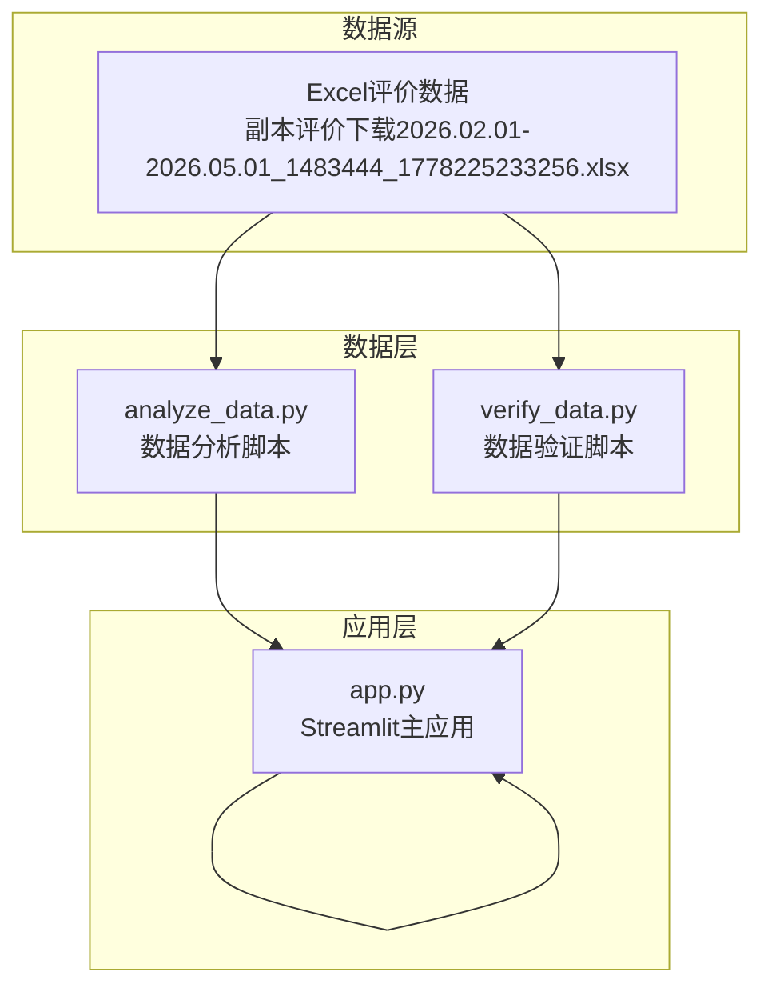
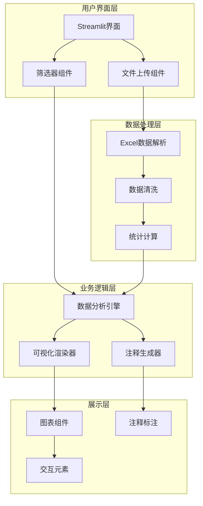
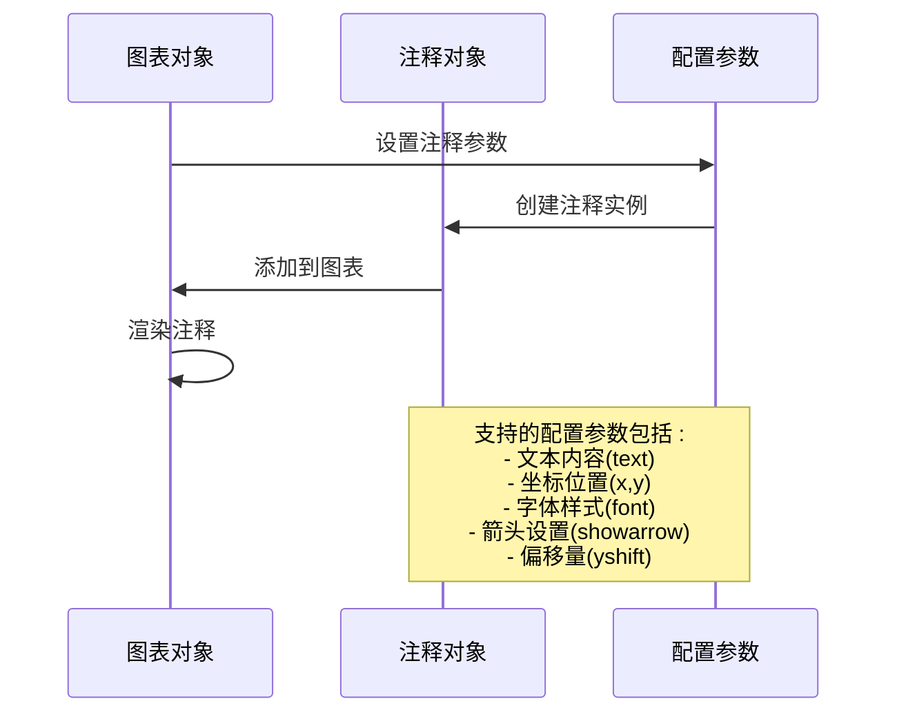
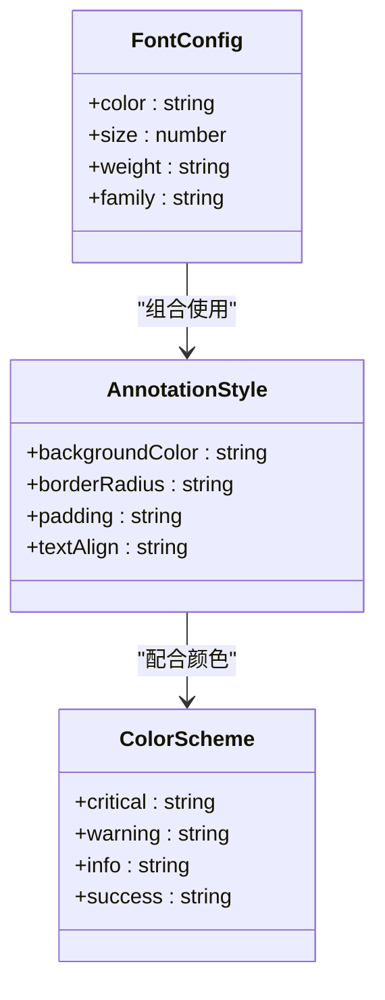
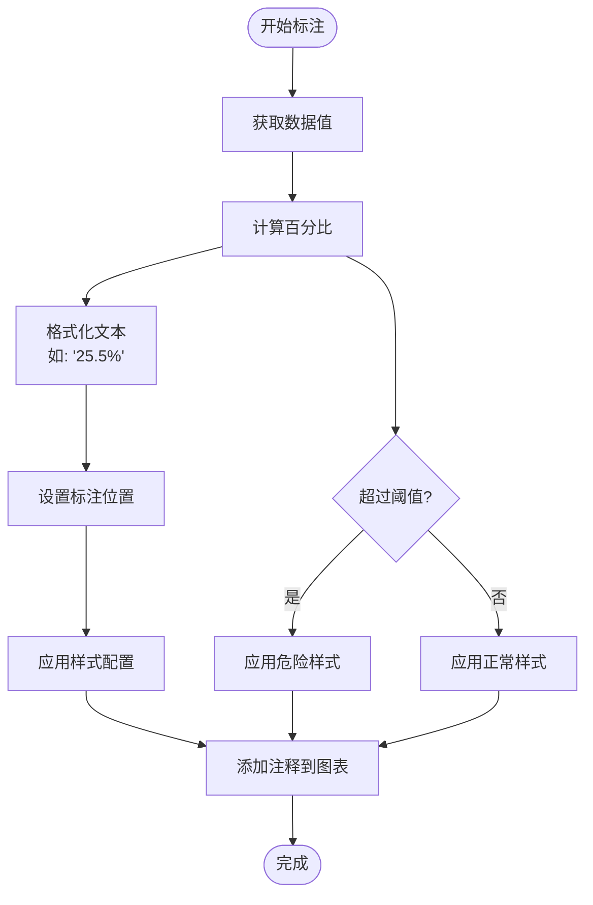
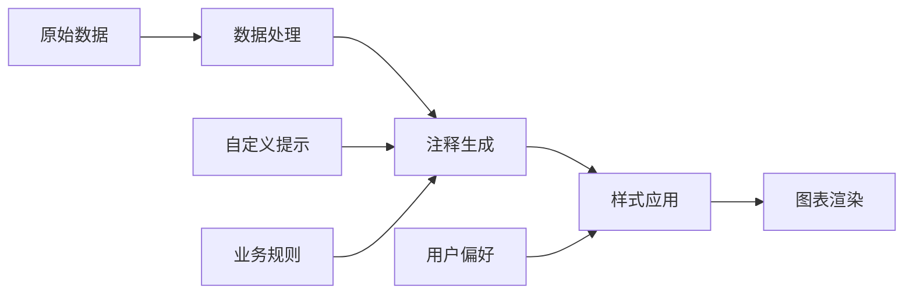
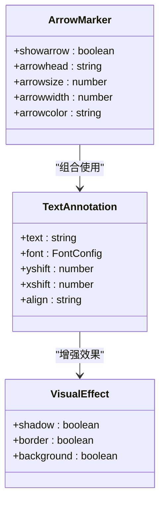
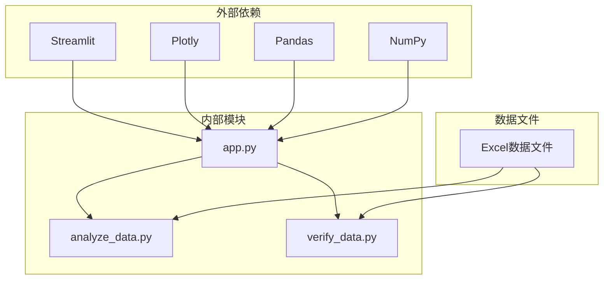
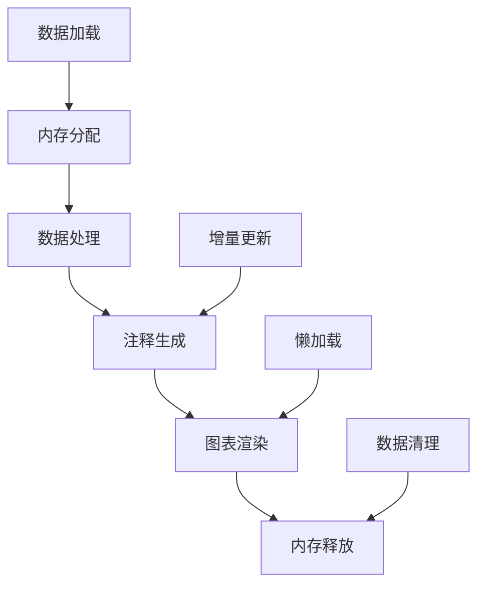

# 注释和标记系统

<cite>
**本文档引用的文件**
- [app.py](file://app.py)
- [analyze_data.py](file://analyze_data.py)
- [verify_data.py](file://verify_data.py)
</cite>

## 目录
1. [简介](#简介)
2. [项目结构](#项目结构)
3. [核心组件](#核心组件)
4. [架构概览](#架构概览)
5. [详细组件分析](#详细组件分析)
6. [依赖关系分析](#依赖关系分析)
7. [性能考虑](#性能考虑)
8. [故障排除指南](#故障排除指南)
9. [结论](#结论)

## 简介

本项目是一个餐饮差评运营分析看板，专注于通过数据可视化和注释系统来识别和解决餐饮服务中的问题。系统实现了完整的注释和标记功能，用于在图表中突出显示关键数据点、百分比标注和重要信息。

该系统的核心价值在于：
- **实时数据可视化**：通过Plotly图表展示复杂的餐饮评价数据
- **智能注释系统**：自动在图表中标注关键指标和异常值
- **多维度分析**：从多个角度分析差评问题并提供整改建议
- **交互式体验**：用户可以通过筛选器动态调整分析视角

## 项目结构

项目采用简洁的三层架构设计，每个模块都有明确的职责分工：

**图表来源**
- [app.py:1-1089](file://app.py#L1-L1089)
- [analyze_data.py:1-133](file://analyze_data.py#L1-L133)
- [verify_data.py:1-32](file://verify_data.py#L1-L32)

**章节来源**
- [app.py:1-1089](file://app.py#L1-L1089)
- [analyze_data.py:1-133](file://analyze_data.py#L1-L133)
- [verify_data.py:1-32](file://verify_data.py#L1-L32)

## 核心组件

### 注释系统架构

系统实现了多层次的注释和标记机制，主要体现在以下几个方面：

#### 1. 图表注释引擎
- **位置控制**：精确控制注释在图表中的X、Y坐标位置
- **样式定制**：支持字体大小、颜色、粗细等样式属性
- **箭头标记**：可选的箭头指向特定数据点
- **文本对齐**：支持垂直偏移和水平对齐

#### 2. 百分比标注系统
- **动态计算**：根据数据实时计算百分比值
- **格式化输出**：统一的百分比显示格式
- **颜色编码**：不同百分比区间使用不同的颜色方案

#### 3. 数值标注策略
- **平均值标注**：在柱状图顶部显示数值
- **比例标注**：在饼图和条形图中显示比例
- **阈值标注**：突出显示异常或关键数值

**章节来源**
- [app.py:470-480](file://app.py#L470-L480)
- [app.py:530-540](file://app.py#L530-L540)
- [app.py:749-757](file://app.py#L749-L757)
- [app.py:891-899](file://app.py#L891-L899)

## 架构概览

系统采用模块化设计，每个功能模块都有清晰的职责边界：

**图表来源**
- [app.py:326-363](file://app.py#L326-L363)
- [app.py:440-451](file://app.py#L440-L451)
- [app.py:455-480](file://app.py#L455-L480)

## 详细组件分析

### 注释系统实现

#### add_annotation函数详解

系统通过Plotly的`add_annotation`方法实现注释功能，该方法支持丰富的配置选项：

**图表来源**
- [app.py:472-478](file://app.py#L472-L478)
- [app.py:531-537](file://app.py#L531-L537)
- [app.py:750-756](file://app.py#L750-L756)
- [app.py:892-898](file://app.py#L892-L898)

#### 注释参数配置

| 参数名称 | 类型 | 默认值 | 描述 |
|---------|------|--------|------|
| x | float/int | 0 | X轴坐标位置 |
| y | float/int | 0 | Y轴坐标位置 |
| text | str | "" | 显示的文本内容 |
| showarrow | bool | False | 是否显示箭头 |
| font | dict | {} | 字体样式配置 |
| yshift | int | 0 | 垂直偏移量 |
| xshift | int | 0 | 水平偏移量 |

#### 位置控制策略

系统实现了多种位置控制策略：

1. **索引位置标注**：使用数据索引作为X坐标，数值作为Y坐标
2. **百分比位置标注**：在图表顶部显示百分比数值
3. **动态位置调整**：根据数据值自动调整注释位置

**章节来源**
- [app.py:470-480](file://app.py#L470-L480)
- [app.py:530-540](file://app.py#L530-L540)
- [app.py:749-757](file://app.py#L749-L757)
- [app.py:891-899](file://app.py#L891-L899)

### 字体样式和颜色设置

#### 字体样式配置

系统提供了统一的字体样式配置，确保注释的可读性和一致性：

**图表来源**
- [app.py:476-477](file://app.py#L476-L477)
- [app.py:535-536](file://app.py#L535-L536)
- [app.py:754-755](file://app.py#L754-L755)
- [app.py:896-897](file://app.py#L896-L897)

#### 颜色编码策略

系统采用颜色编码来传达数据的重要程度：

| 颜色类别 | 颜色值 | 使用场景 | 语义含义 |
|---------|--------|----------|----------|
| critical | #EF4444 | 差评率、严重问题 | 危险、需要立即关注 |
| warning | #F97316 | 回复率不足、中等问题 | 警告、需要关注 |
| info | #3B82F6 | 平均评分、一般信息 | 信息、参考数据 |
| success | #10B981 | 回复率高、积极成果 | 成功、良好表现 |

**章节来源**
- [app.py:446](file://app.py#L446)
- [app.py:459](file://app.py#L459)
- [app.py:499](file://app.py#L499)
- [app.py:519](file://app.py#L519)

### 不同场景下的注释策略

#### 百分比标注策略

系统在多个图表中实现了百分比标注：

**图表来源**
- [app.py:472-478](file://app.py#L472-L478)
- [app.py:750-756](file://app.py#L750-L756)
- [app.py:892-898](file://app.py#L892-L898)

#### 数值标注策略

对于数值型数据，系统采用直接标注的方式：

1. **柱状图数值标注**：在柱状图顶部显示具体数值
2. **平均值标注**：在图表中突出显示平均值
3. **累计值标注**：显示累计统计结果

#### 自定义提示信息

系统支持自定义提示信息的添加：

**图表来源**
- [app.py:550-553](file://app.py#L550-L553)
- [app.py:982-998](file://app.py#L982-L998)

**章节来源**
- [app.py:470-480](file://app.py#L470-L480)
- [app.py:530-540](file://app.py#L530-L540)
- [app.py:749-757](file://app.py#L749-L757)
- [app.py:891-899](file://app.py#L891-L899)
- [app.py:982-998](file://app.py#L982-L998)

### 标记系统的视觉效果

#### 箭头标记系统

系统实现了灵活的箭头标记功能：

**图表来源**
- [app.py:475](file://app.py#L475)
- [app.py:534](file://app.py#L534)
- [app.py:753](file://app.py#L753)
- [app.py:895](file://app.py#L895)

#### 文本框标记系统

系统支持多种文本框样式：

1. **简单文本标注**：纯文本显示
2. **带背景标注**：带背景色的文本框
3. **圆角文本框**：圆润边角的标注框
4. **彩色主题标注**：根据数据重要性着色

#### 图标应用策略

系统在界面中集成了丰富的图标元素：

| 图标类别 | 图标符号 | 使用场景 | 功能作用 |
|---------|----------|----------|----------|
| 标题图标 | 📌, 📊, 🎯 | 页面标题 | 区分功能模块 |
| 状态图标 | 🔴, 🟠, 🟡, 🟢 | KPI状态 | 显示数据状态 |
| 操作图标 | 📤, 📋, ⚠️ | 功能按钮 | 引导用户操作 |
| 提示图标 | 💡, ✅, ❗ | 信息提示 | 提供辅助信息 |

**章节来源**
- [app.py:398-401](file://app.py#L398-L401)
- [app.py:475](file://app.py#L475)
- [app.py:534](file://app.py#L534)
- [app.py:753](file://app.py#L753)
- [app.py:895](file://app.py#L895)

## 依赖关系分析

系统采用了清晰的依赖层次结构：

**图表来源**
- [app.py:1-7](file://app.py#L1-L7)
- [analyze_data.py:1](file://analyze_data.py#L1)
- [verify_data.py:1](file://verify_data.py#L1)

### 外部依赖管理

系统对外部依赖的使用遵循最佳实践：

1. **版本兼容性**：确保所有依赖包版本兼容
2. **功能分离**：每个依赖负责特定的功能领域
3. **性能优化**：合理使用依赖以保证运行效率

### 内部模块耦合

系统内部模块之间保持松耦合：

- **app.py**：主要业务逻辑和界面展示
- **analyze_data.py**：独立的数据分析功能
- **verify_data.py**：数据验证和质量检查

**章节来源**
- [app.py:1-7](file://app.py#L1-L7)
- [analyze_data.py:1-133](file://analyze_data.py#L1-L133)
- [verify_data.py:1-32](file://verify_data.py#L1-L32)

## 性能考虑

### 注释渲染性能

系统在注释渲染方面采用了多项优化措施：

1. **批量注释处理**：一次性添加多个注释，减少重绘次数
2. **条件注释生成**：只在数据存在时生成注释
3. **样式缓存**：复用相同的样式配置，避免重复计算

### 内存使用优化

### 响应式设计

系统采用响应式布局，确保在不同设备上的良好体验：

- **自适应图表尺寸**：根据容器大小调整图表尺寸
- **移动端优化**：针对移动设备优化触摸交互
- **加载状态指示**：提供清晰的加载状态反馈

## 故障排除指南

### 常见问题及解决方案

#### 注释显示问题

**问题描述**：注释无法正确显示在图表上

**可能原因**：
1. 坐标系统不匹配
2. 注释样式冲突
3. 数据为空或无效

**解决方案**：
1. 检查X、Y坐标值的有效性
2. 验证注释样式配置
3. 确保数据预处理正确

#### 性能问题

**问题描述**：图表渲染缓慢或内存占用过高

**可能原因**：
1. 注释数量过多
2. 数据量过大
3. 样式复杂度过高

**解决方案**：
1. 限制注释数量
2. 实施数据分页
3. 简化样式配置

#### 数据验证失败

**问题描述**：上传的Excel文件无法正确解析

**可能原因**：
1. 缺少必要列
2. 数据格式不正确
3. 文件损坏

**解决方案**：
1. 检查文件完整性
2. 验证数据格式
3. 重新生成数据文件

**章节来源**
- [app.py:1033-1035](file://app.py#L1033-L1035)
- [app.py:335-337](file://app.py#L335-L337)

### 调试工具和技巧

系统提供了完善的调试支持：

1. **数据验证面板**：显示详细的统计数据
2. **错误日志记录**：捕获和显示运行时错误
3. **性能监控**：跟踪内存使用和渲染时间

## 结论

本注释和标记系统为餐饮差评分析提供了强大的可视化支持。通过精心设计的注释策略和丰富的视觉效果，系统能够有效地突出关键数据点，帮助用户快速识别问题并制定改进措施。

### 主要优势

1. **智能化注释**：自动根据数据生成合适的注释内容
2. **灵活的样式控制**：支持丰富的样式配置选项
3. **多场景适配**：适用于各种类型的图表和数据展示
4. **良好的用户体验**：直观的界面设计和交互体验

### 技术特色

1. **模块化设计**：清晰的组件分离和职责划分
2. **性能优化**：高效的渲染和内存管理
3. **错误处理**：完善的异常处理和用户反馈机制
4. **扩展性**：易于添加新的注释类型和样式

### 发展建议

1. **注释模板系统**：实现注释样式的模板化管理
2. **交互式注释编辑**：允许用户自定义注释内容和样式
3. **注释历史追踪**：记录注释的修改历史
4. **注释共享功能**：支持团队协作和注释分享

该系统为餐饮行业的数据分析和问题诊断提供了强有力的技术支撑，通过持续的优化和改进，将进一步提升用户体验和分析效果。