# 饼图配置

<cite>
**本文档引用的文件**
- [app.py](file://app.py)
- [analyze_data.py](file://analyze_data.py)
- [verify_data.py](file://verify_data.py)
</cite>

## 目录
1. [简介](#简介)
2. [项目结构](#项目结构)
3. [核心组件](#核心组件)
4. [架构概览](#架构概览)
5. [详细组件分析](#详细组件分析)
6. [依赖关系分析](#依赖关系分析)
7. [性能考虑](#性能考虑)
8. [故障排除指南](#故障排除指南)
9. [结论](#结论)

## 简介

本文件专注于评价等级分布饼图的配置和实现方法。该系统使用Plotly Express的px.pie函数创建了多个饼图可视化，包括评价等级分布、VIP用户分布等。本文档将深入解释饼图的参数配置、颜色映射设置、视觉效果配置以及最佳实践。

## 项目结构

该项目采用简洁的三层架构设计：

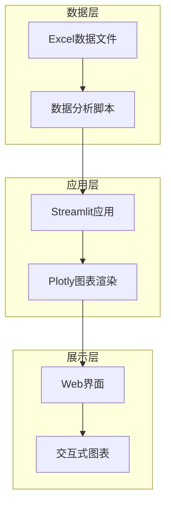

**图表来源**
- [app.py:1-1089](file://app.py#L1-L1089)

**章节来源**
- [app.py:1-1089](file://app.py#L1-L1089)

## 核心组件

### 饼图配置系统

系统实现了两个主要的饼图配置模式：

1. **基础饼图配置**：用于评价等级分布
2. **主题化饼图配置**：用于VIP用户分布

### 颜色映射策略

系统采用了统一的颜色映射策略，确保视觉一致性：

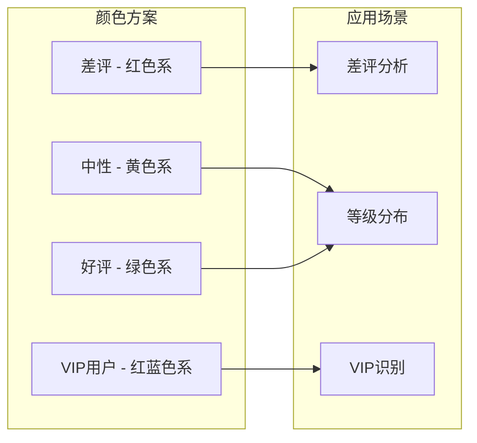

**图表来源**
- [app.py:442-451](file://app.py#L442-L451)
- [app.py:843-853](file://app.py#L843-L853)

**章节来源**
- [app.py:442-451](file://app.py#L442-L451)
- [app.py:843-853](file://app.py#L843-L853)

## 架构概览

系统采用模块化设计，每个饼图都遵循相同的配置模式：

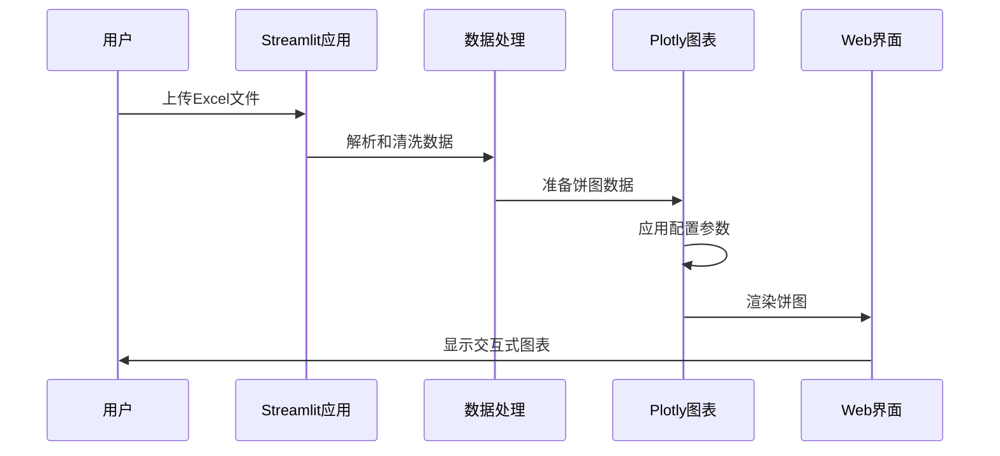

**图表来源**
- [app.py:328-451](file://app.py#L328-L451)

## 详细组件分析

### 评价等级分布饼图

这是系统中最核心的饼图组件，用于展示差评、中性和好评的分布情况。

#### 基础配置参数

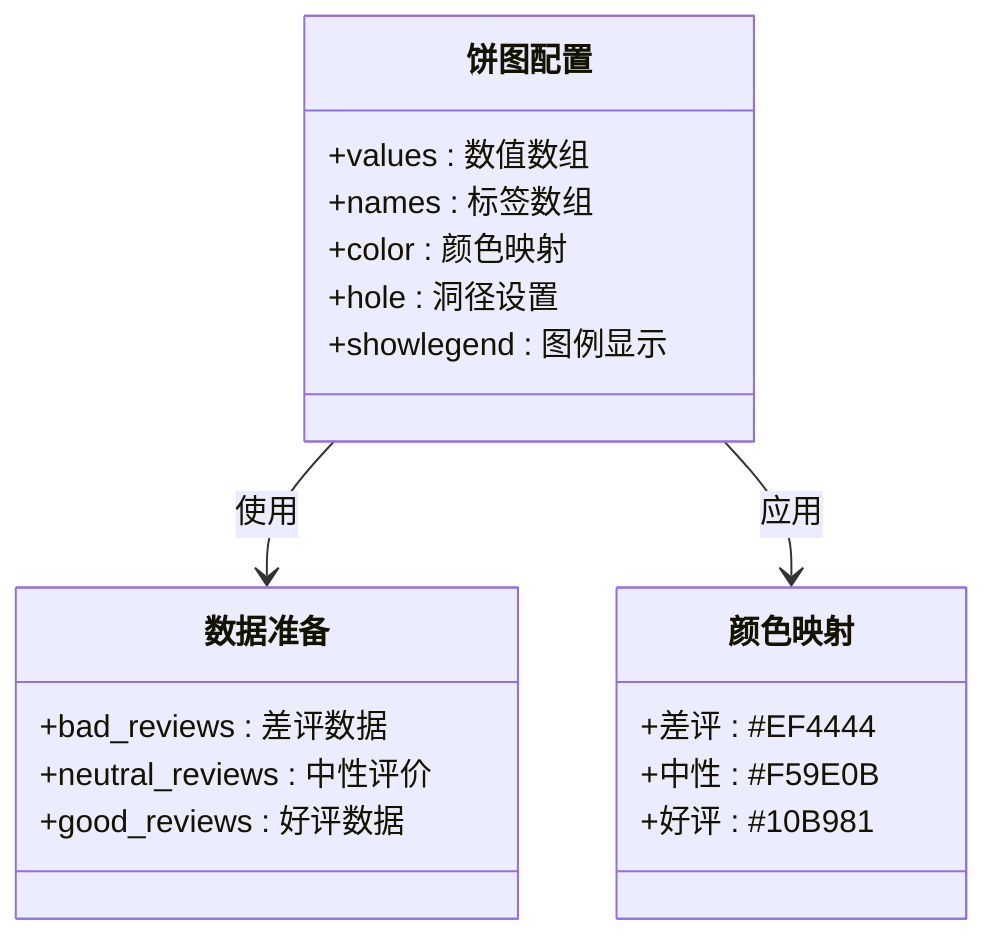

**图表来源**
- [app.py:441-449](file://app.py#L441-L449)

#### 关键配置要素

1. **数据源配置**：使用pd.Series创建评价等级分布数据
2. **颜色映射**：通过color_discrete_map实现自定义颜色
3. **视觉效果**：设置hole参数创建环形饼图
4. **布局配置**：应用统一的主题样式

**章节来源**
- [app.py:441-449](file://app.py#L441-L449)

### VIP用户分布饼图

另一个重要的饼图组件，用于展示VIP用户与普通用户的分布情况。

#### 配置特点

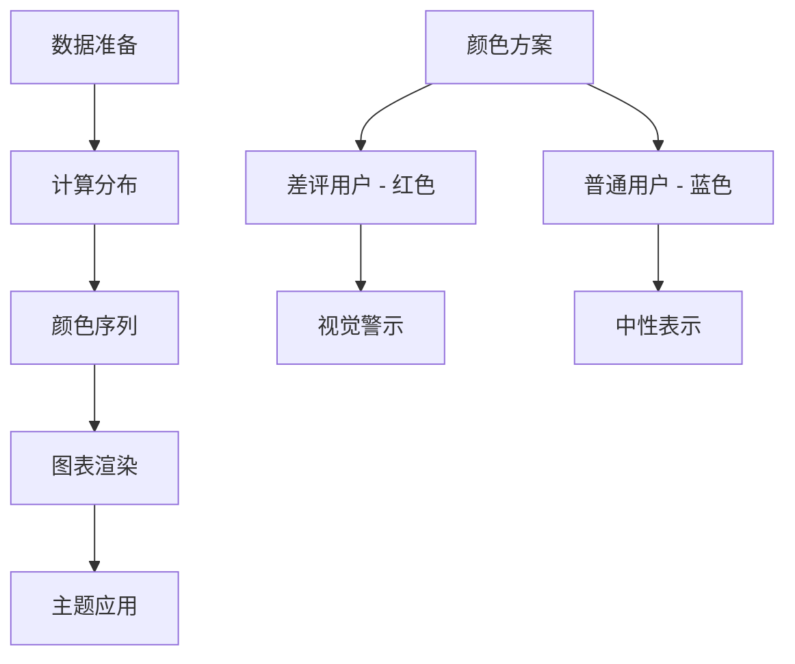

**图表来源**
- [app.py:843-853](file://app.py#L843-L853)

**章节来源**
- [app.py:843-853](file://app.py#L843-L853)

### px.pie函数参数详解

#### 必需参数

| 参数名 | 类型 | 描述 | 示例值 |
|--------|------|------|--------|
| values | array-like | 饼图扇区的数值 | eval_dist.values |
| names | array-like | 扇区的标签名称 | eval_dist.index |
| color | array-like | 颜色映射 | eval_dist.index |

#### 可选参数

| 参数名 | 类型 | 默认值 | 描述 |
|--------|------|--------|------|
| hole | float | 0 | 饼图中心洞径比例 |
| title | str | '' | 图表标题 |
| labels | dict | None | 自定义标签映射 |
| color_discrete_map | dict | None | 自定义颜色映射 |
| color_discrete_sequence | list | None | 颜色序列 |

**章节来源**
- [app.py:442-448](file://app.py#L442-L448)

### 颜色映射配置

#### 颜色选择原则

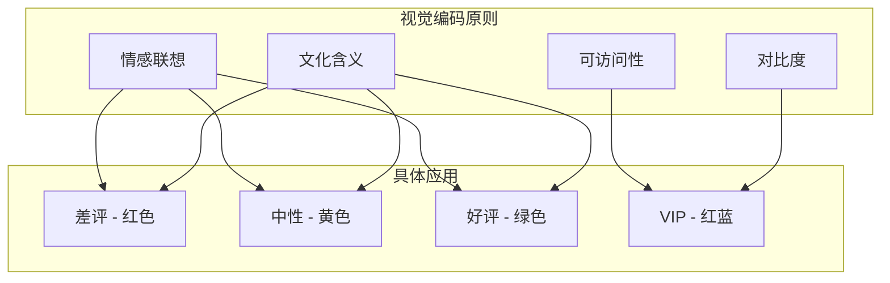

**图表来源**
- [app.py:446](file://app.py#L446)

#### 颜色方案选择

| 评价等级 | 颜色代码 | 含义 | 应用场景 |
|----------|----------|------|----------|
| 差评 | #EF4444 | 危险/警示 | 差评率分析 |
| 中性 | #F59E0B | 平衡/中性 | 中性评价分布 |
| 好评 | #10B981 | 积极/成功 | 好评率统计 |
| VIP用户 | #EF4444 | 重要客户 | VIP识别 |
| 普通用户 | #3B82F6 | 一般客户 | 普通用户对比 |

**章节来源**
- [app.py:446](file://app.py#L446)
- [app.py:846](file://app.py#L846)

### 视觉效果配置

#### 洞径设置

洞径(hole)参数用于创建环形饼图效果：

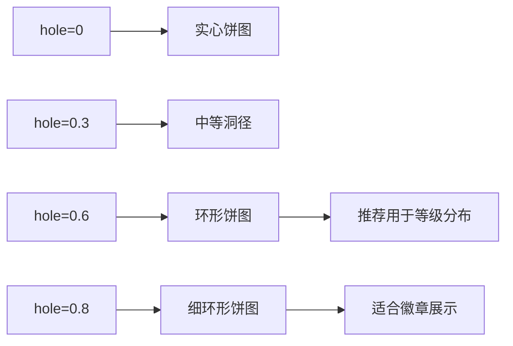

**图表来源**
- [app.py:447](file://app.py#L447)

#### 图例配置

图例在饼图中提供了重要的上下文信息：

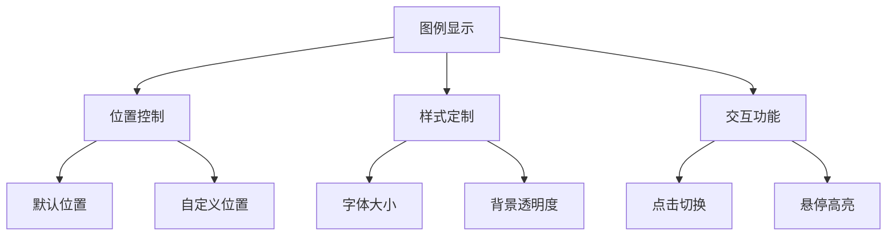

**图表来源**
- [app.py:449](file://app.py#L449)

### 标签和标注配置

#### 百分比显示

系统通过多种方式实现百分比标注：

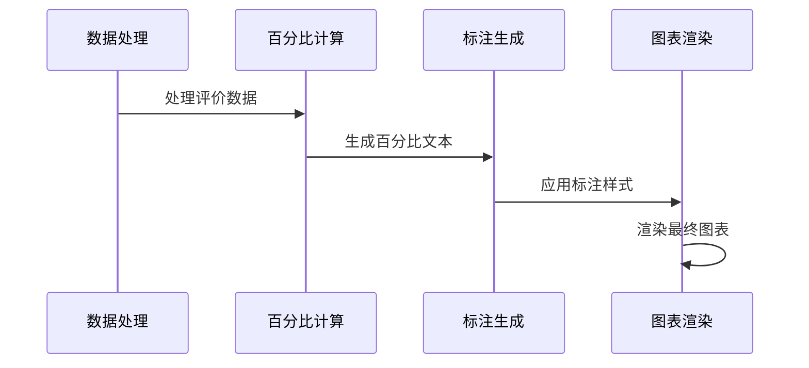

**图表来源**
- [app.py:441-449](file://app.py#L441-L449)

#### 数值标注方法

对于其他图表类型，系统使用注释(annotation)方式添加数值标注：

**章节来源**
- [app.py:472-478](file://app.py#L472-L478)
- [app.py:531-538](file://app.py#L531-L538)

### 交互功能配置

#### 交互特性

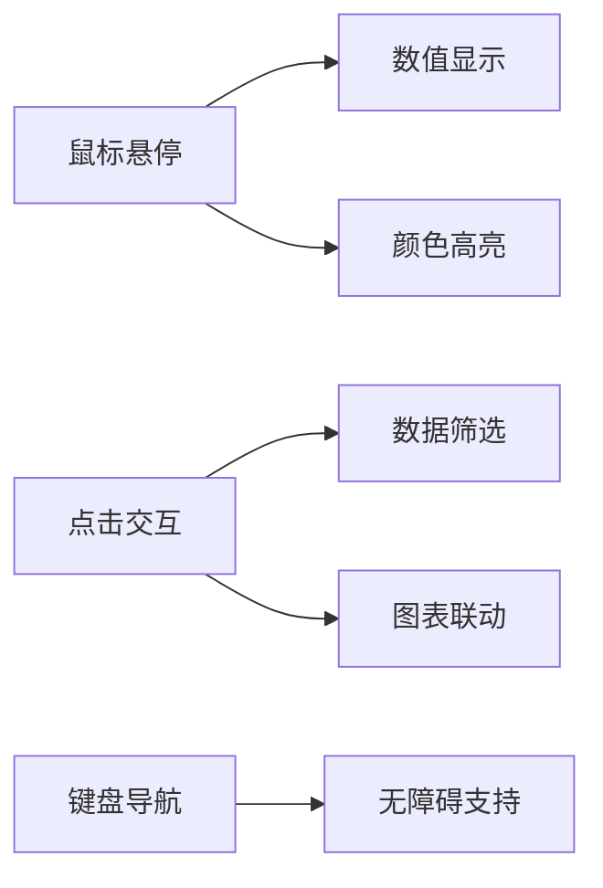

**图表来源**
- [app.py:449](file://app.py#L449)

## 依赖关系分析

### 核心依赖

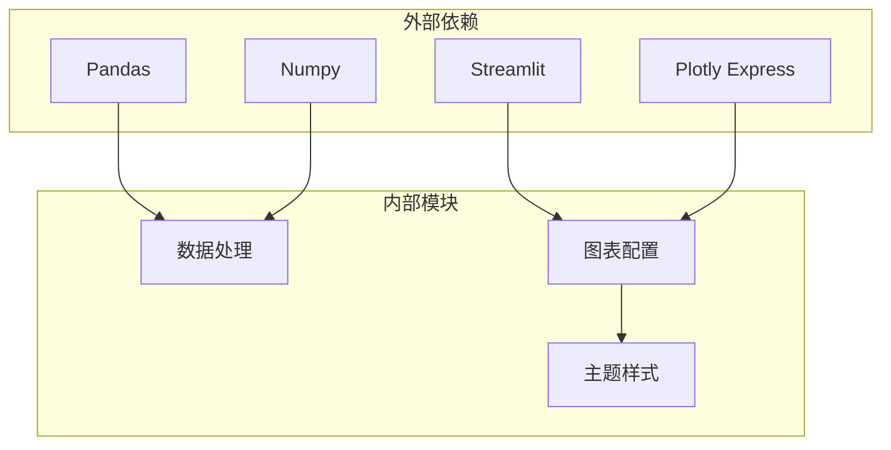

**图表来源**
- [app.py:1-6](file://app.py#L1-L6)

### 组件耦合关系

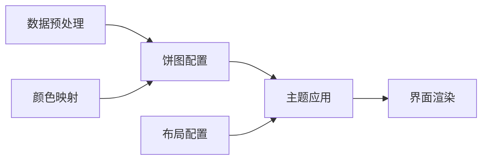

**图表来源**
- [app.py:328-451](file://app.py#L328-L451)

**章节来源**
- [app.py:1-6](file://app.py#L1-L6)
- [app.py:328-451](file://app.py#L328-L451)

## 性能考虑

### 数据处理优化

1. **内存使用**：使用pandas进行高效的数据聚合
2. **计算效率**：避免重复计算，缓存中间结果
3. **渲染优化**：合理设置图表尺寸，平衡清晰度和性能

### 图表渲染优化

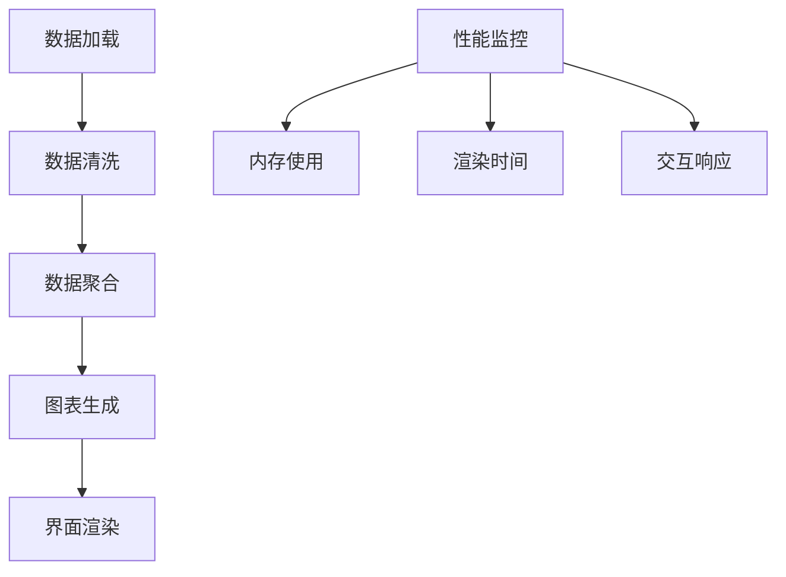

## 故障排除指南

### 常见问题及解决方案

#### 数据格式问题

| 问题类型 | 症状 | 解决方案 |
|----------|------|----------|
| 缺少必要列 | 图表不显示 | 检查Excel列名匹配 |
| 数据类型错误 | 计算异常 | 确保数值列为正确类型 |
| 缺失值处理 | 统计偏差 | 使用fillna或dropna处理 |

#### 颜色显示问题

| 问题 | 可能原因 | 解决方法 |
|------|----------|----------|
| 颜色不显示 | 颜色映射错误 | 检查color_discrete_map配置 |
| 颜色不一致 | 主题冲突 | 确认颜色方案应用顺序 |
| 对比度不足 | 颜色选择不当 | 调整颜色亮度和饱和度 |

**章节来源**
- [app.py:332-338](file://app.py#L332-L338)
- [app.py:1033-1035](file://app.py#L1033-L1035)

## 结论

本项目展示了如何在实际业务场景中有效使用饼图进行数据可视化。通过合理的参数配置、颜色映射和视觉效果设置，系统能够清晰地传达评价等级分布的关键信息。

### 最佳实践总结

1. **明确目标**：根据业务需求选择合适的图表类型
2. **色彩搭配**：遵循情感联想和文化含义的原则
3. **交互设计**：提供直观的用户交互体验
4. **性能优化**：平衡视觉效果和运行效率
5. **可访问性**：确保不同用户群体都能理解图表信息

这些实践经验为类似的数据可视化项目提供了有价值的参考框架。