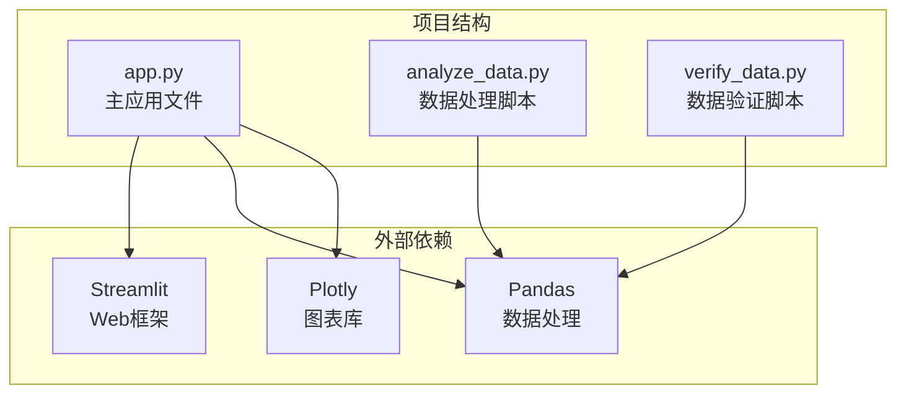
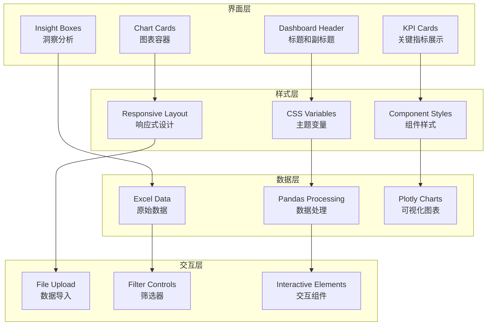
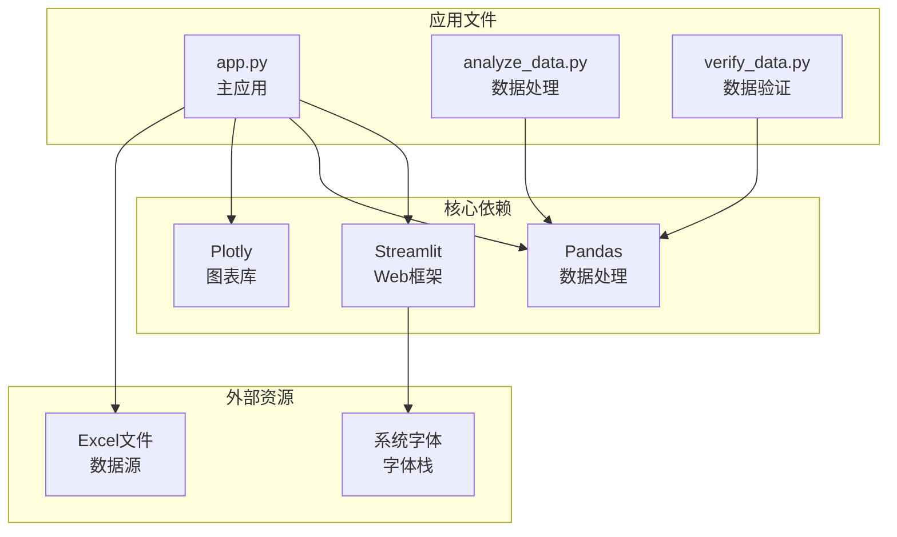

# 界面设计原则

<cite>
**本文档引用的文件**
- [app.py](file://app.py)
- [analyze_data.py](file://analyze_data.py)
- [verify_data.py](file://verify_data.py)
</cite>

## 目录
1. [引言](#引言)
2. [项目结构](#项目结构)
3. [核心组件](#核心组件)
4. [架构概览](#架构概览)
5. [详细组件分析](#详细组件分析)
6. [依赖分析](#依赖分析)
7. [性能考虑](#性能考虑)
8. [故障排除指南](#故障排除指南)
9. [结论](#结论)

## 引言

本文件详细阐述了餐饮差评运营分析看板的界面设计原则，这是一个基于Streamlit构建的数据可视化应用。该系统采用暗色主题设计，通过精心设计的色彩体系、响应式布局和统一的视觉层次结构，为用户提供专业的数据分析体验。

## 项目结构

该项目采用简洁的单文件架构，主要包含一个核心应用文件和两个辅助分析脚本：

**图表来源**
- [app.py:1-1089](file://app.py#L1-L1089)
- [analyze_data.py:1-133](file://analyze_data.py#L1-L133)
- [verify_data.py:1-32](file://verify_data.py#L1-L32)

**章节来源**
- [app.py:1-1089](file://app.py#L1-L1089)

## 核心组件

### 暗色主题设计理念

系统采用深色主题设计，主要背景色为深蓝色调（#0F172A），营造专业、现代的视觉效果。这种设计选择特别适合数据分析场景，能够减少视觉疲劳并突出数据内容。

**章节来源**
- [app.py:10-31](file://app.py#L10-L31)
- [app.py:33-37](file://app.py#L33-L37)

### 色彩体系设计

系统建立了完整的色彩体系，包含主色调、辅助色和渐变色：

#### 主色调系统
- **红色系** (#EF4444): 用于差评、警告和重要信息
- **橙色系** (#F97316): 用于中等严重程度的问题
- **黄色系** (#F59E0B): 用于一般性问题
- **蓝色系** (#3B82F6): 用于信息类内容
- **绿色系** (#10B981): 用于积极结果和成功状态
- **青色系** (#14B8A6): 用于特殊强调

#### 中性色调系统
- **深背景** (--bg-dark: #0F172A): 主要背景色
- **卡片背景** (--bg-card: #1E293B): 卡片和容器背景
- **文本颜色**:
  - 主文本 (--text-primary: #F1F5F9)
  - 次要文本 (--text-secondary: #94A3B8)
  - 柔和文本 (--text-muted: #64748B)

#### 渐变色系统
- **红色渐变**: 从红色到橙色的渐变效果
- **蓝色渐变**: 从蓝色到紫色的渐变效果
- **绿色渐变**: 从绿色到青色的渐变效果
- **橙色渐变**: 从橙色到黄色的渐变效果

**章节来源**
- [app.py:12-31](file://app.py#L12-L31)

### CSS变量系统详解

系统采用CSS自定义属性（CSS变量）实现主题化设计，所有颜色都通过变量进行管理：

#### 变量命名规范
- **主色调**: --primary-[颜色名称]
- **背景色**: --bg-[用途]
- **文本色**: --text-[级别]
- **边框色**: --border-color
- **渐变色**: --gradient-[颜色]

#### 变量作用域
所有变量在:root选择器中定义，确保在整个文档范围内可用：
- 使用 `var(--variable-name)` 语法引用变量
- 支持浏览器回退机制，当CSS变量不可用时使用备用颜色

**章节来源**
- [app.py:10-31](file://app.py#L10-L31)

## 架构概览

系统采用模块化架构，将界面设计、数据处理和可视化功能分离：

**图表来源**
- [app.py:319-324](file://app.py#L319-L324)
- [app.py:404-427](file://app.py#L404-L427)
- [app.py:436-480](file://app.py#L436-L480)

## 详细组件分析

### 响应式布局实现

系统采用流式网格系统和弹性布局实现响应式设计：

#### 网格系统
- **KPI区域**: 使用CSS Grid实现4列布局
- **图表区域**: 使用Flexbox实现自适应排列
- **容器设计**: 所有容器使用百分比宽度和最小宽度约束

#### 卡片布局
- **统一尺寸**: 标准化12px圆角和1.25rem内边距
- **边框系统**: 使用1px实线边框，支持悬停效果
- **阴影系统**: 统一的24px阴影效果，增强层次感

#### 容器设计
- **主容器**: 使用1rem上下内边距
- **卡片容器**: 使用12px圆角和1px边框
- **图表容器**: 内置1.25rem内边距和1.25rem底部边距

**章节来源**
- [app.py:84-89](file://app.py#L84-L89)
- [app.py:91-102](file://app.py#L91-L102)
- [app.py:155-161](file://app.py#L155-L161)

### 视觉层次结构

系统建立了清晰的视觉层次结构，通过字体大小、颜色和边框来区分不同级别的信息：

#### 标题层级
- **页面标题**: 28px，使用渐变文字效果
- **仪表板标题**: 20px，加粗显示
- **小节标题**: 16px，带下划线装饰
- **标签标题**: 14px，加粗显示

#### 间距规范
- **大间距**: 2rem (卡片间距)
- **中间距**: 1.25rem (组件间距)
- **小间距**: 0.5rem (内部间距)
- **超小间距**: 0.25rem (徽章间距)

#### 边框样式
- **标准边框**: 1px实线，颜色为--border-color
- **强调边框**: 3px实线，用于状态指示
- **圆角系统**: 统一使用12px圆角半径

**章节来源**
- [app.py:53-61](file://app.py#L53-L61)
- [app.py:68-78](file://app.py#L68-L78)
- [app.py:120-131](file://app.py#L120-L131)

### 界面元素标准化设计

#### KPI卡片设计
- **状态分类**: 支持critical、warning、info、success四种状态
- **颜色映射**: 每种状态对应特定的颜色方案
- **交互效果**: 悬停时提升和阴影增强

#### 图表容器设计
- **统一样式**: 所有图表使用相同的卡片样式
- **标题系统**: 每个图表都有明确的标题标识
- **内边距规范**: 标准化的1.25rem内边距

#### 标签云设计
- **弹性布局**: 使用flex-wrap实现自动换行
- **间距控制**: 0.5rem间隔确保良好的可读性
- **状态标签**: 支持多种颜色的状态标签

**章节来源**
- [app.py:104-118](file://app.py#L104-L118)
- [app.py:155-168](file://app.py#L155-L168)
- [app.py:219-245](file://app.py#L219-L245)

## 依赖分析

系统依赖关系相对简单，主要依赖于Streamlit生态系统：

**图表来源**
- [app.py:1-7](file://app.py#L1-L7)
- [analyze_data.py:1](file://analyze_data.py#L1)
- [verify_data.py:1](file://verify_data.py#L1)

**章节来源**
- [app.py:1-7](file://app.py#L1-L7)

## 性能考虑

### 样式优化
- **CSS变量缓存**: 浏览器原生支持CSS变量，减少重复计算
- **渐变渲染**: 使用硬件加速的渐变效果
- **阴影优化**: 合理的阴影值避免过度渲染

### 数据处理优化
- **内存管理**: 使用pandas高效的数据处理
- **图表优化**: Plotly图表的懒加载机制
- **文件处理**: Excel文件的分块读取策略

## 故障排除指南

### 常见问题及解决方案

#### 样式不生效
- **检查CSS注入**: 确保OP_STYLE正确注入到页面
- **变量引用**: 验证CSS变量名拼写正确
- **浏览器兼容性**: 检查目标浏览器对CSS变量的支持

#### 数据显示异常
- **列名匹配**: 确认Excel文件列名与代码要求一致
- **数据类型**: 验证时间字段转换为datetime类型
- **空值处理**: 检查缺失值的处理逻辑

#### 图表渲染问题
- **容器宽度**: 确保图表容器具有明确的宽度
- **数据格式**: 验证传入Plotly的数据格式正确
- **主题配置**: 检查make_plotly_theme函数的配置

**章节来源**
- [app.py:328-363](file://app.py#L328-L363)
- [app.py:296-304](file://app.py#L296-L304)

## 结论

本界面设计原则文档详细阐述了餐饮差评运营分析看板的设计理念和实现方法。系统通过精心设计的暗色主题、完整的色彩体系、响应式布局和统一的视觉层次结构，为用户提供专业的数据分析体验。

关键设计要点包括：
- **一致性**: 所有组件遵循统一的设计语言
- **可扩展性**: CSS变量系统便于主题定制
- **响应性**: 自适应布局适配不同屏幕尺寸
- **可访问性**: 良好的对比度和色彩搭配

这些设计原则不仅适用于当前项目，也为类似的数据可视化应用提供了参考模板。