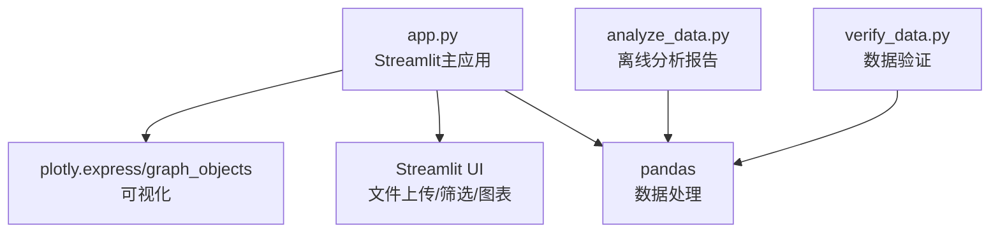
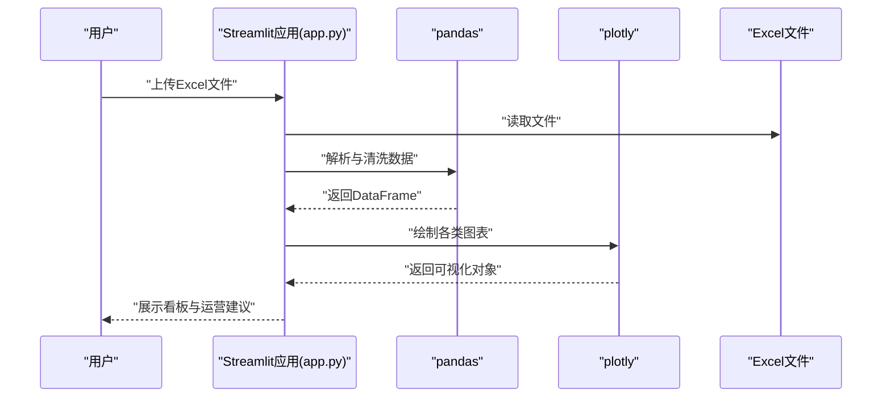
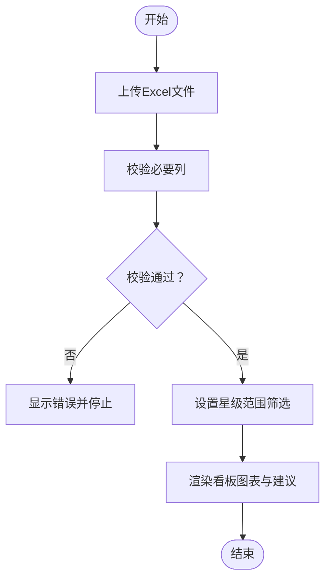
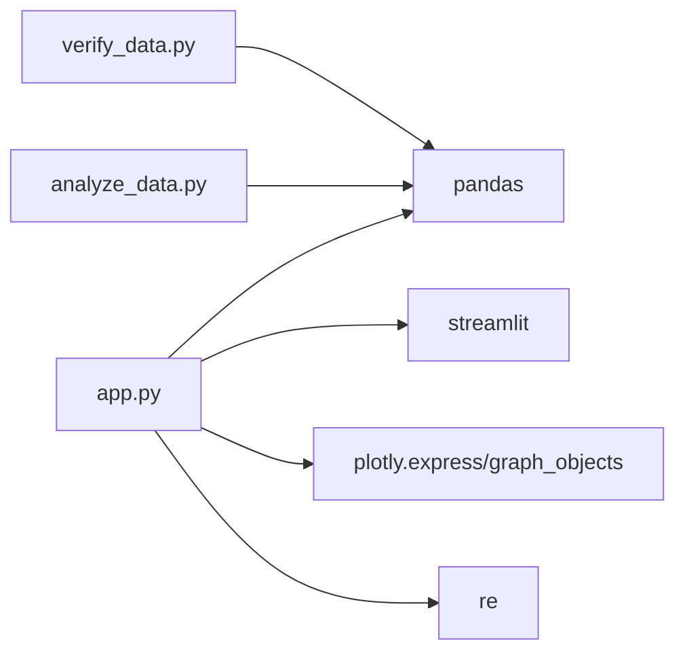

# 快速开始

<cite>
**本文引用的文件**
- [app.py](file://app.py)
- [analyze_data.py](file://analyze_data.py)
- [verify_data.py](file://verify_data.py)
</cite>

## 目录
1. [简介](#简介)
2. [项目结构](#项目结构)
3. [核心组件](#核心组件)
4. [架构总览](#架构总览)
5. [详细组件分析](#详细组件分析)
6. [依赖关系分析](#依赖关系分析)
7. [性能考虑](#性能考虑)
8. [故障排除指南](#故障排除指南)
9. [结论](#结论)
10. [附录](#附录)

## 简介
本指南面向需要快速上手“餐饮差评运营分析看板”的用户，提供从环境准备、依赖安装、应用启动到首次使用的完整流程说明。该看板基于 Streamlit 构建，支持上传 Excel 评价数据，自动完成数据校验、可视化分析与运营建议输出，帮助运营人员快速定位差评问题、制定整改方案。

## 项目结构
本仓库包含三个核心脚本：
- app.py：Streamlit 主应用，负责界面交互、数据上传、分析图表展示与运营建议生成
- analyze_data.py：离线数据分析脚本，用于生成完整分析报告
- verify_data.py：数据验证脚本，用于快速核对回复状态与差评率等关键指标

**图表来源**
- [app.py:1-10](file://app.py#L1-L10)
- [analyze_data.py:1-3](file://analyze_data.py#L1-L3)
- [verify_data.py:1-3](file://verify_data.py#L1-L3)

**章节来源**
- [app.py:1-10](file://app.py#L1-L10)
- [analyze_data.py:1-3](file://analyze_data.py#L1-L3)
- [verify_data.py:1-3](file://verify_data.py#L1-L3)

## 核心组件
- Streamlit 应用入口：负责页面布局、样式注入、文件上传、数据筛选与可视化渲染
- 数据处理模块：基于 pandas 对 Excel 数据进行清洗、转换与统计
- 可视化模块：基于 plotly 绘制饼图、柱状图、折线图等
- 离线分析与验证：提供命令行模式下的完整报告与关键指标核对

**章节来源**
- [app.py:328-363](file://app.py#L328-L363)
- [app.py:397-427](file://app.py#L397-L427)
- [app.py:436-481](file://app.py#L436-L481)
- [analyze_data.py:9-26](file://analyze_data.py#L9-L26)
- [verify_data.py:5-32](file://verify_data.py#L5-L32)

## 架构总览
下图展示了从用户上传 Excel 到生成分析看板的整体流程。

**图表来源**
- [app.py:328-363](file://app.py#L328-L363)
- [app.py:436-481](file://app.py#L436-L481)
- [app.py:492-540](file://app.py#L492-L540)

## 详细组件分析

### 环境准备与依赖安装
- Python 版本：建议使用 Python 3.8+（具体以实际运行环境为准）
- 依赖库：
  - streamlit：构建 Web 看板
  - pandas：数据处理与统计
  - plotly：交互式图表
  - openpyxl 或 xlrd：读取 Excel 文件（pandas 读取 .xlsx/.xls 所需）
- 安装方式（示例）：
  - pip install streamlit pandas plotly openpyxl
  - 如需读取 .xls 文件，同时安装 xlrd

提示：若使用虚拟环境，建议先激活后再执行安装命令。

**章节来源**
- [app.py:1-6](file://app.py#L1-L6)

### 启动应用
- 在项目根目录执行命令启动看板：
  - streamlit run app.py
- 浏览器打开默认地址（通常为 http://localhost:8501），即可看到上传界面

**章节来源**
- [app.py:328-363](file://app.py#L328-L363)

### 首次使用流程
- 步骤1：点击“上传Excel评价数据”区域，选择本地 Excel 文件（支持 .xlsx/.xls）
- 步骤2：系统自动进行数据校验，若缺失必要列会提示错误并停止
- 步骤3：在筛选面板中设置星级范围（默认全量），应用筛选后生成看板
- 步骤4：浏览各板块图表与运营建议，展开“差评详情数据/未回复差评明细/数据验证”查看明细

**图表来源**
- [app.py:328-363](file://app.py#L328-L363)
- [app.py:346-384](file://app.py#L346-L384)

**章节来源**
- [app.py:328-363](file://app.py#L328-L363)
- [app.py:346-384](file://app.py#L346-L384)

### 数据字段与格式要求
- 必填字段（缺失将报错并停止）：
  - 评价时间、评价ID、省份、城市、评价门店、星级分、口味分、环境分、服务分、回复状态
- 字段说明（示例，以实际数据为准）：
  - 评价时间：日期时间型
  - 星级分：数值型（1-5）
  - 回复状态：枚举值（如“已回复”、“未回复”）
- 建议字段（用于更丰富分析）：
  - 平台、是否vip、用户等级、菜品标签、服务标签、环境标签、评价详情

**章节来源**
- [app.py:332-337](file://app.py#L332-L337)
- [app.py:339-344](file://app.py#L339-L344)

### 离线分析与验证
- 离线分析：运行 analyze_data.py 可输出完整分析报告（控制台）
- 数据验证：运行 verify_data.py 可快速核对回复状态与差评率等关键指标

**章节来源**
- [analyze_data.py:9-26](file://analyze_data.py#L9-L26)
- [verify_data.py:5-32](file://verify_data.py#L5-L32)

## 依赖关系分析
- app.py 依赖：
  - streamlit：UI 与交互
  - pandas：数据读取、清洗、统计
  - plotly.express/graph_objects：图表绘制
  - re：关键词提取
- analyze_data.py 与 verify_data.py 仅依赖 pandas，用于离线分析与验证

**图表来源**
- [app.py:1-6](file://app.py#L1-L6)
- [analyze_data.py:1](file://analyze_data.py#L1)
- [verify_data.py:1](file://verify_data.py#L1)

**章节来源**
- [app.py:1-6](file://app.py#L1-L6)
- [analyze_data.py:1](file://analyze_data.py#L1)
- [verify_data.py:1](file://verify_data.py#L1)

## 性能考虑
- 大数据量建议：
  - 控制单次上传数据量，避免浏览器内存压力
  - 使用星级范围筛选缩小分析范围
- 图表渲染：
  - 适当调整图表尺寸与颜色映射，减少渲染开销
- 依赖版本：
  - 保持 pandas 与 plotly 的兼容版本，避免不必要的性能问题

[本节为通用建议，不直接分析具体文件]

## 故障排除指南
- 上传文件报错“缺少必要列”
  - 确认 Excel 包含以下列：评价时间、评价ID、省份、城市、评价门店、星级分、口味分、环境分、服务分、回复状态
  - 若列名不同，请按上述名称重命名或修改源码中的列名列表
- 评价时间无法解析
  - 确保“评价时间”列为日期时间型；若存在异常值，系统会丢弃空值
- 无数据显示或筛选后为空
  - 调整星级范围筛选条件；确认数据中存在目标星级区间
- 未回复差评预警为空
  - 当前筛选条件下无差评或全部差评已回复
- 无法读取 .xls 文件
  - 安装 xlrd 依赖以支持 .xls 读取
- 启动失败
  - 确认已安装 streamlit、pandas、plotly、openpyxl（或 xlrd）

**章节来源**
- [app.py:332-337](file://app.py#L332-L337)
- [app.py:339-344](file://app.py#L339-L344)
- [app.py:359-361](file://app.py#L359-L361)
- [app.py:1033-1036](file://app.py#L1033-L1036)

## 结论
通过本快速开始指南，您可以在本地完成环境准备、安装依赖、启动看板并完成首次使用。建议结合离线分析脚本与数据验证脚本，进一步加深对数据质量与关键指标的理解，从而高效开展差评运营工作。

[本节为总结性内容，不直接分析具体文件]

## 附录

### 示例数据使用说明
- 示例文件：副本评价下载2026.02.01-2026.05.01_1483444_1778225233256.xlsx
- 使用方式：
  - 将示例文件放在项目根目录，运行 analyze_data.py 或 verify_data.py 即可直接查看分析结果
- 注意事项：
  - 若使用 app.py 上传该文件，系统会自动识别并生成看板
  - 若自行导出 Excel，请确保字段名称与“数据字段与格式要求”一致

**章节来源**
- [analyze_data.py:3](file://analyze_data.py#L3)
- [verify_data.py:3](file://verify_data.py#L3)