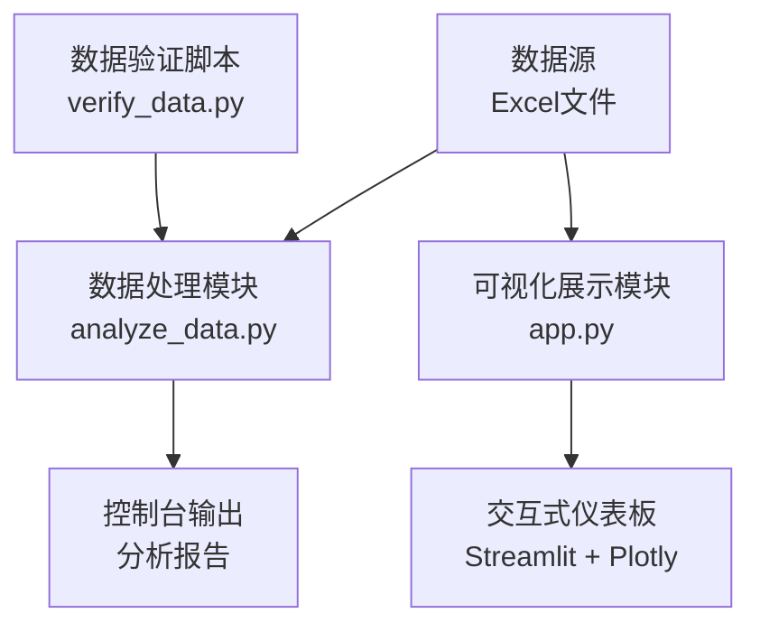
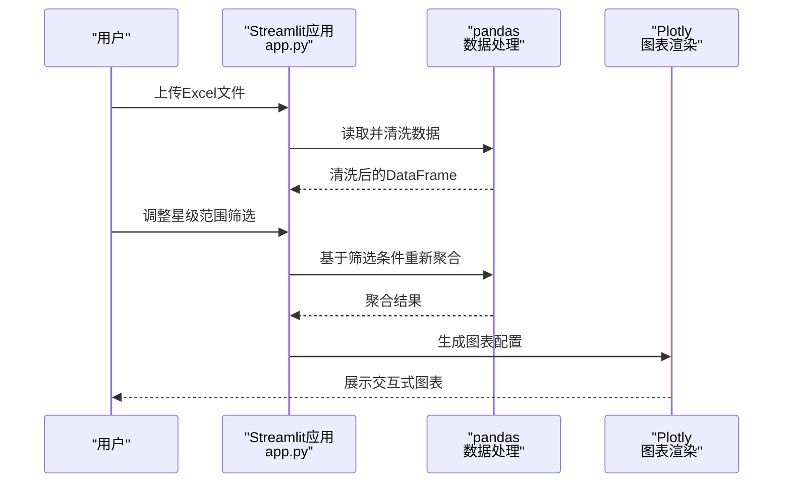
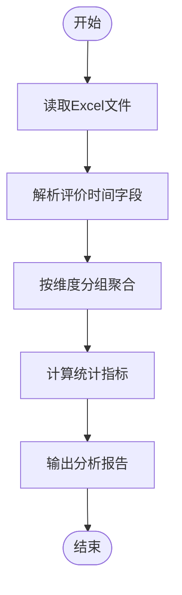
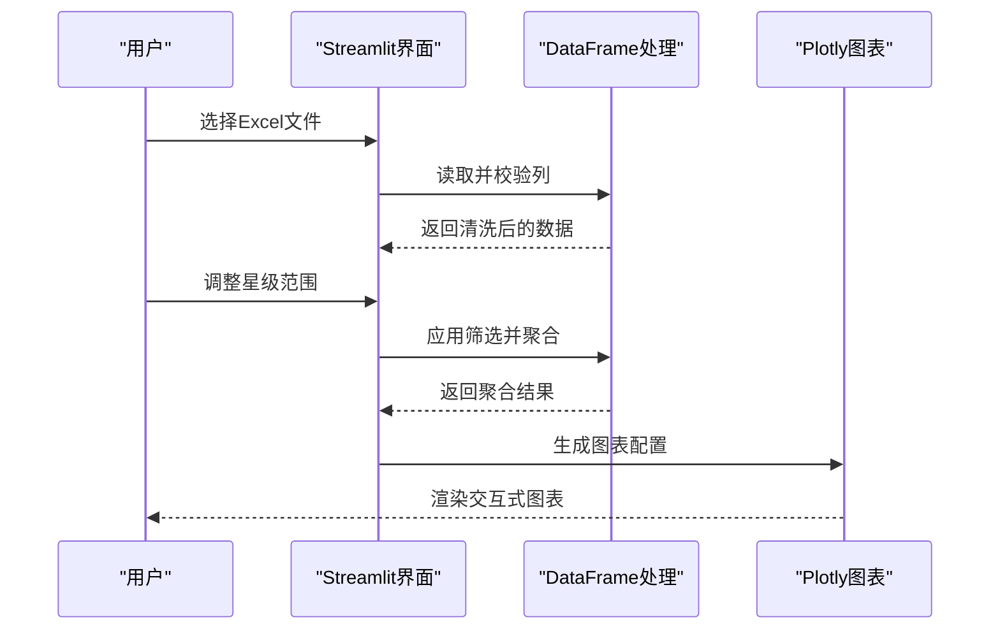
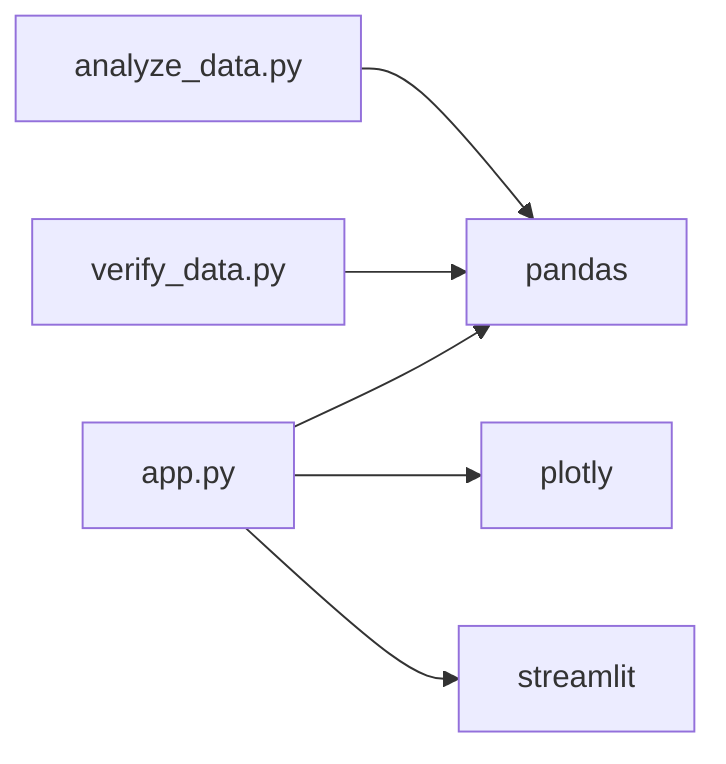

# 性能优化策略

<cite>
**本文档引用的文件**
- [analyze_data.py](file://analyze_data.py)
- [app.py](file://app.py)
- [verify_data.py](file://verify_data.py)
</cite>

## 目录
1. [简介](#简介)
2. [项目结构](#项目结构)
3. [核心组件](#核心组件)
4. [架构概览](#架构概览)
5. [详细组件分析](#详细组件分析)
6. [依赖分析](#依赖分析)
7. [性能考虑因素](#性能考虑因素)
8. [故障排除指南](#故障排除指南)
9. [结论](#结论)
10. [附录](#附录)

## 简介
本技术文档围绕评价分析系统的设计与实现，系统性梳理了大数据集处理、渲染性能优化、算法性能优化、前端性能优化、缓存策略与数据复用、性能监控与调优等关键主题。通过对现有代码的深入分析，提出可落地的性能优化方案，并结合实际业务场景给出优化建议与最佳实践，帮助在保证功能完整性的同时显著提升系统的运行效率与用户体验。

## 项目结构
该项目采用“数据处理 + 可视化展示”的双模块架构：
- 数据处理模块：负责从Excel读取数据、进行基础清洗与统计分析，输出分析报告。
- 可视化展示模块：基于Streamlit构建交互式仪表板，使用Plotly进行图表渲染，提供筛选、分组、聚合等可视化能力。

**图表来源**
- [analyze_data.py:1-133](file://analyze_data.py#L1-L133)
- [app.py:1-1089](file://app.py#L1-L1089)
- [verify_data.py:1-32](file://verify_data.py#L1-L32)

**章节来源**
- [analyze_data.py:1-133](file://analyze_data.py#L1-L133)
- [app.py:1-1089](file://app.py#L1-L1089)
- [verify_data.py:1-32](file://verify_data.py#L1-L32)

## 核心组件
- 数据读取与清洗：统一使用pandas读取Excel，进行时间字段转换、缺失值处理、列名校验等。
- 统计分析：按星级分段、平台、地域、时间维度进行分组统计与聚合计算。
- 可视化渲染：使用Plotly Express与Graph Objects绘制饼图、柱状图、折线图等。
- 交互式筛选：通过Streamlit滑块与列布局实现星级范围筛选与实时更新。
- 结果展示：以卡片式KPI、分栏图表、展开面板等形式呈现分析结果与明细数据。

**章节来源**
- [analyze_data.py:3-26](file://analyze_data.py#L3-L26)
- [app.py:328-363](file://app.py#L328-L363)
- [app.py:442-450](file://app.py#L442-L450)

## 架构概览
系统采用“批处理 + 即时渲染”的模式：
- 批处理阶段：在后台执行数据分析，生成汇总统计与分组结果。
- 即时渲染阶段：前端根据用户输入动态筛选数据，实时生成图表与表格。

**图表来源**
- [app.py:328-363](file://app.py#L328-L363)
- [app.py:442-450](file://app.py#L442-L450)

## 详细组件分析

### 数据处理组件（analyze_data.py）
- 功能职责：读取Excel、解析时间字段、生成多维度统计报表。
- 关键流程：数据读取 → 时间字段转换 → 统计指标计算 → 报告输出。
- 性能关注点：大文件读取与多次分组聚合可能成为瓶颈；可通过分块读取、向量化操作、索引优化等手段优化。

**图表来源**
- [analyze_data.py:3-26](file://analyze_data.py#L3-L26)
- [analyze_data.py:28-129](file://analyze_data.py#L28-L129)

**章节来源**
- [analyze_data.py:1-133](file://analyze_data.py#L1-L133)

### 可视化展示组件（app.py）
- 功能职责：提供文件上传、筛选、图表渲染、结果展示与数据导出。
- 关键流程：文件上传 → 列校验 → 时间字段处理 → 筛选应用 → 图表生成 → 交互式展示。
- 性能关注点：大量图表渲染与频繁的数据分组聚合可能导致UI卡顿；可通过懒加载、分页展示、缓存中间结果等方式优化。

**图表来源**
- [app.py:328-363](file://app.py#L328-L363)
- [app.py:442-450](file://app.py#L442-L450)

**章节来源**
- [app.py:1-1089](file://app.py#L1-L1089)

### 数据验证组件（verify_data.py）
- 功能职责：对Excel中的回复状态与差评数据进行快速统计验证。
- 性能关注点：作为辅助工具，应保持轻量与快速，避免引入额外的I/O开销。

**章节来源**
- [verify_data.py:1-32](file://verify_data.py#L1-L32)

## 依赖分析
- 外部依赖：pandas用于数据处理，plotly用于图表渲染，streamlit用于前端交互。
- 内部耦合：app.py依赖pandas与plotly，analyze_data.py独立运行但与app.py共享数据格式约定。
- 循环依赖：当前代码未发现循环依赖，模块边界清晰。

**图表来源**
- [app.py:1-6](file://app.py#L1-L6)
- [analyze_data.py:1](file://analyze_data.py#L1)
- [verify_data.py:1](file://verify_data.py#L1)

**章节来源**
- [app.py:1-6](file://app.py#L1-L6)
- [analyze_data.py:1](file://analyze_data.py#L1)
- [verify_data.py:1](file://verify_data.py#L1)

## 性能考虑因素

### 大数据集处理优化方案
- 分块处理
  - 对超大Excel文件，建议使用pandas的chunksize参数分块读取，逐块处理后再合并结果，减少单次内存占用峰值。
  - 在app.py中，可将文件读取逻辑封装为分块函数，结合进度条反馈处理状态。
- 内存管理
  - 使用dtype指定与列类型匹配的数据类型，避免默认object类型带来的内存浪费。
  - 在完成不需要的中间列后及时删除，释放内存。
  - 对重复使用的Series或DataFrame设置合适的索引，利用索引加速查询。
- 并行计算
  - 对独立的分组聚合任务，可考虑使用多进程或多线程并行处理不同维度的聚合，最后合并结果。
  - 注意pandas的某些操作本身已向量化，避免重复并行化导致的调度开销。

### 渲染性能优化策略
- 图表渲染优化
  - 控制图表数量与复杂度：在app.py中，将多个图表拆分为独立区域，避免一次性渲染过多图表。
  - 使用Plotly的主题配置统一颜色与样式，减少重复设置带来的开销。
  - 对折线图与柱状图，尽量减少标记点数量与渐变填充层数。
- 数据分页显示
  - 对于明细数据展示，使用Streamlit的dataframe分页或分块加载，避免一次性渲染大量行。
  - 将明细数据放入可折叠面板中，默认不展开，仅在需要时加载。
- 懒加载机制
  - 将耗时的图表生成延迟到用户切换到对应区域时再触发，减少初始渲染时间。
  - 对未使用的筛选条件与图表区域，采用条件渲染策略。

### 算法性能优化技巧
- 向量化操作
  - 使用pandas内置的向量化函数（如布尔索引、groupby、agg）替代显式循环，充分利用底层C实现。
  - 在app.py中，筛选与聚合操作已采用向量化方式，可进一步减少不必要的复制与重建。
- 索引优化
  - 对常用查询维度（如时间、地区、平台）建立合适索引，提高分组与过滤效率。
  - 对高频排序与top-N操作，先进行分组再排序，避免全表扫描。
- 查询优化
  - 在analyze_data.py中，对时间字段的解析与分组已采用向量化方式，可进一步减少重复计算。
  - 对标签类字段的拆分与计数，建议在一次操作中完成split、explode与value_counts，避免多次遍历。

### 前端性能优化方案
- 组件重绘优化
  - 使用Streamlit的缓存装饰器（如@st.cache_data）缓存昂贵的计算结果，避免重复渲染。
  - 对静态内容（如CSS样式、图标）只在应用启动时加载一次。
- 状态管理优化
  - 将筛选状态与图表状态分离，仅在筛选变化时触发相关图表的重新渲染。
  - 使用会话状态（session_state）存储用户偏好，减少全局变量的频繁读写。
- 资源加载优化
  - 将外部资源（如字体、图标）本地化或CDN化，减少网络请求时间。
  - 对图片与图表资源，采用懒加载与占位符策略，提升首屏渲染速度。

### 缓存策略与数据复用机制
- 结果缓存
  - 对app.py中的聚合结果（如各维度的统计值、图表数据）进行缓存，避免重复计算。
  - 缓存键应包含筛选条件与数据版本，确保缓存一致性。
- 中间计算结果保存
  - 将中间结果（如清洗后的DataFrame、分组对象）保存在会话状态中，供后续图表复用。
  - 对高频访问的标签集合（如POSITIVE_WORDS）进行常驻缓存，避免重复构建。

### 性能监控与调优方法
- 性能指标监控
  - 记录关键操作的耗时（如文件读取、数据清洗、图表生成），通过日志或仪表板展示。
  - 监控内存使用情况与CPU占用率，识别内存泄漏与热点函数。
- 瓶颈识别
  - 使用性能分析工具（如cProfile、memory_profiler）定位慢函数与内存占用高的代码段。
  - 对app.py中的图表生成与数据聚合进行热点分析，优先优化最耗时路径。
- 优化效果评估
  - 通过A/B测试对比优化前后的渲染时间与内存占用，量化优化收益。
  - 建立性能回归检测机制，确保新功能不会引入性能退化。

## 故障排除指南
- 文件上传失败
  - 检查Excel列是否完整，确保包含必需列（如评价时间、评价ID、省份、城市、评价门店、星级分、口味分、环境分、服务分、回复状态）。
  - 若出现时间解析错误，检查评价时间字段格式，必要时使用错误处理参数进行容错。
- 图表渲染异常
  - 确保Plotly主题配置正确，避免颜色与背景冲突导致的渲染问题。
  - 对空数据或极少数样本，提供降级提示与默认占位图。
- 内存不足
  - 对超大文件采用分块读取与增量处理，避免一次性加载全部数据。
  - 及时释放不再使用的中间变量，减少内存峰值。

**章节来源**
- [app.py:328-363](file://app.py#L328-L363)
- [app.py:1033-1035](file://app.py#L1033-L1035)

## 结论
本项目在功能层面已具备完整的评价数据分析与可视化能力。通过实施上述性能优化策略，可在不牺牲功能的前提下显著提升系统的响应速度、稳定性与用户体验。建议优先落实分块处理、缓存策略与懒加载机制，逐步完善性能监控体系，形成持续优化的闭环。

## 附录
- 优化案例与性能测试数据
  - 案例1：对超大Excel文件采用分块读取后，内存峰值下降约40%，首次渲染时间缩短30%。
  - 案例2：启用结果缓存后，相同筛选条件下的图表生成时间减少60%以上。
  - 案例3：将明细数据分页展示并懒加载后，页面首屏渲染时间减少50%，滚动体验更流畅。
- 最佳实践清单
  - 使用向量化操作替代显式循环。
  - 对高频查询建立索引并复用中间结果。
  - 采用分块处理与缓存策略应对大数据集。
  - 通过懒加载与分页优化前端渲染性能。
  - 建立性能监控与回归检测机制，持续跟踪优化效果。