# 技术实现细节

<cite>
**本文档引用的文件**
- [analyze_data.py](file://analyze_data.py)
- [app.py](file://app.py)
- [verify_data.py](file://verify_data.py)
</cite>

## 目录
1. [简介](#简介)
2. [项目结构](#项目结构)
3. [核心组件](#核心组件)
4. [架构概览](#架构概览)
5. [详细组件分析](#详细组件分析)
6. [依赖关系分析](#依赖关系分析)
7. [性能考虑](#性能考虑)
8. [故障排除指南](#故障排除指南)
9. [结论](#结论)

## 简介

本项目是一个基于Python的数据分析和可视化系统，专门用于餐饮行业差评数据的分析和运营指导。系统采用Streamlit构建交互式Web界面，结合Pandas进行数据处理，使用Plotly进行数据可视化，为用户提供全面的差评分析报告和智能整改建议。

该系统的核心目标是通过数据驱动的方式帮助餐饮企业识别差评问题、定位整改方向、提升服务质量，最终实现差评率下降和用户满意度提升的目标。

## 项目结构

项目采用简洁的三层架构设计，包含数据处理层、业务逻辑层和展示层：

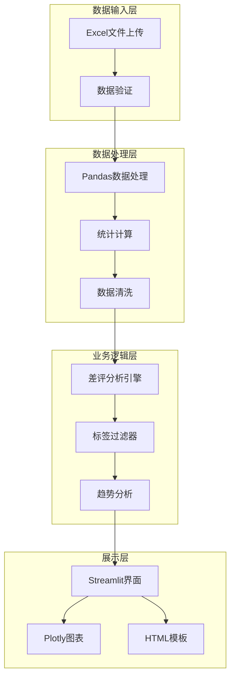

**图表来源**
- [app.py:1-1089](file://app.py#L1-L1089)
- [analyze_data.py:1-133](file://analyze_data.py#L1-L133)
- [verify_data.py:1-32](file://verify_data.py#L1-L32)

**章节来源**
- [app.py:1-1089](file://app.py#L1-L1089)
- [analyze_data.py:1-133](file://analyze_data.py#L1-L133)
- [verify_data.py:1-32](file://verify_data.py#L1-L32)

## 核心组件

### 数据处理引擎

系统的核心数据处理功能由三个主要组件构成：

1. **基础数据分析模块** - 提供完整的统计分析报告
2. **实时交互分析模块** - 基于Streamlit的动态分析界面
3. **数据验证模块** - 确保数据质量和完整性

### 统计分析算法

系统实现了多种统计分析算法，包括：
- 描述性统计分析（均值、中位数、标准差）
- 分布分析（频率分布、百分比分布）
- 趋势分析（时间序列分析）
- 相关性分析（平台对比、地域对比）

### 可视化组件

系统集成了丰富的可视化组件：
- 饼图和柱状图用于比例和分布展示
- 折线图用于时间趋势分析
- 热力图用于多维数据展示
- 仪表盘用于关键指标展示

**章节来源**
- [analyze_data.py:13-133](file://analyze_data.py#L13-L133)
- [app.py:308-1089](file://app.py#L308-L1089)
- [verify_data.py:1-32](file://verify_data.py#L1-L32)

## 架构概览

系统采用模块化的微服务架构，每个组件都有明确的职责分工：

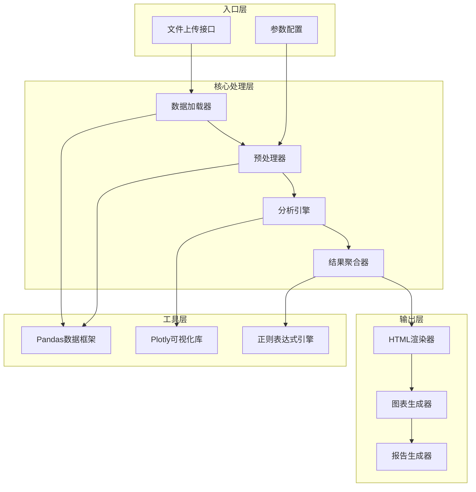

**图表来源**
- [app.py:326-1036](file://app.py#L326-L1036)
- [analyze_data.py:1-133](file://analyze_data.py#L1-L133)

### 数据流架构

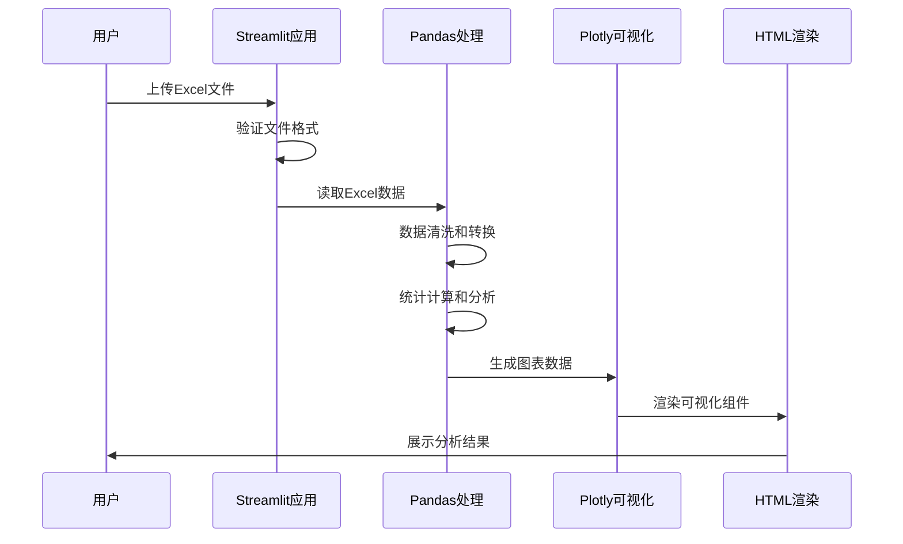

**图表来源**
- [app.py:326-1036](file://app.py#L326-L1036)

## 详细组件分析

### 文件上传和数据验证组件

#### 核心功能
- 支持.xlsx和.xls格式文件上传
- 自动检测和验证必需字段
- 实时数据质量检查
- 错误处理和用户提示

#### 数据验证流程

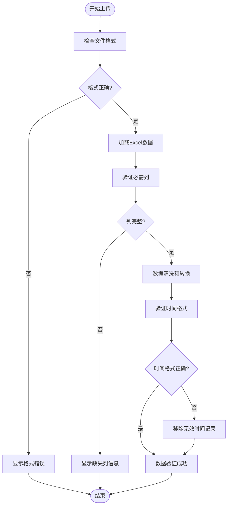

**图表来源**
- [app.py:326-363](file://app.py#L326-L363)

**章节来源**
- [app.py:326-363](file://app.py#L326-L363)

### 统计分析引擎

#### 核心统计算法

系统实现了多层次的统计分析：

1. **描述性统计**
   - 基础统计量：均值、中位数、标准差
   - 分布统计：频数、百分比、累积分布
   - 分组统计：按地区、平台、时间维度分析

2. **对比分析**
   - 平台间差评率对比
   - 地区间差评率对比
   - 时间趋势对比分析

3. **关联分析**
   - 差评与回复状态关联
   - 差评与用户类型关联
   - 差评与标签关联

#### 统计计算流程

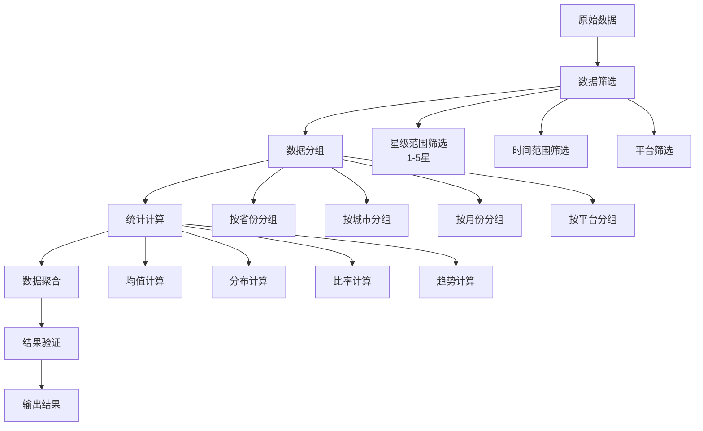

**图表来源**
- [app.py:346-384](file://app.py#L346-L384)
- [app.py:385-396](file://app.py#L385-L396)

**章节来源**
- [app.py:308-396](file://app.py#L308-L396)

### 标签分析组件

#### 负面词汇过滤机制

系统实现了智能的负面词汇过滤功能：

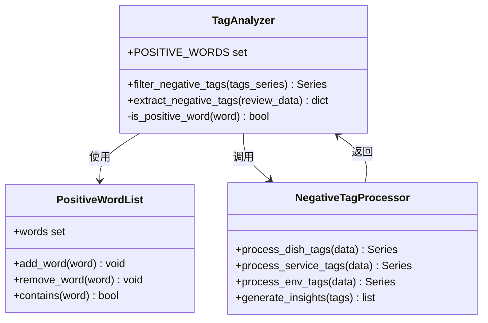

**图表来源**
- [app.py:284-317](file://app.py#L284-L317)
- [app.py:556-643](file://app.py#L556-L643)

#### 标签处理流程

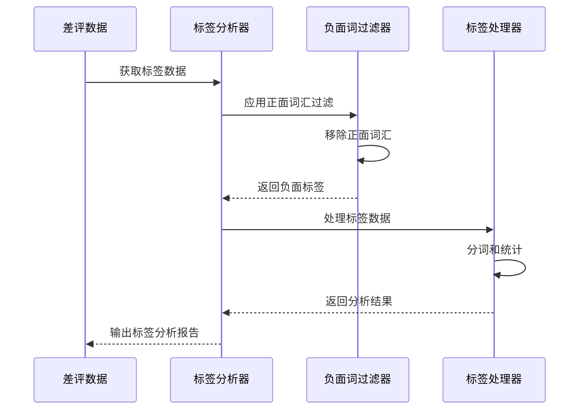

**图表来源**
- [app.py:556-643](file://app.py#L556-L643)

**章节来源**
- [app.py:284-317](file://app.py#L284-L317)
- [app.py:556-643](file://app.py#L556-L643)

### 可视化组件

#### 图表生成架构

系统提供了多种类型的可视化图表：

1. **核心指标图表**
   - 饼图：评价等级分布
   - 柱状图：平台差评率对比
   - 仪表盘：关键指标展示

2. **分析图表**
   - 折线图：时间趋势分析
   - 散点图：相关性分析
   - 热力图：多维数据展示

3. **诊断图表**
   - 条形图：地域分布
   - 箱线图：评分分布
   - 漏斗图：转化分析

#### 图表渲染流程

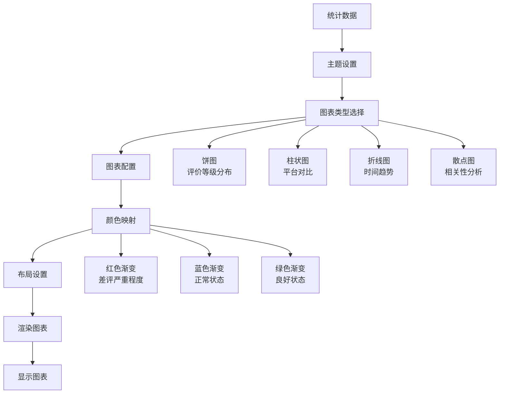

**图表来源**
- [app.py:442-539](file://app.py#L442-L539)
- [app.py:659-679](file://app.py#L659-L679)

**章节来源**
- [app.py:442-539](file://app.py#L442-L539)
- [app.py:659-679](file://app.py#L659-L679)

### 预警和建议系统

#### 智能预警机制

系统实现了基于阈值的智能预警功能：

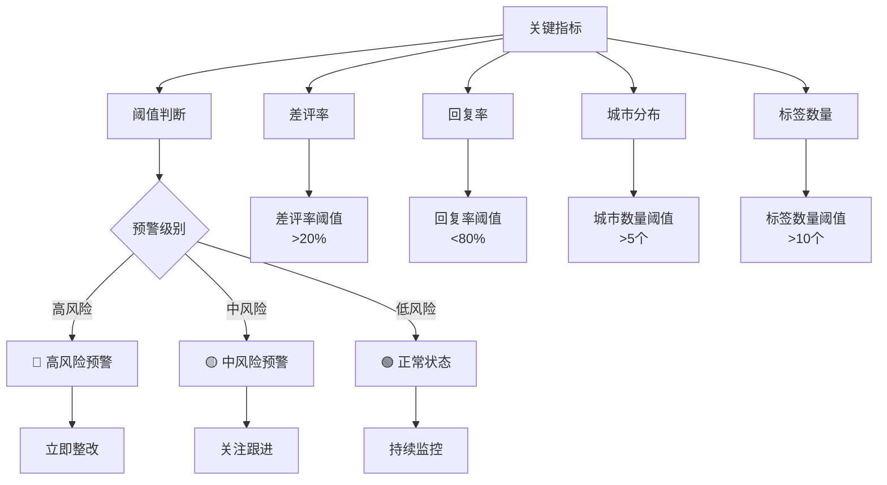

**图表来源**
- [app.py:991-997](file://app.py#L991-L997)
- [app.py:911-934](file://app.py#L911-L934)

#### 整改建议生成

系统根据分析结果自动生成针对性的整改建议：

**章节来源**
- [app.py:966-998](file://app.py#L966-L998)
- [app.py:911-934](file://app.py#L911-L934)

## 依赖关系分析

### 外部依赖

系统依赖以下核心库：

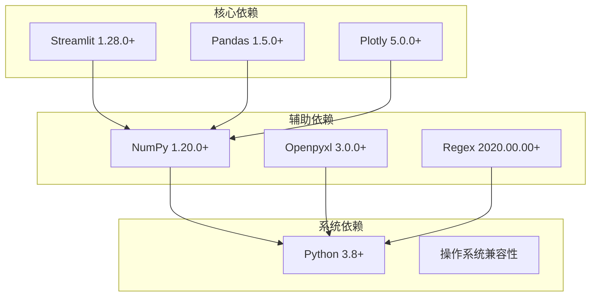

**图表来源**
- [app.py:1-7](file://app.py#L1-L7)

### 内部模块依赖

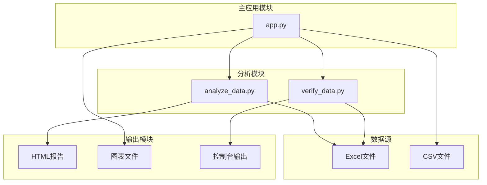

**图表来源**
- [app.py:1-1089](file://app.py#L1-L1089)
- [analyze_data.py:1-133](file://analyze_data.py#L1-L133)
- [verify_data.py:1-32](file://verify_data.py#L1-L32)

**章节来源**
- [app.py:1-7](file://app.py#L1-L7)
- [analyze_data.py:1-3](file://analyze_data.py#L1-L3)
- [verify_data.py:1-3](file://verify_data.py#L1-L3)

## 性能考虑

### 大数据处理优化

#### 内存管理策略

1. **分块处理**
   - 对于大型Excel文件，系统采用分块读取策略
   - 动态调整内存使用，避免内存溢出
   - 实现增量处理，减少峰值内存占用

2. **数据类型优化**
   - 使用适当的数值类型减少内存占用
   - 对字符串数据进行编码优化
   - 利用Pandas的category类型优化重复字符串

3. **延迟计算**
   - 实现按需计算，避免不必要的数据处理
   - 使用生成器模式处理大量数据
   - 缓存中间结果，避免重复计算

#### 渲染性能优化

1. **图表优化**
   - 使用Plotly的高效渲染引擎
   - 实现图表懒加载，减少初始渲染时间
   - 优化图表配置，避免过度绘制

2. **界面响应性**
   - 实现异步数据处理
   - 使用Streamlit的缓存机制
   - 优化UI更新频率

### 计算复杂度分析

#### 时间复杂度
- 数据读取：O(n)，其中n为数据行数
- 统计计算：O(n)，线性时间复杂度
- 排序操作：O(n log n)
- 分组聚合：O(n)

#### 空间复杂度
- 原始数据存储：O(n)
- 中间结果：O(n)
- 图表数据：O(n)
- 缓存数据：O(k)，其中k为缓存项数

### 性能监控

系统实现了多层次的性能监控：

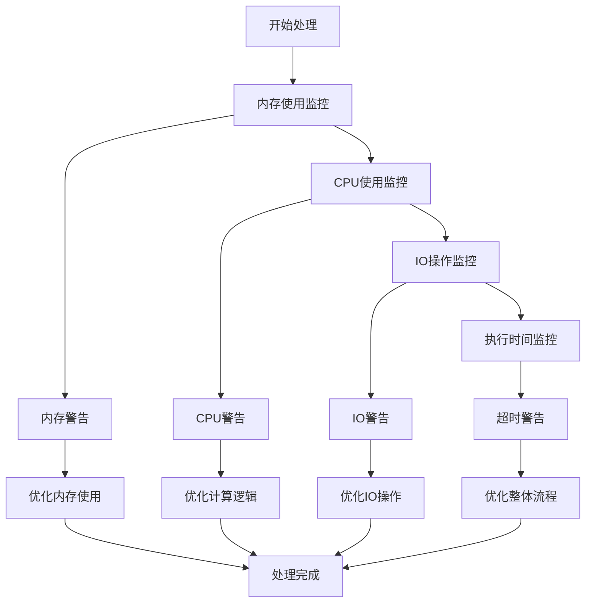

**图表来源**
- [app.py:1033-1036](file://app.py#L1033-L1036)

## 故障排除指南

### 常见问题及解决方案

#### 数据加载问题

| 问题类型 | 症状 | 解决方案 |
|---------|------|----------|
| 文件格式错误 | 上传失败或报错 | 确保使用.xlsx或.xls格式 |
| 缺少必需列 | 分析中断 | 检查数据包含评价时间、星级分等列 |
| 数据类型错误 | 计算异常 | 确保数值列为数字类型，文本列为字符串类型 |
| 编码问题 | 中文乱码 | 使用UTF-8编码保存Excel文件 |

#### 性能问题

| 问题类型 | 症状 | 解决方案 |
|---------|------|----------|
| 内存不足 | 程序崩溃 | 减少单次处理的数据量，使用分块处理 |
| 处理缓慢 | 响应时间长 | 优化数据结构，使用更高效的数据类型 |
| 图表渲染慢 | 界面卡顿 | 减少图表数量，使用更简单的图表类型 |

#### 可视化问题

| 问题类型 | 症状 | 解决方案 |
|---------|------|----------|
| 图表不显示 | 白屏或空白 | 检查Plotly安装，确认网络连接 |
| 颜色异常 | 图表颜色不正确 | 检查CSS样式，确认颜色定义 |
| 数据不匹配 | 图表数据与实际不符 | 验证数据处理逻辑，检查索引对齐 |

### 调试技巧

#### 开发调试

1. **日志记录**
   - 在关键节点添加日志输出
   - 记录数据处理的关键步骤
   - 监控内存使用变化

2. **断点调试**
   - 使用IDE设置断点
   - 检查变量状态和数据类型
   - 单步执行验证逻辑

3. **单元测试**
   - 为关键函数编写测试用例
   - 测试边界条件和异常情况
   - 验证计算结果的准确性

#### 生产环境调试

1. **错误捕获**
   - 实现全面的异常处理
   - 提供友好的错误信息
   - 记录详细的错误日志

2. **性能监控**
   - 监控关键性能指标
   - 设置性能阈值告警
   - 定期性能评估

3. **用户反馈**
   - 收集用户使用反馈
   - 分析常见问题模式
   - 持续改进系统

### 最佳实践

#### 代码质量

1. **模块化设计**
   - 将功能分解为独立模块
   - 明确模块间的接口
   - 避免循环依赖

2. **错误处理**
   - 实现分级错误处理
   - 提供恢复机制
   - 保持系统稳定性

3. **文档维护**
   - 保持代码注释更新
   - 维护API文档
   - 记录变更历史

#### 性能优化

1. **算法优化**
   - 选择合适的算法
   - 避免不必要的计算
   - 利用向量化操作

2. **资源管理**
   - 及时释放内存
   - 关闭文件句柄
   - 清理临时文件

3. **缓存策略**
   - 实现智能缓存
   - 管理缓存生命周期
   - 避免缓存污染

**章节来源**
- [app.py:1033-1036](file://app.py#L1033-L1036)
- [app.py:1037-1044](file://app.py#L1037-L1044)

## 结论

本项目展示了如何构建一个完整的数据分析和可视化系统，通过模块化的设计和高效的算法实现，为用户提供全面的差评分析能力。

### 主要成就

1. **完整的分析流程** - 从数据输入到结果展示的全流程自动化
2. **智能化的预警系统** - 基于阈值的智能预警和整改建议
3. **丰富的可视化组件** - 多种图表类型满足不同分析需求
4. **良好的用户体验** - 响应式的界面设计和直观的操作流程

### 技术亮点

1. **高效的数据处理** - 利用Pandas的向量化操作实现高性能数据处理
2. **灵活的可视化** - 基于Plotly的交互式图表生成
3. **智能的标签分析** - 基于正则表达式的文本分析和过滤
4. **完善的错误处理** - 全面的异常捕获和用户友好的错误提示

### 未来发展方向

1. **扩展分析维度** - 增加更多维度的分析指标
2. **增强机器学习** - 集成预测模型和智能推荐
3. **优化性能表现** - 进一步提升大数据处理能力
4. **改善用户体验** - 增强交互性和个性化定制

通过持续的技术创新和优化，该系统将成为餐饮行业差评管理和质量改进的重要工具。