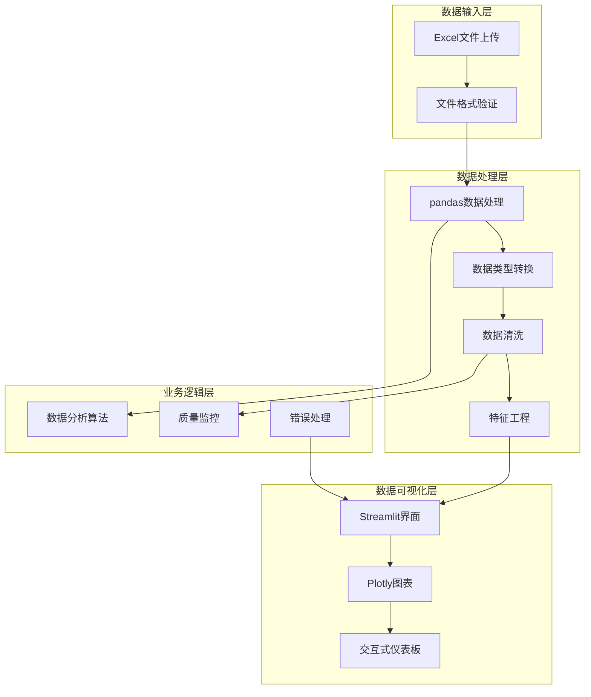
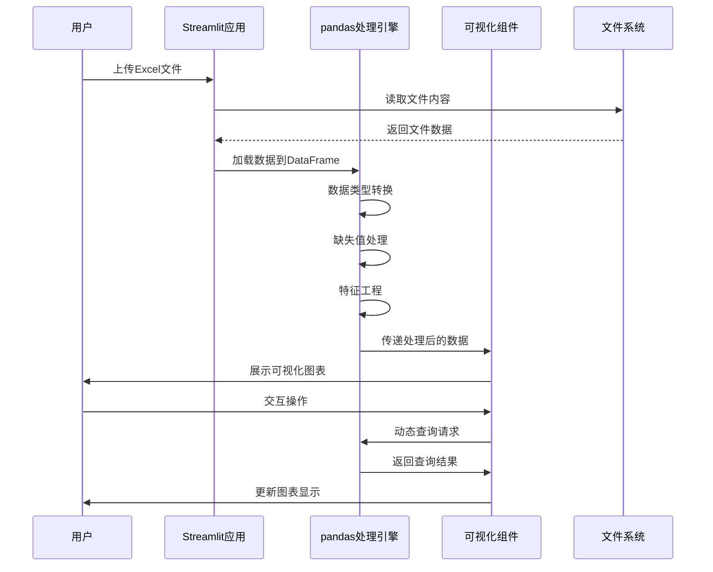
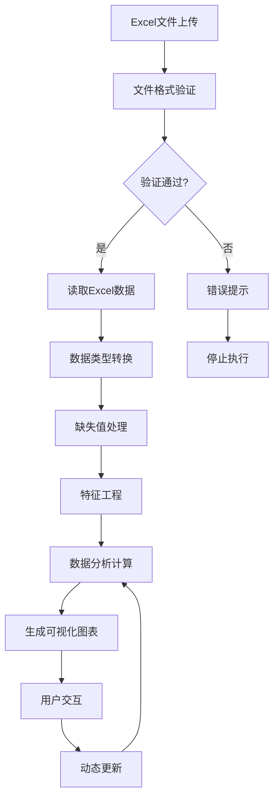
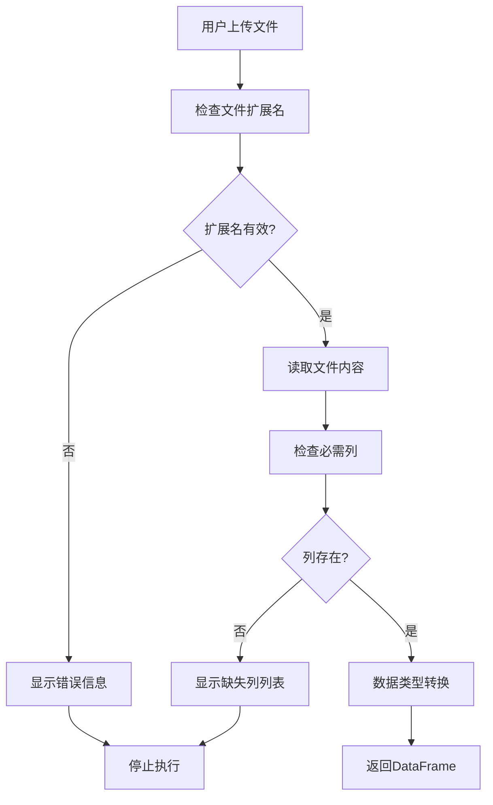
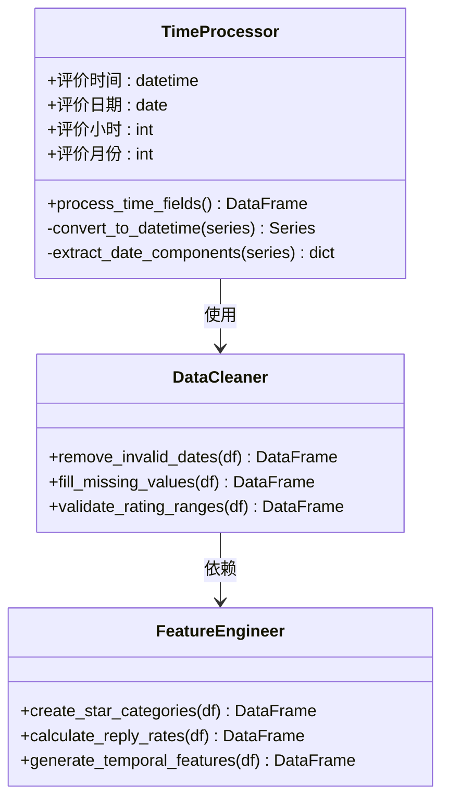
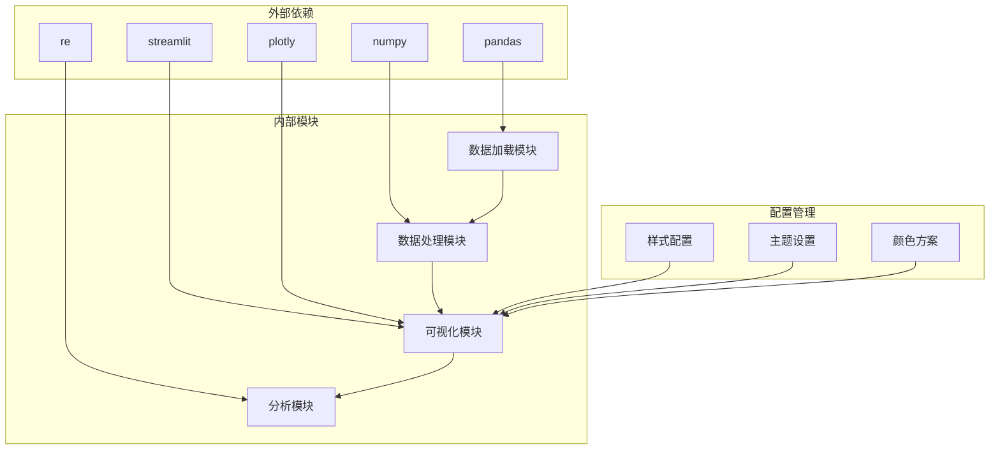

# 数据处理流程

<cite>
**本文档引用的文件**
- [analyze_data.py](file://analyze_data.py)
- [app.py](file://app.py)
- [verify_data.py](file://verify_data.py)
</cite>

## 目录
1. [简介](#简介)
2. [项目结构](#项目结构)
3. [核心组件](#核心组件)
4. [架构概览](#架构概览)
5. [详细组件分析](#详细组件分析)
6. [依赖关系分析](#依赖关系分析)
7. [性能考虑](#性能考虑)
8. [故障排除指南](#故障排除指南)
9. [结论](#结论)

## 简介

本项目是一个完整的餐饮评价数据分析系统，专注于从Excel文件上传到最终可视化展示的全流程数据处理。系统采用Python生态系统，结合pandas进行数据处理、Streamlit构建交互式界面、Plotly进行数据可视化，实现了从原始数据到深度洞察的完整转化。

该系统主要服务于餐饮企业的差评运营管理，通过自动化数据处理和智能分析，帮助企业管理者快速识别问题、定位整改方向、提升服务质量。系统具备实时数据处理能力，支持多种数据源格式，提供丰富的可视化图表和智能运营建议。

## 项目结构

项目采用简洁的三层架构设计，每个模块都有明确的职责分工：



**图表来源**
- [app.py:1-1089](file://app.py#L1-L1089)
- [analyze_data.py:1-133](file://analyze_data.py#L1-L133)
- [verify_data.py:1-32](file://verify_data.py#L1-L32)

**章节来源**
- [app.py:1-1089](file://app.py#L1-L1089)
- [analyze_data.py:1-133](file://analyze_data.py#L1-L133)
- [verify_data.py:1-32](file://verify_data.py#L1-L32)

## 核心组件

### 数据加载组件

数据加载组件负责从Excel文件中读取原始数据，包含文件格式验证和基础数据结构检查功能。

**关键特性：**
- 支持.xlsx和.xls两种Excel格式
- 自动检测必需的数据列
- 错误处理和异常捕获机制
- 内存友好的数据读取策略

### 数据处理引擎

数据处理引擎基于pandas实现，提供完整的数据转换和分析功能。

**核心功能：**
- 时间字段解析和格式化
- 多维度数据分组统计
- 派生字段计算
- 缺失值处理和数据清洗

### 可视化组件

可视化组件使用Streamlit和Plotly构建交互式仪表板，提供丰富的图表展示。

**图表类型：**
- 饼图和柱状图
- 折线图和面积图
- 词云和标签分析
- 地理分布图

**章节来源**
- [app.py:326-363](file://app.py#L326-L363)
- [app.py:339-344](file://app.py#L339-L344)
- [app.py:308-313](file://app.py#L308-L313)

## 架构概览

系统采用事件驱动的处理架构，从文件上传开始，经过多阶段的数据处理，最终生成可视化报告。



**图表来源**
- [app.py:326-363](file://app.py#L326-L363)
- [app.py:442-450](file://app.py#L442-L450)
- [app.py:566-580](file://app.py#L566-L580)

### 数据流处理管道



**图表来源**
- [app.py:326-363](file://app.py#L326-L363)
- [app.py:339-344](file://app.py#L339-L344)
- [app.py:356-363](file://app.py#L356-L363)

## 详细组件分析

### 数据加载与验证组件

数据加载组件是整个系统的入口点，负责处理用户上传的Excel文件并进行初步验证。

#### 文件格式验证流程



**图表来源**
- [app.py:326-337](file://app.py#L326-L337)
- [app.py:332-333](file://app.py#L332-L333)

#### 数据验证规则

系统实施严格的数据验证规则，确保数据质量和完整性：

**必需列验证：**
- 评价时间：必须为有效的日期时间格式
- 评价ID：唯一标识符，不能为空
- 省份和城市：地理位置信息
- 评价门店：具体的门店标识
- 评分字段：星级分、口味分、环境分、服务分
- 回复状态：评价回复状态

**数据质量检查：**
- 时间字段的合理性验证
- 评分范围的有效性检查
- 缺失值的自动处理
- 异常值的识别和处理

**章节来源**
- [app.py:326-363](file://app.py#L326-L363)
- [app.py:332-337](file://app.py#L332-L337)

### 数据预处理组件

数据预处理组件负责将原始数据转换为分析友好的格式，包括数据类型转换、缺失值处理和特征工程。

#### 时间字段处理

时间字段处理是数据预处理的核心环节，涉及多个时间维度的提取和计算：



**图表来源**
- [app.py:339-344](file://app.py#L339-L344)
- [app.py:308-313](file://app.py#L308-L313)

#### 缺失值处理策略

系统采用多层次的缺失值处理策略：

**处理流程：**
1. **时间字段缺失值**：直接删除无效记录
2. **评分字段缺失值**：根据业务规则进行填充或标记
3. **文本字段缺失值**：保留NaN值以便后续处理
4. **分类字段缺失值**：统一标记为"未知"

**处理原则：**
- 保持数据完整性的同时避免引入偏差
- 对于关键字段缺失的记录进行剔除
- 对于可选字段采用合理的默认值

**章节来源**
- [app.py:339-344](file://app.py#L339-L344)
- [app.py:346-363](file://app.py#L346-L363)

### 数据分析与计算组件

数据分析组件提供多层次的统计分析功能，涵盖核心指标计算、趋势分析和深度洞察挖掘。

#### 核心指标计算

系统计算多个关键业务指标，为管理层决策提供数据支撑：

**差评分析指标：**
- 差评率：差评数量占总评价数的比例
- 差评回复率：已回复差评占差评总数的比例
- 差评平均星级：差评用户的平均评分
- 差评门店覆盖数：产生差评的门店数量

**计算公式：**
```
差评率 = 差评数量 / 总评价数 × 100%
差评回复率 = 已回复差评数量 / 差评总数 × 100%
差评平均星级 = Σ(差评星级) / 差评数量
```

#### 分组聚合分析

系统支持多维度的数据分组和聚合分析：

**地理维度分析：**
- 省份层面的差评分布
- 城市层面的差评密度
- 门店层面的问题识别

**时间维度分析：**
- 日趋势分析
- 月度趋势分析
- 小时分布分析

**用户维度分析：**
- VIP用户与普通用户的差异
- 用户等级的分布特征
- 不同用户群体的满意度

**章节来源**
- [app.py:365-394](file://app.py#L365-L394)
- [app.py:441-441](file://app.py#L441-L441)
- [app.py:733-757](file://app.py#L733-L757)

### 可视化与交互组件

可视化组件使用Plotly构建丰富的交互式图表，提供直观的数据洞察。

#### 图表类型与用途

**核心图表类型：**

1. **饼图**：展示评价等级分布和用户类型比例
2. **柱状图**：展示各维度的数值对比和排名
3. **折线图**：展示时间趋势和变化模式
4. **词云图**：展示高频关键词和标签

**交互功能：**
- 动态筛选和过滤
- 图表间联动交互
- 数据钻取和下钻
- 导出和分享功能

#### 主题和样式设计

系统采用深色主题设计，提供专业的视觉体验：

**颜色方案：**
- 红色：差评和警告信息
- 橙色：中性评价和提醒
- 绿色：好评和积极信息
- 蓝色：辅助信息和背景

**响应式设计：**
- 支持不同屏幕尺寸
- 自适应布局调整
- 移动端友好界面

**章节来源**
- [app.py:442-450](file://app.py#L442-L450)
- [app.py:566-580](file://app.py#L566-L580)
- [app.py:296-304](file://app.py#L296-L304)

### 标签分析与关键词挖掘

标签分析组件专门处理文本数据，提取有价值的业务洞察。

#### 负面词汇过滤

系统内置了专门的好评词汇过滤机制：

**过滤词汇库：**
- 味道类：好吃、美味、鲜美、可口
- 服务类：态度好、服务好、热情、周到
- 环境类：环境好、干净、整洁、舒适
- 性价比类：实惠、划算、性价比高

**过滤逻辑：**
- 自动识别和排除正面词汇
- 保留负面和中性词汇
- 支持自定义词汇扩展

#### 标签统计分析

系统提供多维度的标签分析：

**菜品标签分析：**
- 负面菜品标签的频率统计
- 各品类的差评集中度分析
- 门店层面的菜品问题识别

**服务标签分析：**
- 服务流程中的薄弱环节
- 员工行为和服务质量评估
- 客户体验的关键影响因素

**环境标签分析：**
- 用餐环境的客观评价
- 设施设备的维护状况
- 卫生条件的合规性评估

**章节来源**
- [app.py:284-294](file://app.py#L284-L294)
- [app.py:315-317](file://app.py#L315-L317)
- [app.py:561-564](file://app.py#L561-L564)

## 依赖关系分析

系统采用模块化的依赖设计，各组件之间保持松耦合的关系。



**图表来源**
- [app.py:1-7](file://app.py#L1-L7)
- [app.py:10-282](file://app.py#L10-L282)

### 依赖注入和模块化设计

系统采用清晰的模块化架构，每个模块都有明确的职责边界：

**数据访问层：**
- Excel文件读取
- 数据格式转换
- 错误处理机制

**业务逻辑层：**
- 数据分析算法
- 统计计算方法
- 业务规则验证

**表现层：**
- 图表渲染
- 用户交互
- 界面布局

**章节来源**
- [app.py:1-1089](file://app.py#L1-L1089)
- [analyze_data.py:1-133](file://analyze_data.py#L1-L133)

## 性能考虑

系统在设计时充分考虑了性能优化，采用多种策略确保高效的数据处理能力。

### 内存优化策略

**分块处理：**
- 大型Excel文件的分块读取
- 流式数据处理减少内存占用
- 按需加载和释放数据资源

**数据类型优化：**
- 合理选择数据类型减少内存消耗
- 数值型数据的压缩存储
- 文本数据的编码优化

### 计算效率优化

**向量化操作：**
- 利用pandas的向量化特性
- 避免Python循环提高执行效率
- 批量数据处理优化

**索引优化：**
- 关键字段建立索引
- 查询性能的显著提升
- 复合索引的合理使用

### 缓存策略

系统采用多层缓存机制：

**内存缓存：**
- 处理后的中间结果缓存
- 频繁访问数据的内存存储
- 缓存失效和更新机制

**磁盘缓存：**
- 大型数据集的持久化存储
- 断点续传和恢复机制
- 数据版本管理和一致性保证

## 故障排除指南

系统内置了完善的错误处理和故障排除机制。

### 常见问题及解决方案

**文件格式错误：**
- 症状：上传文件后显示格式错误
- 解决方案：确认文件为.xlsx或.xls格式
- 预防措施：提供文件格式验证和提示

**数据列缺失：**
- 症状：系统提示缺少必要列
- 解决方案：检查Excel文件的列结构
- 预防措施：提供模板文件和字段说明

**数据类型错误：**
- 症状：时间字段无法解析或评分异常
- 解决方案：检查数据格式和范围
- 预防措施：数据验证和类型转换

### 错误监控和日志

**错误分类：**
- 输入验证错误：文件格式、列结构
- 数据处理错误：类型转换、计算异常
- 系统错误：内存不足、网络问题

**监控机制：**
- 实时错误日志记录
- 用户友好的错误提示
- 自动重试和降级策略

**章节来源**
- [app.py:1033-1035](file://app.py#L1033-L1035)
- [app.py:335-337](file://app.py#L335-L337)

## 结论

本数据处理系统成功实现了从Excel文件上传到最终可视化展示的完整数据处理链路。系统具有以下显著特点：

**技术优势：**
- 采用成熟的Python生态系统，确保稳定性和可靠性
- 模块化设计便于维护和扩展
- 丰富的可视化功能提供直观的数据洞察

**业务价值：**
- 自动化程度高，减少人工干预
- 实时分析能力支持快速决策
- 智能化建议提供整改方向

**可扩展性：**
- 支持多种数据源格式
- 灵活的配置和定制能力
- 良好的性能优化策略

该系统为餐饮企业提供了强有力的数据分析工具，能够有效提升差评管理水平，优化服务质量，最终实现业务增长目标。通过持续的功能完善和性能优化，系统将在实际应用中发挥更大的价值。