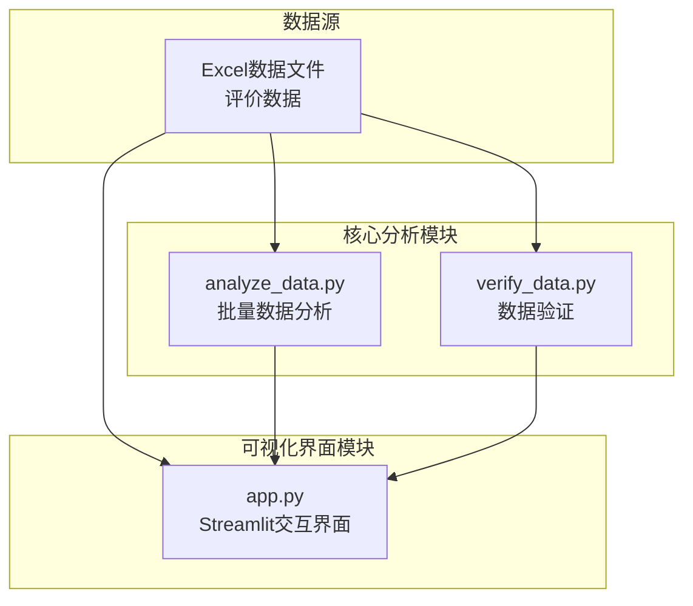
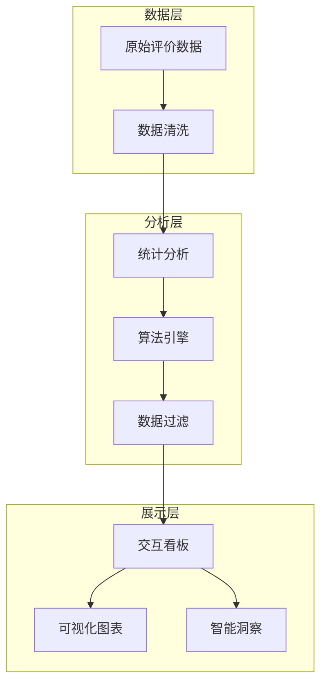
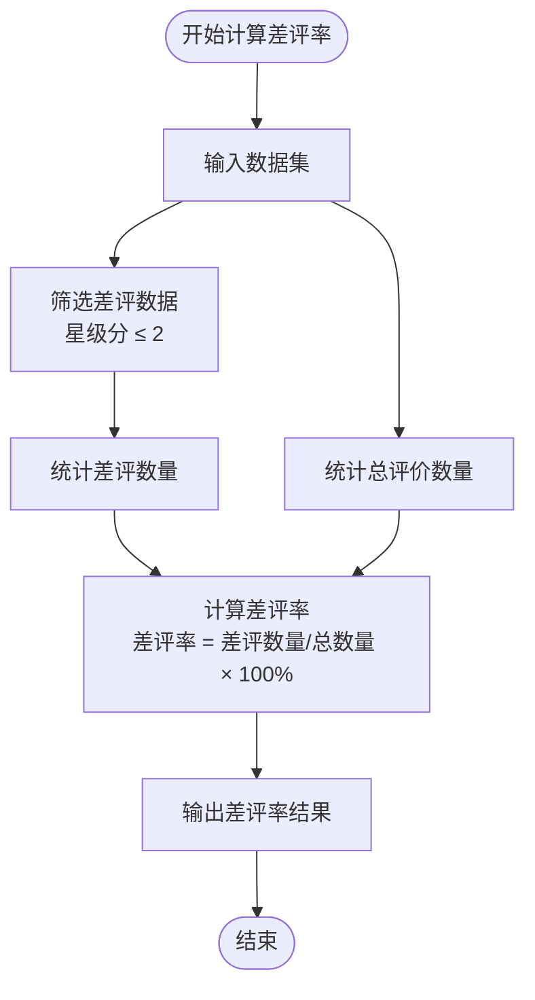
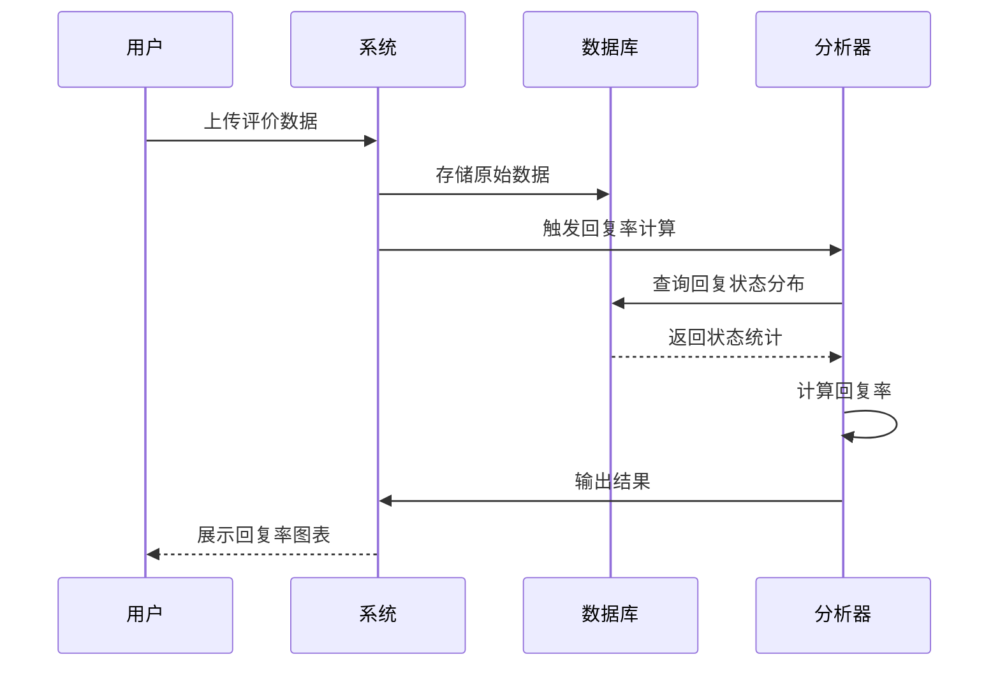
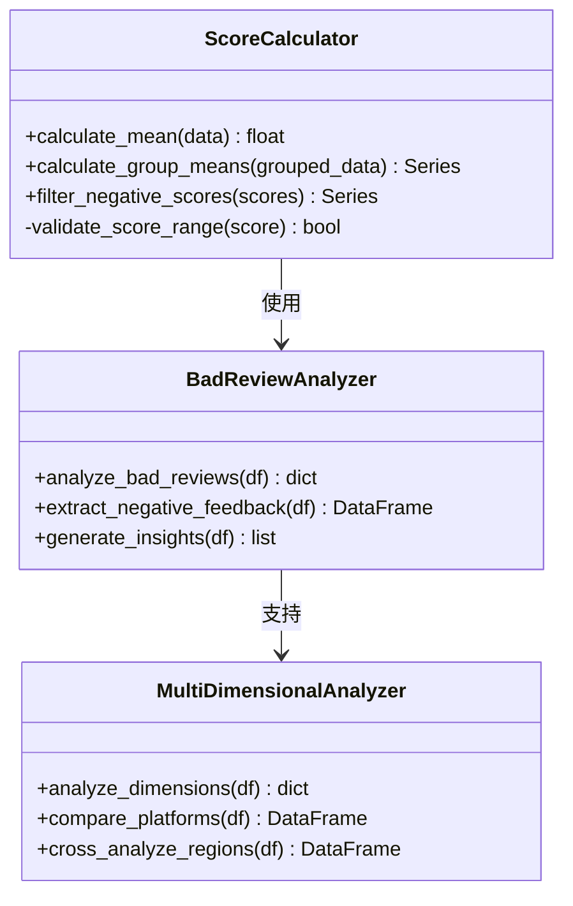
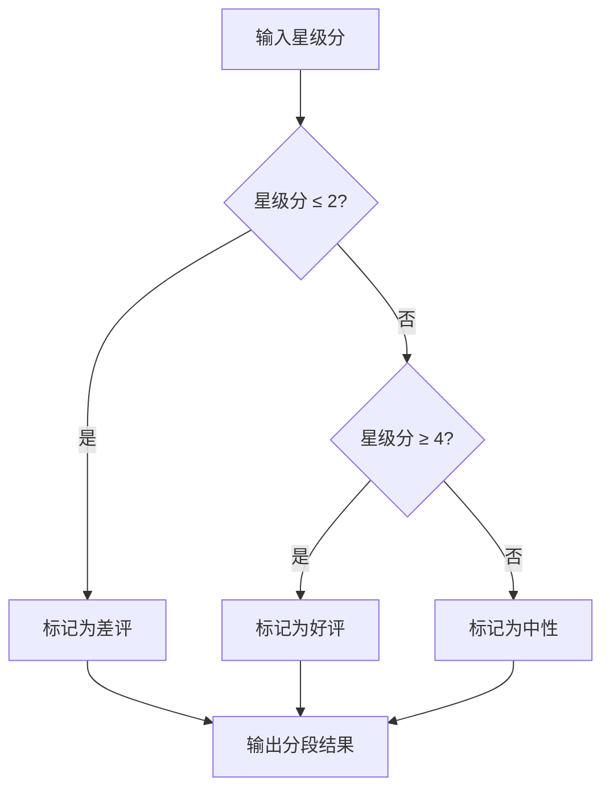
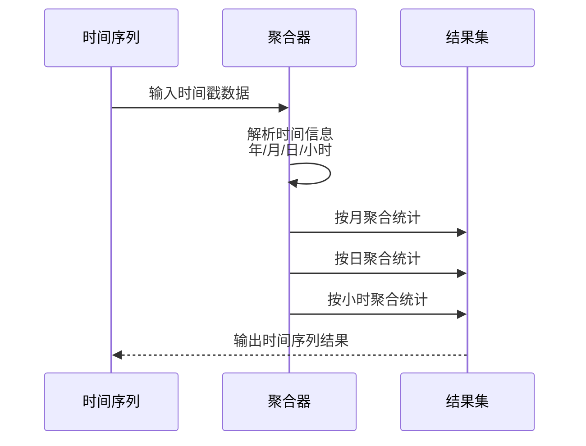
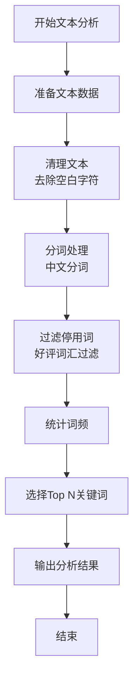
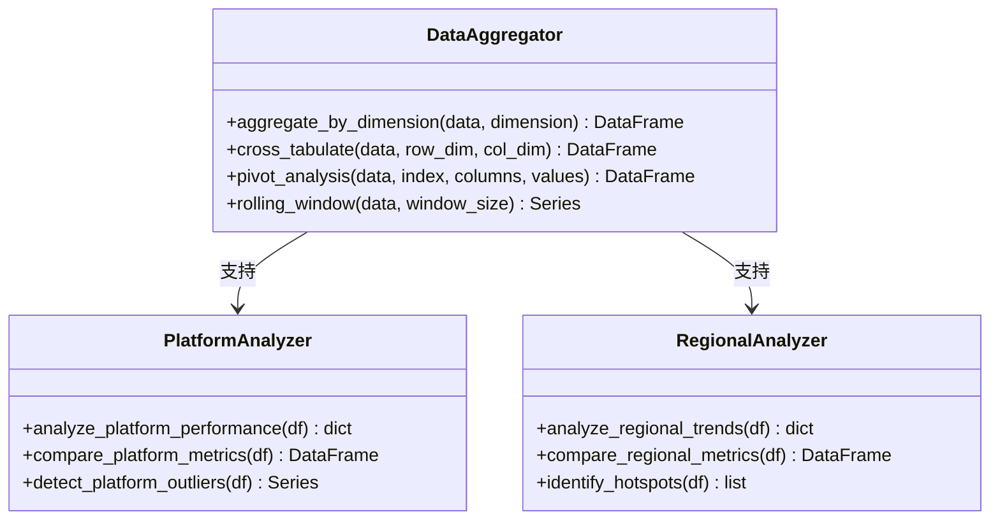
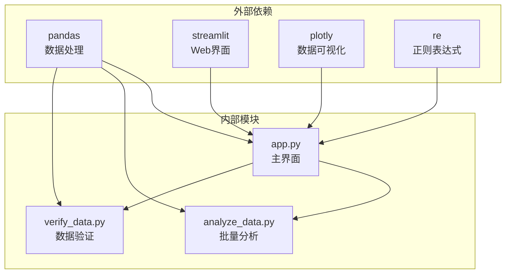

# 核心算法与逻辑实现

<cite>
**本文档引用的文件**
- [analyze_data.py](file://analyze_data.py)
- [app.py](file://app.py)
- [verify_data.py](file://verify_data.py)
</cite>

## 目录
1. [简介](#简介)
2. [项目结构](#项目结构)
3. [核心组件](#核心组件)
4. [架构概览](#架构概览)
5. [详细组件分析](#详细组件分析)
6. [依赖分析](#依赖分析)
7. [性能考虑](#性能考虑)
8. [故障排除指南](#故障排除指南)
9. [结论](#结论)

## 简介

本项目是一个基于Python的数据分析系统，专注于餐饮评价数据的深度分析和可视化展示。系统实现了多种核心算法，包括差评率计算、回复率统计、评分均值计算、数据分类分组、文本分析、数据聚合和透视等功能。通过Streamlit构建了交互式的分析看板，为用户提供直观的数据洞察和运营建议。

## 项目结构

项目采用模块化设计，包含三个主要文件：

**图表来源**
- [analyze_data.py:1-133](file://analyze_data.py#L1-L133)
- [app.py:1-1089](file://app.py#L1-L1089)
- [verify_data.py:1-32](file://verify_data.py#L1-L32)

**章节来源**
- [analyze_data.py:1-133](file://analyze_data.py#L1-L133)
- [app.py:1-1089](file://app.py#L1-L1089)
- [verify_data.py:1-32](file://verify_data.py#L1-L32)

## 核心组件

### 数据分析引擎

系统的核心数据分析功能由`analyze_data.py`实现，提供了完整的批处理分析能力：

- **基础统计指标计算**：总评价数、时间范围、平均星级分等
- **评分分布分析**：星级分分布、各项评分TOP3省份
- **地域分布分析**：评价量TOP10省份和城市
- **时间趋势分析**：月度评价量、高峰时段识别
- **用户分析**：VIP用户分布、用户等级分布、评分对比
- **投诉分析**：投诉类型分布、投诉量TOP5城市
- **标签分析**：菜品标签、服务标签、环境标签TOP10
- **平台分析**：各平台评价量和平均评分

### 实时交互界面

`app.py`构建了基于Streamlit的交互式分析看板，包含：

- **实时数据筛选**：星级范围滑块筛选
- **动态可视化**：饼图、柱状图、折线图等多种图表
- **智能分析**：差评率计算、回复率统计、标签过滤
- **运营建议**：基于数据分析的整改建议生成

### 数据验证工具

`verify_data.py`提供了数据质量验证功能：

- **回复状态验证**：已回复、未回复数量统计
- **差评数据验证**：差评数量、差评率、回复率计算
- **数据完整性检查**：缺失字段检测

**章节来源**
- [analyze_data.py:13-133](file://analyze_data.py#L13-L133)
- [app.py:308-380](file://app.py#L308-L380)
- [verify_data.py:1-32](file://verify_data.py#L1-L32)

## 架构概览

系统采用分层架构设计，实现了数据处理、分析计算和可视化展示的分离：

**图表来源**
- [app.py:328-364](file://app.py#L328-L364)
- [app.py:308-380](file://app.py#L308-L380)
- [analyze_data.py:1-133](file://analyze_data.py#L1-L133)

系统的核心优势在于：

1. **模块化设计**：每个功能模块职责明确，便于维护和扩展
2. **实时交互**：通过Streamlit实现数据的实时可视化和分析
3. **智能过滤**：内置好评词汇过滤机制，提升分析准确性
4. **多维度分析**：支持时间、地域、平台、用户等多个维度的交叉分析

## 详细组件分析

### 差评率计算算法

差评率是系统最重要的核心指标之一，用于衡量餐厅服务质量和用户满意度。

#### 算法实现原理

**图表来源**
- [app.py:365-383](file://app.py#L365-L383)
- [verify_data.py:21-24](file://verify_data.py#L21-L24)

#### 复杂度分析

- **时间复杂度**：O(n)，其中n为评价数据总量
- **空间复杂度**：O(1)，仅使用常量额外空间
- **算法特点**：一次遍历即可完成计算，效率极高

#### 关键实现细节

1. **差评定义**：星级分小于等于2的评价被定义为差评
2. **数据筛选**：使用布尔索引进行高效筛选
3. **精度控制**：结果保留一位小数，提高可读性
4. **边界处理**：空数据集时返回0%

**章节来源**
- [app.py:365-383](file://app.py#L365-L383)
- [verify_data.py:21-24](file://verify_data.py#L21-L24)

### 回复率统计算法

回复率反映了餐厅对用户反馈的响应效率和服务质量。

#### 算法实现流程

**图表来源**
- [app.py:308-313](file://app.py#L308-L313)
- [verify_data.py:11-18](file://verify_data.py#L11-L18)

#### 统计方法

系统实现了三种回复率计算：

1. **整体回复率**：全部评价的回复情况
2. **差评回复率**：差评评价的回复情况  
3. **中性评价回复率**：中性评价的回复情况

#### 复杂度分析

- **时间复杂度**：O(n)，单次遍历统计
- **空间复杂度**：O(1)，常量空间使用
- **优化策略**：使用向量化操作替代循环

**章节来源**
- [app.py:308-380](file://app.py#L308-L380)
- [verify_data.py:11-32](file://verify_data.py#L11-L32)

### 评分均值计算算法

系统支持多维度评分的均值计算，包括星级分、口味分、环境分、服务分等。

#### 算法实现模式

**图表来源**
- [app.py:385-396](file://app.py#L385-L396)
- [app.py:515-539](file://app.py#L515-L539)

#### 计算方法

1. **简单均值**：直接计算数值的算术平均值
2. **分组均值**：按维度（省份、平台、时间）分组计算均值
3. **加权均值**：根据权重调整不同维度的重要性

#### 复杂度分析

- **时间复杂度**：O(n)，n为评分数据量
- **空间复杂度**：O(k)，k为分组数量
- **性能优化**：使用pandas内置函数进行向量化计算

**章节来源**
- [app.py:385-396](file://app.py#L385-L396)
- [app.py:515-539](file://app.py#L515-L539)

### 数据分类和分组算法

系统实现了多层次的数据分类和分组功能。

#### 星级分段算法

**图表来源**
- [app.py:365-367](file://app.py#L365-L367)

#### 地域统计算法

系统支持按省份和城市的多层级统计：

- **评价量统计**：按地区统计评价数量
- **差评率计算**：按地区计算差评率
- **TOP排名**：筛选Top N地区

#### 时间序列分析算法

**图表来源**
- [app.py:342-344](file://app.py#L342-L344)
- [app.py:771-772](file://app.py#L771-L772)

**章节来源**
- [app.py:342-344](file://app.py#L342-L344)
- [app.py:365-367](file://app.py#L365-L367)
- [app.py:771-772](file://app.py#L771-L772)

### 文本分析算法

系统实现了基于规则的文本分析功能，主要用于差评标签过滤和关键词提取。

#### 关键词提取算法

**图表来源**
- [app.py:654-656](file://app.py#L654-L656)
- [app.py:658-659](file://app.py#L658-L659)

#### 标签过滤算法

系统内置了专门的好评词汇过滤机制：

- **好评词汇集合**：包含200+个正面评价词汇
- **负向标签识别**：自动过滤掉好评词汇
- **语义分析**：基于词汇语义进行正负面判断

#### 复杂度分析

- **时间复杂度**：O(n×m)，n为文本数量，m为平均词数
- **空间复杂度**：O(k)，k为词汇表大小
- **优化策略**：使用集合查找替代列表查找

**章节来源**
- [app.py:284-294](file://app.py#L284-L294)
- [app.py:654-659](file://app.py#L654-L659)

### 数据聚合和透视算法

系统实现了多维度的数据聚合和透视分析功能。

#### 多维度统计计算

**图表来源**
- [app.py:385-387](file://app.py#L385-L387)
- [app.py:734-735](file://app.py#L734-L735)

#### 交叉分析方法

1. **平台交叉分析**：比较不同平台的差评率
2. **地域交叉分析**：分析不同地区的评价表现
3. **时间交叉分析**：观察时间维度的变化趋势

#### 复杂度分析

- **时间复杂度**：O(n×d)，n为数据量，d为维度数
- **空间复杂度**：O(n)，存储中间结果
- **性能优化**：使用groupby和merge操作进行高效聚合

**章节来源**
- [app.py:385-387](file://app.py#L385-L387)
- [app.py:734-735](file://app.py#L734-L735)

## 依赖分析

系统依赖关系清晰，模块间耦合度低，便于维护和扩展。

**图表来源**
- [app.py:1-7](file://app.py#L1-L7)
- [analyze_data.py:1](file://analyze_data.py#L1)
- [verify_data.py:1](file://verify_data.py#L1)

### 主要依赖库说明

1. **pandas**：提供强大的数据结构和数据分析工具
2. **streamlit**：构建交互式Web应用的框架
3. **plotly**：创建高质量的交互式图表
4. **re**：正则表达式处理中文文本

### 模块间接口

- **数据输入接口**：统一的Excel文件读取格式
- **分析接口**：标准化的统计计算方法
- **展示接口**：灵活的可视化图表生成

**章节来源**
- [app.py:1-7](file://app.py#L1-L7)
- [analyze_data.py:1](file://analyze_data.py#L1)
- [verify_data.py:1](file://verify_data.py#L1)

## 性能考虑

### 算法性能优化

1. **向量化操作**：大量使用pandas的向量化操作，避免Python循环
2. **内存管理**：合理使用数据类型，减少内存占用
3. **缓存机制**：对重复计算的结果进行缓存
4. **并行处理**：对于大数据集考虑使用并行计算

### 内存优化策略

- **数据类型优化**：使用合适的整数和浮点数类型
- **分块处理**：对于超大数据集采用分块处理策略
- **及时释放**：及时删除不再使用的中间变量

### 扩展性考虑

- **插件架构**：支持新增分析算法的插件化扩展
- **配置驱动**：通过配置文件控制分析参数
- **API接口**：提供RESTful API供其他系统集成

## 故障排除指南

### 常见问题及解决方案

#### 数据加载问题

**问题描述**：Excel文件无法正确读取
**可能原因**：
- 文件格式不支持
- 缺少必要列
- 数据编码问题

**解决方法**：
1. 确认文件格式为.xlsx或.xls
2. 检查必需列是否存在
3. 验证文件编码格式

#### 分析计算异常

**问题描述**：统计结果异常或显示NaN
**可能原因**：
- 数据为空或缺失
- 数据类型不正确
- 计算过程中出现除零错误

**解决方法**：
1. 检查数据完整性
2. 验证数据类型转换
3. 添加边界条件检查

#### 可视化显示问题

**问题描述**：图表无法正常显示
**可能原因**：
- 数据格式不符合要求
- Plotly版本兼容性问题
- 浏览器兼容性问题

**解决方法**：
1. 确保数据格式正确
2. 更新Plotly到最新版本
3. 更换浏览器尝试

**章节来源**
- [app.py:1033-1035](file://app.py#L1033-L1035)
- [app.py:335-337](file://app.py#L335-L337)

## 结论

本项目成功实现了餐饮评价数据的全面分析系统，具有以下特点：

### 技术优势

1. **算法完备性**：涵盖了从基础统计到高级分析的完整算法体系
2. **实现简洁性**：使用Python和pandas实现，代码简洁易懂
3. **可视化丰富**：提供多种图表类型，满足不同分析需求
4. **交互友好**：基于Streamlit构建的现代化Web界面

### 应用价值

1. **业务指导性强**：为餐厅运营提供数据驱动的决策支持
2. **实时性强**：支持实时数据上传和分析
3. **扩展性好**：模块化设计便于功能扩展
4. **维护成本低**：开源技术栈，维护成本相对较低

### 改进建议

1. **算法优化**：可以考虑引入机器学习算法进行更深层次的分析
2. **性能提升**：对于超大数据集可以考虑使用分布式计算
3. **功能扩展**：增加更多维度的分析功能，如情感分析等
4. **移动端适配**：优化移动端的用户体验

该系统为餐饮行业的数据化运营提供了有效的技术支撑，具有良好的实用价值和推广前景。