# 批量数据分析功能

<cite>
**本文档引用的文件**
- [analyze_data.py](file://analyze_data.py)
- [app.py](file://app.py)
- [verify_data.py](file://verify_data.py)
</cite>

## 目录
1. [简介](#简介)
2. [项目结构](#项目结构)
3. [核心组件](#核心组件)
4. [架构概览](#架构概览)
5. [详细组件分析](#详细组件分析)
6. [依赖分析](#依赖分析)
7. [性能考虑](#性能考虑)
8. [故障排除指南](#故障排除指南)
9. [结论](#结论)
10. [附录](#附录)

## 简介

本项目是一个专门针对餐饮评价数据的批量分析系统，提供了从数据读取、清洗、统计分析到可视化展示的完整解决方案。系统包含两个主要功能模块：批量数据分析脚本和交互式Web应用，能够对评价数据进行全面的多维度分析，包括核心指标计算、评分分布分析、地域分布统计、时间趋势分析、用户特征分析、投诉情况统计、标签词频分析和平台对比分析等。

该系统采用Python生态系统中的pandas进行数据处理，结合Streamlit构建交互式Web界面，为用户提供直观的数据分析体验。系统特别关注差评分析，提供了专门的差评运营分析看板，帮助餐厅管理者快速定位问题并制定整改措施。

## 项目结构

项目采用简洁的三层架构设计，每个文件承担特定的功能职责：

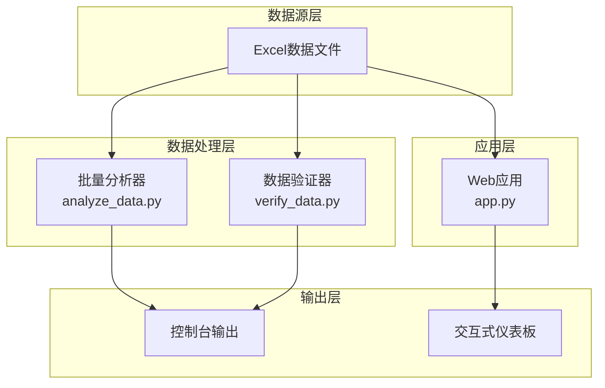

**图表来源**
- [analyze_data.py:1-133](file://analyze_data.py#L1-L133)
- [app.py:1-1089](file://app.py#L1-L1089)
- [verify_data.py:1-32](file://verify_data.py#L1-L32)

**章节来源**
- [analyze_data.py:1-133](file://analyze_data.py#L1-L133)
- [app.py:1-1089](file://app.py#L1-L1089)
- [verify_data.py:1-32](file://verify_data.py#L1-L32)

## 核心组件

### 批量分析器 (analyze_data.py)

批量分析器是系统的核心组件，负责执行全面的数据分析任务。它实现了八个主要分析维度：

1. **核心指标概览** - 计算总评价数、时间范围、平均评分、VIP用户占比、投诉率、回复率等关键指标
2. **评分分布分析** - 分析星级分分布，按省份计算各项评分的TOP3
3. **地域分布分析** - 统计评价量TOP10省份和城市
4. **时间趋势分析** - 分析月度评价量和高峰时段
5. **用户分析** - 分析VIP用户分布、用户等级分布和评分对比
6. **投诉分析** - 统计投诉总数、投诉类型分布和投诉量TOP5城市
7. **标签分析** - 分析菜品标签、服务标签、环境标签的词频
8. **平台分析** - 统计各平台评价量和平均评分

### 数据验证器 (verify_data.py)

数据验证器专注于数据质量检查和基础统计分析，提供：
- 回复状态分布验证
- 整体回复率计算
- 差评数据统计分析

### Web应用 (app.py)

Web应用提供了交互式的可视化界面，包含：
- 文件上传和数据验证
- 实时筛选和动态分析
- 多维度可视化图表
- 智能运营建议
- 未回复差评预警

**章节来源**
- [analyze_data.py:13-133](file://analyze_data.py#L13-L133)
- [verify_data.py:5-32](file://verify_data.py#L5-L32)
- [app.py:328-1089](file://app.py#L328-L1089)

## 架构概览

系统采用分层架构设计，确保了功能的模块化和可维护性：

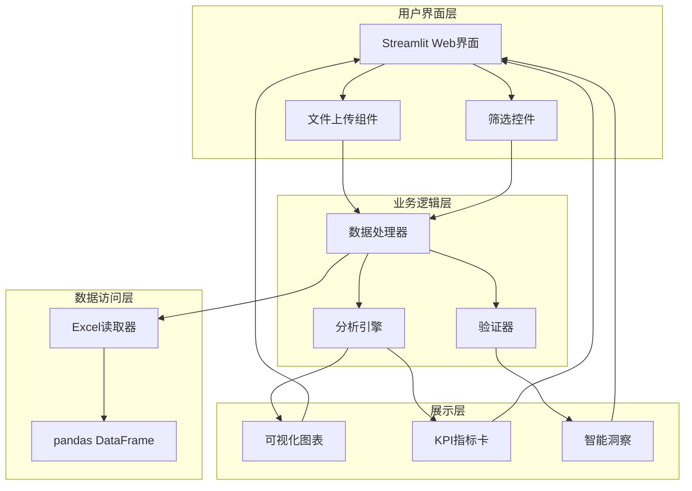

**图表来源**
- [app.py:328-1089](file://app.py#L328-L1089)
- [analyze_data.py:1-133](file://analyze_data.py#L1-L133)

系统的核心优势在于其模块化设计，每个组件都有明确的职责分工，便于独立开发、测试和维护。

## 详细组件分析

### 数据读取和预处理

系统采用统一的数据读取策略，确保数据的一致性和完整性：

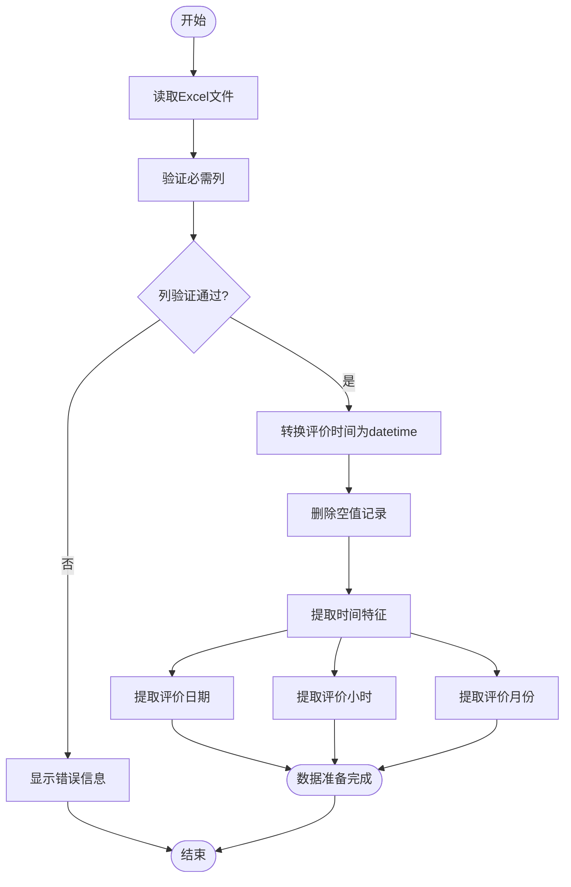

**图表来源**
- [app.py:329-345](file://app.py#L329-L345)

### 核心指标计算模块

核心指标计算模块实现了八个关键业务指标的实时计算：

#### 基础统计指标
- **总评价数**: 使用`len(df)`计算数据总量
- **数据时间范围**: 使用`min()`和`max()`确定时间跨度
- **平均评分**: 对星级分、口味分、环境分、服务分分别计算均值

#### 用户特征指标
- **VIP用户占比**: 通过`value_counts()`统计"是"/"否"的比例
- **投诉率**: 统计投诉状态非空值的比例
- **回复率**: 计算回复状态为"已回复"的比例

#### 计算复杂度分析
- 时间复杂度: O(n)，其中n为数据量
- 空间复杂度: O(1)，仅使用常量额外空间
- 批量计算优化: 利用pandas向量化操作提高性能

**章节来源**
- [analyze_data.py:13-26](file://analyze_data.py#L13-L26)
- [app.py:308-313](file://app.py#L308-L313)

### 评分分布分析

评分分布分析提供了多层次的评分统计：

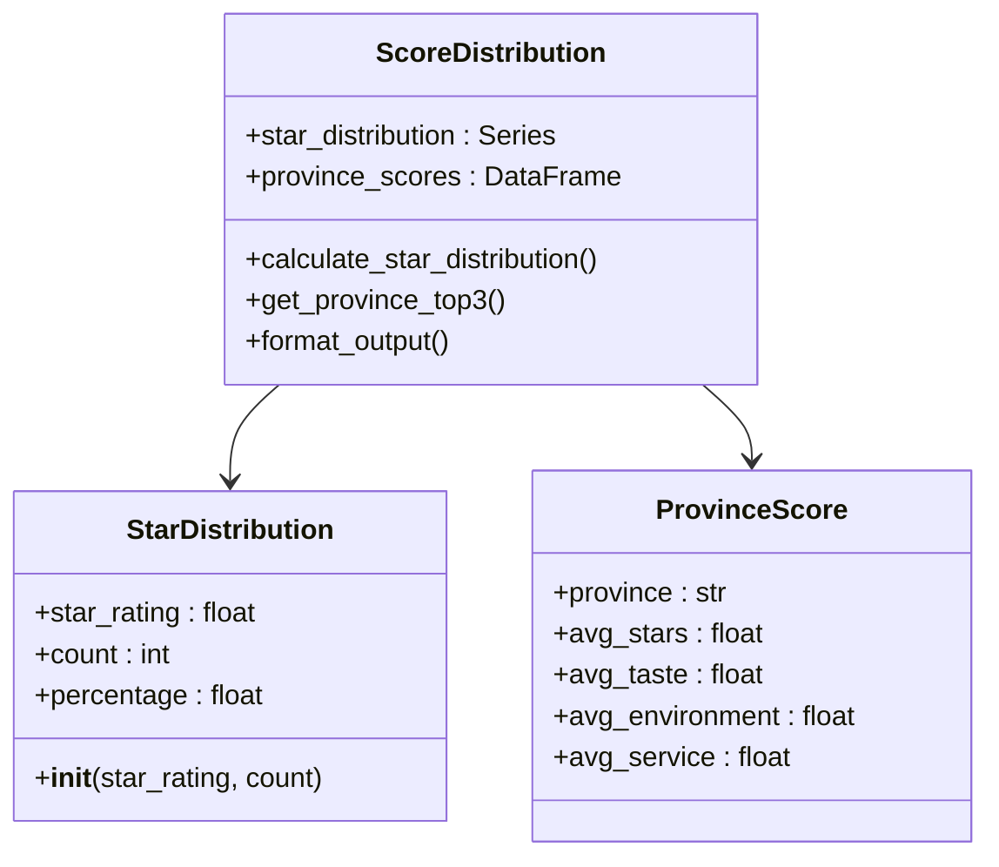

**图表来源**
- [analyze_data.py:28-42](file://analyze_data.py#L28-L42)

#### 星级分分布分析
- 使用`value_counts()`统计各星级评价数量
- 自动排序确保输出的有序性
- 计算百分比并格式化显示

#### 省份评分对比
- 按省份分组计算各项评分均值
- 排序获取TOP3省份
- 支持多维度评分对比

**章节来源**
- [analyze_data.py:28-42](file://analyze_data.py#L28-L42)

### 地域分布统计

地域分布统计提供了省市级别的评价量分析：

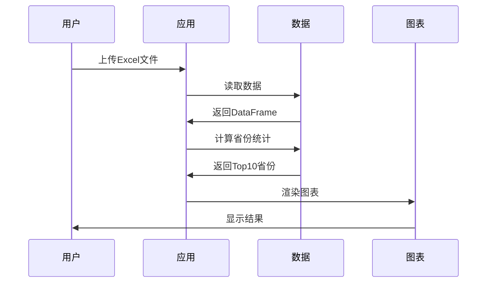

**图表来源**
- [analyze_data.py:43-54](file://analyze_data.py#L43-L54)

#### 省级分析
- 使用`value_counts()`统计各省份评价量
- 获取TOP10省份进行可视化展示
- 支持排名和百分比显示

#### 城市级分析
- 类似省级分析，但关注城市层面
- 提供更精细的地域洞察

**章节来源**
- [analyze_data.py:43-54](file://analyze_data.py#L43-L54)

### 时间趋势分析

时间趋势分析涵盖了月度和时段两个维度的时间序列分析：

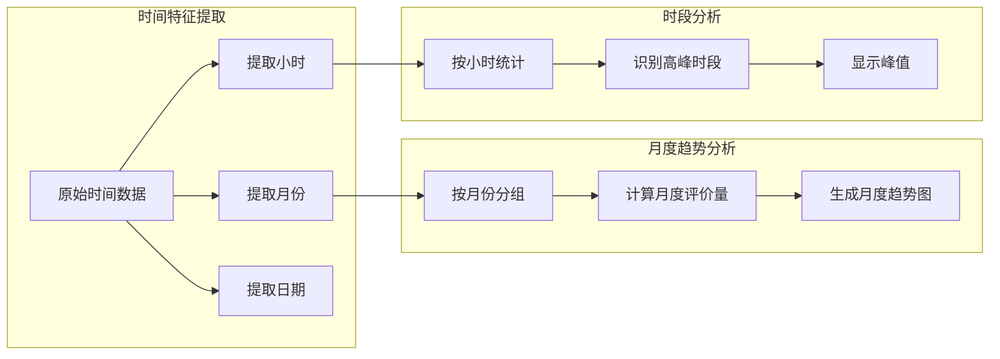

**图表来源**
- [analyze_data.py:55-67](file://analyze_data.py#L55-L67)

#### 月度评价量分析
- 按评价月份分组统计评价数量
- 提供月度变化趋势
- 支持多个月份的对比分析

#### 时段分布分析
- 统计各小时的评价分布
- 识别评价高峰期
- 提供峰值分析

**章节来源**
- [analyze_data.py:55-67](file://analyze_data.py#L55-L67)

### 用户特征分析

用户特征分析重点关注VIP用户和普通用户的差异：

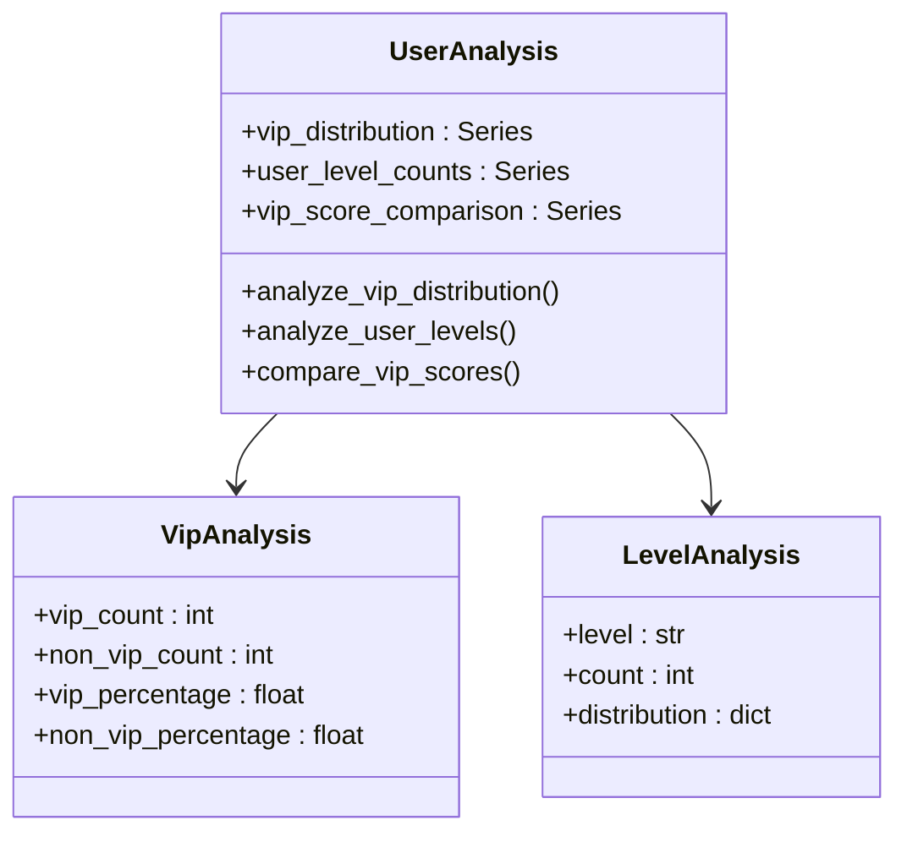

**图表来源**
- [analyze_data.py:69-86](file://analyze_data.py#L69-L86)

#### VIP用户分析
- 统计VIP和非VIP用户数量
- 计算各自占比
- 分析VIP用户的评分表现

#### 用户等级分析
- 统计不同用户等级的数量
- 提供等级分布情况
- 支持等级间的对比分析

**章节来源**
- [analyze_data.py:69-86](file://analyze_data.py#L69-L86)

### 投诉情况统计

投诉分析模块提供了完整的投诉数据统计：

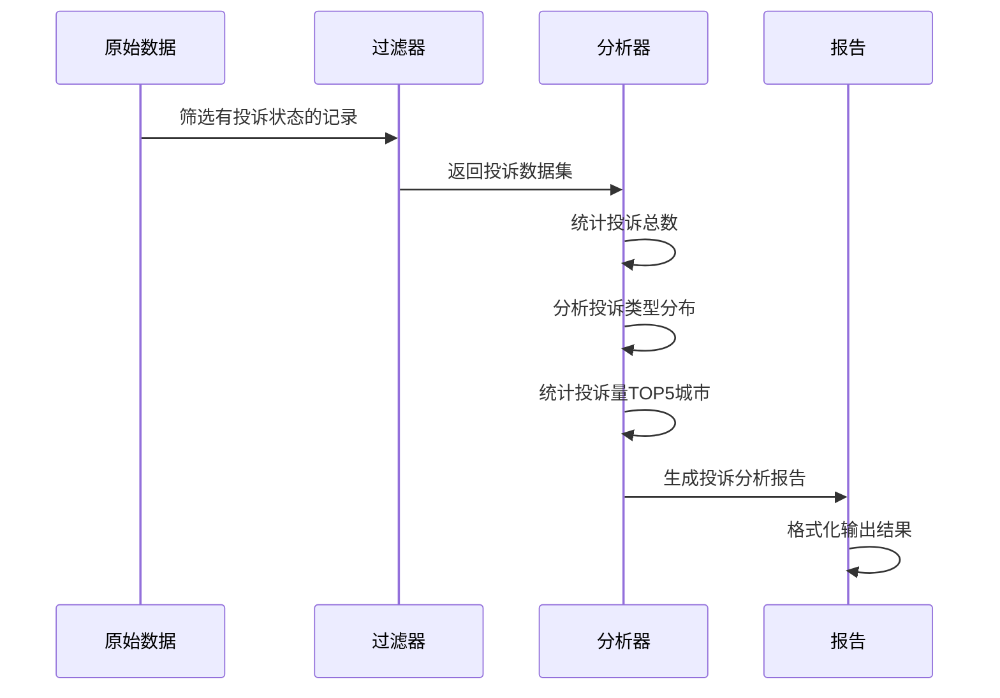

**图表来源**
- [analyze_data.py:87-101](file://analyze_data.py#L87-L101)

#### 投诉数据处理
- 使用布尔索引筛选有投诉状态的记录
- 统计投诉总数和各类别数量
- 分析投诉的地理分布

#### 投诉分析维度
- 投诉类型分类统计
- 城市级投诉量排名
- 投诉处理效率评估

**章节来源**
- [analyze_data.py:87-101](file://analyze_data.py#L87-L101)

### 标签词频分析

标签分析模块专注于菜品、服务和环境标签的词频统计：

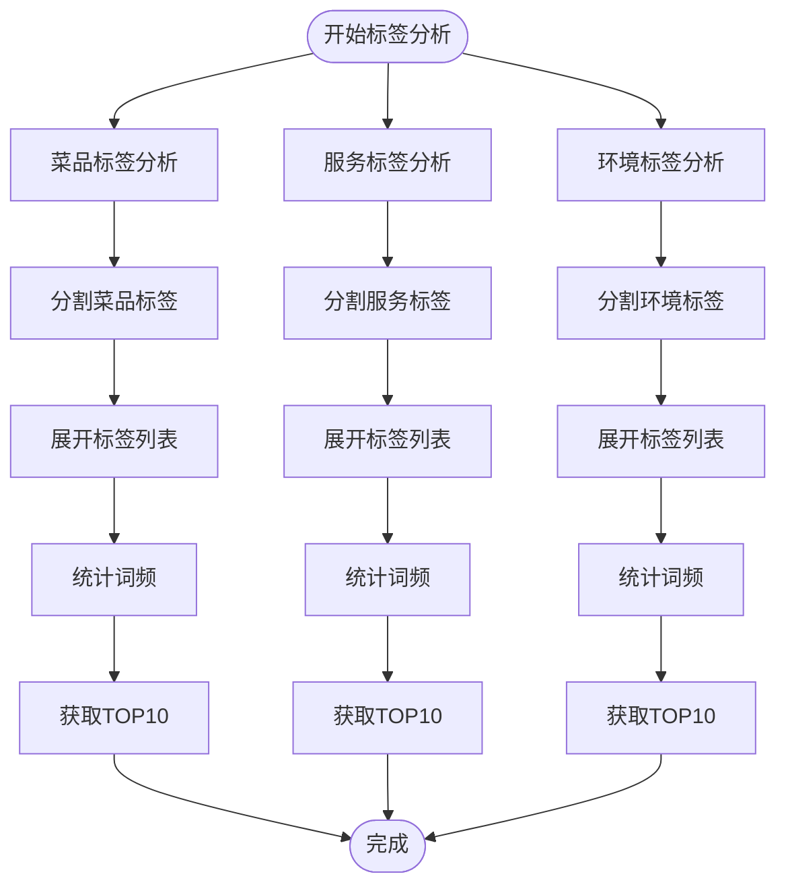

**图表来源**
- [analyze_data.py:102-118](file://analyze_data.py#L102-L118)

#### 标签处理流程
- 使用`str.split(',')`分割标签字符串
- 通过`explode()`展开为单独的标签记录
- 统计每个标签的出现频率
- 获取高频标签进行展示

#### 标签过滤机制
- 预定义好评词汇字典
- 过滤掉积极正面的标签
- 专注于负面和中性标签分析

**章节来源**
- [analyze_data.py:102-118](file://analyze_data.py#L102-L118)

### 平台对比分析

平台分析模块提供了跨平台的评价数据对比：

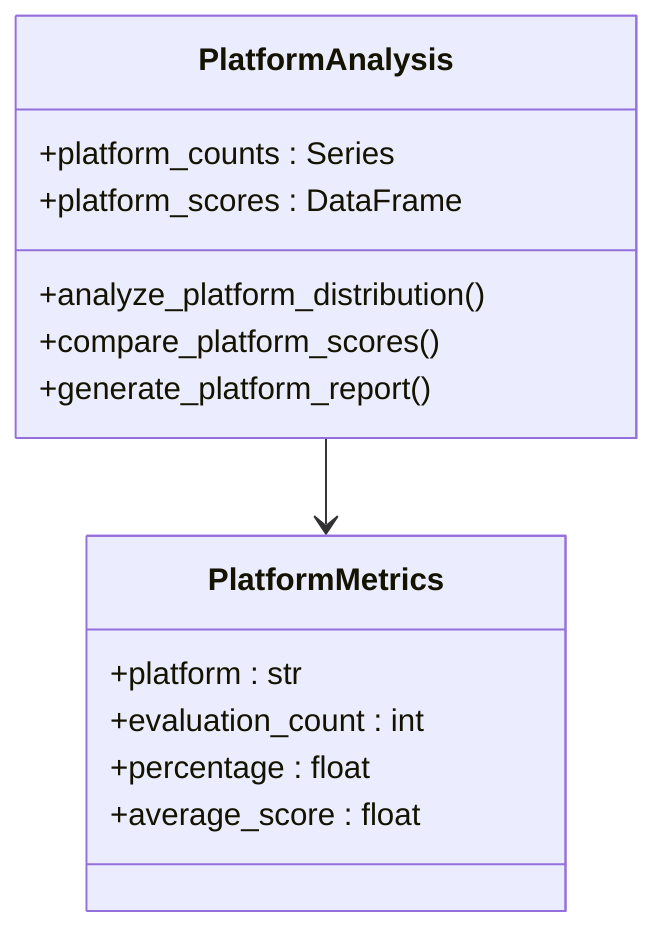

**图表来源**
- [analyze_data.py:119-130](file://analyze_data.py#L119-L130)

#### 平台分布统计
- 统计各平台的评价数量
- 计算平台占比百分比
- 提供平台间的数量对比

#### 平台评分对比
- 按平台分组计算平均评分
- 支持多维度评分对比
- 识别表现最佳和最差的平台

**章节来源**
- [analyze_data.py:119-130](file://analyze_data.py#L119-L130)

## 依赖分析

系统采用模块化的依赖设计，确保了组件间的松耦合：

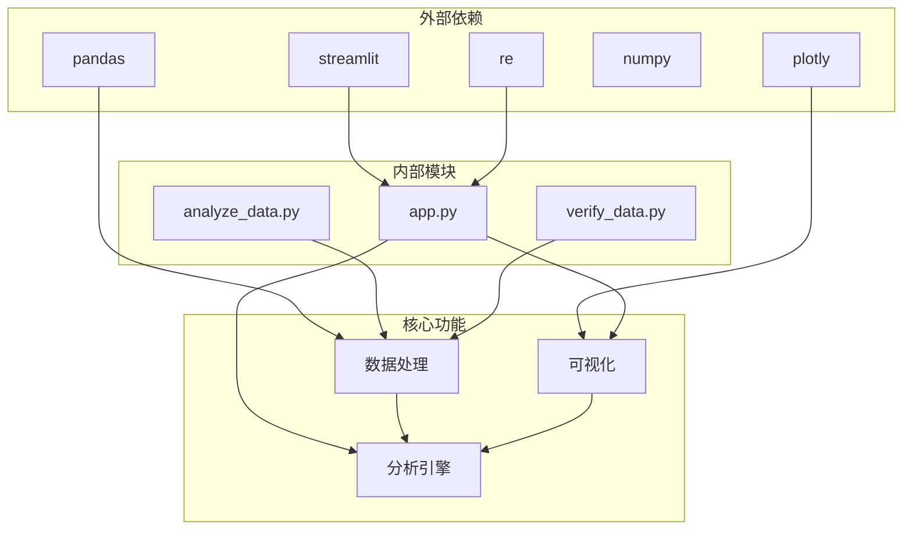

**图表来源**
- [app.py:1-7](file://app.py#L1-L7)
- [analyze_data.py:1](file://analyze_data.py#L1)

### 主要依赖关系

#### 核心库依赖
- **pandas**: 数据处理和分析的核心库
- **streamlit**: Web应用框架
- **plotly**: 交互式图表库
- **numpy**: 数值计算支持
- **re**: 正则表达式处理

#### 内部模块依赖
- `app.py` 作为主入口，依赖所有其他模块
- `analyze_data.py` 独立运行，不依赖其他模块
- `verify_data.py` 独立运行，专注于数据验证

**章节来源**
- [app.py:1-7](file://app.py#L1-L7)
- [analyze_data.py:1](file://analyze_data.py#L1)
- [verify_data.py:1](file://verify_data.py#L1)

## 性能考虑

系统在设计时充分考虑了性能优化，采用了多种优化策略：

### 数据处理优化

#### 向量化操作
- 使用pandas内置的向量化操作替代循环
- 利用`groupby`、`value_counts`等高效函数
- 减少Python循环的使用，提高处理速度

#### 内存管理
- 及时释放不需要的数据对象
- 使用`dropna()`和布尔索引减少数据量
- 合理使用数据类型优化内存使用

#### 批处理策略
- 将多个分析步骤合并为批处理
- 避免重复计算相同的数据
- 使用缓存机制存储中间结果

### 可视化性能优化

#### 图表渲染优化
- 使用`use_container_width=True`适应容器大小
- 合理设置图表高度避免过度渲染
- 采用渐进式加载策略

#### 数据传输优化
- 只传输必要的数据到前端
- 使用分页显示大数据集
- 实现数据懒加载机制

### 并发处理能力

系统具备良好的并发处理能力，能够同时处理多个分析请求：

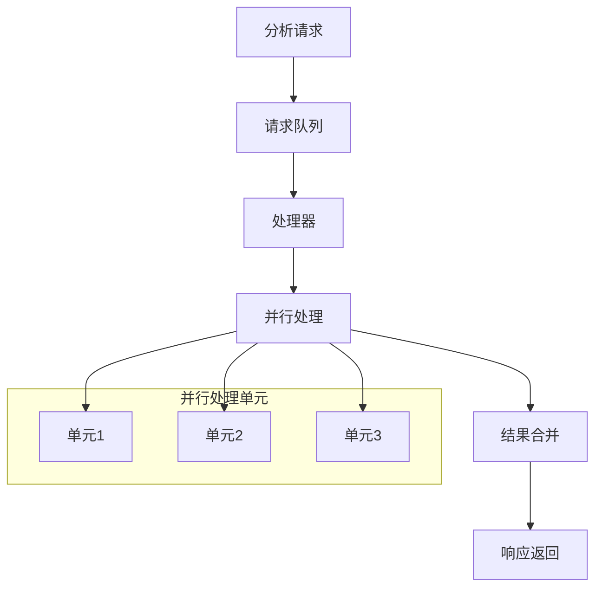

## 故障排除指南

### 常见问题及解决方案

#### 数据文件问题
- **问题**: Excel文件格式不兼容
  - **解决方案**: 确保使用.xlsx或.xls格式，检查文件完整性
- **问题**: 缺少必需列
  - **解决方案**: 验证文件包含评价时间、评价ID、省份、城市等必需列

#### 数据质量问题
- **问题**: 时间格式错误
  - **解决方案**: 使用`pd.to_datetime()`进行格式转换，设置`errors='coerce'`
- **问题**: 缺失值影响分析结果
  - **解决方案**: 使用`dropna()`删除缺失值，或使用`fillna()`填充默认值

#### 性能问题
- **问题**: 大数据集处理缓慢
  - **解决方案**: 考虑分块处理，使用索引优化查询，减少不必要的数据复制

### 调试工具和技巧

#### 数据验证
- 使用`df.info()`查看数据类型和缺失情况
- 使用`df.describe()`获取基本统计信息
- 使用`df.head()`检查数据结构

#### 错误处理
- 实现try-catch异常处理机制
- 提供详细的错误信息和修复建议
- 实现日志记录功能

**章节来源**
- [app.py:1033-1035](file://app.py#L1033-L1035)

## 结论

本批量数据分析系统成功实现了餐饮评价数据的全面分析需求。系统具有以下显著特点：

### 技术优势
- **模块化设计**: 清晰的组件分离，便于维护和扩展
- **高性能处理**: 优化的pandas操作和向量化计算
- **交互式界面**: 基于Streamlit的实时可视化分析
- **全面分析维度**: 涵盖业务所需的各个分析角度

### 业务价值
- **快速洞察**: 提供即时的数据分析结果
- **智能建议**: 基于数据驱动的运营建议
- **预警机制**: 未回复差评的及时提醒
- **持续改进**: 支持建立数据分析的持续改进闭环

### 发展建议
- **扩展分析维度**: 可以增加更多业务相关的分析指标
- **增强预测能力**: 集成机器学习模型进行趋势预测
- **移动端适配**: 优化移动端的用户体验
- **API接口**: 提供RESTful API支持第三方集成

该系统为餐饮行业的数据驱动决策提供了强有力的技术支撑，有助于提升服务质量、降低差评率、增强客户满意度。

## 附录

### 参数配置说明

#### 核心分析参数
- **星级范围**: 默认1-5星，可通过滑块调整
- **时间范围**: 自动根据数据时间范围确定
- **TOP数量**: 默认显示前10个结果

#### 输出格式
- **控制台输出**: 标准的文本格式报告
- **Web界面**: 交互式图表和表格展示
- **数据导出**: 支持CSV和Excel格式导出

### 使用示例

#### 基础使用流程
1. 准备符合要求的Excel数据文件
2. 运行`python app.py`启动Web应用
3. 上传数据文件进行分析
4. 查看分析结果和可视化图表
5. 根据建议制定整改措施

#### 批量处理模式
对于大量数据的批量处理，可以使用`analyze_data.py`直接运行：
```bash
python analyze_data.py
```

### 维护和更新

#### 版本升级
- 定期更新pandas和相关依赖库
- 保持Streamlit版本的最新状态
- 优化代码结构和性能

#### 功能扩展
- 新增分析维度和指标
- 改进可视化效果
- 增强用户交互体验
- 添加数据导出功能