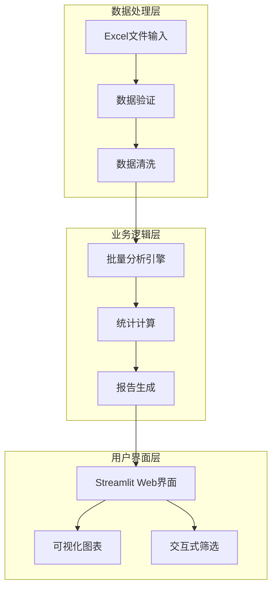
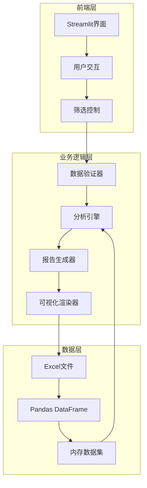
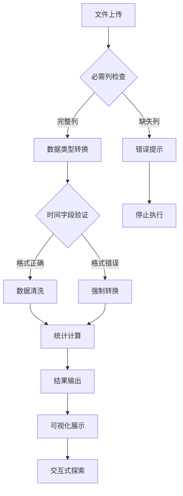
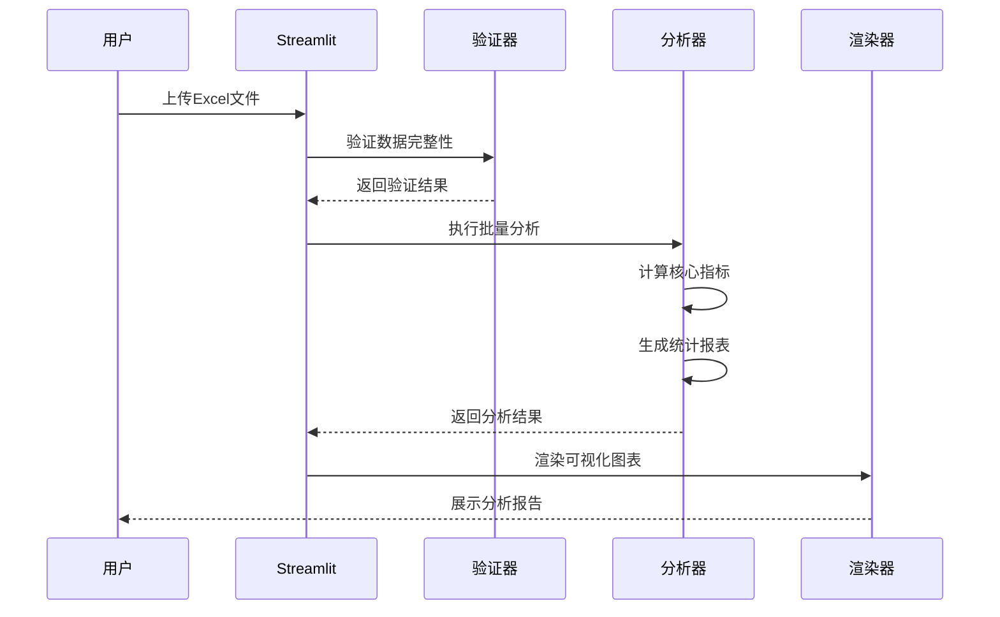
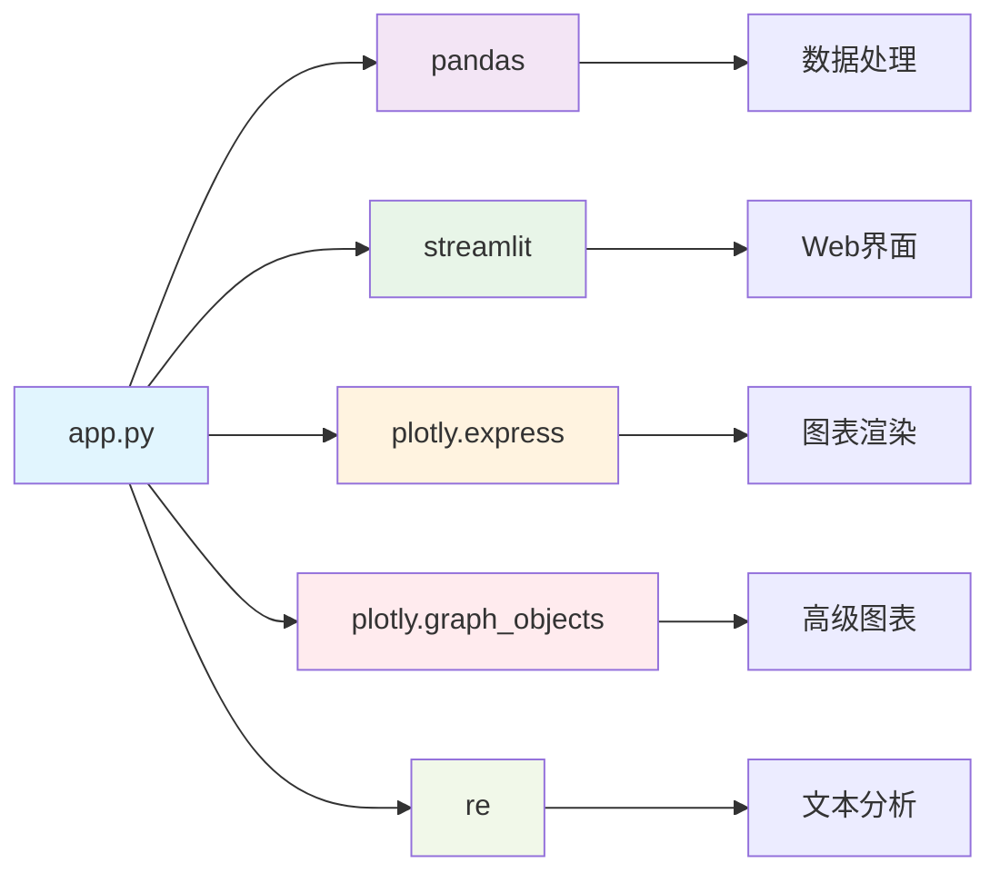

# 数据处理与分析模块

<cite>
**本文档引用的文件**
- [analyze_data.py](file://analyze_data.py)
- [verify_data.py](file://verify_data.py)
- [app.py](file://app.py)
</cite>

## 目录
1. [简介](#简介)
2. [项目结构](#项目结构)
3. [核心组件](#核心组件)
4. [架构概览](#架构概览)
5. [详细组件分析](#详细组件分析)
6. [依赖分析](#依赖分析)
7. [性能考虑](#性能考虑)
8. [故障排除指南](#故障排除指南)
9. [结论](#结论)
10. [附录](#附录)

## 简介

本项目是一个专注于餐饮评价数据分析的综合系统，提供了从数据导入、验证、分析到可视化展示的完整解决方案。系统采用Python技术栈，结合Pandas进行数据处理，Streamlit构建交互式Web界面，Plotly进行数据可视化，旨在帮助餐饮企业通过数据驱动的方式识别差评问题、制定整改策略并持续改进服务质量。

该系统主要面向差评运营分析场景，能够自动识别差评问题、分析差评来源、提供智能整改建议，并通过直观的可视化界面展示关键指标和趋势分析。

## 项目结构

项目采用简洁的三层架构设计，包含数据处理层、业务逻辑层和用户界面层：

**图表来源**
- [app.py:326-337](file://app.py#L326-L337)
- [app.py:339-344](file://app.py#L339-L344)

**章节来源**
- [app.py:1-1089](file://app.py#L1-L1089)

## 核心组件

### 数据输入与验证组件

系统提供两种数据输入方式：
- **本地文件分析**：直接读取指定Excel文件进行批量分析
- **在线上传分析**：通过Web界面上传Excel文件进行实时分析

数据验证机制包括：
- 必需列检查：确保数据完整性
- 数据类型转换：时间字段标准化处理
- 缺失值处理：自动清理无效数据

### 批量分析引擎

核心分析功能涵盖：
- **基础统计指标**：评价总数、时间范围、平均评分等
- **评分分布分析**：星级分布、地域分布、时间趋势
- **用户行为分析**：VIP用户对比、用户等级分析
- **投诉问题诊断**：投诉类型分类、热点城市识别

### 可视化展示组件

提供丰富的图表类型：
- 饼图：评价等级分布、用户类型分布
- 柱状图：各项评分对比、地域分布
- 折线图：时间趋势分析
- 词云：关键词和标签分析

**章节来源**
- [analyze_data.py:1-133](file://analyze_data.py#L1-L133)
- [verify_data.py:1-32](file://verify_data.py#L1-L32)
- [app.py:308-383](file://app.py#L308-L383)

## 架构概览

系统采用模块化设计，各组件职责清晰分离：

**图表来源**
- [app.py:326-357](file://app.py#L326-L357)
- [app.py:365-383](file://app.py#L365-L383)

系统的核心流程包括：用户上传数据 → 数据验证 → 实时分析 → 结果展示 → 交互式探索。

**章节来源**
- [app.py:328-363](file://app.py#L328-L363)

## 详细组件分析

### 数据输入与验证机制

#### Excel文件格式要求

系统支持标准的Excel文件格式，包括.xlsx和.xls格式。文件必须包含以下必需列：

**核心必需列**：
- 评价时间：时间戳字段，用于时间序列分析
- 评价ID：唯一标识符，用于数据去重和关联
- 省份：地理信息，用于地域分析
- 城市：地理细分，用于城市级分析
- 评价门店：门店标识，用于门店级分析
- 星级分：总体评分，范围1-5分
- 口味分：食物质量评分
- 环境分：就餐环境评分
- 服务分：服务质量评分
- 回复状态：回复状态标识

**可选增强列**：
- 是否vip：VIP用户标识
- 用户等级：用户级别分类
- 投诉状态：投诉记录标识
- 投诉类型：投诉具体类型
- 菜品标签：菜品相关标签
- 服务标签：服务相关标签
- 环境标签：环境相关标签
- 平台：评价来源平台
- 评价详情：文本评论内容

#### 数据类型验证

系统实施多层次的数据验证：

**图表来源**
- [app.py:326-344](file://app.py#L326-L344)
- [app.py:339-340](file://app.py#L339-L340)

**章节来源**
- [app.py:326-344](file://app.py#L326-L344)
- [app.py:339-340](file://app.py#L339-L340)

### 批量数据分析功能

#### 统计计算方法

系统实现了全面的统计分析框架：

**核心指标计算**：
- 基础统计：总评价数、时间范围、平均评分
- 分布统计：星级分布、地域分布、时间分布
- 对比分析：VIP vs 普通用户、平台对比、时间趋势

**高级分析算法**：
- 差评识别：基于星级阈值的自动分类
- 地域分析：按省份、城市维度的聚合统计
- 时间分析：日、月、小时粒度的时间序列分析
- 标签分析：基于字符串分割的标签提取和统计

#### 报告生成逻辑

系统采用模块化的报告生成架构：

**图表来源**
- [app.py:328-363](file://app.py#L328-L363)
- [app.py:365-383](file://app.py#L365-L383)

**章节来源**
- [app.py:365-383](file://app.py#L365-L383)
- [app.py:385-396](file://app.py#L385-L396)

### 数据验证工具

#### 数据质量检查

系统内置了完善的数据质量检查机制：

**回复状态验证**：
- 自动统计已回复/未回复数量
- 计算整体回复率和差评回复率
- 识别异常回复状态

**差评数据验证**：
- 基于星级阈值识别差评
- 统计差评率和差评回复情况
- 分析差评分布特征

**章节来源**
- [verify_data.py:7-18](file://verify_data.py#L7-L18)
- [verify_data.py:21-32](file://verify_data.py#L21-L32)

#### 异常值检测

系统采用多维度的异常值检测策略：

**评分异常检测**：
- 星级分范围检查（1-5分）
- 各维度评分一致性分析
- 极端值识别和标记

**时间异常检测**：
- 时间戳有效性验证
- 时间范围合理性检查
- 异常时间点识别

**地理异常检测**：
- 地理信息完整性检查
- 地区分布合理性分析

#### 数据清洗功能

**缺失值处理**：
- 时间字段缺失值删除
- 标签字段空值处理
- 数值字段默认值填充

**重复数据处理**：
- 基于评价ID的去重
- 时间戳重复检测
- 内容重复识别

**数据标准化**：
- 字段名称统一
- 数据类型转换
- 编码格式规范化

**章节来源**
- [app.py:339-344](file://app.py#L339-L344)
- [app.py:346-363](file://app.py#L346-L363)

### 可视化分析组件

#### 图表类型与用途

系统提供多种图表类型以满足不同分析需求：

**描述性统计图表**：
- 饼图：评价等级分布、用户类型分布
- 柱状图：各项评分对比、地域分布
- 折线图：时间趋势分析

**诊断分析图表**：
- 差评星级分布
- 差评各项评分均值
- 差评标签分析

**预警监控图表**：
- 未回复差评城市分布
- 月度差评率趋势
- 差评回复率变化

#### 交互式功能

**动态筛选**：
- 星级范围滑块筛选
- 实时数据更新
- 筛选条件可视化

**数据导出**：
- 原始数据查看
- 分析结果导出
- 图表截图保存

**章节来源**
- [app.py:442-450](file://app.py#L442-L450)
- [app.py:494-510](file://app.py#L494-L510)

## 依赖分析

系统采用轻量级但功能完备的技术栈：

**图表来源**
- [app.py:1-6](file://app.py#L1-L6)

**依赖关系特点**：
- **核心依赖**：pandas负责数据处理，streamlit提供Web界面
- **可视化依赖**：plotly系列库提供丰富的图表功能
- **文本处理依赖**：正则表达式支持关键词提取

**章节来源**
- [app.py:1-6](file://app.py#L1-L6)

## 性能考虑

### 数据处理优化

**内存管理**：
- 使用分块读取处理大型Excel文件
- 及时释放中间变量和临时数据
- 优化DataFrame操作减少内存占用

**计算效率**：
- 向量化操作替代循环处理
- 使用groupby进行高效分组聚合
- 缓存常用计算结果避免重复计算

### 界面响应优化

**懒加载机制**：
- 图表按需渲染
- 大数据集分页显示
- 动态数据更新

**并发处理**：
- 多线程处理独立分析任务
- 异步数据加载
- 非阻塞UI更新

## 故障排除指南

### 常见问题及解决方案

**文件格式问题**：
- 症状：无法读取Excel文件
- 解决方案：确认文件为.xlsx或.xls格式，检查文件完整性

**列缺失问题**：
- 症状：数据验证失败
- 解决方案：确保必需列存在，列名大小写一致

**数据类型错误**：
- 症状：分析结果异常
- 解决方案：检查数值字段格式，确保时间字段正确解析

**内存不足问题**：
- 症状：程序运行缓慢或崩溃
- 解决方案：减小数据文件大小，优化数据结构

### 调试工具

**数据验证面板**：
- 实时显示数据统计信息
- 显示缺失值分布
- 提供数据质量评估

**错误日志**：
- 详细的错误信息输出
- 文件路径和行号定位
- 建议的修复方案

**章节来源**
- [app.py:1033-1035](file://app.py#L1033-L1035)
- [app.py:1011-1031](file://app.py#L1011-L1031)

## 结论

本数据处理与分析模块为餐饮企业提供了完整的差评数据分析解决方案。系统通过模块化设计实现了数据输入、验证、分析、可视化的全流程自动化，具有以下优势：

**技术优势**：
- 基于成熟技术栈，稳定可靠
- 模块化设计便于维护和扩展
- 交互式界面提升用户体验

**业务价值**：
- 快速识别差评问题根源
- 提供数据驱动的整改建议
- 建立持续改进的分析体系

**改进建议**：
- 增加更多分析维度和指标
- 支持更多数据源格式
- 提供API接口便于集成
- 增强机器学习预测能力

该系统为企业数字化转型提供了坚实的数据分析基础，有助于提升服务质量、降低差评率、增强客户满意度。

## 附录

### Excel文件格式规范

**文件命名规范**：
- 建议使用包含时间范围的命名方式
- 包含业务标识符便于识别
- 避免特殊字符和空格

**数据质量要求**：
- 确保数据完整性，无缺失值
- 统一数据格式和编码
- 保持数据一致性

**最佳实践建议**：
- 定期备份原始数据
- 建立数据字典和元数据管理
- 制定数据更新和维护流程

### 使用指南

**准备工作**：
1. 准备符合规范的Excel文件
2. 确保网络连接稳定
3. 准备必要的分析工具

**操作步骤**：
1. 上传Excel文件
2. 查看数据验证结果
3. 设置筛选条件
4. 分析关键指标
5. 查看可视化图表
6. 获取整改建议

**注意事项**：
- 首次使用建议先测试小数据集
- 定期更新分析模型
- 建立数据安全保护措施