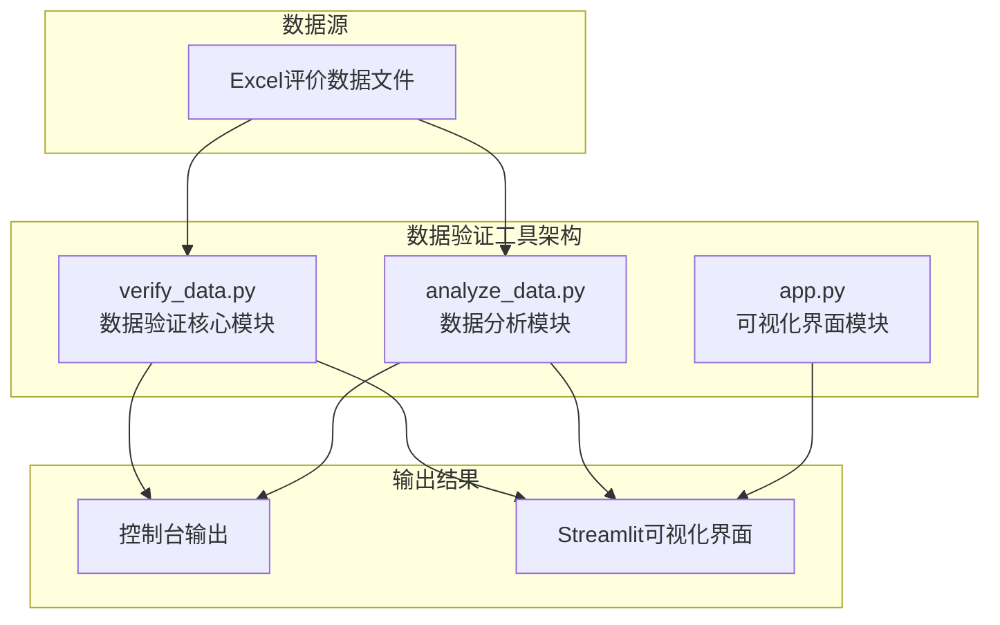
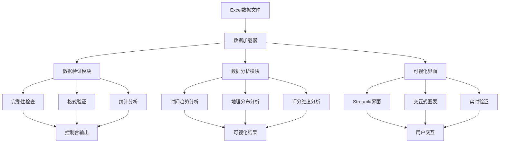
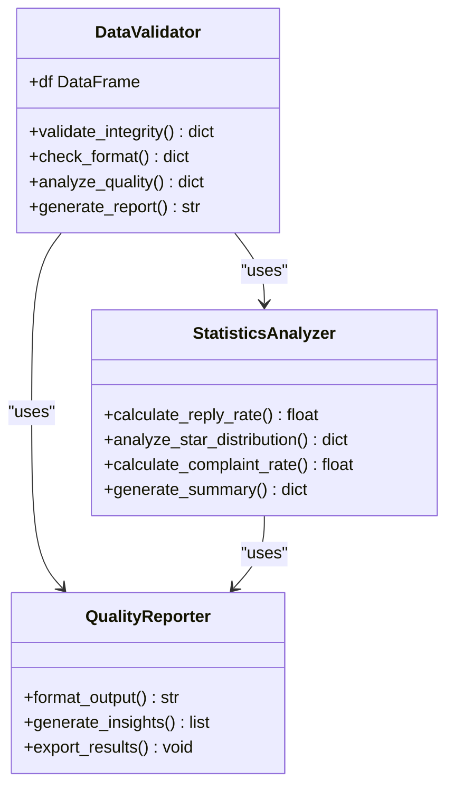
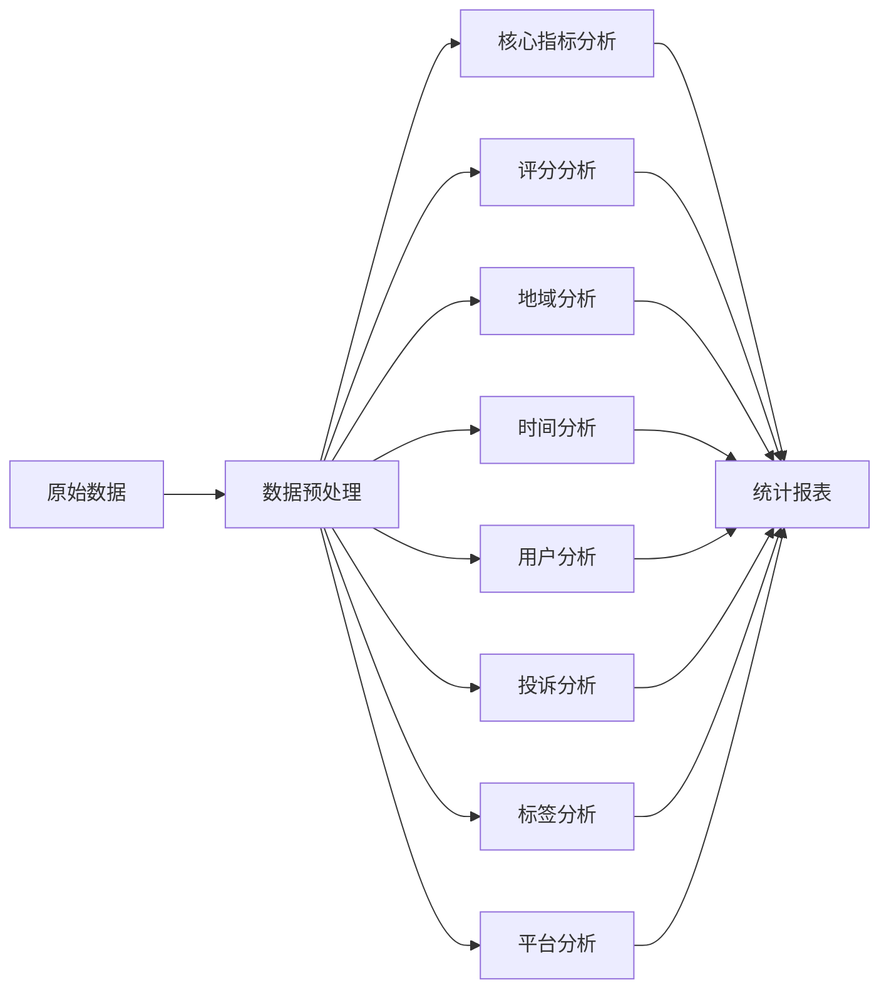
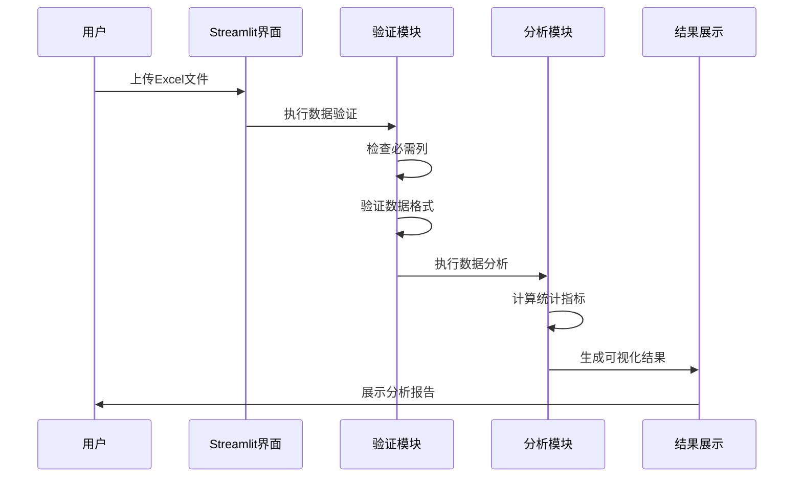
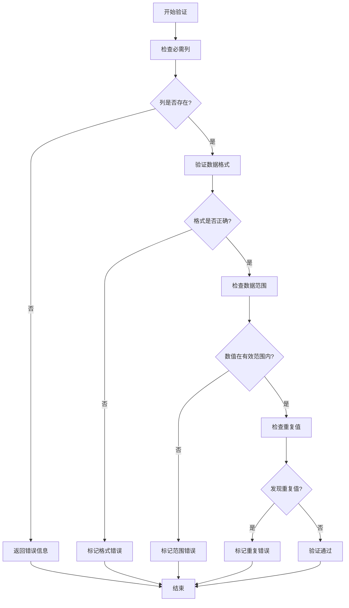

# 数据验证工具

<cite>
**本文档引用的文件**
- [verify_data.py](file://verify_data.py)
- [analyze_data.py](file://analyze_data.py)
- [app.py](file://app.py)
</cite>

## 目录
1. [简介](#简介)
2. [项目结构](#项目结构)
3. [核心组件](#核心组件)
4. [架构概览](#架构概览)
5. [详细组件分析](#详细组件分析)
6. [数据验证机制](#数据验证机制)
7. [性能考虑](#性能考虑)
8. [故障排除指南](#故障排除指南)
9. [结论](#结论)

## 简介

本项目是一个专注于餐饮评价数据分析的数据验证工具，主要功能包括数据完整性验证、数据格式校验、异常值检测和重复数据识别等。该工具通过三个核心模块协同工作：数据验证模块（verify_data.py）、数据分析模块（analyze_data.py）和可视化展示模块（app.py），为用户提供全面的评价数据质量检查和分析能力。

该工具特别针对差评数据进行深度分析，提供差评率统计、回复状态跟踪、地域分布分析等功能，帮助餐饮企业识别和解决服务质量问题。

## 项目结构

项目采用模块化设计，每个文件都有明确的职责分工：

**图表来源**
- [verify_data.py:1-32](file://verify_data.py#L1-L32)
- [analyze_data.py:1-133](file://analyze_data.py#L1-L133)
- [app.py:1-1089](file://app.py#L1-L1089)

**章节来源**
- [verify_data.py:1-32](file://verify_data.py#L1-L32)
- [analyze_data.py:1-133](file://analyze_data.py#L1-L133)
- [app.py:1-1089](file://app.py#L1-L1089)

## 核心组件

### 数据验证模块 (verify_data.py)

这是项目的核心验证模块，负责执行基础的数据质量检查和统计分析。主要功能包括：

- **数据完整性验证**：检查必需字段的存在性和完整性
- **数据格式校验**：验证数据类型和格式的正确性
- **统计分析**：计算各种关键指标和比率
- **异常值检测**：识别不符合预期模式的数据

### 数据分析模块 (analyze_data.py)

提供更深入的数据分析功能，包括：

- **时间序列分析**：按月、日、小时维度分析评价趋势
- **地理分布分析**：按省份、城市维度分析评价分布
- **评分维度分析**：分析各项评分指标的分布情况
- **用户特征分析**：分析VIP用户和普通用户的差异

### 可视化界面模块 (app.py)

基于Streamlit构建的交互式可视化界面，提供：

- **实时数据验证**：在数据上传时进行实时验证
- **动态图表展示**：多种图表形式展示分析结果
- **交互式筛选**：支持星级范围等条件筛选
- **智能预警系统**：根据阈值自动识别潜在问题

**章节来源**
- [verify_data.py:1-32](file://verify_data.py#L1-L32)
- [analyze_data.py:1-133](file://analyze_data.py#L1-L133)
- [app.py:1-1089](file://app.py#L1-L1089)

## 架构概览

**图表来源**
- [verify_data.py:1-32](file://verify_data.py#L1-L32)
- [analyze_data.py:1-133](file://analyze_data.py#L1-L133)
- [app.py:1-1089](file://app.py#L1-L1089)

## 详细组件分析

### 数据验证模块 (verify_data.py)

#### 主要功能特性

该模块专注于基础的数据质量检查，提供了以下核心功能：

**1. 基础统计分析**
- 计算回复状态分布
- 统计整体回复率
- 分析差评数据特征

**2. 数据完整性检查**
- 验证必需字段的存在
- 检查数据完整性
- 识别缺失值情况

**3. 质量指标计算**
- 差评率计算
- 差评回复率分析
- 多维度统计指标

**图表来源**
- [verify_data.py:1-32](file://verify_data.py#L1-L32)

**章节来源**
- [verify_data.py:1-32](file://verify_data.py#L1-L32)

### 数据分析模块 (analyze_data.py)

#### 功能架构

该模块提供了全面的数据分析能力，包括多个维度的分析功能：

**1. 核心指标概览**
- 总评价数统计
- 时间范围分析
- 平均评分计算
- VIP用户占比分析

**2. 评分分布分析**
- 星级分分布统计
- 各项评分维度分析
- 省份评分对比

**3. 地域分布分析**
- 省份评价量排名
- 城市评价量排名
- 地理热点识别

**4. 时间趋势分析**
- 月度评价量趋势
- 小时分布分析
- 高峰时段识别

**5. 用户分析**
- VIP用户分布
- 用户等级分析
- 用户评分对比

**6. 投诉分析**
- 投诉总数统计
- 投诉类型分布
- 城市投诉排名

**7. 标签分析**
- 菜品标签分析
- 服务标签分析
- 环境标签分析

**8. 平台分析**
- 各平台评价量统计
- 平台评分对比

**图表来源**
- [analyze_data.py:1-133](file://analyze_data.py#L1-L133)

**章节来源**
- [analyze_data.py:1-133](file://analyze_data.py#L1-L133)

### 可视化界面模块 (app.py)

#### 界面架构

该模块基于Streamlit构建了完整的可视化界面，提供了丰富的交互功能：

**1. 界面设计**
- 深色主题设计
- 响应式布局
- 卡片式组件设计
- 渐变色彩系统

**2. 数据验证功能**
- 实时文件上传验证
- 必需列检查
- 数据格式验证
- 错误处理机制

**3. 交互式分析**
- 星级范围筛选
- 动态图表更新
- 实时数据展示
- 智能预警系统

**4. 报告生成功能**
- 自动化报告生成
- 关键指标展示
- 诊断建议输出
- 数据导出功能

**图表来源**
- [app.py:328-1036](file://app.py#L328-L1036)

**章节来源**
- [app.py:1-1089](file://app.py#L1-L1089)

## 数据验证机制

### 数据完整性验证

#### 必需字段检查

系统对输入数据进行严格的完整性检查，确保所有必需字段都存在且有效：

**必需列验证**
- 评价时间：必须存在且可转换为日期时间格式
- 评价ID：唯一标识符，用于数据去重
- 省份：地理位置信息，用于地域分析
- 城市：详细位置信息
- 评价门店：具体门店标识
- 星级分：评分指标，范围1-5
- 口味分：评分指标，范围1-5
- 环境分：评分指标，范围1-5
- 服务分：评分指标，范围1-5
- 回复状态：回复状态标识

**验证流程**

**图表来源**
- [app.py:328-362](file://app.py#L328-L362)

#### 数据格式校验

系统对各种数据类型进行严格格式验证：

**时间格式验证**
- 使用日期时间解析函数
- 支持多种日期格式
- 自动处理解析错误

**数值范围验证**
- 星级分：1-5范围检查
- 评分分：1-5范围检查
- 数量统计：非负数检查

**文本格式验证**
- 字符串长度检查
- 编码格式验证
- 特殊字符处理

### 异常值检测

#### 差评识别机制

系统通过多维度分析识别异常评价数据：

**差评定义**
- 星级分 ≤ 2 的评价被定义为差评
- 差评率计算：差评数量 / 总评价数量 × 100%

**异常回复状态检测**
- 未回复差评识别
- 回复状态不一致检查
- 回复时效性分析

**地理异常检测**
- 异常高发地区识别
- 地区间差异分析
- 季节性变化监测

### 重复数据识别

#### 去重策略

系统采用多层去重策略确保数据准确性：

**主键去重**
- 基于评价ID进行唯一性检查
- 重复记录标记和处理
- 去重前后数据对比

**内容相似性检测**
- 评价详情相似度分析
- 多字段组合去重
- 语义相似性评估

**时间序列去重**
- 近期重复评价检测
- 时间窗口内重复识别
- 重复频率分析

### 数据质量评估

#### 质量指标体系

系统建立了完整的数据质量评估指标：

**完整性指标**
- 字段完整率
- 记录完整率
- 数据覆盖率

**准确性指标**
- 逻辑一致性检查
- 数值范围验证
- 异常值检测率

**一致性指标**
- 格式统一性
- 单位一致性
- 编码标准化

**及时性指标**
- 数据更新频率
- 时效性检查
- 过期数据识别

**章节来源**
- [verify_data.py:1-32](file://verify_data.py#L1-L32)
- [app.py:328-362](file://app.py#L328-L362)

## 性能考虑

### 数据处理优化

#### 内存管理

系统采用高效的内存管理策略：

**大数据集处理**
- 分块读取大文件
- 流式数据处理
- 内存使用监控

**数据类型优化**
- 合理的数据类型选择
- 数值压缩存储
- 字符串池化处理

#### 计算效率

**向量化操作**
- Pandas向量化计算
- NumPy数组操作
- 减少Python循环

**缓存机制**
- 频繁访问数据缓存
- 计算结果缓存
- 图表数据缓存

### 界面性能优化

#### 前端优化

**懒加载机制**
- 图表按需加载
- 数据分页显示
- 交互元素延迟初始化

**响应式设计**
- 移动端适配
- 屏幕尺寸自适应
- 触摸交互优化

**章节来源**
- [app.py:1-1089](file://app.py#L1-L1089)

## 故障排除指南

### 常见问题及解决方案

#### 数据文件问题

**问题：文件格式不支持**
- 检查文件扩展名（.xlsx, .xls）
- 确认Excel版本兼容性
- 验证文件完整性

**问题：列名不匹配**
- 对照必需列清单核对
- 检查列名大小写
- 验证特殊字符处理

**问题：编码格式错误**
- 确认文件保存编码
- 检查特殊字符处理
- 验证中文字符显示

#### 数据质量问题

**问题：数据为空或缺失**
- 检查数据完整性
- 验证数据范围
- 处理异常值

**问题：重复数据**
- 执行去重操作
- 检查主键设置
- 验证数据唯一性

**问题：格式错误**
- 检查数据类型
- 验证格式规范
- 处理转换错误

#### 界面显示问题

**问题：图表显示异常**
- 检查数据格式
- 验证数值范围
- 确认显示设置

**问题：页面加载缓慢**
- 检查网络连接
- 验证数据量大小
- 优化浏览器性能

### 错误处理策略

#### 系统级错误处理

**异常捕获机制**
- 全局异常捕获
- 错误信息分类
- 用户友好提示

**恢复机制**
- 自动重试机制
- 数据回滚处理
- 状态恢复策略

#### 数据验证错误处理

**验证失败处理**
- 详细的错误报告
- 建议的修复方案
- 数据修正指导

**预防性措施**
- 输入验证
- 边界检查
- 类型安全

**章节来源**
- [app.py:1033-1036](file://app.py#L1033-L1036)

## 结论

本数据验证工具通过三个核心模块的协同工作，为餐饮评价数据提供了全面的质量保障和分析能力。verify_data.py作为核心验证模块，专注于基础的数据质量检查，提供了完整的数据完整性验证、格式校验、统计分析等功能。

系统的主要优势包括：

**完整性保障**：通过严格的必需字段检查和格式验证，确保数据质量

**智能化分析**：自动化的统计分析和异常检测，减少人工干预

**用户友好**：直观的可视化界面和清晰的错误提示

**可扩展性**：模块化设计便于功能扩展和维护

该工具特别适用于餐饮企业的差评管理和质量改进工作，能够帮助管理者快速识别问题、制定改进措施，并建立持续的质量监控机制。