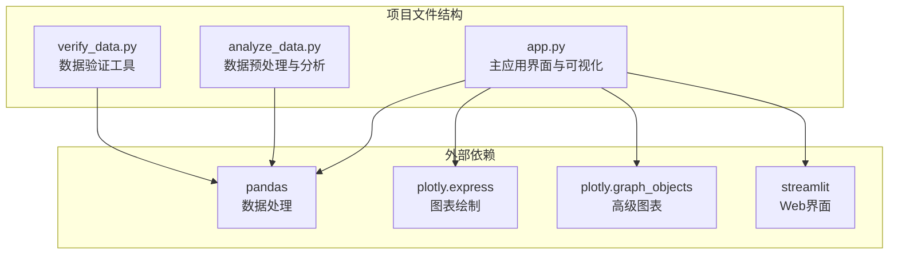
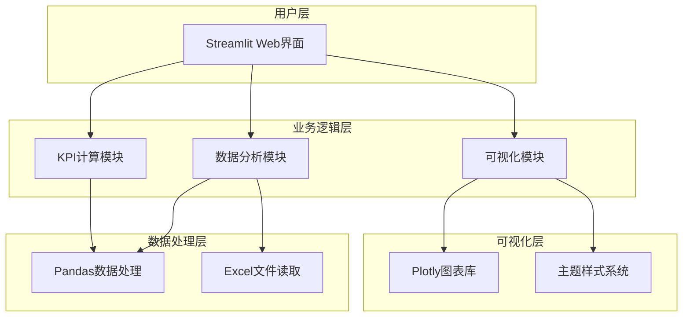
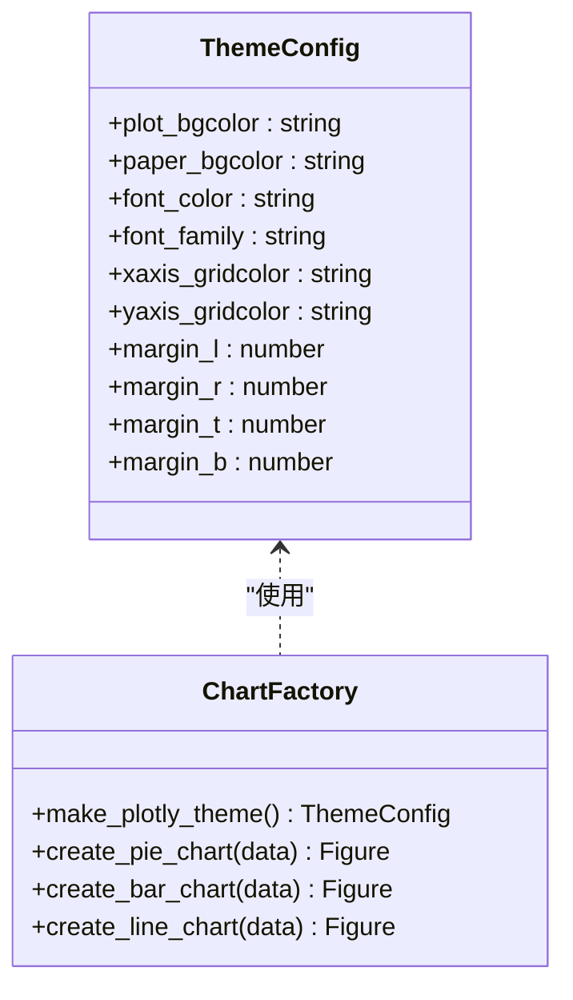
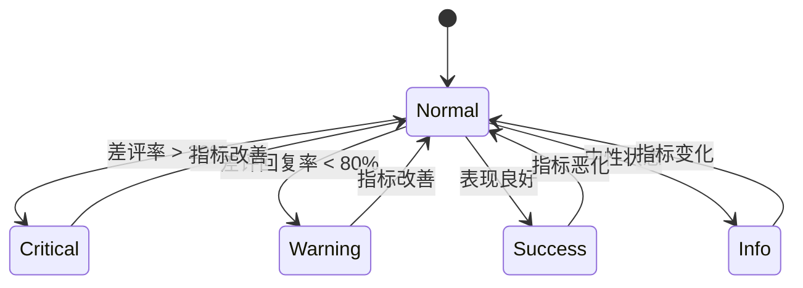
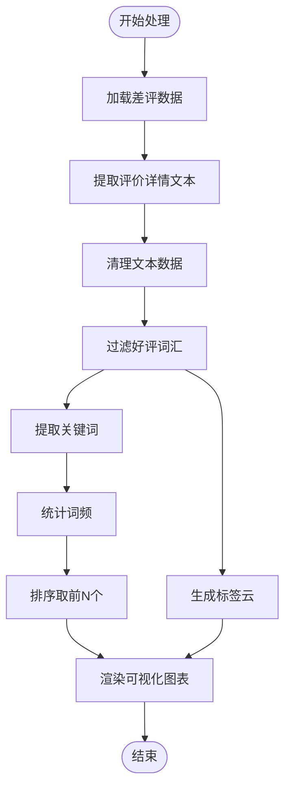
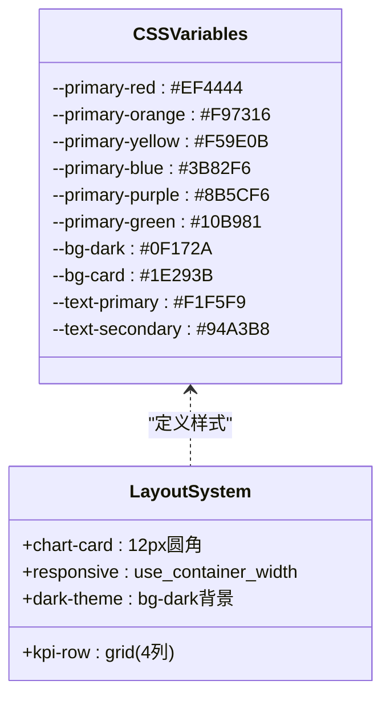
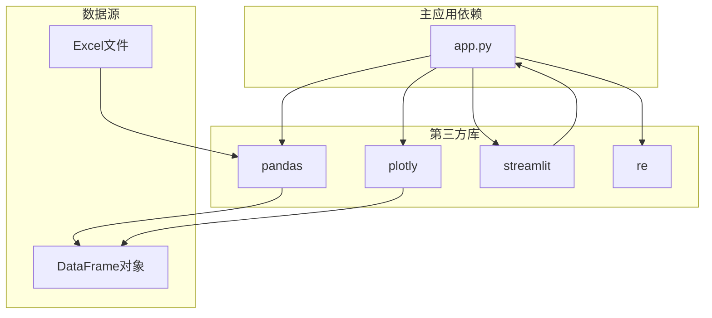

# 多维度可视化展示

<cite>
**本文档引用的文件**
- [analyze_data.py](file://analyze_data.py)
- [app.py](file://app.py)
- [verify_data.py](file://verify_data.py)
</cite>

## 目录
1. [简介](#简介)
2. [项目结构](#项目结构)
3. [核心组件](#核心组件)
4. [架构概览](#架构概览)
5. [详细组件分析](#详细组件分析)
6. [依赖分析](#依赖分析)
7. [性能考虑](#性能考虑)
8. [故障排除指南](#故障排除指南)
9. [结论](#结论)
10. [附录](#附录)

## 简介

餐饮差评运营分析看板是一个基于Python Streamlit框架构建的数据可视化分析系统。该系统专注于餐饮行业的差评数据分析，提供多维度的可视化展示功能，帮助运营人员快速识别问题、定位整改方向并提升门店服务质量。

本系统集成了多种图表类型，包括饼图用于评价等级分布展示、柱状图用于平台差评率对比、折线图用于时间趋势分析等。通过Plotly图表库的强大功能，实现了丰富的交互体验和美观的视觉效果。

## 项目结构

该项目采用简洁的三层架构设计，主要包含三个核心文件：

**图表来源**
- [app.py:1-10](file://app.py#L1-L10)
- [analyze_data.py:1-3](file://analyze_data.py#L1-L3)
- [verify_data.py:1-3](file://verify_data.py#L1-L3)

**章节来源**
- [app.py:1-10](file://app.py#L1-L10)
- [analyze_data.py:1-3](file://analyze_data.py#L1-L3)
- [verify_data.py:1-3](file://verify_data.py#L1-L3)

## 核心组件

### 主应用组件 (app.py)

主应用文件是整个系统的中枢，负责：
- 用户界面设计与交互
- 数据加载与预处理
- 可视化图表生成
- KPI指标计算与展示
- 响应式布局管理

### 数据分析组件 (analyze_data.py)

数据处理模块专注于：
- Excel数据读取与清洗
- 统计指标计算
- 分组分析与聚合
- 报告格式化输出

### 数据验证组件 (verify_data.py)

验证工具模块提供：
- 数据完整性检查
- 统计指标核对
- 异常数据检测

**章节来源**
- [app.py:1-10](file://app.py#L1-L10)
- [analyze_data.py:1-133](file://analyze_data.py#L1-L133)
- [verify_data.py:1-32](file://verify_data.py#L1-L32)

## 架构概览

系统采用模块化设计，通过清晰的职责分离实现高效的数据处理和可视化展示：

**图表来源**
- [app.py:1-10](file://app.py#L1-L10)
- [app.py:296-306](file://app.py#L296-L306)

## 详细组件分析

### Plotly图表库集成

#### 主题系统设计

系统实现了统一的主题配置系统，通过`make_plotly_theme()`函数提供一致的视觉风格：

**图表来源**
- [app.py:296-306](file://app.py#L296-L306)

#### 图表类型实现

系统实现了多种图表类型的统一配置模式：

**饼图配置示例**：
- 评价等级分布饼图使用了特定的颜色映射
- 支持环形图显示（hole参数）
- 自动添加图例和百分比标注

**柱状图配置示例**：
- 平台差评率对比使用连续颜色渐变
- 支持数值标注显示
- 自定义颜色方案从绿色到红色的渐变

**折线图配置示例**：
- 时间趋势分析使用点标记和填充效果
- 支持透明度填充到零轴
- 自适应容器宽度布局

**章节来源**
- [app.py:442-450](file://app.py#L442-L450)
- [app.py:456-480](file://app.py#L456-L480)
- [app.py:773-784](file://app.py#L773-L784)

### KPI指标卡片设计

#### 卡片状态系统

KPI卡片采用了状态驱动的颜色编码系统：

**图表来源**
- [app.py:406-426](file://app.py#L406-L426)
- [app.py:912-934](file://app.py#L912-L934)

#### 动态更新机制

KPI卡片通过以下方式实现动态更新：
- 实时计算当前筛选条件下的指标值
- 自动调整颜色状态以反映数据变化
- 提供趋势信息显示当前状态

**章节来源**
- [app.py:404-427](file://app.py#L404-L427)
- [app.py:911-934](file://app.py#L911-L934)

### 标签云与词云图生成

#### 文本处理流程

系统实现了完整的文本处理管道：

**图表来源**
- [app.py:654-677](file://app.py#L654-L677)
- [app.py:284-294](file://app.py#L284-L294)

#### 好评词汇过滤机制

系统内置了专门的好评词汇过滤列表，自动排除常见的正面评价词汇：

- 食物相关的正面词汇：味道好、好吃、美味、鲜美等
- 服务相关的正面词汇：态度好、服务好、热情、周到等  
- 环境相关的正面词汇：环境好、干净、整洁、舒适等
- 性价比相关的正面词汇：实惠、划算、性价比高等

**章节来源**
- [app.py:284-294](file://app.py#L284-L294)
- [app.py:654-677](file://app.py#L654-L677)

### 响应式布局实现

#### CSS变量主题系统

系统采用了现代CSS变量技术实现主题定制：

**图表来源**
- [app.py:10-31](file://app.py#L10-L31)
- [app.py:84-169](file://app.py#L84-L169)

#### 布局适配策略

- 使用CSS Grid实现KPI卡片的自适应网格布局
- 采用Flexbox实现标签云的弹性布局
- 通过Streamlit的列布局系统实现响应式图表排列
- 支持不同屏幕尺寸的自适应显示

**章节来源**
- [app.py:84-169](file://app.py#L84-L169)

## 依赖分析

### 外部依赖关系

**图表来源**
- [app.py:1-7](file://app.py#L1-L7)

### 内部模块依赖

系统内部模块之间的依赖关系相对简单，主要通过数据传递实现松耦合：

- 主应用模块负责协调各个功能模块
- 数据分析模块独立处理数据预处理
- 可视化模块专注于图表生成
- 验证模块提供数据质量检查

**章节来源**
- [app.py:1-7](file://app.py#L1-L7)

## 性能考虑

### 数据处理优化

1. **内存使用优化**：通过分步处理和及时释放不需要的数据来控制内存使用
2. **索引优化**：合理使用pandas的索引功能提高查询效率
3. **向量化操作**：充分利用pandas的向量化特性避免循环操作

### 图表渲染优化

1. **懒加载策略**：仅在需要时生成图表，减少初始加载时间
2. **缓存机制**：对重复使用的数据进行缓存
3. **分辨率适配**：根据容器大小动态调整图表分辨率

### 前端性能优化

1. **CSS变量缓存**：通过CSS变量减少样式计算开销
2. **响应式设计**：优化移动端显示性能
3. **按需加载**：只加载当前可见区域的图表

## 故障排除指南

### 常见问题及解决方案

#### 数据加载问题
- **问题**：Excel文件读取失败
- **原因**：文件格式不支持或列名不匹配
- **解决**：确保使用.xlsx或.xls格式，检查必需列是否存在

#### 图表显示异常
- **问题**：图表无法正常显示
- **原因**：数据为空或格式不正确
- **解决**：检查数据预处理步骤，确保数据完整性

#### 性能问题
- **问题**：页面加载缓慢
- **原因**：数据量过大或图表过多
- **解决**：增加数据筛选条件，优化图表配置

**章节来源**
- [app.py:1033-1036](file://app.py#L1033-L1036)

### 调试工具使用

系统提供了内置的数据验证功能，可以通过"数据验证"面板查看关键指标的计算结果，帮助快速定位问题。

**章节来源**
- [app.py:1011-1031](file://app.py#L1011-L1031)

## 结论

餐饮差评运营分析看板通过精心设计的多维度可视化展示，为餐饮行业的差评分析提供了强大的数据洞察能力。系统的主要优势包括：

1. **完整的分析流程**：从数据加载到可视化展示的一体化解决方案
2. **丰富的图表类型**：涵盖饼图、柱状图、折线图等多种可视化需求
3. **智能的数据处理**：自动过滤好评词汇，突出负面评价的关键信息
4. **响应式设计**：适配不同设备和屏幕尺寸的显示需求
5. **实时交互**：支持用户自定义筛选条件，实时更新分析结果

该系统不仅能够帮助运营人员快速识别差评问题，还能提供针对性的整改建议，形成从发现问题到解决问题的完整闭环。

## 附录

### 图表配置参数说明

#### Plotly主题配置参数
- `plot_bgcolor`: 图表背景色
- `paper_bgcolor`: 画布背景色  
- `font.color`: 字体颜色
- `font.family`: 字体族
- `xaxis.gridcolor`: X轴网格线颜色
- `yaxis.gridcolor`: Y轴网格线颜色
- `margin.l/r/t/b`: 边距设置

#### 颜色方案配置
- **差评**: #EF4444 (红色系)
- **中性**: #F59E0B (黄色系)  
- **好评**: #10B981 (绿色系)
- **平台对比**: 绿色到红色的渐变

### 最佳实践建议

1. **数据质量保证**：定期检查数据完整性，确保分析结果的准确性
2. **用户培训**：为运营人员提供系统使用培训，提高分析效率
3. **持续优化**：根据实际使用反馈不断优化图表配置和功能
4. **性能监控**：关注系统性能指标，及时发现和解决性能问题