# 实时数据分析功能

<cite>
**本文档引用的文件**
- [analyze_data.py](file://analyze_data.py)
- [app.py](file://app.py)
- [verify_data.py](file://verify_data.py)
</cite>

## 目录
1. [简介](#简介)
2. [项目结构](#项目结构)
3. [核心组件](#核心组件)
4. [架构概览](#架构概览)
5. [详细组件分析](#详细组件分析)
6. [依赖分析](#依赖分析)
7. [性能考虑](#性能考虑)
8. [故障排除指南](#故障排除指南)
9. [结论](#结论)
10. [附录](#附录)

## 简介

餐饮差评运营分析看板是一个基于Python的数据分析可视化系统，专门用于实时监控和分析餐饮企业的用户评价数据。该系统通过Streamlit构建交互式仪表板，提供全面的差评分析功能，包括差评率计算、回复率统计、评分分布分析和平台对比分析等核心功能。

本系统采用现代化的数据处理架构，结合Pandas进行数据清洗和统计分析，使用Plotly进行数据可视化，为餐饮企业提供数据驱动的运营决策支持。

## 项目结构

项目采用简洁的三层架构设计，每个模块都有明确的职责分工：

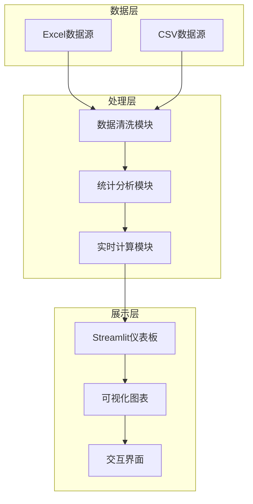

**图表来源**
- [app.py:1-1089](file://app.py#L1-L1089)
- [analyze_data.py:1-133](file://analyze_data.py#L1-L133)

**章节来源**
- [app.py:1-1089](file://app.py#L1-L1089)
- [analyze_data.py:1-133](file://analyze_data.py#L1-L133)

## 核心组件

### 数据处理引擎

系统的核心数据处理能力由三个主要组件构成：

1. **实时数据加载器** - 负责从Excel文件中读取和解析评价数据
2. **统计计算引擎** - 执行各种数据分析算法和指标计算
3. **可视化渲染器** - 将分析结果转换为交互式图表

### 差评分析模块

差评分析是系统的核心功能，包含以下关键算法：

- **差评率计算算法**：基于星级分阈值的差评识别和比率计算
- **回复率统计算法**：区分已回复和未回复评价的分类统计
- **评分分布分析**：多维度评分的统计分析和对比
- **平台对比分析**：跨平台差评数据的统一比较

**章节来源**
- [app.py:308-387](file://app.py#L308-L387)
- [analyze_data.py:13-133](file://analyze_data.py#L13-L133)

## 架构概览

系统采用事件驱动的实时数据处理架构，具有以下特点：

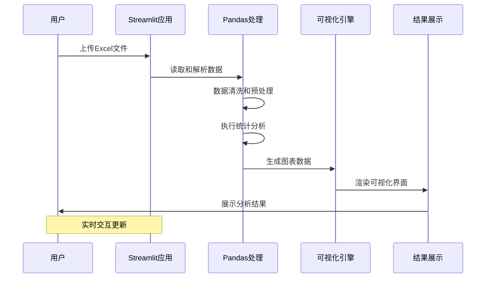

**图表来源**
- [app.py:328-363](file://app.py#L328-L363)
- [app.py:381-427](file://app.py#L381-L427)

### 数据流架构

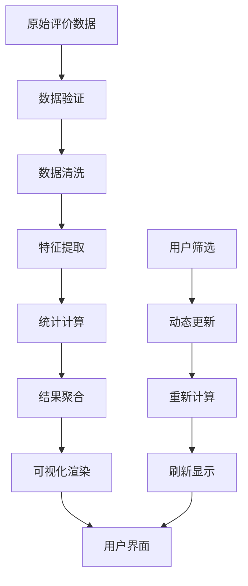

**图表来源**
- [app.py:339-363](file://app.py#L339-L363)
- [app.py:441-451](file://app.py#L441-L451)

## 详细组件分析

### 差评率计算算法

差评率计算是系统最核心的功能之一，采用严格的分级标准：

#### 算法实现逻辑

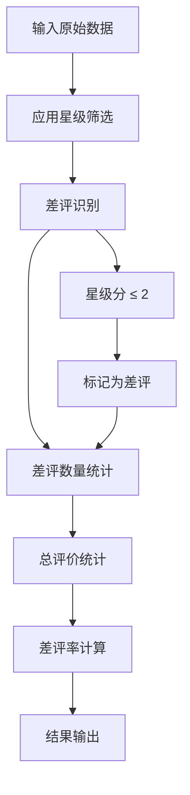

**图表来源**
- [app.py:365-383](file://app.py#L365-L383)

#### 计算公式详解

差评率计算采用以下数学公式：
```
差评率 = (差评数量 / 总评价数量) × 100%
```

其中差评定义为星级分小于等于2分的评价。

#### 实现细节

系统实现了三种级别的评价分类：
- **差评**：星级分 ≤ 2分
- **中性评价**：星级分 = 3分  
- **好评**：星级分 ≥ 4分

**章节来源**
- [app.py:365-383](file://app.py#L365-L383)
- [app.py:407-420](file://app.py#L407-L420)

### 回复率统计功能

回复率统计功能提供了多层次的回复情况分析：

#### 分类统计实现

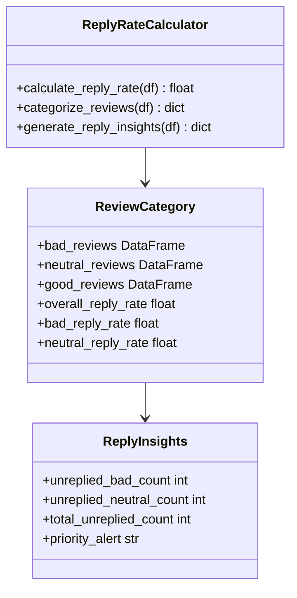

**图表来源**
- [app.py:308-313](file://app.py#L308-L313)
- [app.py:369-379](file://app.py#L369-L379)

#### 百分比计算方法

回复率采用以下计算方式：
```
回复率 = (已回复数量 / 总评价数量) × 100%
```

系统同时提供：
- 整体回复率：所有评价的回复情况
- 差评回复率：仅差评的回复情况
- 中性评价回复率：中性评价的回复情况

#### 不同星级评价的回复率对比

系统支持按星级分组的回复率对比分析，帮助识别不同质量层次评价的回复效率差异。

**章节来源**
- [app.py:378-379](file://app.py#L378-L379)
- [app.py:412-414](file://app.py#L412-L414)

### 评分分布分析功能

评分分布分析提供了多维度的评分统计能力：

#### 平均值计算算法

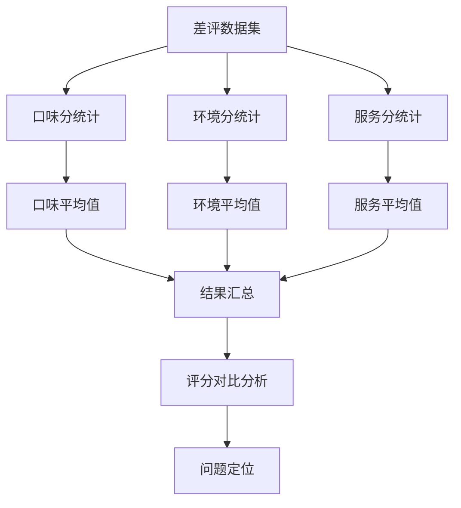

**图表来源**
- [app.py:393-396](file://app.py#L393-L396)

#### 统计指标实现

系统计算以下关键统计指标：
- **平均星级分**：差评的整体质量水平
- **平均口味分**：食物质量的客观评价
- **平均环境分**：就餐环境的满意度
- **平均服务分**：服务质量的综合评估

#### 星级分统计分布

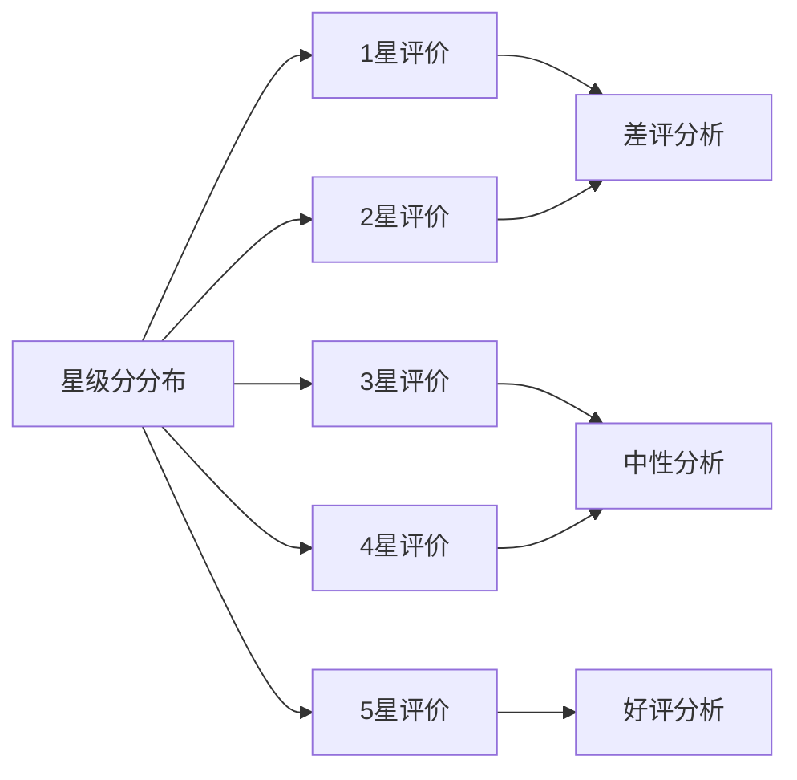

**图表来源**
- [app.py:494-509](file://app.py#L494-L509)

**章节来源**
- [app.py:515-539](file://app.py#L515-L539)
- [app.py:494-509](file://app.py#L494-L509)

### 平台差评率对比功能

平台对比分析帮助识别不同评价渠道的质量差异：

#### 平台数据处理流程

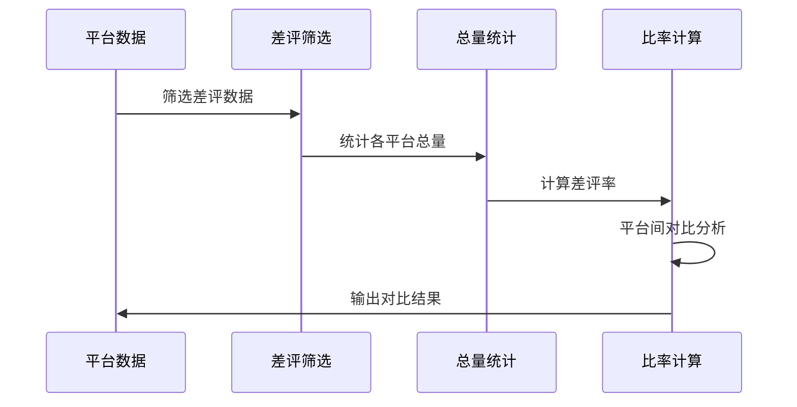

**图表来源**
- [app.py:385-387](file://app.py#L385-L387)

#### 对比分析实现

系统实现以下平台对比功能：
- **平台差评数量统计**：各平台差评的绝对数量
- **平台差评率计算**：各平台差评占该平台总评价的比例
- **平台间差异分析**：识别表现最优和最差的平台

#### 可视化展示

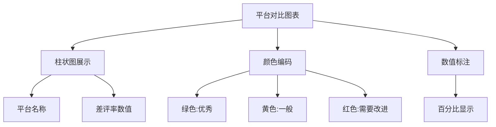

**图表来源**
- [app.py:455-480](file://app.py#L455-L480)

**章节来源**
- [app.py:455-480](file://app.py#L455-L480)
- [app.py:385-387](file://app.py#L385-L387)

### 实时数据处理机制

系统采用事件驱动的实时数据处理模式：

#### 数据更新流程

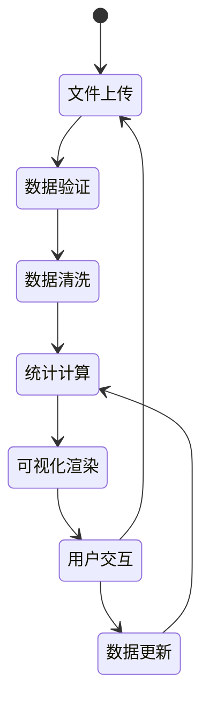

#### 动态筛选机制

系统支持实时筛选功能：
- **星级范围筛选**：用户可选择特定星级范围
- **动态数据更新**：筛选条件变化时自动更新所有指标
- **实时图表刷新**：所有可视化组件同步更新

**章节来源**
- [app.py:346-363](file://app.py#L346-L363)
- [app.py:351-353](file://app.py#L351-L353)

## 依赖分析

系统依赖关系清晰，模块间耦合度低：

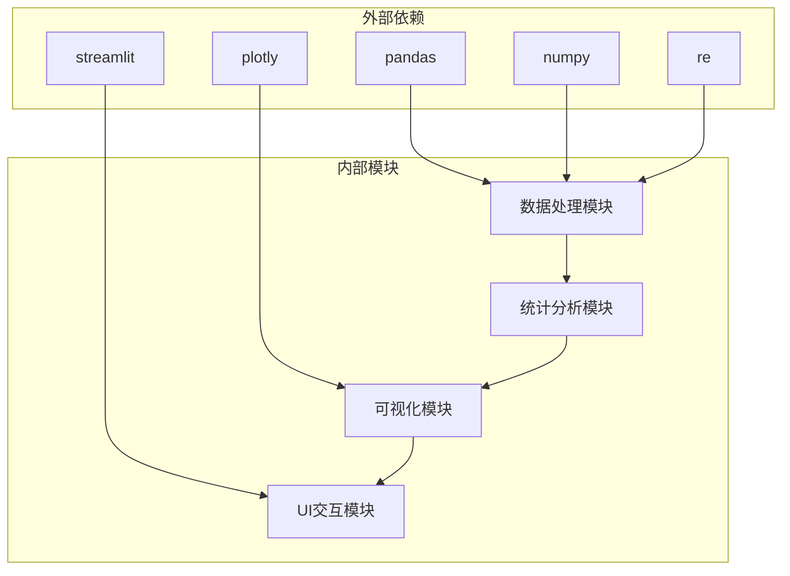

**图表来源**
- [app.py:1-7](file://app.py#L1-L7)

### 核心依赖说明

- **pandas**：数据处理和分析的核心库
- **streamlit**：构建交互式Web应用的框架
- **plotly**：高级数据可视化的图表库
- **numpy**：数值计算支持
- **re**：正则表达式处理

**章节来源**
- [app.py:1-7](file://app.py#L1-L7)

## 性能考虑

### 数据处理优化

系统在大数据量场景下的性能优化策略：

1. **内存使用优化**：采用分块处理和延迟计算
2. **计算效率提升**：使用向量化操作替代循环
3. **缓存机制**：对重复计算的结果进行缓存
4. **并行处理**：利用多核CPU进行并行计算

### 可扩展性设计

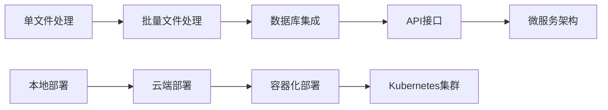

## 故障排除指南

### 常见问题及解决方案

#### 数据加载问题

**问题**：Excel文件无法正确读取
**解决方案**：
1. 检查文件格式是否为.xlsx或.xls
2. 确认文件路径正确
3. 验证文件完整性

#### 缺失字段问题

**问题**：缺少必要的数据字段
**解决方案**：
1. 确保数据包含以下必需字段：评价时间、评价ID、省份、城市、评价门店、星级分、口味分、环境分、服务分、回复状态
2. 检查字段名称是否正确
3. 验证数据类型

#### 性能问题

**问题**：大数据量处理缓慢
**解决方案**：
1. 分批处理大数据文件
2. 使用更高效的存储格式（如Parquet）
3. 考虑使用Dask进行分布式计算

**章节来源**
- [app.py:1033-1035](file://app.py#L1033-L1035)
- [app.py:335-337](file://app.py#L335-L337)

### 调试工具

系统内置了数据验证功能，帮助开发者快速定位问题：

#### 数据验证功能

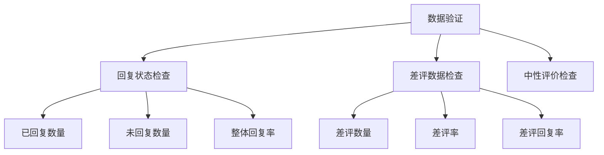

**图表来源**
- [verify_data.py:7-32](file://verify_data.py#L7-L32)

**章节来源**
- [verify_data.py:1-32](file://verify_data.py#L1-L32)

## 结论

餐饮差评运营分析看板系统通过精心设计的数据处理算法和直观的可视化界面，为企业提供了全面的差评分析解决方案。系统的主要优势包括：

1. **算法准确性**：基于严格的数据标准和精确的计算逻辑
2. **实时性**：支持动态数据更新和实时分析
3. **可视化丰富**：提供多种图表类型和交互功能
4. **可扩展性**：模块化设计便于功能扩展和维护

该系统能够帮助企业快速识别差评问题、定位整改方向、制定改进措施，最终实现差评率下降和服务质量提升的目标。

## 附录

### 开发者指南

#### 环境配置

```bash
pip install pandas streamlit plotly numpy openpyxl
```

#### 数据格式要求

系统期望的数据格式包含以下字段：
- 评价时间：datetime类型
- 评价ID：唯一标识符
- 省份：字符串类型
- 城市：字符串类型
- 评价门店：字符串类型
- 星级分：1-5的整数
- 口味分：0-5的浮点数
- 环境分：0-5的浮点数
- 服务分：0-5的浮点数
- 回复状态：已回复/未回复

#### 扩展开发建议

1. **增加更多分析维度**：如时间序列分析、聚类分析等
2. **集成机器学习算法**：用于预测差评风险和推荐改进措施
3. **添加自动化报告功能**：定期生成分析报告
4. **支持更多数据源**：如数据库、API接口等