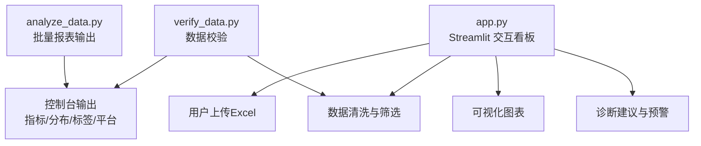
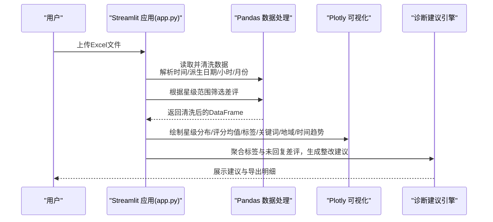
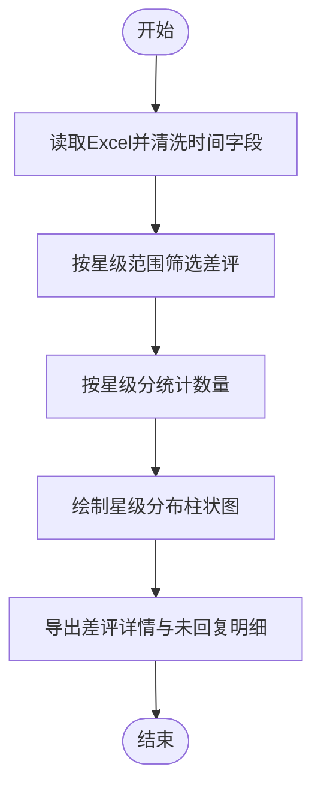
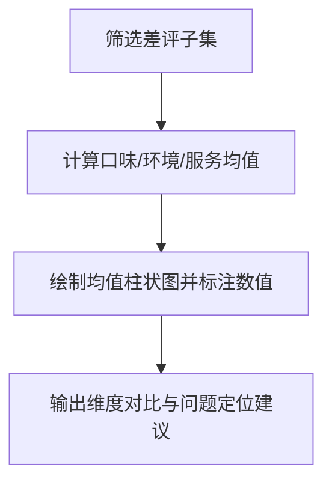
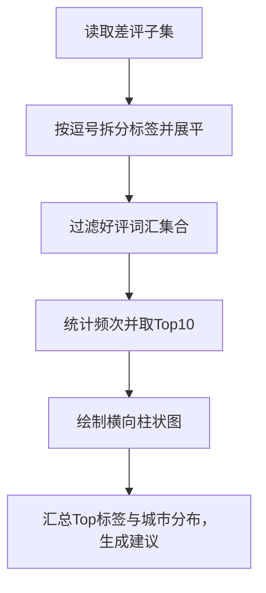
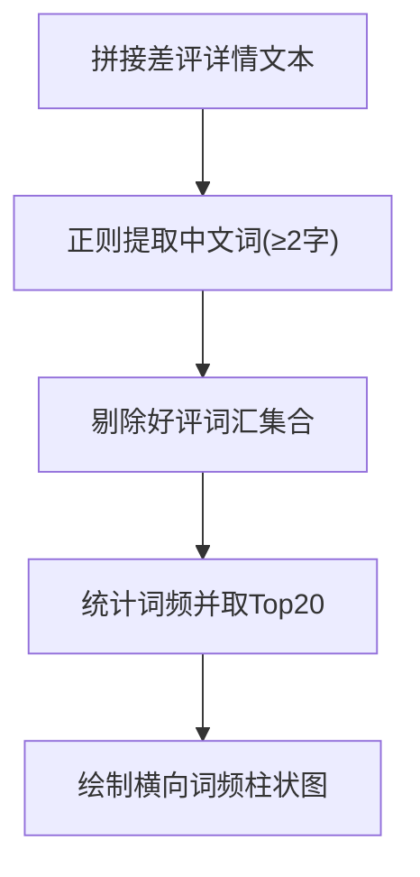
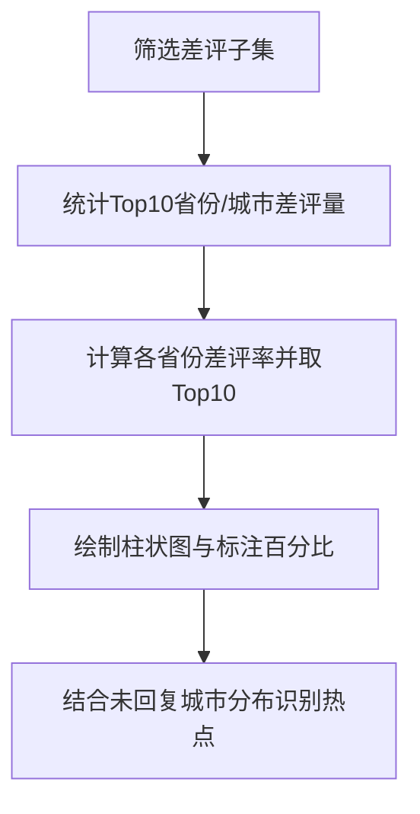
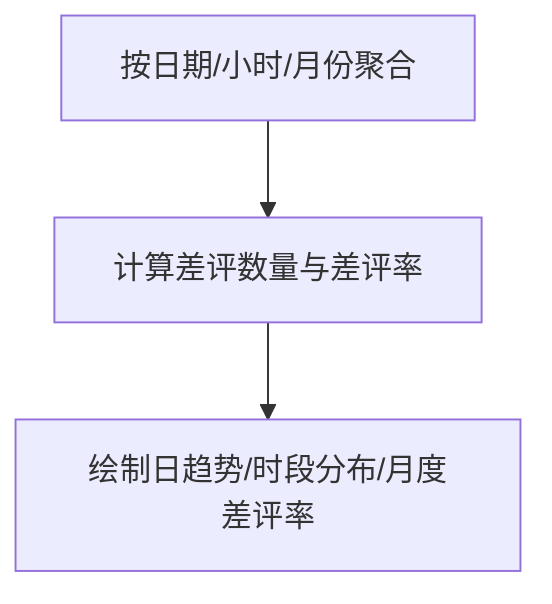
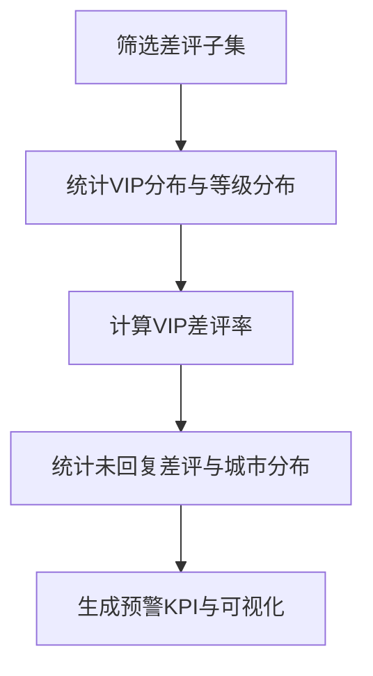
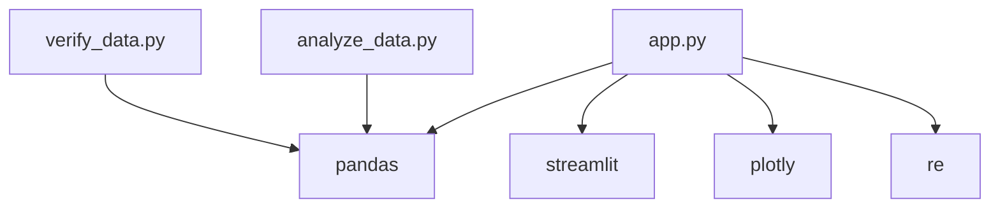

# 差评问题诊断分析

<cite>
**本文引用的文件**
- [analyze_data.py](file://analyze_data.py)
- [app.py](file://app.py)
- [verify_data.py](file://verify_data.py)
</cite>

## 目录
1. [简介](#简介)
2. [项目结构](#项目结构)
3. [核心组件](#核心组件)
4. [架构总览](#架构总览)
5. [详细组件分析](#详细组件分析)
6. [依赖分析](#依赖分析)
7. [性能考虑](#性能考虑)
8. [故障排查指南](#故障排查指南)
9. [结论](#结论)
10. [附录](#附录)

## 简介
本技术文档围绕“餐饮差评运营分析看板”的差评问题诊断分析功能展开，系统性阐述以下能力：
- 差评星级分布分析：星级分统计、分布可视化与异常星级识别
- 差评各项评分均值分析：口味分、环境分、服务分的平均值计算、维度对比与问题定位
- 差评标签分析：菜品标签、服务标签、环境标签的提取、过滤与统计分析，以及好评词汇过滤机制
- 关键词分析：评价详情文本处理、负面关键词提取、词频统计与重要性排序
- 地域分布分析：省份与城市的差评量统计、差评率计算与地理热点识别
- 文本挖掘算法说明、正则表达式使用与数据分析最佳实践

该看板基于 Streamlit 构建交互式仪表盘，结合 Pandas、Plotly 实现数据清洗、聚合与可视化，帮助运营人员快速定位问题、制定整改策略并形成闭环管理。

## 项目结构
仓库包含三个核心脚本：
- analyze_data.py：批量报表输出，涵盖基础指标、评分分布、地域分布、时间趋势、用户分析、投诉分析与标签分析等
- app.py：交互式看板，提供筛选、可视化、诊断建议与导出能力
- verify_data.py：数据校验脚本，用于快速核对回复状态与差评率等关键指标

**图表来源**
- [app.py:326-363](file://app.py#L326-L363)
- [analyze_data.py:13-133](file://analyze_data.py#L13-L133)
- [verify_data.py:1-32](file://verify_data.py#L1-L32)

**章节来源**
- [analyze_data.py:1-133](file://analyze_data.py#L1-L133)
- [app.py:1-1089](file://app.py#L1-L1089)
- [verify_data.py:1-32](file://verify_data.py#L1-L32)

## 核心组件
- 数据加载与清洗
  - 从 Excel 加载评价数据，解析时间字段，派生日期、小时、月份等维度
  - 校验必要列是否存在，缺失时报错并停止运行
- 差评筛选与分层
  - 将评价按星级分为差评（≤2）、中性（3）、好评（≥4），并分别统计回复状态
- KPI 计算
  - 差评率、差评回复率、差评平均星级、差评门店覆盖数、平台差评率等
- 可视化模块
  - 评价等级分布饼图、平台差评率柱状图、星级分布直方图、各项评分均值柱状图、标签与关键词热力图、地域分布与时间趋势图
- 诊断与建议
  - 基于标签与未回复差评的城市分布生成智能整改建议
- 数据校验
  - verify_data.py 快速核对回复状态与差评率，辅助确认数据质量

**章节来源**
- [app.py:326-363](file://app.py#L326-L363)
- [app.py:365-396](file://app.py#L365-L396)
- [app.py:404-427](file://app.py#L404-L427)
- [app.py:494-539](file://app.py#L494-L539)
- [app.py:556-643](file://app.py#L556-L643)
- [app.py:652-679](file://app.py#L652-L679)
- [app.py:692-758](file://app.py#L692-L758)
- [app.py:771-828](file://app.py#L771-L828)
- [app.py:966-998](file://app.py#L966-L998)
- [verify_data.py:1-32](file://verify_data.py#L1-L32)

## 架构总览
下图展示从数据上传到诊断建议的端到端流程，包括数据清洗、筛选、聚合与可视化。

**图表来源**
- [app.py:326-363](file://app.py#L326-L363)
- [app.py:494-539](file://app.py#L494-L539)
- [app.py:556-679](file://app.py#L556-L679)
- [app.py:692-828](file://app.py#L692-L828)
- [app.py:966-998](file://app.py#L966-L998)

## 详细组件分析

### 差评星级分布分析
- 统计逻辑
  - 对差评子集按星级分进行计数并排序，得到星级分布
- 可视化
  - 使用 Plotly 绘制星级分布柱状图，颜色随数值递增呈现从低到高的警示色阶
- 异常识别
  - 结合阈值与趋势图识别异常波动；当某星级占比显著偏离历史水平或与其他星级差距过大时，触发异常提示
- 输出与导出
  - 支持查看差评详情与未回复差评明细，便于进一步核查

**图表来源**
- [app.py:326-363](file://app.py#L326-L363)
- [app.py:494-511](file://app.py#L494-L511)
- [app.py:1000-1010](file://app.py#L1000-L1010)

**章节来源**
- [app.py:494-511](file://app.py#L494-L511)
- [app.py:1000-1010](file://app.py#L1000-L1010)

### 差评各项评分均值分析
- 计算逻辑
  - 在差评子集中计算口味分、环境分、服务分的均值，作为问题定位依据
- 可视化
  - 使用柱状图展示三项维度的均值，标注具体数值，便于横向对比
- 问题定位
  - 均值显著偏低的维度即为高风险领域，结合标签与关键词进一步深挖原因

**图表来源**
- [app.py:390-396](file://app.py#L390-L396)
- [app.py:515-539](file://app.py#L515-L539)

**章节来源**
- [app.py:390-396](file://app.py#L390-L396)
- [app.py:515-539](file://app.py#L515-L539)

### 差评标签分析（菜品/服务/环境）
- 数据预处理
  - 将多标签字段按逗号拆分并展平，去除空值
- 过滤机制
  - 定义“好评词汇集合”，在差评标签中剔除这些正面词汇，仅保留负面标签
- 统计与可视化
  - 分别统计菜品、服务、环境三类标签的出现频次，绘制横向柱状图，颜色随频次递增
- 诊断建议
  - 汇总前三高频负面标签，结合未回复差评城市分布，生成整改建议

**图表来源**
- [app.py:561-564](file://app.py#L561-L564)
- [app.py:589-593](file://app.py#L589-L593)
- [app.py:619-622](file://app.py#L619-L622)
- [app.py:966-998](file://app.py#L966-L998)

**章节来源**
- [app.py:284-294](file://app.py#L284-L294)
- [app.py:315-317](file://app.py#L315-L317)
- [app.py:561-564](file://app.py#L561-L564)
- [app.py:589-593](file://app.py#L589-L593)
- [app.py:619-622](file://app.py#L619-L622)
- [app.py:966-998](file://app.py#L966-L998)

### 关键词分析（评价详情文本）
- 文本处理
  - 从差评详情拼接文本，使用正则提取连续中文字符（长度≥2）
- 过滤与统计
  - 剔除“好评词汇集合”，统计剩余词语的词频，取前20名
- 可视化与排序
  - 绘制横向词频柱状图，按频次降序排列，突出高频负面词

**图表来源**
- [app.py:654-656](file://app.py#L654-L656)
- [app.py:658-674](file://app.py#L658-L674)
- [app.py:284-294](file://app.py#L284-L294)

**章节来源**
- [app.py:654-674](file://app.py#L654-L674)
- [app.py:284-294](file://app.py#L284-L294)

### 地域分布分析（省份/城市）
- 统计逻辑
  - 计算差评量Top10省份与Top10城市；计算各省份差评率并取Top10
- 可视化
  - 省份/城市采用纵向/横向柱状图，差评率采用颜色映射，标注百分比
- 热点识别
  - 差评率与差评量双维度识别高风险区域，结合未回复差评城市分布进行优先级排序

**图表来源**
- [app.py:693-708](file://app.py#L693-L708)
- [app.py:714-729](file://app.py#L714-L729)
- [app.py:734-757](file://app.py#L734-L757)
- [app.py:938-956](file://app.py#L938-L956)

**章节来源**
- [app.py:693-757](file://app.py#L693-L757)
- [app.py:938-956](file://app.py#L938-L956)

### 时间趋势分析
- 日趋势
  - 按评价日期统计差评数量，绘制折线图并填充至零轴
- 时段分布
  - 按小时统计差评数量，标注峰值时段
- 月度差评率
  - 计算月度差评率并绘制趋势线，辅助识别季节性波动

**图表来源**
- [app.py:771-785](file://app.py#L771-L785)
- [app.py:790-804](file://app.py#L790-L804)
- [app.py:812-828](file://app.py#L812-L828)

**章节来源**
- [app.py:771-828](file://app.py#L771-L828)

### 用户画像与未回复预警
- 用户画像
  - 差评用户VIP分布与等级分布，对比VIP与普通用户的差评率
- 未回复预警
  - 统计未回复差评数量与城市分布，生成KPI卡片与可视化，提示优先处理

**图表来源**
- [app.py:842-853](file://app.py#L842-L853)
- [app.py:858-873](file://app.py#L858-L873)
- [app.py:877-899](file://app.py#L877-L899)
- [app.py:909-956](file://app.py#L909-L956)

**章节来源**
- [app.py:842-899](file://app.py#L842-L899)
- [app.py:909-956](file://app.py#L909-L956)

### 批量报表与数据校验
- analyze_data.py
  - 输出核心指标概览、评分分布、地域分布、时间趋势、用户分析、投诉分析与标签分析
- verify_data.py
  - 快速核对回复状态与差评率，辅助确认数据质量

**章节来源**
- [analyze_data.py:13-133](file://analyze_data.py#L13-L133)
- [verify_data.py:1-32](file://verify_data.py#L1-L32)

## 依赖分析
- 外部库
  - pandas：数据读取、清洗、分组聚合、统计
  - streamlit：构建交互式看板
  - plotly：绘制各类图表
  - re：正则表达式提取中文词
- 内部依赖
  - app.py 依赖 verify_data.py 的数据校验思路与 analyze_data.py 的指标口径
- 潜在耦合
  - 好评词汇集合定义集中于 app.py，若后续扩展为配置文件，可降低耦合度
  - 可视化主题统一由 make_plotly_theme 提供，便于维护一致性

**图表来源**
- [app.py:1-7](file://app.py#L1-L7)
- [verify_data.py:1](file://verify_data.py#L1)
- [analyze_data.py:1](file://analyze_data.py#L1)

**章节来源**
- [app.py:1-7](file://app.py#L1-L7)
- [verify_data.py:1](file://verify_data.py#L1)
- [analyze_data.py:1](file://analyze_data.py#L1)

## 性能考虑
- 数据规模
  - 当数据量较大时，建议分批读取或使用索引优化（如按日期/小时建立索引）
- 计算复杂度
  - 标签拆分与词频统计为 O(n) 级别，注意内存占用；可限制 Top N 与缓存中间结果
- 可视化渲染
  - 大数据量时减少一次性渲染的图表数量，或采用交互式缩放与分页展示
- 正则效率
  - 中文词提取正则应保持简洁，避免回溯；必要时预编译正则对象

[本节为通用性能建议，不直接分析特定文件]

## 故障排查指南
- 文件格式与列缺失
  - 若上传文件缺少必要列，应用会提示缺失列并停止执行；请确保包含评价时间、评价ID、省份、城市、评价门店、星级分、口味分、环境分、服务分、回复状态等
- 时间解析失败
  - 当评价时间存在异常值时，应用会丢弃无法解析的时间记录；请检查原始数据的时间格式
- 无数据可显示
  - 当筛选后差评为空时，应用会提示调整星级范围；请适当放宽筛选条件
- 数据校验
  - 使用 verify_data.py 快速核对回复状态与差评率，确认数据完整性与一致性

**章节来源**
- [app.py:332-338](file://app.py#L332-L338)
- [app.py:339-341](file://app.py#L339-L341)
- [app.py:359-362](file://app.py#L359-L362)
- [verify_data.py:7-18](file://verify_data.py#L7-L18)

## 结论
本看板通过“数据清洗—筛选—聚合—可视化—诊断建议”闭环，实现了对差评问题的快速定位与整改指导。差评星级分布、各项评分均值、标签与关键词分析、地域分布与时间趋势共同构成多维诊断体系，配合未回复预警与智能建议，帮助运营团队聚焦高风险点、制定针对性整改措施并持续跟踪效果。

[本节为总结性内容，不直接分析特定文件]

## 附录
- 数据字段说明（来自 app.py 的列校验与使用）
  - 评价时间、评价ID、省份、城市、评价门店、星级分、口味分、环境分、服务分、回复状态、平台、是否vip、用户等级、菜品标签、服务标签、环境标签、评价详情
- 好评词汇集合（用于标签与关键词过滤）
  - 包含“味道好”“好吃”“美味”“态度好”“服务好”“出餐快”“环境好”“干净”“整洁”“实惠”“性价比高”“份量足”“新鲜”“推荐”等
- 诊断建议模板
  - 基于Top标签与Top城市分布生成，结合差评率与回复率阈值给出整改建议

**章节来源**
- [app.py:332-338](file://app.py#L332-L338)
- [app.py:284-294](file://app.py#L284-L294)
- [app.py:966-998](file://app.py#L966-L998)