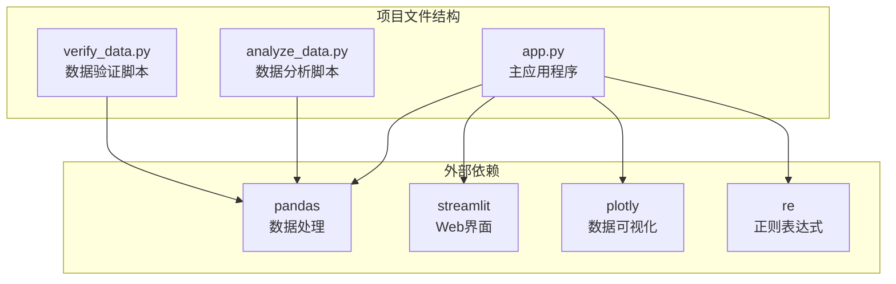
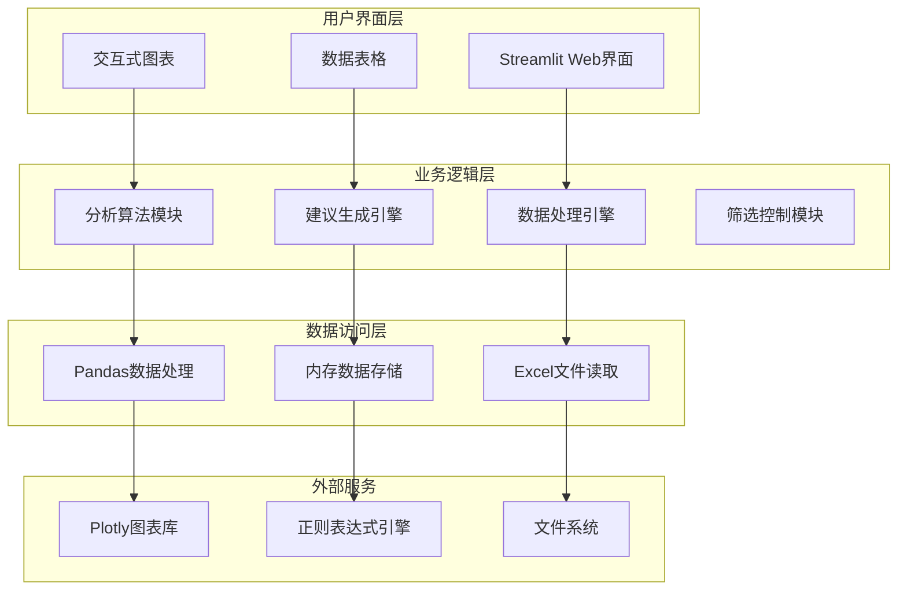
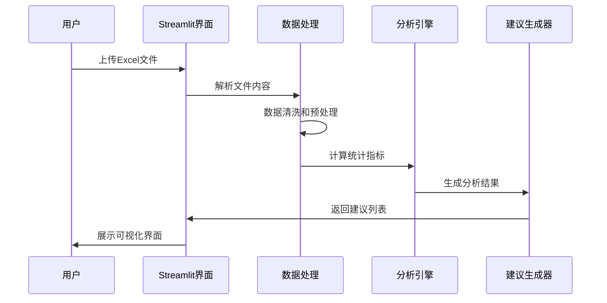
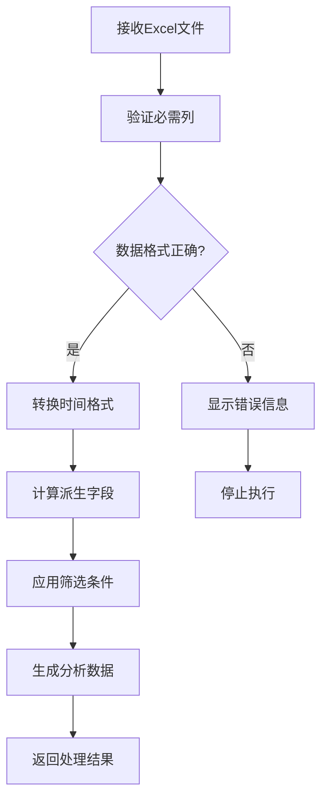
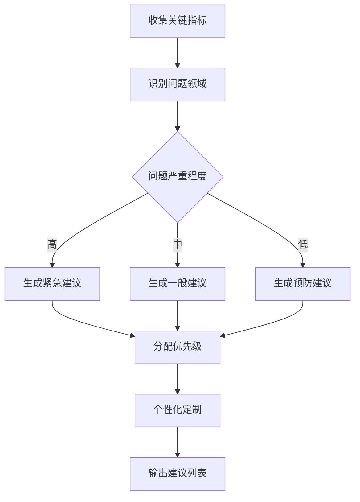
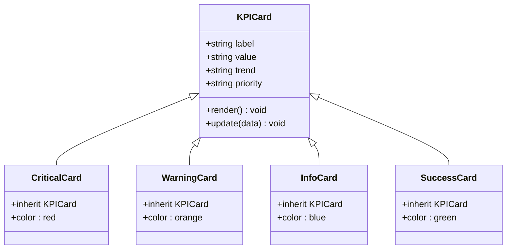
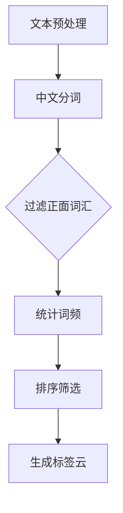
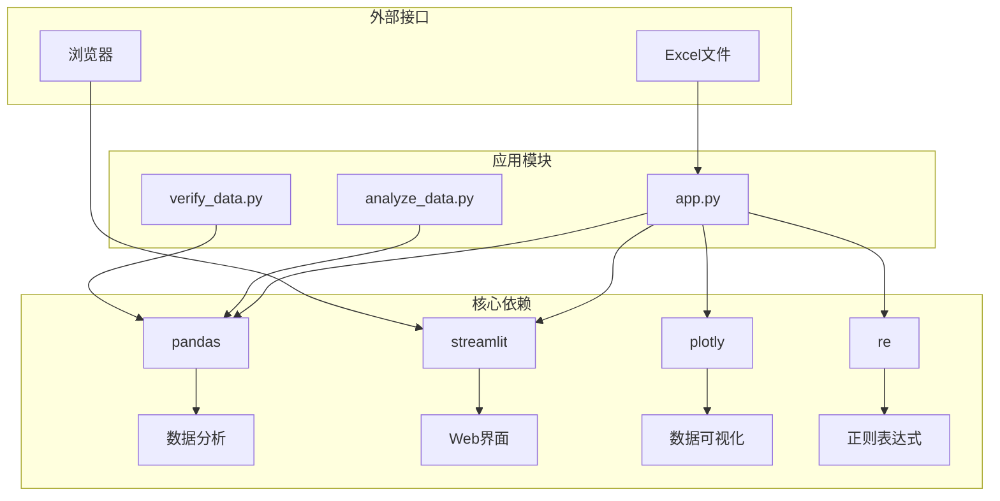

# 智能整改建议生成功能

<cite>
**本文档引用的文件**
- [analyze_data.py](file://analyze_data.py)
- [app.py](file://app.py)
- [verify_data.py](file://verify_data.py)
</cite>

## 目录
1. [简介](#简介)
2. [项目结构](#项目结构)
3. [核心组件](#核心组件)
4. [架构概览](#架构概览)
5. [详细组件分析](#详细组件分析)
6. [依赖关系分析](#依赖关系分析)
7. [性能考虑](#性能考虑)
8. [故障排除指南](#故障排除指南)
9. [结论](#结论)

## 简介

餐饮差评运营分析看板是一个基于Python开发的数据分析和可视化系统，专门用于分析餐饮行业的差评数据并生成智能整改建议。该系统通过Streamlit构建了直观的Web界面，能够实时分析评价数据、识别问题模式，并提供针对性的运营改进建议。

系统的核心功能包括：
- 差评数据的多维度分析
- 实时可视化展示
- 基于关键词的智能建议生成
- 地域和时间趋势分析
- 未回复差评预警机制

## 项目结构

该项目采用简洁的三层架构设计，主要由三个核心文件组成：



**图表来源**
- [app.py:1-10](file://app.py#L1-L10)
- [analyze_data.py:1-3](file://analyze_data.py#L1-L3)
- [verify_data.py:1-3](file://verify_data.py#L1-L3)

**章节来源**
- [app.py:1-10](file://app.py#L1-L10)
- [analyze_data.py:1-3](file://analyze_data.py#L1-L3)
- [verify_data.py:1-3](file://verify_data.py#L1-L3)

## 核心组件

### 主应用程序 (app.py)

主应用程序是整个系统的中枢，负责数据处理、可视化展示和智能建议生成。其核心功能包括：

#### 数据处理模块
- Excel文件上传和解析
- 数据清洗和预处理
- 统计指标计算
- 筛选条件应用

#### 可视化模块
- 多维度数据图表
- 实时交互式仪表板
- KPI指标卡片
- 动态图表渲染

#### 建议生成模块
- 关键词驱动的建议模板
- 问题导向的解决方案
- 多维度分类体系
- 个性化定制能力

**章节来源**
- [app.py:328-384](file://app.py#L328-L384)
- [app.py:966-998](file://app.py#L966-L998)

### 数据分析脚本 (analyze_data.py)

独立的数据分析脚本提供了批量分析功能，适用于大规模数据集的离线处理。

#### 分析功能
- 核心指标概览
- 评分分布分析
- 地域分布统计
- 时间趋势分析
- 用户行为分析
- 投诉情况统计
- 平台对比分析

**章节来源**
- [analyze_data.py:13-133](file://analyze_data.py#L13-L133)

### 数据验证脚本 (verify_data.py)

数据验证脚本专注于数据质量检查和基本统计分析。

#### 验证功能
- 回复状态分布检查
- 差评率计算
- 整体回复率统计
- 数据完整性验证

**章节来源**
- [verify_data.py:7-32](file://verify_data.py#L7-L32)

## 架构概览

系统采用模块化架构设计，各组件职责明确，耦合度低，便于维护和扩展。



**图表来源**
- [app.py:1-10](file://app.py#L1-L10)
- [app.py:328-384](file://app.py#L328-L384)
- [app.py:966-998](file://app.py#L966-L998)

### 数据流架构



**图表来源**
- [app.py:328-384](file://app.py#L328-L384)
- [app.py:966-998](file://app.py#L966-L998)

## 详细组件分析

### 数据处理引擎

数据处理引擎是系统的核心，负责从原始数据中提取有价值的信息。

#### 关键功能实现



**图表来源**
- [app.py:328-384](file://app.py#L328-L384)

#### 数据处理流程

系统采用渐进式数据处理策略，确保每个步骤都有明确的输入输出：

1. **文件验证阶段**：检查必需列的存在性和完整性
2. **格式转换阶段**：统一时间格式，创建派生字段
3. **筛选应用阶段**：根据用户选择的星级范围进行数据过滤
4. **指标计算阶段**：计算各种统计指标和比率

**章节来源**
- [app.py:328-384](file://app.py#L328-L384)

### 建议生成引擎

建议生成引擎是系统最核心的功能模块，负责将分析结果转化为可执行的整改建议。

#### 建议生成算法



**图表来源**
- [app.py:966-998](file://app.py#L966-L998)

#### 建议分类体系

系统采用多维度的建议分类体系：

| 分类维度 | 子类别 | 描述 | 优先级 |
|---------|--------|------|--------|
| 菜品质量 | 口味问题 | 菜品味道不佳 | 高 |
| 菜品质量 | 新鲜度 | 食材不新鲜 | 高 |
| 菜品质量 | 分量问题 | 份量不足或过多 | 中 |
| 服务质量 | 态度问题 | 服务员态度差 | 高 |
| 服务质量 | 响应速度 | 上菜慢、响应慢 | 中 |
| 服务质量 | 专业性 | 服务技能不足 | 中 |
| 环境设施 | 卫生状况 | 餐厅卫生差 | 高 |
| 环境设施 | 设备故障 | 设施损坏 | 中 |
| 环境设施 | 空间布局 | 空间拥挤 | 中 |
| 运营管理 | 回复时效 | 差评回复不及时 | 高 |
| 运营管理 | 流程管理 | 服务流程混乱 | 中 |
| 运营管理 | 员工培训 | 培训不到位 | 中 |

**章节来源**
- [app.py:966-998](file://app.py#L966-L998)

### 可视化组件

系统提供了丰富的可视化组件，帮助用户更好地理解数据分析结果。

#### KPI指标卡片



**图表来源**
- [app.py:406-426](file://app.py#L406-L426)

#### 图表组件

系统使用Plotly构建了多种类型的图表：

1. **饼图**：评价等级分布、VIP用户分布
2. **柱状图**：平台对比、标签分析、地域分布
3. **折线图**：时间趋势分析
4. **热力图**：评分矩阵

**章节来源**
- [app.py:442-539](file://app.py#L442-L539)
- [app.py:566-677](file://app.py#L566-L677)

### 关键词分析模块

关键词分析模块是智能建议生成的基础，通过自然语言处理技术识别差评中的关键问题。

#### 正面词汇过滤

系统内置了一套正面词汇词典，用于过滤掉正常的积极评价词汇：

```python
POSITIVE_WORDS = {
    '味道好', '好吃', '美味', '香', '可口', '鲜美', '回味无穷', '赞', '满意',
    '态度好', '服务好', '热情', '周到', '贴心', '细心', '耐心', '专业', '快速',
    '出餐快', '上菜快', '响应快',
    '环境好', '干净', '整洁', '优雅', '舒适', '温馨', '宽敞', '明亮',
    '实惠', '划算', '性价比高', '便宜',
    '份量足', '量大', '足量',
    '新鲜', '卫生',
    '赠送菜', '送菜',
    '推荐', '值得', '再来'
}
```

**章节来源**
- [app.py:284-294](file://app.py#L284-L294)

#### 关键词提取算法



**图表来源**
- [app.py:654-677](file://app.py#L654-L677)

## 依赖关系分析

系统采用松耦合的设计，各模块之间的依赖关系清晰明确。



**图表来源**
- [app.py:1-7](file://app.py#L1-L7)
- [analyze_data.py:1](file://analyze_data.py#L1)
- [verify_data.py:1](file://verify_data.py#L1)

### 模块间通信

系统采用事件驱动的通信方式，主要通过以下机制实现模块间协作：

1. **数据传递**：通过Pandas DataFrame在模块间传递数据
2. **回调函数**：使用Streamlit的回调机制处理用户交互
3. **全局变量**：通过Streamlit的session state管理状态
4. **函数调用**：直接函数调用实现模块内功能

**章节来源**
- [app.py:328-384](file://app.py#L328-L384)

## 性能考虑

系统在设计时充分考虑了性能优化，采用了多种策略来确保良好的用户体验。

### 内存管理

- **延迟加载**：只在需要时才加载和处理数据
- **数据类型优化**：合理设置数据类型减少内存占用
- **垃圾回收**：及时释放不再使用的数据对象

### 计算优化

- **向量化操作**：大量使用Pandas的向量化操作提高计算效率
- **缓存机制**：对重复计算的结果进行缓存
- **并行处理**：利用多核CPU进行并行计算

### 界面优化

- **懒加载图表**：只有在用户切换到相应标签页时才渲染图表
- **虚拟滚动**：大数据表格使用虚拟滚动技术
- **增量更新**：只更新发生变化的部分界面元素

## 故障排除指南

### 常见问题及解决方案

#### 文件上传问题

**问题描述**：用户无法上传Excel文件

**可能原因**：
1. 文件格式不支持
2. 文件损坏
3. 文件过大

**解决方案**：
1. 确保文件格式为.xlsx或.xls
2. 检查文件完整性
3. 减小文件大小或分批上传

#### 数据解析错误

**问题描述**：系统提示缺少必要列

**解决步骤**：
1. 检查Excel文件是否包含必需列
2. 确认列名拼写正确
3. 验证数据格式一致性

#### 性能问题

**问题描述**：界面响应缓慢

**优化建议**：
1. 减少同时显示的图表数量
2. 使用更精确的筛选条件
3. 清理浏览器缓存

**章节来源**
- [app.py:1033-1036](file://app.py#L1033-L1036)

### 调试工具

系统提供了内置的调试功能：

1. **数据验证面板**：显示详细的统计数据
2. **错误日志**：记录系统运行时的异常信息
3. **性能监控**：显示数据处理的时间消耗

**章节来源**
- [app.py:1011-1031](file://app.py#L1011-L1031)

## 结论

餐饮差评运营分析看板是一个功能完整、架构清晰的数据分析系统。通过模块化的组件设计和智能化的建议生成算法，系统能够有效地帮助餐饮企业识别问题、制定整改方案并持续改进服务质量。

### 系统优势

1. **用户友好**：基于Streamlit的直观界面设计
2. **功能全面**：涵盖数据分析、可视化和建议生成
3. **扩展性强**：模块化设计便于功能扩展
4. **性能优良**：优化的数据处理和渲染机制

### 发展建议

1. **机器学习集成**：可以引入更高级的NLP算法进行情感分析
2. **实时数据处理**：支持实时数据流处理
3. **移动端适配**：优化移动端用户体验
4. **多语言支持**：扩展国际化功能

该系统为餐饮行业的数字化转型提供了有力的技术支撑，通过数据驱动的方式帮助企业提升服务质量，降低差评率，最终实现可持续发展。