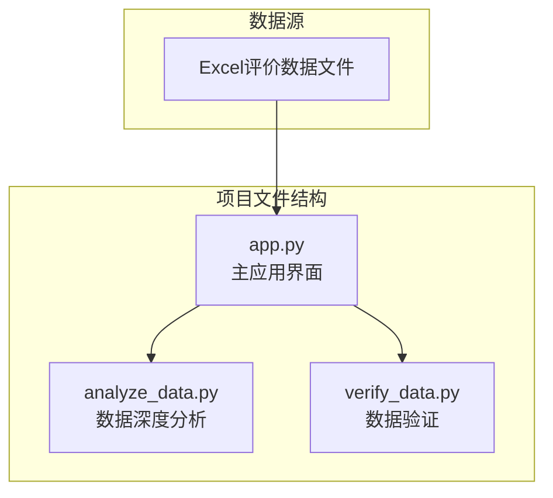
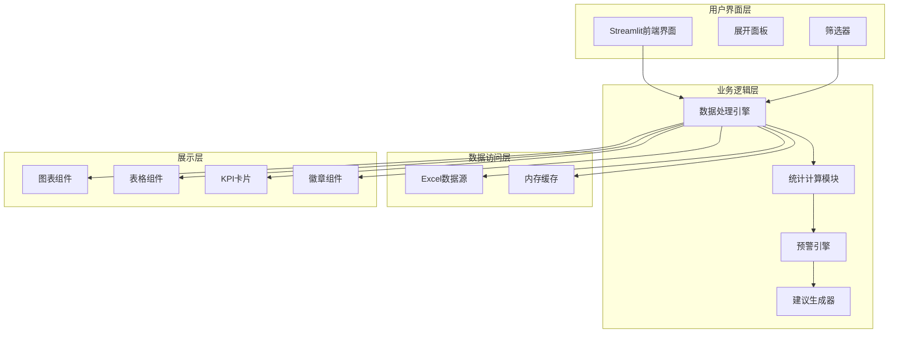
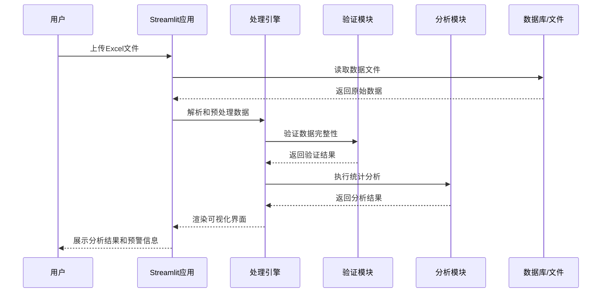
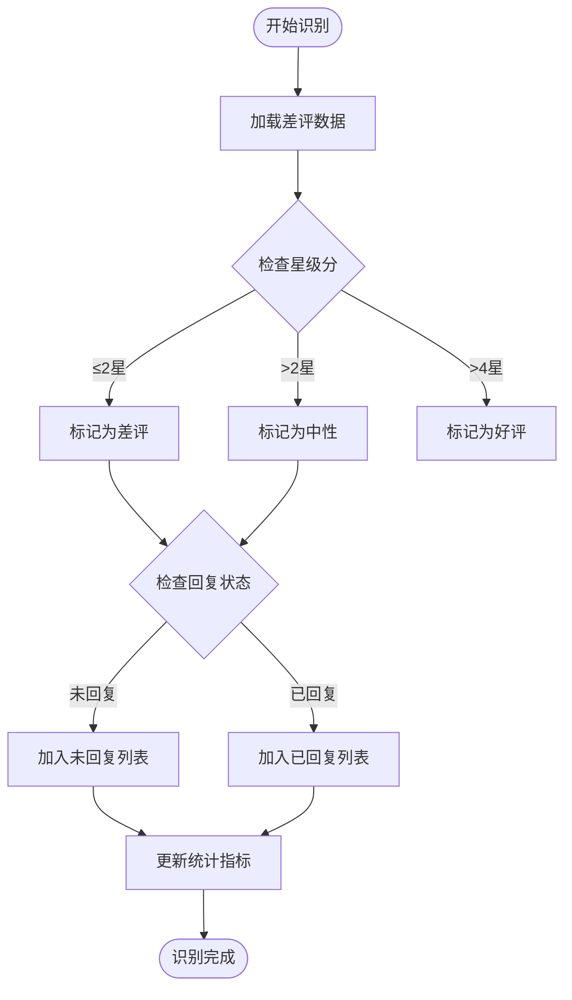
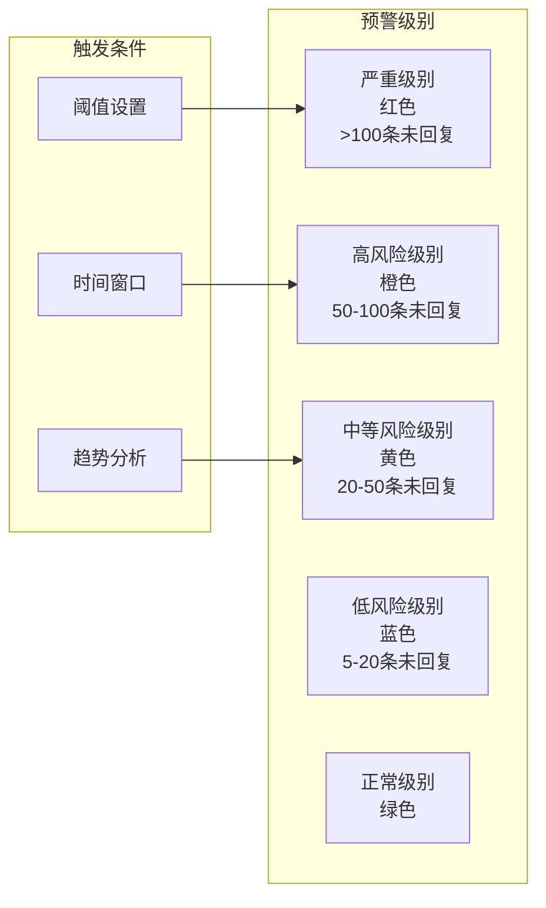
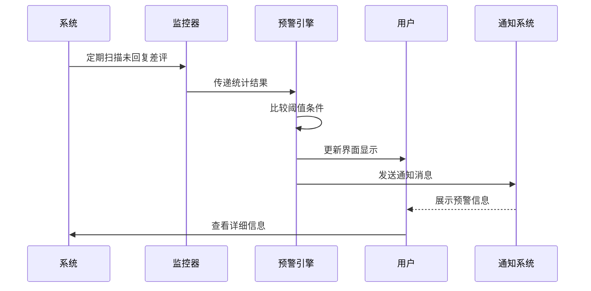
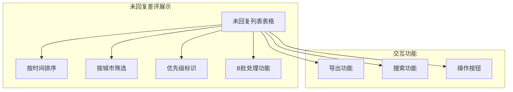
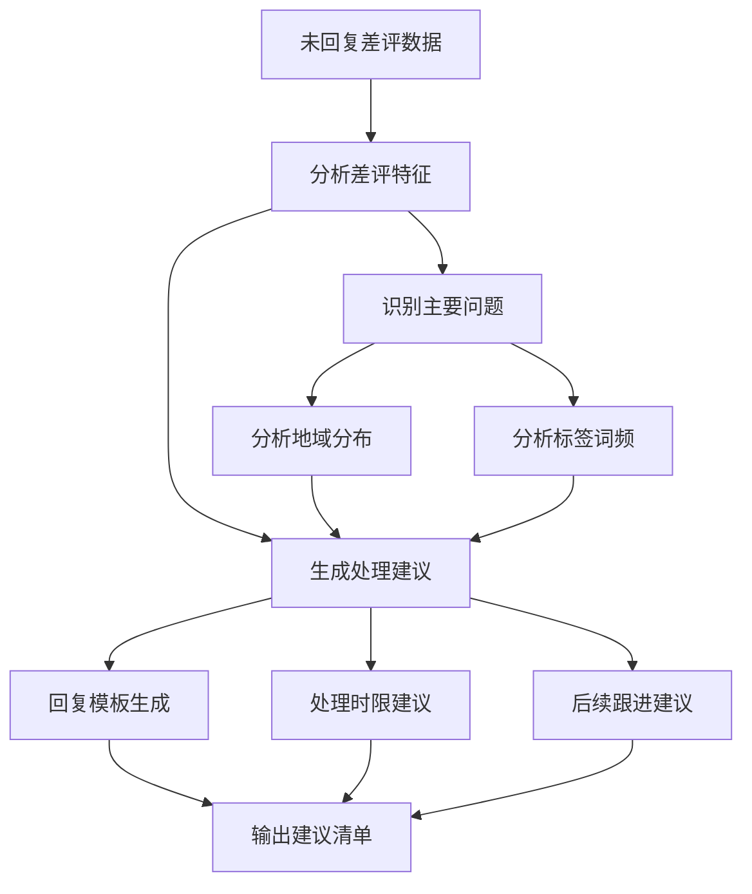
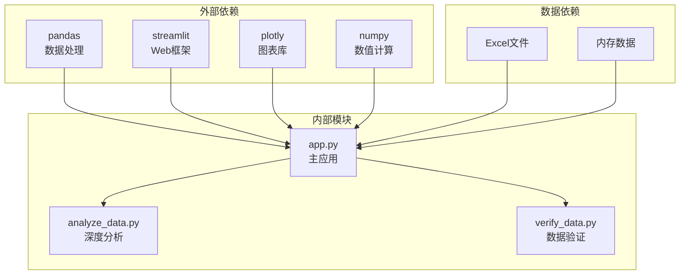

# 未回复差评预警系统

<cite>
**本文档引用的文件**
- [analyze_data.py](file://analyze_data.py)
- [app.py](file://app.py)
- [verify_data.py](file://verify_data.py)
</cite>

## 目录
1. [简介](#简介)
2. [项目结构](#项目结构)
3. [核心组件](#核心组件)
4. [架构概览](#架构概览)
5. [详细组件分析](#详细组件分析)
6. [依赖关系分析](#依赖关系分析)
7. [性能考虑](#性能考虑)
8. [故障排除指南](#故障排除指南)
9. [结论](#结论)
10. [附录](#附录)

## 简介

未回复差评预警系统是一个基于Streamlit构建的餐饮差评运营分析看板，专注于识别和监控未回复的差评情况。该系统通过数据分析和可视化展示，帮助餐饮企业及时发现和处理未回复的差评，从而提升客户满意度和服务质量。

系统的核心功能包括：
- 未回复差评的自动识别和统计
- 差评回复状态的实时监控
- 可视化的未回复差评展示
- 基于阈值的预警机制
- 批量处理和处理建议

## 项目结构

该项目采用简洁的三层架构设计，主要包含三个核心文件：

**图表来源**
- [app.py:1-1089](file://app.py#L1-L1089)
- [analyze_data.py:1-133](file://analyze_data.py#L1-L133)
- [verify_data.py:1-32](file://verify_data.py#L1-L32)

**章节来源**
- [app.py:1-1089](file://app.py#L1-L1089)
- [analyze_data.py:1-133](file://analyze_data.py#L1-L133)
- [verify_data.py:1-32](file://verify_data.py#L1-L32)

## 核心组件

### 主应用界面组件

主应用界面使用Streamlit框架构建，提供了完整的用户交互体验：

- **文件上传模块**：支持Excel格式的数据文件上传
- **实时数据处理**：动态计算各类指标和统计数据
- **可视化图表**：多种图表类型展示分析结果
- **预警展示模块**：专门的未回复差评预警区域
- **操作面板**：提供数据导出和验证功能

### 数据分析组件

数据分析模块负责核心的统计计算和业务逻辑：

- **回复状态判断**：基于"回复状态"字段进行差评分类
- **未回复数量统计**：实时统计未回复差评的数量
- **阈值计算**：根据业务需求设置预警阈值
- **趋势分析**：提供时间维度的趋势分析

### 可视化组件

系统集成了多种可视化技术：

- **Plotly图表**：用于复杂的统计图表展示
- **Streamlit组件**：用于基础的表格和表单展示
- **颜色编码系统**：基于严重程度的颜色标识
- **响应式布局**：适配不同屏幕尺寸的显示

**章节来源**
- [app.py:326-1089](file://app.py#L326-L1089)
- [analyze_data.py:1-133](file://analyze_data.py#L1-L133)
- [verify_data.py:1-32](file://verify_data.py#L1-L32)

## 架构概览

系统采用事件驱动的架构模式，主要由以下几个层次组成：

**图表来源**
- [app.py:326-1089](file://app.py#L326-L1089)
- [analyze_data.py:1-133](file://analyze_data.py#L1-L133)

### 数据流架构

系统的数据流遵循从输入到输出的完整路径：

**图表来源**
- [app.py:326-1089](file://app.py#L326-L1089)

## 详细组件分析

### 未回复差评识别逻辑

系统通过精确的逻辑判断来识别未回复的差评：

#### 基础识别规则

**图表来源**
- [app.py:365-379](file://app.py#L365-L379)

#### 统计指标计算

系统实时计算多个关键指标：

| 指标名称 | 计算公式 | 用途 |
|---------|---------|------|
| 差评率 | 差评数量 / 总评价数 × 100% | 衡量整体服务质量 |
| 差评回复率 | 差评已回复数量 / 差评总数 × 100% | 评估响应效率 |
| 未回复差评数 | 差评中回复状态为"未回复"的数量 | 直接反映处理缺口 |
| 整体未回复数 | 所有评价中回复状态为"未回复"的数量 | 综合处理水平 |

**章节来源**
- [app.py:365-379](file://app.py#L365-L379)
- [app.py:909-934](file://app.py#L909-L934)

### 预警触发机制

系统实现了多层次的预警机制，基于不同的严重程度和业务场景：

#### 预警级别定义

**图表来源**
- [app.py:912-934](file://app.py#L912-L934)

#### 预警条件配置

系统支持灵活的预警条件配置：

- **数量阈值**：基于未回复差评数量的绝对阈值
- **比例阈值**：基于未回复差评占总差评比例的阈值
- **时间阈值**：基于评价产生时间的时效性阈值
- **地域阈值**：基于特定地区的异常集中度

#### 自动提醒功能

**图表来源**
- [app.py:909-957](file://app.py#L909-L957)

**章节来源**
- [app.py:909-957](file://app.py#L909-L957)

### 可视化展示系统

系统提供了丰富的可视化展示功能：

#### 未回复差评列表

**图表来源**
- [app.py:1005-1010](file://app.py#L1005-L1010)

#### KPI卡片设计

系统使用颜色编码的KPI卡片来直观展示关键指标：

- **红色卡片**：严重问题指标（如未回复差评数）
- **橙色卡片**：高风险指标（如差评回复率低）
- **蓝色卡片**：中等风险指标（如中性评价未回复数）
- **绿色卡片**：正常指标（如整体回复率）

**章节来源**
- [app.py:912-934](file://app.py#L912-L934)
- [app.py:1005-1010](file://app.py#L1005-L1010)

### 预警处理建议

系统不仅识别问题，还提供智能化的处理建议：

#### 建议生成算法

**图表来源**
- [app.py:966-998](file://app.py#L966-L998)

#### 处理流程指导

系统提供标准化的处理流程：

1. **快速响应**：对紧急未回复差评进行优先处理
2. **分类处理**：根据问题类型分配相应处理人员
3. **模板回复**：使用标准化回复模板提高效率
4. **效果跟踪**：监控处理后的客户反馈变化

**章节来源**
- [app.py:966-998](file://app.py#L966-L998)

### 系统配置选项

系统支持多种配置选项来满足不同业务需求：

#### 阈值设置配置

| 配置项 | 默认值 | 可调范围 | 用途 |
|--------|--------|----------|------|
| 未回复差评数量阈值 | 5条 | 1-100条 | 控制预警触发时机 |
| 差评回复率阈值 | 80% | 50%-100% | 衡量响应效率 |
| 时间窗口设置 | 24小时 | 1-72小时 | 控制统计的时间范围 |
| 地域权重系数 | 1.0 | 0.5-2.0 | 调整特定地区的敏感度 |

#### 通知方式配置

- **界面提醒**：实时在界面上显示预警信息
- **颜色变化**：通过颜色变化提示严重程度
- **徽章显示**：在相关模块显示未处理数量
- **邮件通知**：可扩展的邮件通知功能

#### 处理时限管理

系统支持灵活的处理时限设置：

- **紧急处理**：1小时内必须响应
- **常规处理**：24小时内处理
- **一般处理**：72小时内处理
- **跟踪处理**：超时自动升级处理级别

**章节来源**
- [app.py:912-934](file://app.py#L912-L934)

## 依赖关系分析

系统采用松耦合的设计，各组件之间的依赖关系清晰明确：

**图表来源**
- [app.py:1-1089](file://app.py#L1-L1089)

### 组件耦合度分析

系统设计遵循了低耦合高内聚的原则：

- **应用层与数据层分离**：通过清晰的接口进行数据交换
- **功能模块独立**：每个功能模块都有明确的职责边界
- **配置与逻辑分离**：通过配置文件管理可变参数
- **UI与业务逻辑分离**：界面展示与业务逻辑相互独立

**章节来源**
- [app.py:1-1089](file://app.py#L1-L1089)

## 性能考虑

系统在设计时充分考虑了性能优化：

### 数据处理优化

- **延迟加载**：只在需要时加载和处理数据
- **缓存机制**：对计算结果进行缓存避免重复计算
- **向量化操作**：使用pandas的向量化操作提高处理速度
- **内存管理**：合理控制内存使用避免溢出

### 用户体验优化

- **异步处理**：大数据量处理时提供进度反馈
- **增量更新**：只更新发生变化的部分界面
- **响应式设计**：适配不同设备的显示效果
- **错误处理**：提供友好的错误提示和恢复机制

## 故障排除指南

### 常见问题及解决方案

#### 数据上传问题

**问题描述**：文件上传失败或数据无法解析

**可能原因**：
- Excel文件格式不正确
- 缺少必要的列名
- 数据格式不符合要求

**解决步骤**：
1. 检查Excel文件是否为.xlsx或.xls格式
2. 确认文件包含必需的列：评价时间、评价ID、省份、城市、评价门店、星级分、口味分、环境分、服务分、回复状态
3. 验证数据格式是否正确，特别是日期和数值格式

#### 数据分析错误

**问题描述**：分析结果异常或计算错误

**可能原因**：
- 数据质量问题
- 缺失值处理不当
- 异常值影响统计结果

**解决步骤**：
1. 使用数据验证功能检查数据完整性
2. 检查是否有异常值或缺失值
3. 验证回复状态字段的格式一致性

#### 界面显示问题

**问题描述**：图表显示异常或界面布局错乱

**可能原因**：
- 浏览器兼容性问题
- 屏幕分辨率适配问题
- 样式冲突

**解决步骤**：
1. 尝试刷新页面重新加载
2. 检查浏览器版本是否过旧
3. 调整浏览器缩放比例
4. 清除浏览器缓存后重试

**章节来源**
- [app.py:1033-1036](file://app.py#L1033-L1036)
- [verify_data.py:7-18](file://verify_data.py#L7-L18)

## 结论

未回复差评预警系统是一个功能完善、设计合理的数据分析工具。系统通过以下特点实现了高效的差评管理：

### 核心优势

1. **实时监控**：能够实时识别和跟踪未回复的差评
2. **智能预警**：基于多维度阈值的智能预警机制
3. **可视化展示**：直观的图表和列表展示分析结果
4. **自动化处理**：提供标准化的处理建议和模板
5. **灵活配置**：支持多种阈值和配置选项

### 技术特色

- 采用Streamlit框架构建现代化的Web界面
- 集成多种图表库提供丰富的可视化效果
- 实现了完整的数据处理和分析流程
- 设计了完善的错误处理和用户引导机制

### 应用价值

该系统能够帮助餐饮企业：
- 及时发现和处理未回复的差评
- 提升客户满意度和忠诚度
- 建立持续改进的服务质量管理体系
- 降低客户流失和品牌风险

## 附录

### 集成指南

#### 系统集成步骤

1. **环境准备**：确保Python环境满足依赖要求
2. **文件部署**：将三个Python文件部署到同一目录
3. **数据准备**：准备符合要求的Excel评价数据文件
4. **启动应用**：运行Streamlit应用启动界面
5. **数据上传**：通过界面上传Excel文件
6. **结果查看**：查看分析结果和预警信息

#### 自定义扩展方法

**添加新的预警规则**：
1. 在预警引擎中添加新的阈值条件
2. 更新颜色编码映射
3. 添加相应的处理建议

**扩展数据源**：
1. 修改数据读取函数支持新的文件格式
2. 更新字段映射关系
3. 添加相应的数据验证逻辑

**定制界面样式**：
1. 修改CSS样式定义
2. 更新颜色主题配置
3. 调整布局和组件样式

### 最佳实践

- **定期维护**：定期更新预警阈值以适应业务变化
- **数据质量**：确保评价数据的准确性和完整性
- **团队培训**：对相关人员进行系统使用培训
- **效果跟踪**：建立处理效果的跟踪和评估机制