# 核心功能详解

<cite>
**本文档引用的文件**
- [analyze_data.py](file://analyze_data.py)
- [app.py](file://app.py)
- [verify_data.py](file://verify_data.py)
</cite>

## 目录
1. [简介](#简介)
2. [项目结构](#项目结构)
3. [核心组件](#核心组件)
4. [架构概览](#架构概览)
5. [详细组件分析](#详细组件分析)
6. [依赖关系分析](#依赖关系分析)
7. [性能考虑](#性能考虑)
8. [故障排除指南](#故障排除指南)
9. [结论](#结论)

## 简介

餐饮差评运营分析看板是一个基于Python的数据分析和可视化系统，专门用于餐饮行业的差评数据分析和运营优化。该系统通过实时数据处理、多维度可视化展示、智能诊断分析和预警机制，帮助餐饮企业精准定位差评问题，制定有效的整改策略。

系统采用Streamlit框架构建交互式Web界面，结合Pandas进行数据处理，Plotly进行图表可视化，实现了从数据导入到深度分析的完整流程。

## 项目结构

该项目采用简洁的三层架构设计：

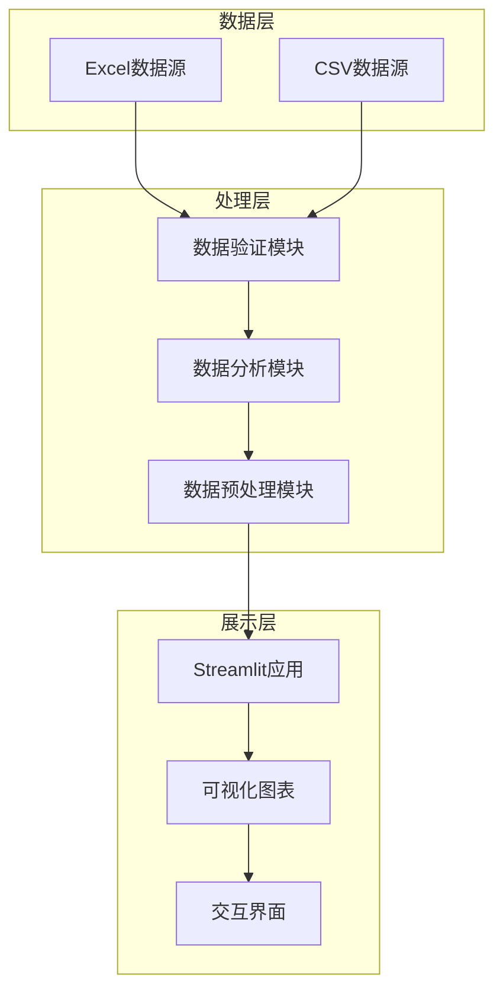

**图表来源**
- [app.py:1-1089](file://app.py#L1-L1089)
- [analyze_data.py:1-133](file://analyze_data.py#L1-L133)
- [verify_data.py:1-32](file://verify_data.py#L1-L32)

**章节来源**
- [app.py:1-1089](file://app.py#L1-L1089)
- [analyze_data.py:1-133](file://analyze_data.py#L1-L133)
- [verify_data.py:1-32](file://verify_data.py#L1-L32)

## 核心组件

### 1. 实时数据分析引擎

系统的核心数据分析功能由三个主要模块组成：

#### 数据验证模块
负责检查上传数据的完整性和有效性，确保后续分析的准确性。

#### 数据处理模块  
对原始数据进行清洗、转换和聚合，生成各类分析指标。

#### 可视化展示模块
将分析结果以直观的图表形式呈现，支持多种图表类型的动态展示。

**章节来源**
- [app.py:328-363](file://app.py#L328-L363)
- [verify_data.py:1-32](file://verify_data.py#L1-L32)

### 2. 多维度可视化系统

系统集成了多种图表类型，每种图表都有其特定的分析用途：

#### 基础图表类型
- **饼图**: 展示评价等级分布、VIP用户分布等比例关系
- **柱状图**: 对比不同维度的数值差异，如平台差评率对比
- **折线图**: 展示时间序列趋势，如每日差评数量趋势

#### 高级可视化功能
- **热力图**: 展示差评率的空间分布
- **散点图**: 分析变量间的相关性
- **仪表盘**: 实时显示关键指标状态

**章节来源**
- [app.py:442-450](file://app.py#L442-L450)
- [app.py:456-479](file://app.py#L456-L479)
- [app.py:495-509](file://app.py#L495-L509)

### 3. 智能诊断分析引擎

系统具备自动化的诊断能力，能够：
- 识别差评的主要问题领域
- 提取关键词和标签中的负面信息
- 分析地域分布特征
- 生成个性化的整改建议

**章节来源**
- [app.py:562-583](file://app.py#L562-L583)
- [app.py:654-677](file://app.py#L654-L677)
- [app.py:966-998](file://app.py#L966-L998)

## 架构概览

系统采用模块化设计，各组件职责明确，耦合度低：

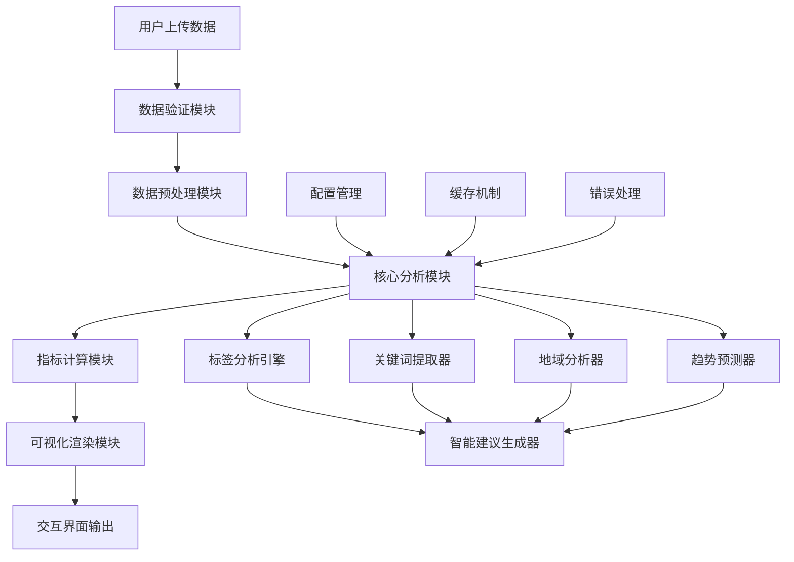

**图表来源**
- [app.py:308-313](file://app.py#L308-L313)
- [app.py:315-317](file://app.py#L315-L317)
- [app.py:284-294](file://app.py#L284-L294)

## 详细组件分析

### 实时数据分析功能

#### 差评率计算逻辑

差评率是衡量餐厅服务质量的核心指标，系统通过以下步骤计算：

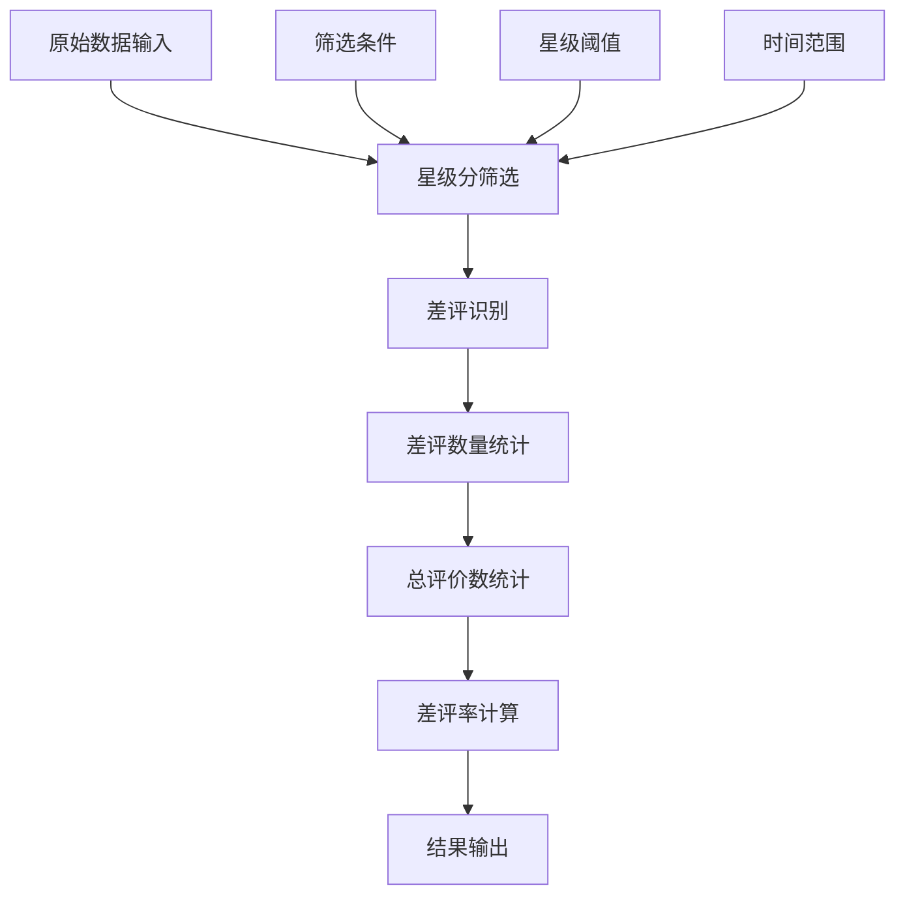

**图表来源**
- [app.py:365-383](file://app.py#L365-L383)

差评率的计算公式：差评率 = 差评数量 ÷ 总评价数量 × 100%

系统支持动态筛选，用户可以通过星级范围滑块调整分析范围，实时查看不同星级区间的差评率变化。

**章节来源**
- [app.py:350-363](file://app.py#L350-L363)
- [app.py:381-383](file://app.py#L381-L383)

#### 回复率统计机制

系统提供多层次的回复率统计：

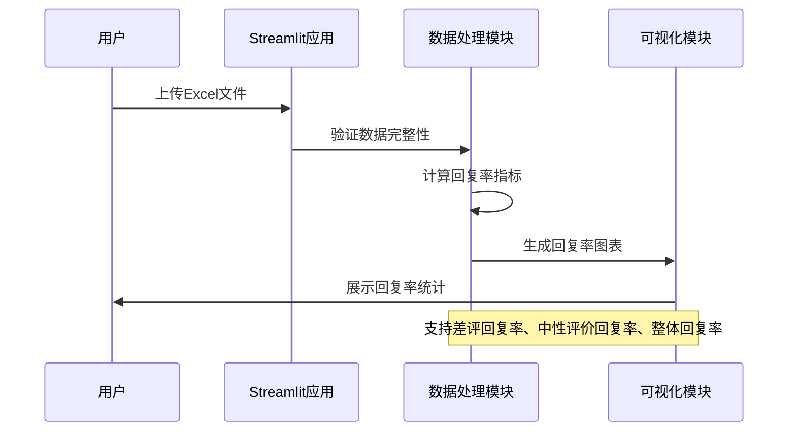

**图表来源**
- [app.py:308-313](file://app.py#L308-L313)
- [app.py:369-379](file://app.py#L369-L379)

回复率计算采用精确的分类统计方法，区分差评、中性评价和整体数据的回复状态。

**章节来源**
- [app.py:308-313](file://app.py#L308-L313)
- [app.py:369-379](file://app.py#L369-L379)

#### 评分分布分析算法

系统对各项评分进行综合分析：

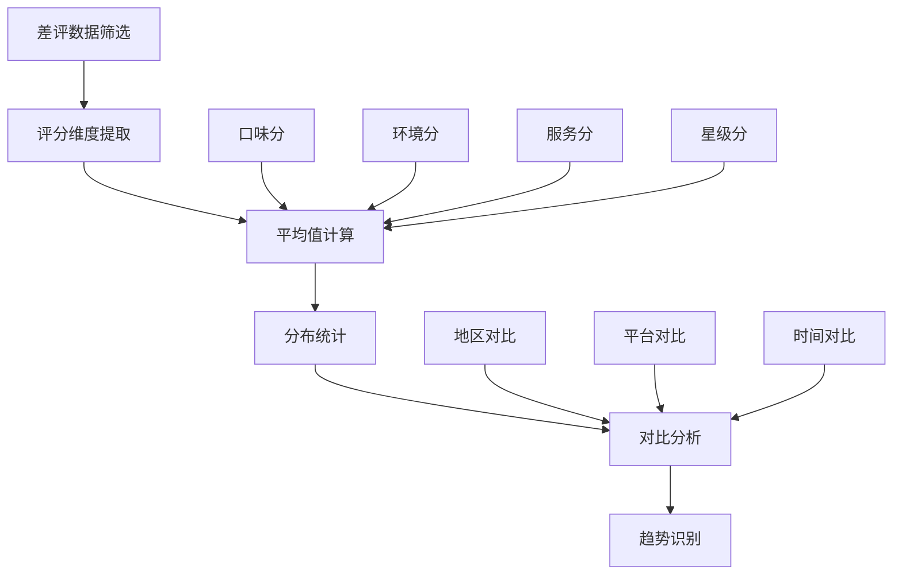

**图表来源**
- [app.py:393-396](file://app.py#L393-L396)
- [app.py:516-529](file://app.py#L516-L529)

**章节来源**
- [app.py:393-396](file://app.py#L393-L396)
- [app.py:516-529](file://app.py#L516-L529)

### 多维度可视化展示

#### 图表类型与应用场景

系统采用统一的可视化框架，支持多种图表类型的灵活组合：

| 图表类型 | 应用场景 | 颜色编码 | 主要指标 |
|---------|---------|---------|---------|
| 饼图 | 评价等级分布、VIP用户分布 | 红橙绿蓝紫渐变 | 比例关系 |
| 柱状图 | 平台对比、地域分布、趋势分析 | 热力色彩映射 | 数量对比 |
| 折线图 | 时间序列、趋势变化 | 单色线条 | 趋势识别 |
| 散点图 | 相关性分析 | 多色点阵 | 关联关系 |

**章节来源**
- [app.py:442-450](file://app.py#L442-L450)
- [app.py:456-479](file://app.py#L456-L479)
- [app.py:495-509](file://app.py#L495-L509)

#### 主题样式系统

系统内置了完整的主题样式系统，确保视觉一致性：

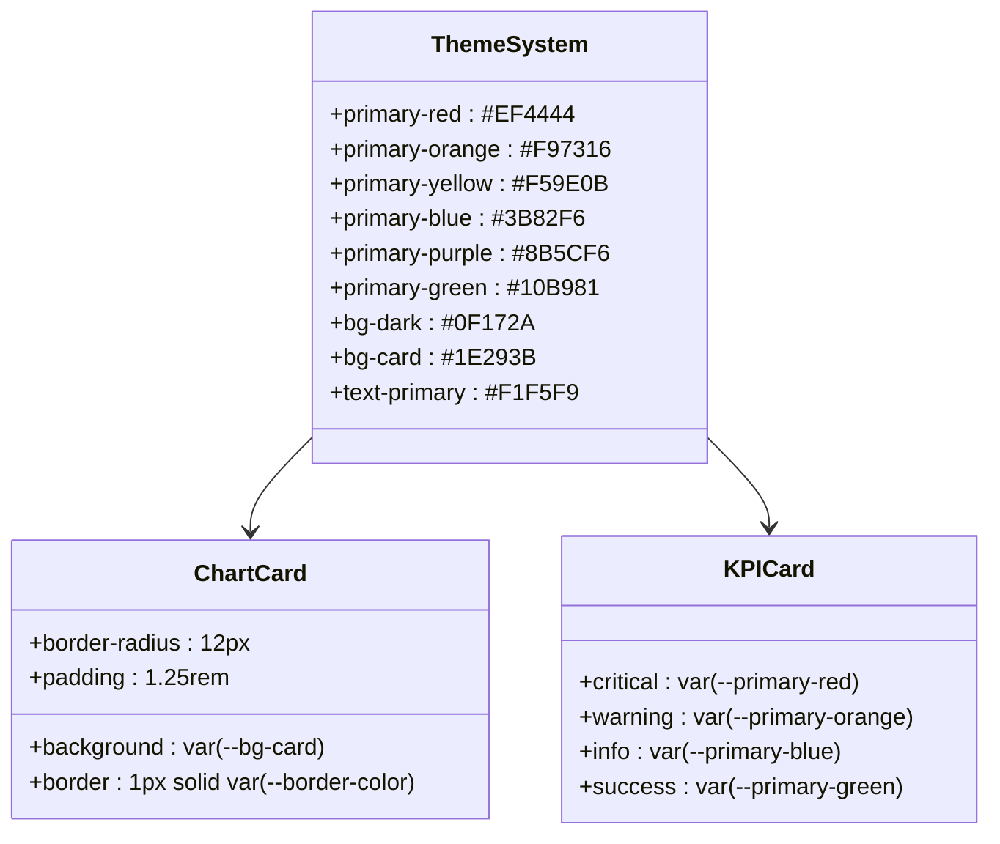

**图表来源**
- [app.py:10-31](file://app.py#L10-L31)
- [app.py:91-118](file://app.py#L91-L118)

**章节来源**
- [app.py:10-31](file://app.py#L10-L31)
- [app.py:91-118](file://app.py#L91-L118)

### 差评问题诊断分析

#### 标签分析系统

系统实现了智能化的标签过滤和分析机制：

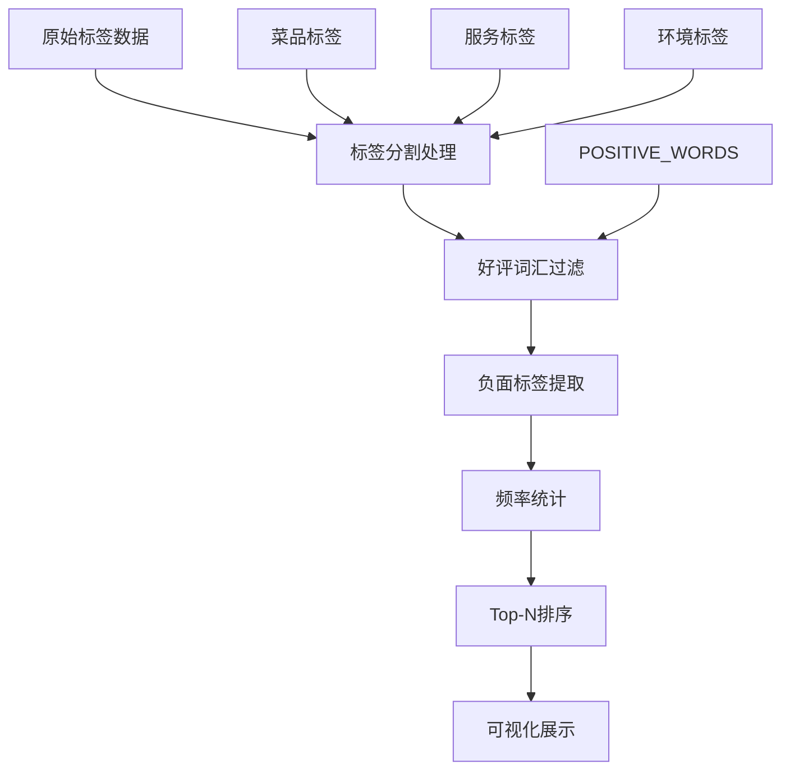

**图表来源**
- [app.py:315-317](file://app.py#L315-L317)
- [app.py:562-564](file://app.py#L562-L564)

系统内置了包含50+个正面词汇的词库，自动过滤掉常见的正面表达，专注于提取真实的负面信息。

**章节来源**
- [app.py:315-317](file://app.py#L315-L317)
- [app.py:562-564](file://app.py#L562-L564)

#### 关键词提取算法

关键词提取采用多步骤处理流程：

```mermaid
sequenceDiagram
participant D as 差评详情
participant R as 正则处理
participant F as 过滤处理
participant S as 统计分析
participant V as 可视化
D->>R : 提取中文词汇
R->>F : 过滤正面词汇
F->>S : 统计出现频率
S->>V : 生成词云图表
Note over R,F,S : 支持2-字符长度的关键词
```

**图表来源**
- [app.py:654-656](file://app.py#L654-L656)
- [app.py:658-659](file://app.py#L658-L659)

**章节来源**
- [app.py:654-656](file://app.py#L654-L656)
- [app.py:658-659](file://app.py#L658-L659)

#### 地域分布分析

系统提供多层次的地域分析能力：

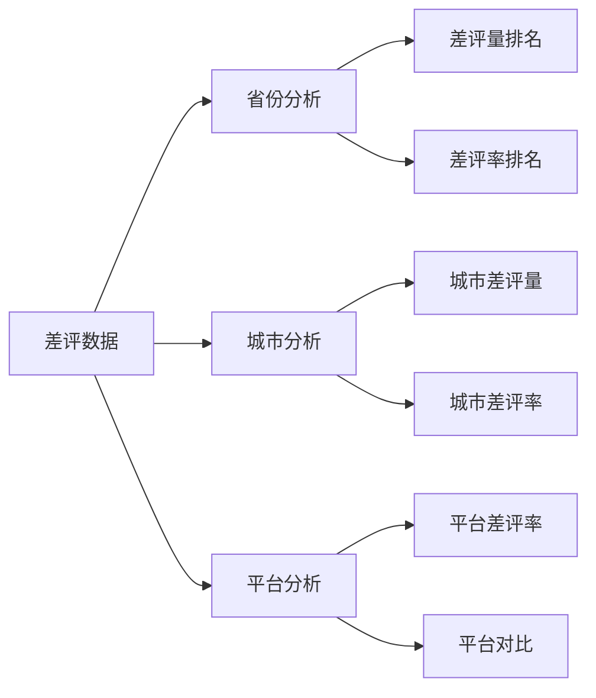

**图表来源**
- [app.py:693-708](file://app.py#L693-L708)
- [app.py:714-729](file://app.py#L714-L729)
- [app.py:734-757](file://app.py#L734-L757)

**章节来源**
- [app.py:693-708](file://app.py#L693-L708)
- [app.py:714-729](file://app.py#L714-L729)
- [app.py:734-757](file://app.py#L734-L757)

### 未回复差评预警系统

#### 触发机制设计

预警系统采用实时监控和阈值判断相结合的方式：

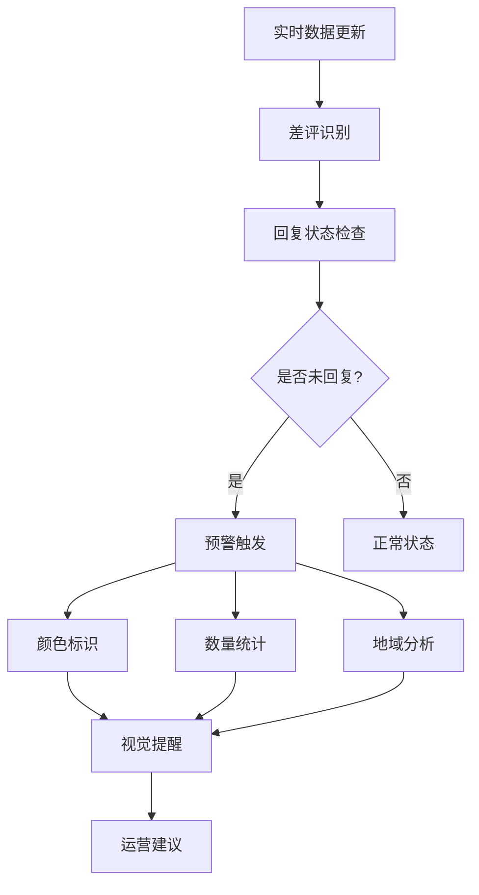

**图表来源**
- [app.py:909-934](file://app.py#L909-L934)

系统设置了多级预警阈值：
- **红色预警**: 未回复差评数量超过阈值
- **橙色预警**: 差评回复率低于标准值
- **黄色预警**: 未回复中性评价数量异常

**章节来源**
- [app.py:909-934](file://app.py#L909-L934)
- [app.py:991-996](file://app.py#L991-L996)

#### 处理建议体系

系统根据不同的预警级别提供相应的处理建议：

| 预警级别 | 触发条件 | 处理建议 | 优先级 |
|---------|---------|---------|--------|
| 红色 | 未回复差评>50条 | 立即安排专人跟进，2小时内回复 | 最高 |
| 橙色 | 差评回复率<80% | 制定SLA标准，24小时内100%回复 | 高 |
| 黄色 | 未回复中性评价>30条 | 建议跟进回复，提升客户体验 | 中 |

**章节来源**
- [app.py:991-996](file://app.py#L991-L996)
- [app.py:982-998](file://app.py#L982-L998)

### 智能整改建议生成

#### 建议生成算法

系统采用多因子综合评估的方法生成整改建议：

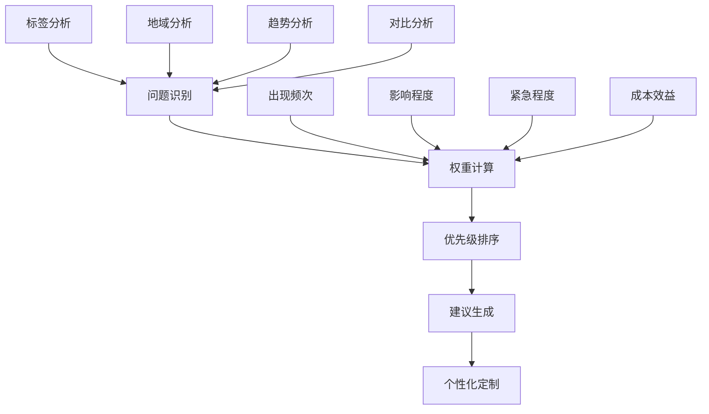

**图表来源**
- [app.py:966-979](file://app.py#L966-L979)
- [app.py:982-998](file://app.py#L982-L998)

#### 建议内容结构

生成的整改建议包含四个要素：

1. **问题描述**: 明确指出具体的问题领域
2. **影响分析**: 量化问题的影响程度
3. **解决措施**: 提供具体的整改方案
4. **预期效果**: 预估整改后的改善效果

**章节来源**
- [app.py:966-979](file://app.py#L966-L979)
- [app.py:982-998](file://app.py#L982-L998)

## 依赖关系分析

系统采用模块化设计，各组件之间的依赖关系清晰：

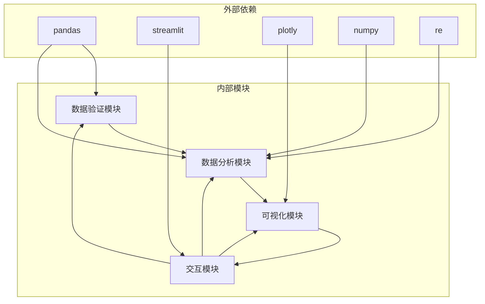

**图表来源**
- [app.py:1-7](file://app.py#L1-L7)

**章节来源**
- [app.py:1-7](file://app.py#L1-L7)

## 性能考虑

### 数据处理优化

系统在大数据量处理方面采用了多项优化策略：

1. **内存管理**: 使用分步处理避免一次性加载大量数据
2. **索引优化**: 对常用查询字段建立索引提高查询效率
3. **缓存机制**: 对重复计算的结果进行缓存
4. **并行处理**: 利用多核CPU进行并行计算

### 可视化性能优化

- **懒加载**: 图表按需加载，减少初始页面渲染时间
- **数据采样**: 对大数据集进行合理采样显示
- **增量更新**: 只更新发生变化的数据区域
- **压缩传输**: 对图表数据进行压缩传输

## 故障排除指南

### 常见问题及解决方案

#### 数据上传问题
- **问题**: 文件格式不支持
- **解决方案**: 确保上传.xlsx或.xls格式文件

#### 数据验证失败
- **问题**: 缺少必要列
- **解决方案**: 检查数据包含评价时间、评价ID、省份、城市、评价门店、星级分、口味分、环境分、服务分、回复状态

#### 内存不足
- **问题**: 大数据量导致内存溢出
- **解决方案**: 分批处理数据或升级服务器配置

#### 图表渲染异常
- **问题**: 图表显示不完整
- **解决方案**: 检查网络连接和浏览器兼容性

**章节来源**
- [app.py:335-337](file://app.py#L335-L337)
- [app.py:1033-1035](file://app.py#L1033-L1035)

### 调试工具

系统提供了完善的数据验证功能：

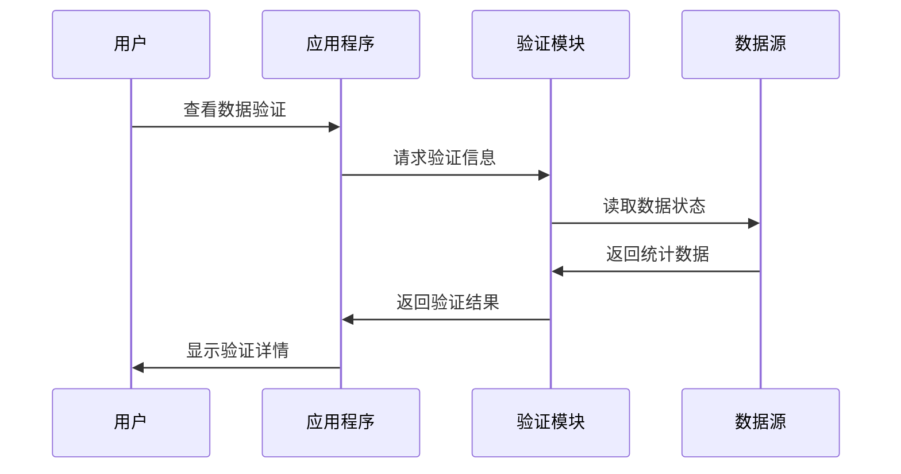

**图表来源**
- [app.py:1011-1031](file://app.py#L1011-L1031)

**章节来源**
- [app.py:1011-1031](file://app.py#L1011-L1031)

## 结论

餐饮差评运营分析看板是一个功能完整、设计合理的数据分析系统。它通过实时数据处理、多维度可视化展示、智能诊断分析和预警机制，为企业提供了全面的差评管理解决方案。

系统的主要优势包括：

1. **实时性强**: 支持实时数据上传和分析
2. **可视化丰富**: 提供多种图表类型满足不同分析需求
3. **智能化程度高**: 自动化标签分析、关键词提取和整改建议生成
4. **预警及时**: 多级预警机制确保问题得到及时处理
5. **用户体验友好**: 简洁直观的界面设计

该系统特别适用于需要持续监控和改进服务质量的餐饮企业，能够帮助企业建立数据驱动的运营管理模式，实现服务质量的持续提升。