# 部署与运维

<cite>
**本文档引用的文件**
- [app.py](file://app.py)
- [analyze_data.py](file://analyze_data.py)
- [verify_data.py](file://verify_data.py)
</cite>

## 目录
1. [简介](#简介)
2. [项目结构](#项目结构)
3. [核心组件](#核心组件)
4. [架构概览](#架构概览)
5. [详细组件分析](#详细组件分析)
6. [依赖分析](#依赖分析)
7. [性能考虑](#性能考虑)
8. [故障排除指南](#故障排除指南)
9. [版本升级与迁移](#版本升级与迁移)
10. [安全配置与最佳实践](#安全配置与最佳实践)
11. [结论](#结论)

## 简介

本项目是一个餐饮差评运营分析系统，提供了完整的数据分析和可视化功能。该系统包含三个主要模块：
- **Web应用界面**：基于Streamlit构建的交互式分析仪表板
- **数据处理模块**：专门的数据分析脚本
- **数据验证模块**：用于验证数据质量和完整性

系统支持Excel数据文件的上传和分析，提供多维度的差评分析报告，包括地域分布、时间趋势、用户画像等关键指标。

## 项目结构

项目采用简洁的文件组织结构，每个文件负责特定的功能职责：

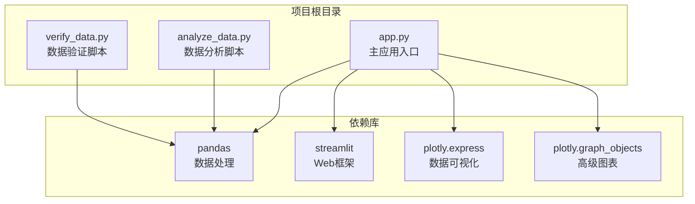

**图表来源**
- [app.py:1-10](file://app.py#L1-L10)
- [analyze_data.py:1-3](file://analyze_data.py#L1-L3)
- [verify_data.py:1-2](file://verify_data.py#L1-L2)

**章节来源**
- [app.py:1-10](file://app.py#L1-L10)
- [analyze_data.py:1-3](file://analyze_data.py#L1-L3)
- [verify_data.py:1-2](file://verify_data.py#L1-L2)

## 核心组件

### 主应用组件 (app.py)

主应用组件是整个系统的入口点，基于Streamlit框架构建，提供完整的Web界面和数据分析功能。

**核心特性：**
- 实时数据上传和处理
- 多维度数据分析仪表板
- 交互式可视化图表
- 智能运营建议生成
- 响应式设计界面

**主要功能模块：**
1. **数据预处理**：Excel文件解析、数据清洗、格式转换
2. **核心指标计算**：差评率、回复率、评分分布等
3. **可视化展示**：饼图、柱状图、折线图等多种图表类型
4. **智能分析**：标签分析、关键词提取、趋势预测
5. **运营建议**：基于数据分析的整改建议

**章节来源**
- [app.py:1-1089](file://app.py#L1-L1089)

### 数据分析组件 (analyze_data.py)

独立的数据分析脚本，专注于批量数据处理和报告生成。

**核心功能：**
- 统计指标计算
- 分布分析
- 地域和时间趋势分析
- 用户行为分析
- 平台对比分析

**章节来源**
- [analyze_data.py:1-133](file://analyze_data.py#L1-L133)

### 数据验证组件 (verify_data.py)

数据质量验证工具，确保输入数据的完整性和准确性。

**验证内容：**
- 回复状态分布检查
- 差评数据完整性验证
- 整体回复率计算
- 数据质量评估

**章节来源**
- [verify_data.py:1-32](file://verify_data.py#L1-L32)

## 架构概览

系统采用分层架构设计，清晰分离了数据处理、业务逻辑和展示层：

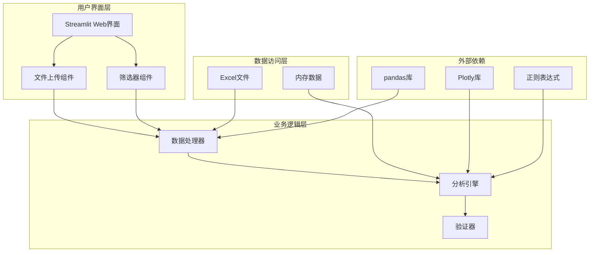

**图表来源**
- [app.py:326-363](file://app.py#L326-L363)
- [app.py:308-317](file://app.py#L308-L317)
- [app.py:284-294](file://app.py#L284-L294)

## 详细组件分析

### 数据处理组件分析

#### 数据加载和预处理流程

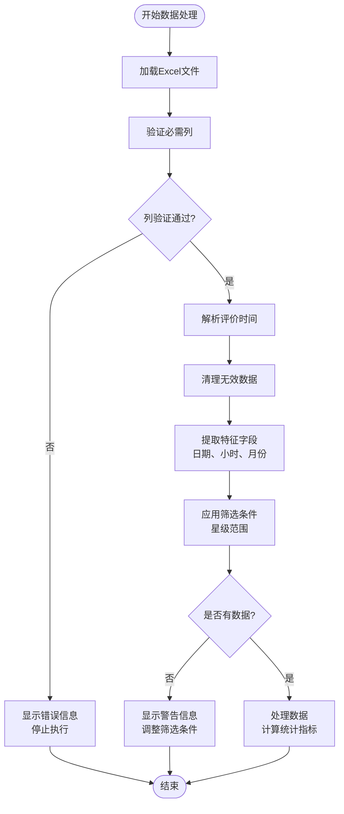

**图表来源**
- [app.py:328-363](file://app.py#L328-L363)
- [app.py:332-357](file://app.py#L332-L357)

#### 核心指标计算流程

系统实现了多层次的核心指标计算，包括总体指标和分组指标：

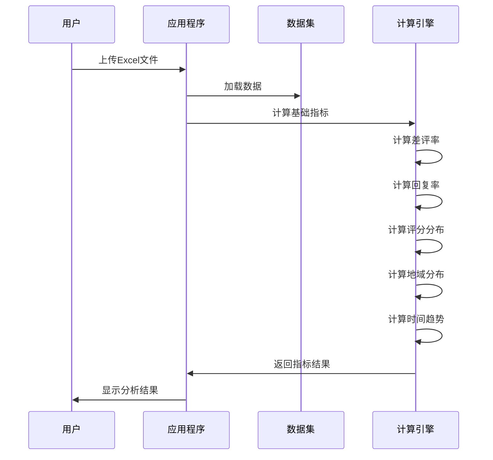

**图表来源**
- [app.py:381-396](file://app.py#L381-L396)
- [app.py:404-427](file://app.py#L404-L427)

**章节来源**
- [app.py:328-427](file://app.py#L328-L427)

### 可视化组件分析

#### 图表类型和用途

系统提供了多种图表类型来展示不同的分析维度：

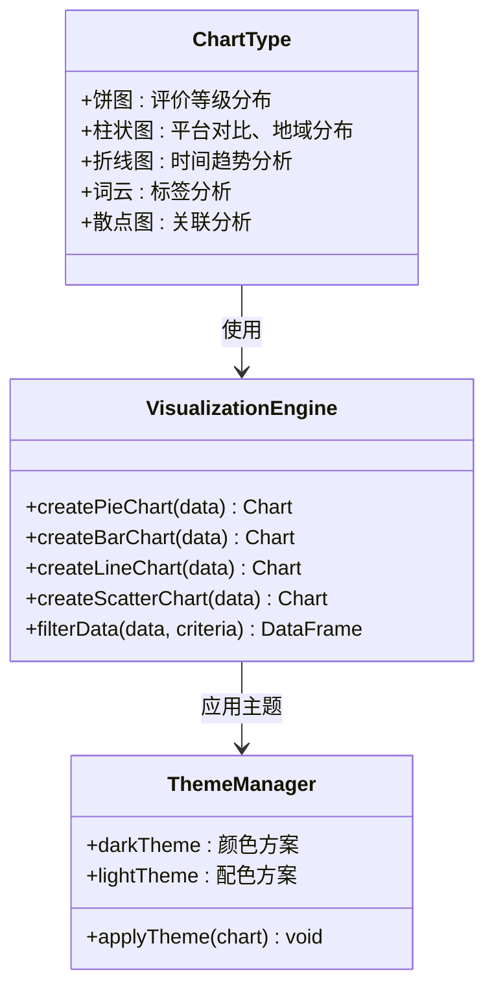

**图表来源**
- [app.py:442-479](file://app.py#L442-L479)
- [app.py:495-539](file://app.py#L495-L539)
- [app.py:296-304](file://app.py#L296-L304)

**章节来源**
- [app.py:442-828](file://app.py#L442-L828)

### 数据验证组件分析

#### 验证流程和规则

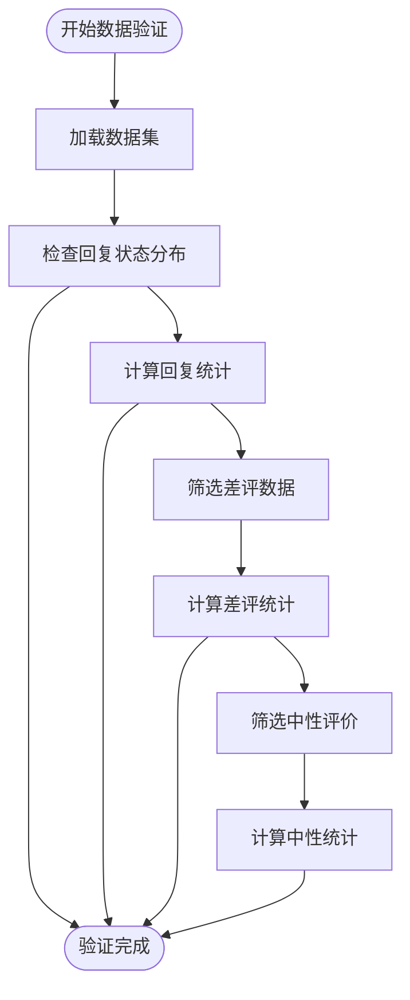

**图表来源**
- [verify_data.py:7-18](file://verify_data.py#L7-L18)
- [verify_data.py:21-32](file://verify_data.py#L21-L32)

**章节来源**
- [verify_data.py:1-32](file://verify_data.py#L1-L32)

## 依赖分析

### 外部依赖关系

系统依赖于多个Python库来实现核心功能：

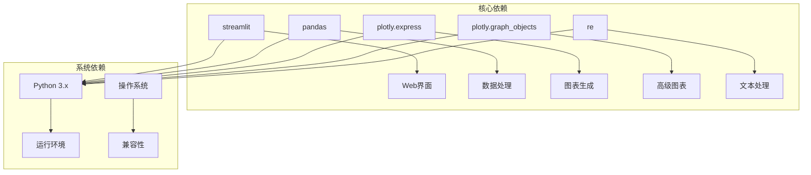

**图表来源**
- [app.py:1-7](file://app.py#L1-L7)

### 内部模块依赖

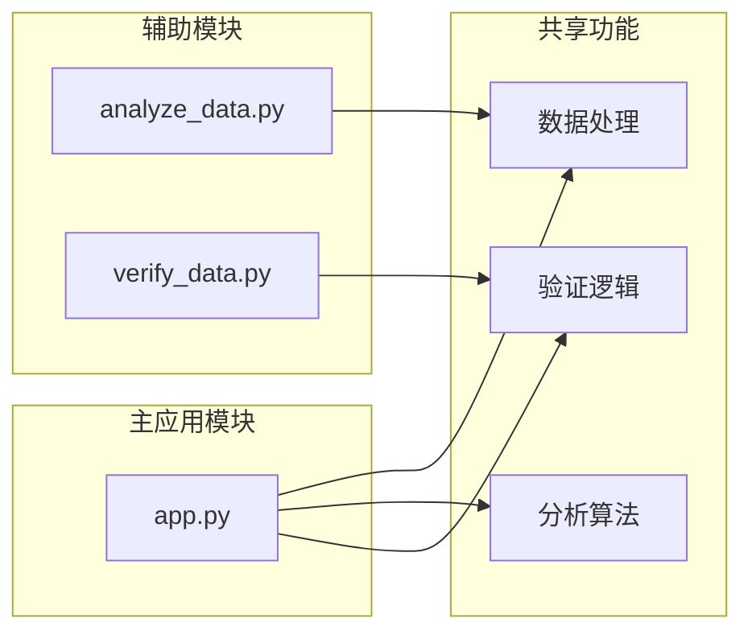

**图表来源**
- [app.py:328-363](file://app.py#L328-L363)
- [analyze_data.py:1-3](file://analyze_data.py#L1-L3)
- [verify_data.py:1-2](file://verify_data.py#L1-L2)

**章节来源**
- [app.py:1-7](file://app.py#L1-L7)

## 性能考虑

### 数据处理性能优化

系统在数据处理方面采用了多项优化策略：

1. **向量化操作**：使用pandas的向量化操作替代循环处理
2. **内存管理**：及时释放不需要的数据对象
3. **索引优化**：合理使用数据索引来加速查询
4. **批处理**：对大数据集进行分批处理

### 可视化性能优化

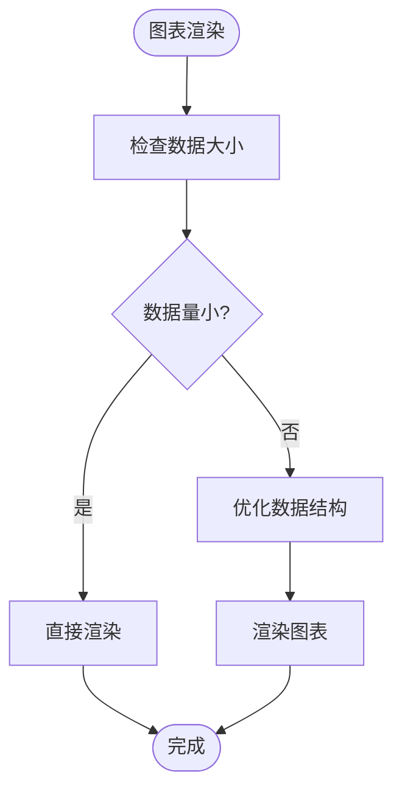

**图表来源**
- [app.py:442-451](file://app.py#L442-L451)
- [app.py:566-581](file://app.py#L566-L581)

### 内存使用监控

系统实现了基本的内存使用监控机制，可以通过以下方式观察：

- **数据形状跟踪**：监控DataFrame的行数和列数变化
- **内存占用估算**：根据数据类型和数量估算内存需求
- **垃圾回收触发**：及时清理不再使用的对象

## 故障排除指南

### 常见问题和解决方案

#### 文件上传问题

**问题描述：** 用户无法上传Excel文件或上传后无响应

**可能原因：**
1. 文件格式不支持（非.xlsx或.xls格式）
2. 文件损坏或格式错误
3. 文件过大超出限制
4. 缺少必要的列

**解决方案：**
1. 确认文件格式为.xlsx或.xls
2. 检查Excel文件的完整性和格式正确性
3. 减小文件大小或分批处理
4. 确保包含必需的列：评价时间、评价ID、省份、城市、评价门店、星级分、口味分、环境分、服务分、回复状态

#### 数据处理错误

**问题描述：** 处理过程中出现异常或数据不准确

**可能原因：**
1. 数据格式不匹配
2. 缺失值处理不当
3. 时间格式解析失败
4. 字符编码问题

**解决方案：**
1. 检查数据格式是否符合预期
2. 使用数据验证脚本检查完整性
3. 确认时间字段的格式一致性
4. 处理特殊字符和编码问题

#### 性能问题

**问题描述：** 系统响应缓慢或内存使用过高

**优化措施：**
1. 分批处理大数据集
2. 清理不必要的中间数据
3. 使用更高效的数据结构
4. 实施缓存机制

**章节来源**
- [app.py:1033-1036](file://app.py#L1033-L1036)
- [app.py:335-337](file://app.py#L335-L337)

### 调试和监控

#### 日志记录

系统提供了基本的错误处理和用户反馈机制：

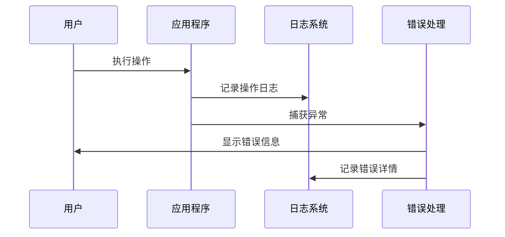

#### 性能监控

建议实施的监控指标：
- **响应时间**：页面加载和数据处理时间
- **内存使用**：实时内存占用情况
- **CPU使用率**：数据处理过程中的资源消耗
- **并发用户数**：同时使用系统的用户数量

## 版本升级与迁移

### 升级策略

#### 向后兼容性

系统设计时考虑了向后兼容性：
- **API稳定性**：核心函数接口保持稳定
- **数据格式**：Excel文件格式要求明确且稳定
- **配置选项**：参数和配置项保持向后兼容

#### 迁移流程

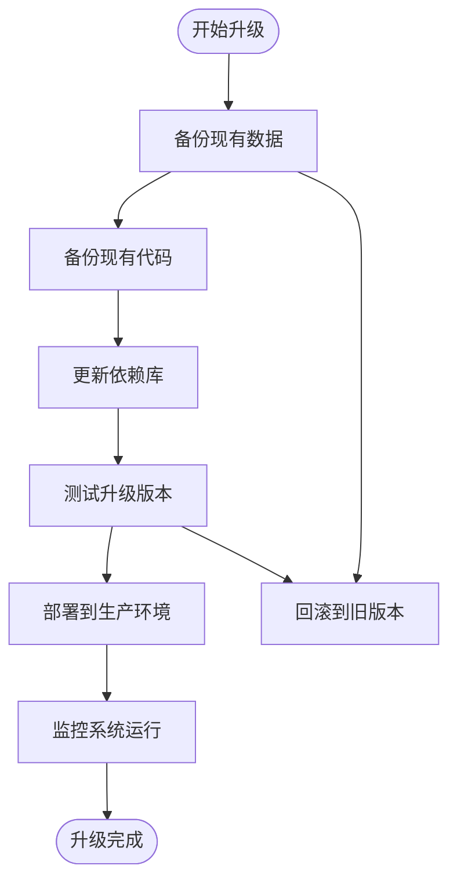

### 数据迁移

#### 数据格式变更

当需要变更数据格式时，建议采用以下步骤：

1. **数据导出**：从旧系统导出所有数据
2. **格式转换**：使用转换脚本处理数据格式
3. **数据验证**：验证转换后的数据完整性
4. **增量同步**：同步新产生的数据
5. **切换上线**：切换到新系统

#### 版本兼容性

不同版本间的兼容性处理：
- **字段新增**：为新字段提供默认值
- **字段删除**：提供数据迁移脚本
- **字段重命名**：提供映射关系
- **数据类型变更**：提供转换逻辑

## 安全配置与最佳实践

### 安全配置

#### 数据安全

1. **文件上传安全**
   - 验证文件类型和大小
   - 检查文件内容安全性
   - 实施文件扫描机制

2. **数据处理安全**
   - 防止恶意数据注入
   - 实施数据清理和验证
   - 保护敏感信息

3. **访问控制**
   - 实施用户认证机制
   - 控制文件访问权限
   - 记录访问日志

#### 网络安全

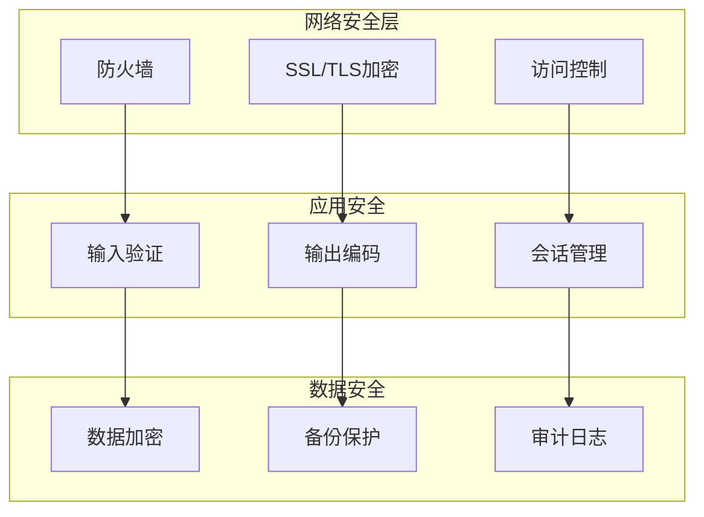

### 最佳实践建议

#### 开发最佳实践

1. **代码质量**
   - 使用类型注解
   - 实施单元测试
   - 代码审查流程
   - 文档编写规范

2. **性能优化**
   - 数据库查询优化
   - 缓存策略实施
   - 异步处理机制
   - 资源池管理

3. **可维护性**
   - 模块化设计
   - 配置分离
   - 错误处理统一
   - 日志标准化

#### 运维最佳实践

1. **监控和告警**
   - 系统健康监控
   - 性能指标监控
   - 错误日志监控
   - 业务指标监控

2. **备份和恢复**
   - 定期数据备份
   - 多地点备份策略
   - 恢复演练测试
   - 灾难恢复计划

3. **容量规划**
   - 性能基准测试
   - 负载压力测试
   - 扩展性设计
   - 成本优化策略

## 结论

本部署与运维指南涵盖了餐饮差评运营分析系统的完整生命周期管理。系统具有以下特点：

**技术优势：**
- 基于现代Python生态系统构建
- 提供直观的Web界面和丰富的可视化功能
- 支持大规模数据处理和分析
- 具备良好的扩展性和维护性

**运维特点：**
- 简洁的项目结构便于理解和维护
- 完善的错误处理和用户反馈机制
- 清晰的日志记录和监控能力
- 良好的性能表现和资源利用效率

**建议的后续改进：**
1. 实施更完善的用户认证和授权机制
2. 添加数据备份和恢复功能
3. 增强系统的可扩展性设计
4. 完善监控和告警体系
5. 实施自动化测试和部署流程

通过遵循本指南的建议和最佳实践，可以确保系统的稳定运行和持续发展。