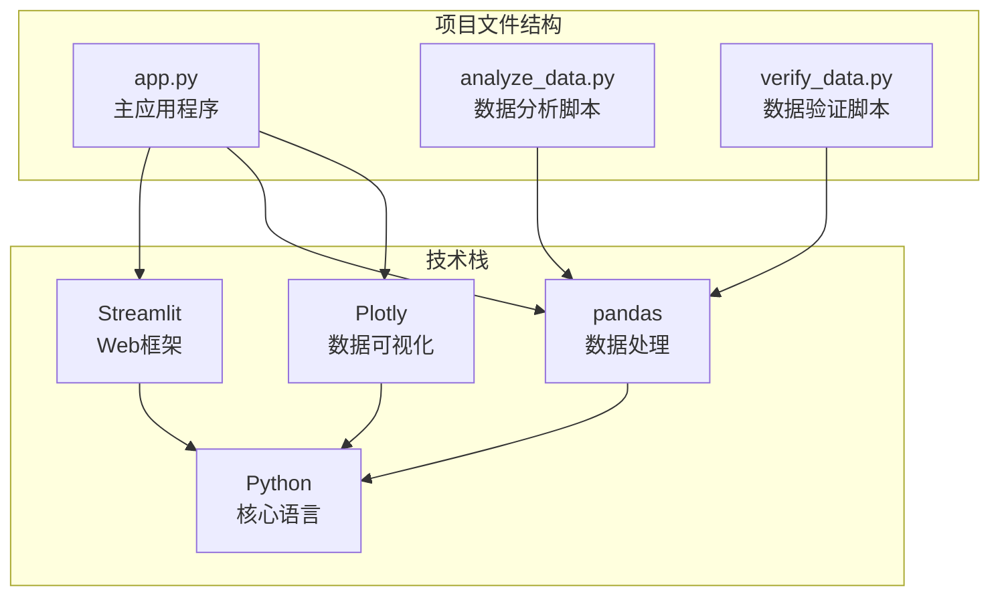
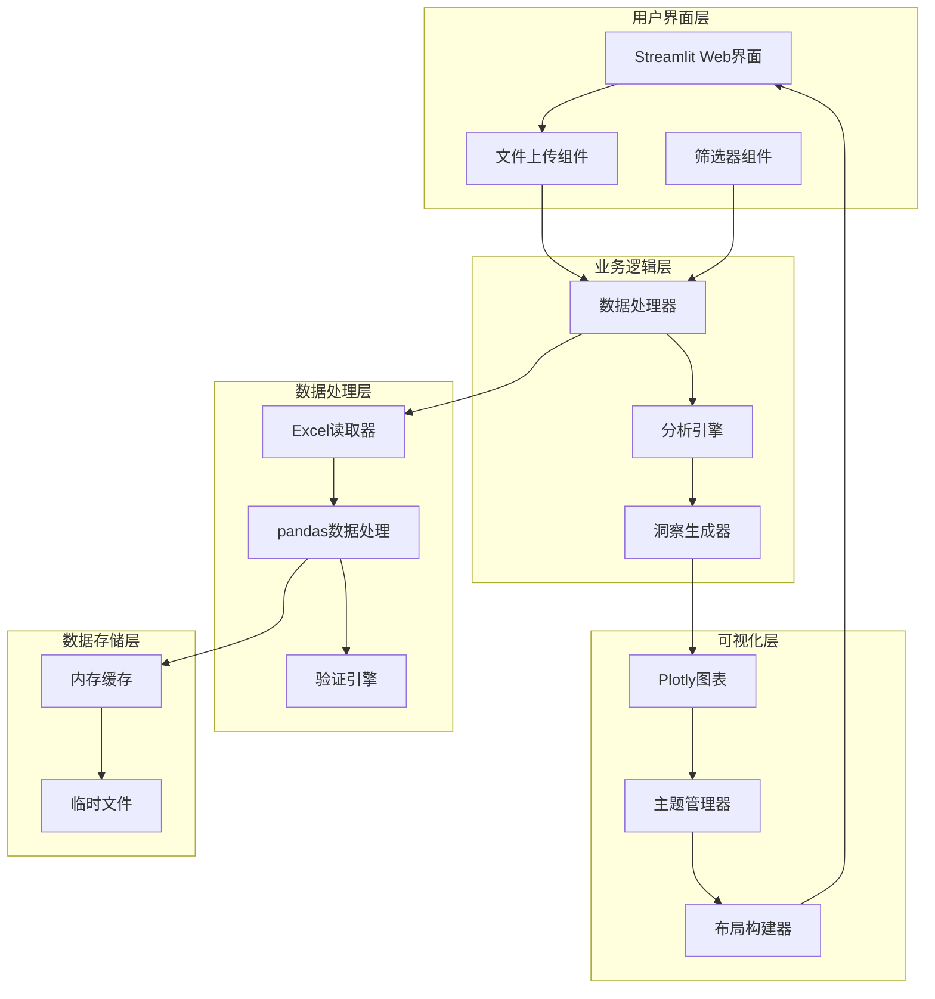
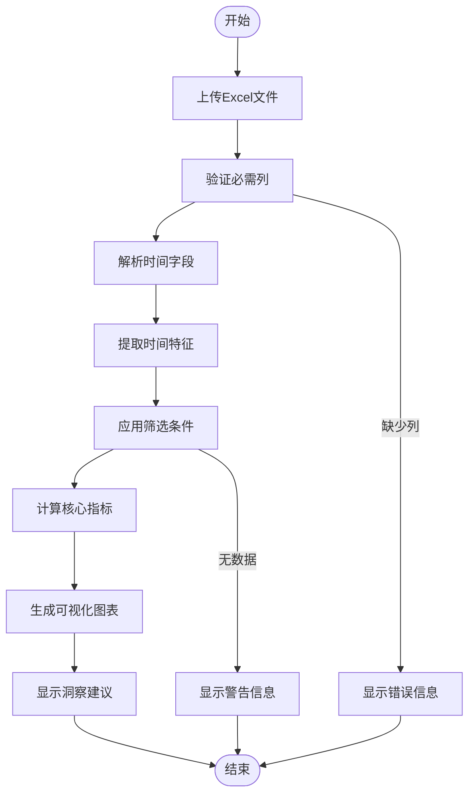
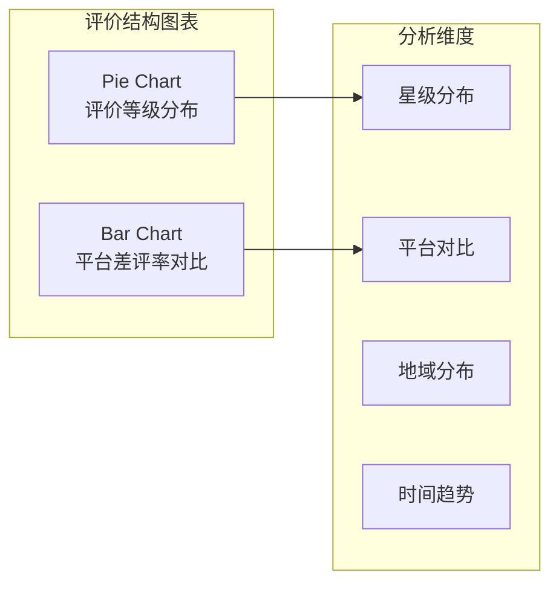
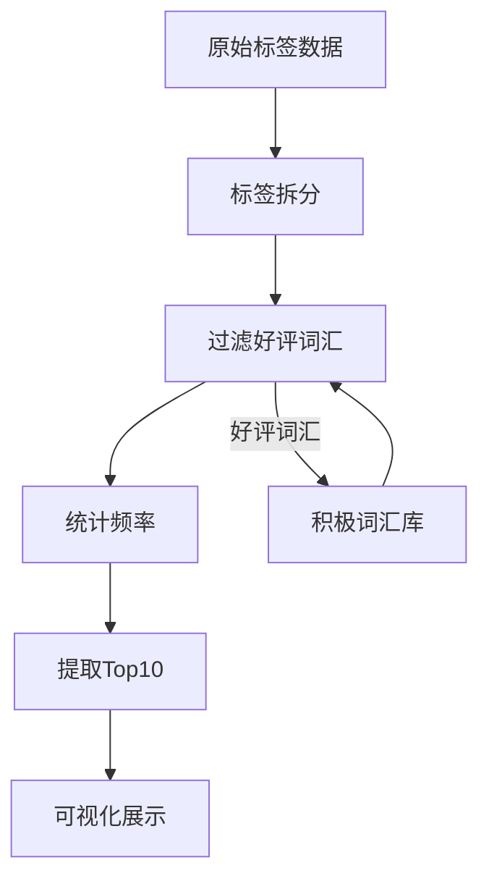
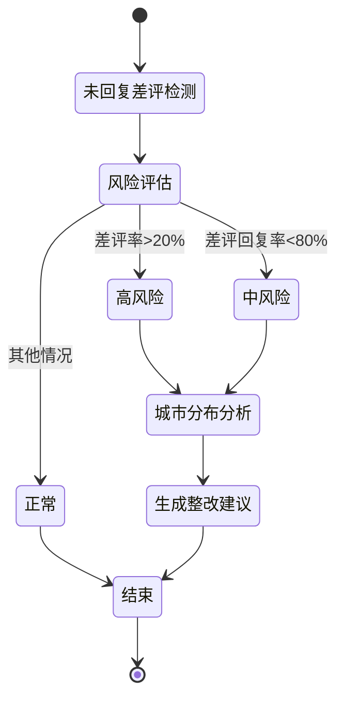
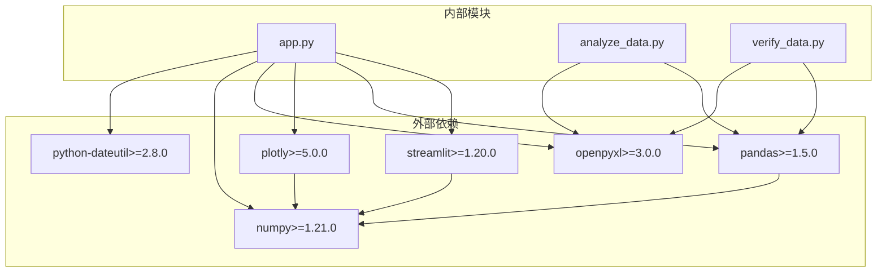

# 项目概述

<cite>
**本文档引用的文件**
- [app.py](file://app.py)
- [analyze_data.py](file://analyze_data.py)
- [verify_data.py](file://verify_data.py)
</cite>

## 目录
1. [项目简介](#项目简介)
2. [项目结构](#项目结构)
3. [核心组件](#核心组件)
4. [架构概览](#架构概览)
5. [详细组件分析](#详细组件分析)
6. [依赖关系分析](#依赖关系分析)
7. [性能考虑](#性能考虑)
8. [故障排除指南](#故障排除指南)
9. [结论](#结论)

## 项目简介

餐饮差评运营分析看板是一个基于Streamlit构建的Web应用程序，专门用于帮助餐饮企业进行差评分析和运营优化。该项目通过直观的数据可视化界面，为企业管理者提供实时的差评监控、问题诊断和整改建议功能，旨在帮助企业降低差评率、提升服务质量、增强客户满意度。

### 核心价值

- **实时监控**: 提供差评数据的实时分析和可视化展示
- **智能诊断**: 自动识别差评问题的根本原因和热点区域
- **运营优化**: 基于数据洞察提供针对性的整改建议
- **成本效益**: 通过自动化分析减少人工排查成本

### 目标用户群体

- 餐饮连锁企业管理层
- 区域运营总监
- 门店经理和店长
- 客户服务质量负责人
- 数据分析师和运营专员

## 项目结构

该项目采用简洁而高效的设计，主要由三个核心文件组成：

**图表来源**
- [app.py:1-1089](file://app.py#L1-L1089)
- [analyze_data.py:1-133](file://analyze_data.py#L1-L133)
- [verify_data.py:1-32](file://verify_data.py#L1-L32)

**章节来源**
- [app.py:1-1089](file://app.py#L1-L1089)
- [analyze_data.py:1-133](file://analyze_data.py#L1-L133)
- [verify_data.py:1-32](file://verify_data.py#L1-L32)

## 核心组件

### 主应用程序 (app.py)

作为整个系统的入口点，app.py负责：
- 用户界面设计和交互逻辑
- 数据上传和验证处理
- 实时数据分析和可视化展示
- 智能整改建议生成

### 数据分析工具 (analyze_data.py)

提供批量数据分析功能，支持：
- 统计指标计算
- 分布分析
- 地域和时间趋势分析
- 标签分析

### 数据验证工具 (verify_data.py)

专注于数据质量检查：
- 回复状态验证
- 差评数据完整性检查
- 基础统计指标验证

**章节来源**
- [app.py:1-1089](file://app.py#L1-L1089)
- [analyze_data.py:1-133](file://analyze_data.py#L1-L133)
- [verify_data.py:1-32](file://verify_data.py#L1-L32)

## 架构概览

项目采用分层架构设计，确保了良好的可维护性和扩展性：

**图表来源**
- [app.py:1-1089](file://app.py#L1-L1089)

### 技术架构详解

#### Streamlit框架
- **实时渲染**: 自动响应用户操作和数据变化
- **组件化设计**: 模块化的UI组件便于维护
- **文件上传**: 支持Excel格式数据导入
- **状态管理**: 内置会话状态管理机制

#### pandas数据处理
- **数据清洗**: 自动处理缺失值和异常数据
- **时间序列分析**: 支持按日、月、小时维度分析
- **分组聚合**: 高效的数据分组和统计计算
- **标签解析**: 支持多标签数据的拆分和统计

#### Plotly可视化
- **交互式图表**: 支持缩放、选择等交互操作
- **主题统一**: 一致的颜色方案和样式设计
- **响应式布局**: 适配不同屏幕尺寸
- **动画效果**: 平滑的图表更新动画

**章节来源**
- [app.py:1-1089](file://app.py#L1-L1089)

## 详细组件分析

### 数据处理管道

**图表来源**
- [app.py:328-363](file://app.py#L328-L363)

### 核心KPI指标体系

系统提供四个关键指标来评估差评状况：

#### 差评率 (Bad Review Rate)
- **定义**: 差评数量占总评价数量的比例
- **阈值**: 超过20%触发高风险提醒
- **意义**: 反映整体服务质量水平

#### 差评回复率 (Response Rate)
- **定义**: 差评已回复数量占差评总数的比例
- **阈值**: 低于80%触发回复率不足提醒
- **意义**: 体现客户服务响应效率

#### 差评平均星级 (Average Star Rating)
- **定义**: 差评用户的平均星级评分
- **范围**: 1-5星
- **意义**: 衡量差评严重程度

#### 差评门店覆盖数 (Store Coverage)
- **定义**: 差评涉及的不同门店数量
- **意义**: 识别问题门店分布范围

**章节来源**
- [app.py:404-427](file://app.py#L404-L427)

### 多维度可视化展示

#### 评价结构总览
系统提供两个核心图表来展示评价的整体分布：

**图表来源**
- [app.py:436-481](file://app.py#L436-L481)

#### 差评问题诊断
通过两个图表深入分析差评的具体问题：

- **差评星级分布**: 展示1-5星的分布情况
- **差评各项评分均值**: 分析口味、环境、服务三个维度的平均得分

#### 标签分析系统
系统实现了智能标签过滤机制：

**图表来源**
- [app.py:556-644](file://app.py#L556-L644)

**章节来源**
- [app.py:488-644](file://app.py#L488-L644)

### 未回复差评预警系统

**图表来源**
- [app.py:909-957](file://app.py#L909-L957)

**章节来源**
- [app.py:902-999](file://app.py#L902-L999)

### 智能整改建议引擎

系统根据数据分析结果自动生成针对性的整改建议：

#### 建议生成规则
- **标签驱动**: 基于高频负面标签识别问题领域
- **地域驱动**: 识别问题最严重的地区和门店
- **趋势驱动**: 分析时间趋势预测未来问题
- **对比驱动**: 通过与其他门店或平台对比发现问题

#### 建议分类
- **菜品相关**: 食材质量、口味、制作工艺
- **服务相关**: 服务态度、响应速度、服务流程
- **环境相关**: 卫生状况、座位舒适度、噪音控制
- **管理相关**: 员工培训、流程优化、监督机制

**章节来源**
- [app.py:965-998](file://app.py#L965-L998)

## 依赖关系分析

**图表来源**
- [app.py:1-7](file://app.py#L1-L7)

### 核心依赖说明

#### Streamlit (版本要求: >=1.20.0)
- **功能**: Web应用框架，提供交互式界面
- **特性**: 实时渲染、组件化开发、文件上传支持
- **优势**: 开发简单、部署便捷、用户体验优秀

#### pandas (版本要求: >=1.5.0)
- **功能**: 数据处理和分析核心库
- **特性**: 高性能数据结构、丰富的统计函数、灵活的数据操作
- **优势**: 处理大规模数据集、强大的数据清洗能力

#### Plotly (版本要求: >=5.0.0)
- **功能**: 交互式图表绘制库
- **特性**: 支持多种图表类型、丰富的交互功能、美观的视觉效果
- **优势**: 与pandas无缝集成、支持主题定制、响应式设计

#### openpyxl (版本要求: >=3.0.0)
- **功能**: Excel文件读写支持
- **特性**: 支持.xlsx和.xls格式、数据类型自动识别
- **优势**: 与pandas深度集成、处理大型Excel文件

**章节来源**
- [app.py:1-7](file://app.py#L1-L7)

## 性能考虑

### 数据处理优化

#### 内存管理
- **分批处理**: 对于大型数据集采用分批处理策略
- **数据类型优化**: 使用适当的数据类型减少内存占用
- **及时释放**: 处理完成后及时释放不需要的数据

#### 计算效率
- **向量化操作**: 利用pandas的向量化特性提高计算速度
- **索引优化**: 合理使用索引加速数据查询
- **缓存机制**: 对重复计算的结果进行缓存

### 用户体验优化

#### 加载性能
- **异步处理**: 将耗时的数据处理操作放在后台执行
- **进度指示**: 为长时间操作提供进度反馈
- **增量渲染**: 逐步渲染页面元素提升感知速度

#### 响应性
- **防抖处理**: 对频繁的用户操作进行防抖处理
- **懒加载**: 对不常用的功能采用懒加载策略
- **虚拟滚动**: 对大数据表格采用虚拟滚动技术

## 故障排除指南

### 常见问题及解决方案

#### 文件上传问题
**症状**: 无法上传Excel文件或提示格式错误
**可能原因**:
- 文件格式不支持
- 文件损坏或格式错误
- 缺少必需的列名

**解决步骤**:
1. 确认文件格式为.xlsx或.xls
2. 检查文件是否损坏
3. 验证必需列是否存在

#### 数据分析错误
**症状**: 分析过程中出现错误或数据不准确
**可能原因**:
- 数据格式不正确
- 缺失值处理不当
- 时间字段解析失败

**解决步骤**:
1. 检查数据格式是否符合要求
2. 处理缺失值和异常值
3. 验证时间字段格式

#### 图表显示问题
**症状**: 图表无法正常显示或显示异常
**可能原因**:
- 数据为空或无效
- Plotly配置错误
- 浏览器兼容性问题

**解决步骤**:
1. 检查数据是否为空
2. 验证Plotly配置参数
3. 更换浏览器尝试

**章节来源**
- [app.py:1033-1036](file://app.py#L1033-L1036)

### 调试技巧

#### 数据验证
使用verify_data.py脚本进行数据质量检查：
- 验证回复状态分布
- 检查差评数据完整性
- 确认统计指标准确性

#### 日志记录
在开发阶段添加适当的日志输出：
- 关键操作的执行时间
- 数据处理过程中的中间结果
- 错误发生时的上下文信息

## 结论

餐饮差评运营分析看板项目通过现代化的技术栈和清晰的架构设计，成功地将复杂的数据分析任务转化为直观易用的Web应用。该项目不仅具备强大的功能特性，还具有良好的可扩展性和维护性。

### 主要优势

1. **技术先进**: 采用最新的Python数据科学生态系统
2. **用户体验**: 提供直观的交互式界面
3. **功能完整**: 覆盖从数据导入到洞察生成的全流程
4. **实用性强**: 直接解决餐饮企业的实际痛点

### 应用前景

该系统可以广泛应用于各类餐饮连锁企业，帮助他们：
- 建立数据驱动的运营管理机制
- 快速识别和解决服务质量问题
- 降低客户流失率，提升品牌声誉
- 建立持续改进的运营体系

通过持续的功能迭代和技术升级，这个项目有望成为餐饮行业数字化转型的重要工具。